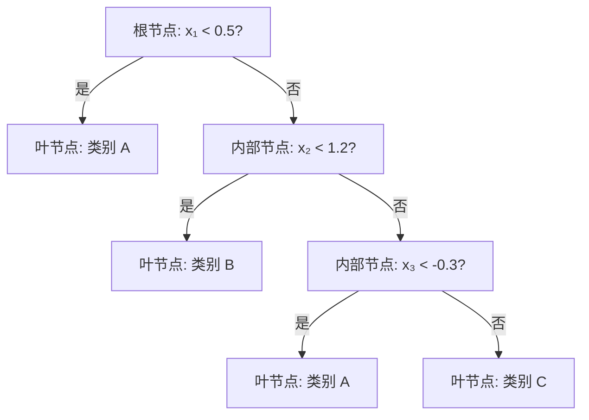
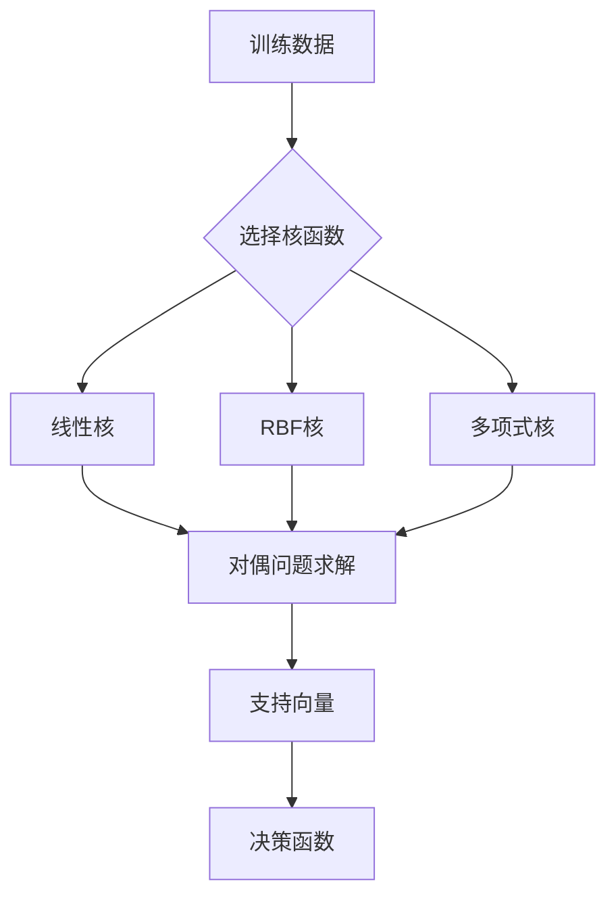
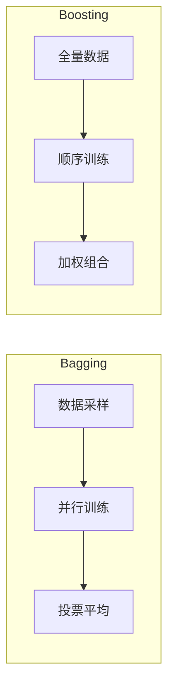

# 监督学习

## 1. 回归问题

### 线性回归
- **原理**：y = wx + b，最小化 MSE
- **求解**：正规方程（闭式解）/ 梯度下降
- **正则化**：Ridge (L2)、Lasso (L1)、Elastic Net (L1+L2)
- **假设**：线性关系、独立同分布、同方差性、正态性

$$ \hat{y} = Xw + b, \quad \mathcal{L}_{MSE} = \frac{1}{n}\sum_{i=1}^{n}(y_i - \hat{y}_i)^2 $$

$$ w^* = (X^T X)^{-1} X^T y \quad \text{(正规方程)} $$


```python
import numpy as np
from sklearn.linear_model import LinearRegression, Ridge, Lasso
from sklearn.metrics import mean_squared_error, r2_score

np.random.seed(42)
X = np.random.randn(200, 3)
y = 2 * X[:, 0] + 0.5 * X[:, 1] - 1.5 * X[:, 2] + np.random.randn(200) * 0.1

lr = LinearRegression()
lr.fit(X, y)
y_pred = lr.predict(X)
print(f"R²: {r2_score(y, y_pred):.4f}, MSE: {mean_squared_error(y, y_pred):.4f}")
print(f"系数: {lr.coef_.round(3)}, 截距: {lr.intercept_:.3f}")

ridge = Ridge(alpha=1.0)
ridge.fit(X, y)
print(f"Ridge 系数: {ridge.coef_.round(3)}")

lasso = Lasso(alpha=0.1)
lasso.fit(X, y)
print(f"Lasso 系数: {lasso.coef_.round(3)}")
```

### 多项式回归
- 通过特征扩展实现非线性：φ(x) = [1, x, x², ..., xⁿ]
- **过拟合风险**：高次多项式在边界处震荡
- **缓解**：正则化 + 交叉验证选择次数

```python
from sklearn.preprocessing import PolynomialFeatures
from sklearn.pipeline import Pipeline

np.random.seed(42)
X = np.random.rand(100, 1) * 6 - 3
y = 0.5 * X ** 3 - X ** 2 + 2 * X + np.random.randn(100, 1) * 0.5

poly_pipe = Pipeline([
    ("poly", PolynomialFeatures(degree=4, include_bias=False)),
    ("ridge", Ridge(alpha=0.1))
])
poly_pipe.fit(X, y.ravel())
y_pred = poly_pipe.predict(X)
print(f"多项式回归 MSE: {mean_squared_error(y, y_pred):.4f}")
```

### 其他回归模型
- **SVR（支持向量回归）**：ε-不敏感带，高维空间
- **决策树回归**：分段常数预测
- **随机森林回归**：多树平均，降低方差
- **GBRT（梯度提升回归树）**：逐步加法模型

```python
from sklearn.svm import SVR
from sklearn.tree import DecisionTreeRegressor
from sklearn.ensemble import RandomForestRegressor, GradientBoostingRegressor

X = np.random.rand(200, 5)
y = X[:, 0] ** 2 + np.sin(X[:, 1]) + np.random.randn(200) * 0.05

models = {
    "SVR": SVR(kernel="rbf", C=1.0, epsilon=0.1),
    "DecisionTree": DecisionTreeRegressor(max_depth=5),
    "RandomForest": RandomForestRegressor(n_estimators=100, max_depth=10),
    "GBRT": GradientBoostingRegressor(n_estimators=100, learning_rate=0.1, max_depth=3)
}
for name, model in models.items():
    model.fit(X, y)
    print(f"{name} R²: {model.score(X, y):.4f}")
```

## 2. 分类问题

### 逻辑回归
- **原理**：P(y=1|x) = σ(wx + b)，σ 为 Sigmoid 函数
- **决策边界**：线性分类器
- **损失**：二元交叉熵（Log Loss）
- **多分类**：Softmax 回归（多项逻辑回归）

$$ P(y=1|x) = \frac{1}{1 + e^{-(wx + b)}}, \quad \mathcal{L}_{log} = -\frac{1}{n}\sum [y\ln\hat{y} + (1-y)\ln(1-\hat{y})] $$

```python
from sklearn.linear_model import LogisticRegression
from sklearn.datasets import make_classification

X, y = make_classification(n_samples=500, n_features=10, n_informative=5,
                           n_redundant=2, random_state=42)
lr_clf = LogisticRegression(C=1.0, solver="lbfgs", max_iter=1000)
lr_clf.fit(X, y)
print(f"准确率: {lr_clf.score(X, y):.4f}")
print(f"类别概率示例: {lr_clf.predict_proba(X[:3]).round(3)}")

lr_l1 = LogisticRegression(C=0.1, penalty="l1", solver="saga", max_iter=1000)
lr_l1.fit(X, y)
print(f"L1 正则化零系数数: {(lr_l1.coef_ == 0).sum()} / {lr_l1.coef_.shape[1]}")
```

### K-近邻（KNN）
- **惰性学习**：训练时不建立模型
- **决策**：K 个最近邻的多数投票
- **距离度量**：欧氏距离、曼哈顿距离、余弦相似度
- **K 选择**：小 K 过拟合，大 K 欠拟合

```python
from sklearn.neighbors import KNeighborsClassifier
from sklearn.model_selection import cross_val_score

X, y = make_classification(n_samples=300, n_features=5, random_state=42)
for k in [1, 3, 5, 11, 21]:
    knn = KNeighborsClassifier(n_neighbors=k, metric="euclidean")
    scores = cross_val_score(knn, X, y, cv=5)
    print(f"K={k:2d} CV准确率: {scores.mean():.4f} ± {scores.std():.4f}")
```

### 决策树
- **核心**：递归分割特征空间
- **分裂准则**：信息增益（ID3）、增益率（C4.5）、基尼系数（CART）
- **剪枝**：预剪枝（限制深度/叶子数）、后剪枝
- **特点**：可解释性强、易过拟合

$$ \text{Gini}(D) = 1 - \sum_{k=1}^{K} p_k^2, \quad \text{Entropy}(D) = -\sum_{k=1}^{K} p_k \log_2 p_k $$

$$ \text{信息增益: } \Delta = \text{Entropy}(D) - \sum_{v} \frac{|D_v|}{|D|} \text{Entropy}(D_v) $$



```python
from sklearn.tree import DecisionTreeClassifier, plot_tree
import matplotlib.pyplot as plt

X, y = make_classification(n_samples=200, n_features=4, random_state=42)
dt = DecisionTreeClassifier(max_depth=3, criterion="gini", min_samples_split=10)
dt.fit(X, y)
print(f"决策树深度: {dt.get_depth()}, 叶节点数: {dt.get_n_leaves()}")
print(f"特征重要性: {dt.feature_importances_.round(3)}")
```

### 支持向量机（SVM）
- **核心思想**：最大化分类间隔（Margin）
- **硬间隔**：线性可分时最大化最小距离
- **软间隔**：引入松弛变量 ξ，容忍噪声
- **核技巧**：隐式映射高维空间
  - 线性核、多项式核、RBF 核（高斯核）、Sigmoid 核
- **SMO 算法**：序列最小优化求解
- **SVR**：SVM 的回归版本

$$ \min \frac{1}{2} \|w\|^2 + C \sum \xi_i, \quad \text{s.t. } y_i(wx_i + b) \ge 1 - \xi_i, \xi_i \ge 0 $$



```python
from sklearn.svm import SVC

X, y = make_classification(n_samples=300, n_features=8, n_informative=6,
                           random_state=42)
kernels = [
    ("Linear", SVC(kernel="linear", C=1.0)),
    ("RBF", SVC(kernel="rbf", gamma="scale", C=1.0)),
    ("Poly", SVC(kernel="poly", degree=3, C=1.0))
]
for name, svm in kernels:
    scores = cross_val_score(svm, X, y, cv=5)
    print(f"SVM {name:7s} CV准确率: {scores.mean():.4f} ± {scores.std():.4f}")
```

### 朴素贝叶斯
- **原理**：基于贝叶斯定理 + 特征条件独立假设
- **变体**：高斯朴素贝叶斯（连续）、多项式朴素贝叶斯（计数）、伯努利朴素贝叶斯（二元）
- **特点**：计算快，小样本也有效

$$ P(y|x) = \frac{P(y) \prod P(x_i|y)}{P(x)} $$

```python
from sklearn.naive_bayes import GaussianNB, MultinomialNB
from sklearn.feature_extraction.text import CountVectorizer

X, y = make_classification(n_samples=500, n_features=20, random_state=42)
gnb = GaussianNB()
gnb.fit(X, y)
print(f"GaussianNB 准确率: {gnb.score(X, y):.4f}")

corpus = ["good movie", "bad movie", "great film", "terrible film"]
labels = [1, 0, 1, 0]
vec = CountVectorizer()
X_text = vec.fit_transform(corpus)
mnb = MultinomialNB()
mnb.fit(X_text, labels)
print(f"MultinomialNB 预测: {mnb.predict(vec.transform(['awesome movie']))}")
```

## 3. 集成学习

### Bagging（Bootstrap Aggregating）
- **随机森林**：
  - 多棵决策树并行训练
  - 样本随机（Bootstrap）+ 特征随机
  - 投票/平均作为最终输出
  - 内置 OOB（Out-of-Bag）评估

```python
from sklearn.ensemble import RandomForestClassifier, BaggingClassifier

X, y = make_classification(n_samples=1000, n_features=20, n_informative=10, random_state=42)
rf = RandomForestClassifier(
    n_estimators=200, max_depth=12, max_features="sqrt",
    oob_score=True, random_state=42
)
rf.fit(X, y)
print(f"RF OOB 分数: {rf.oob_score_:.4f}")
print(f"RF 测试分数: {rf.score(X, y):.4f}")
print(f"Top-3 重要特征: {rf.feature_importances_.argsort()[::-1][:3]}")
```

### Boosting（逐步提升）
- **Adaboost**：自适应调整样本权重
- **Gradient Boosting**：逐步拟合残差
- **XGBoost**：正则化目标 + 二阶导数近似 + 列采样 + 并行化
- **LightGBM**：GOSS 单边梯度采样 + EFB 互斥特征绑定
- **CatBoost**：有序编码分类特征 + 对称决策树

```python
from sklearn.ensemble import AdaBoostClassifier, GradientBoostingClassifier

X, y = make_classification(n_samples=500, n_features=10, random_state=42)
boost_models = {
    "AdaBoost": AdaBoostClassifier(n_estimators=100, learning_rate=0.1),
    "GBDT": GradientBoostingClassifier(n_estimators=100, learning_rate=0.1, max_depth=3)
}
for name, model in boost_models.items():
    scores = cross_val_score(model, X, y, cv=5)
    print(f"{name} CV准确率: {scores.mean():.4f} ± {scores.std():.4f}")
```



### Stacking（堆叠）
- **元学习**：多个基模型输出作为新特征，再训练元模型
- **层级**：基模型层 + 元模型层

```python
from sklearn.ensemble import StackingClassifier
from sklearn.linear_model import LogisticRegression
from sklearn.neighbors import KNeighborsClassifier

base_learners = [
    ("rf", RandomForestClassifier(n_estimators=50, max_depth=8)),
    ("svm", SVC(kernel="rbf", probability=True)),
    ("knn", KNeighborsClassifier(n_neighbors=5))
]
meta = LogisticRegression()
stack = StackingClassifier(estimators=base_learners, final_estimator=meta, cv=5)
scores = cross_val_score(stack, X, y, cv=3)
print(f"Stacking CV准确率: {scores.mean():.4f} ± {scores.std():.4f}")
```

## 4. 分类与回归总结

| 算法 | 回归 | 分类 | 可解释性 | 大数据 | 高维数据 | 训练速度 |
|------|------|------|---------|-------|---------|---------|
| 线性模型 | ✓ | ✓ | ★★★★★ | ✓ | ✓ | 极快 |
| 决策树 | ✓ | ✓ | ★★★★ | ✓ | ✗ | 快 |
| 随机森林 | ✓ | ✓ | ★★★ | ✓ | ✓ | 中等 |
| XGBoost | ✓ | ✓ | ★★ | ✓ | ✓ | 中等 |
| SVM | ✓ | ✓ | ★★ | ✗ | ✓ | 慢 |
| KNN | ✓ | ✓ | ★★ | ✗ | ✗ | 极慢(预测) |
| 朴素贝叶斯 | ✗ | ✓ | ★★★★ | ✓ | ✓ | 极快 |

### 算法选择速查表

| 场景 | 首选 | 备选 |
|------|------|------|
| 特征数>样本数 | Lasso/SVM | Ridge |
| 解释性优先 | 决策树/线性回归 | Logistic |
| 图像/文本 | 深度学习 | SVM(核) |
| 混合类型数据 | XGBoost/LightGBM | RandomForest |
| 低延迟要求 | 线性模型 | 决策树 |

## 5. 2025-2026 趋势
- **Tabular 数据**：XGBoost/LightGBM 仍是最强，但 Transformer 变体（TabTransformer、FT-Transformer）在追赶
- **AutoML**：自动特征工程 + 模型选择 + 超参调优（AutoGluon、H2O AutoML）
- **可解释 AI**：SHAP、LIME 成为监督学习标配
- **大规模训练**：GPU 加速的决策树算法（RAPIDS cuML）
