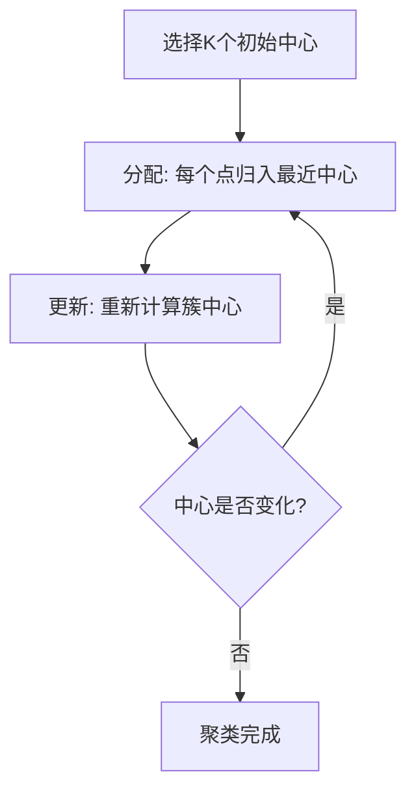
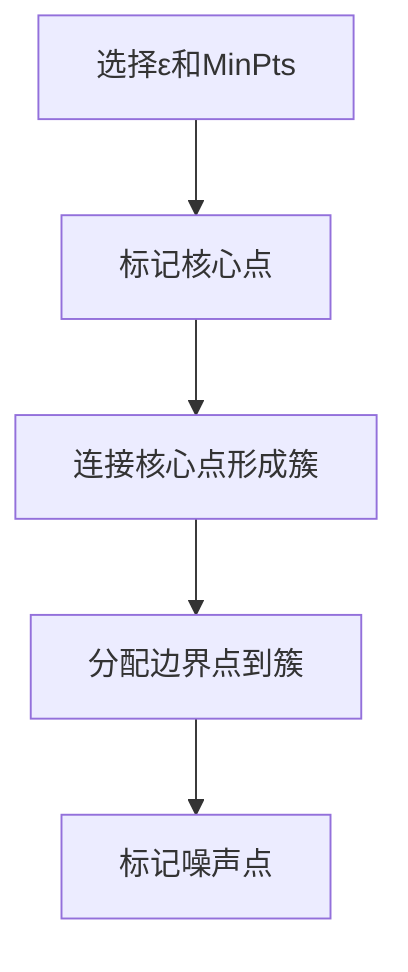
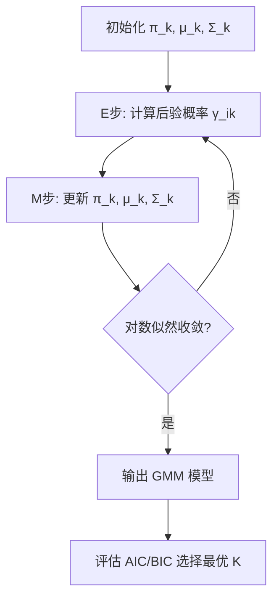
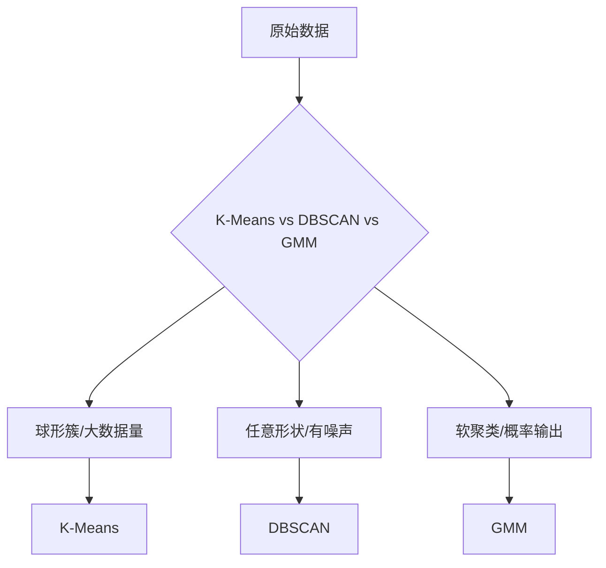
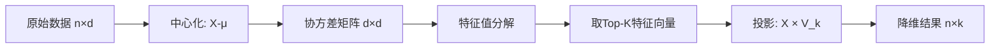

# 无监督学习

## 1. 聚类

### K-Means
- **原理**：迭代优化 K 个聚类中心，最小化簇内平方和（Inertia）
- **算法**：初始化 → 分配 → 更新 → 收敛
- **K 选择**：肘部法（Elbow）、轮廓系数（Silhouette）、Gap Statistic
- **缺点**：需指定 K、对初始值敏感、球形假设
- **改进**：K-Means++（智能初始化）、Mini-Batch K-Means

$$ \mathcal{L}_{KMeans} = \sum_{i=1}^{n} \min_{j} \|x_i - \mu_j\|^2, \quad \text{Inertia} = \sum_{j=1}^{K} \sum_{x \in C_j} \|x - \mu_j\|^2 $$



```python
from sklearn.cluster import KMeans, MiniBatchKMeans
from sklearn.metrics import silhouette_score
import numpy as np

np.random.seed(42)
X = np.concatenate([
    np.random.randn(100, 2) + [2, 2],
    np.random.randn(100, 2) + [-2, 2],
    np.random.randn(100, 2) + [0, -2]
])

kmeans = KMeans(n_clusters=3, init="k-means++", n_init=10, random_state=42)
labels = kmeans.fit_predict(X)
print(f"Inertia: {kmeans.inertia_:.2f}")
print(f"轮廓系数: {silhouette_score(X, labels):.4f}")
print(f"簇中心:\n{kmeans.cluster_centers_.round(3)}")

# 肘部法选K
inertias = [KMeans(n_clusters=k, random_state=42).fit(X).inertia_ for k in range(2, 8)]
print(f"Inertia 变化: {np.round(inertias, 1).tolist()}")

mbkmeans = MiniBatchKMeans(n_clusters=3, batch_size=25, random_state=42)
mb_labels = mbkmeans.fit_predict(X)
print(f"Mini-Batch Inertia: {mbkmeans.inertia_:.2f}")
```

### 层次聚类
- **凝聚式（AGNES）**：自底向上合并最近簇
- **分裂式（DIANA）**：自顶向下分裂簇
- **连接准则**：单链（Single）、全链（Complete）、平均链（Average）、Ward 法
- **输出**：树状图（Dendrogram），可任意选择聚类数

```python
from sklearn.cluster import AgglomerativeClustering
from scipy.cluster.hierarchy import dendrogram, linkage

X = np.concatenate([
    np.random.randn(50, 2) + [3, 3],
    np.random.randn(50, 2) + [-3, 3],
    np.random.randn(50, 2) + [0, -3]
])

# 凝聚聚类
for linkage_criterion in ["ward", "complete", "average"]:
    agg = AgglomerativeClustering(n_clusters=3, linkage=linkage_criterion)
    labels = agg.fit_predict(X)
    print(f"层次聚类({linkage_criterion}) 轮廓系数: {silhouette_score(X, labels):.4f}")

# 生成树状图数据
Z = linkage(X, method="ward")
print(f"树状图连接矩阵形状: {Z.shape}")
```

### DBSCAN
- **核心思想**：密度连接，无需指定 K
- **参数**：ε（邻域半径）、MinPts（最小点数）
- **处理**：核心点 → 边界点 → 噪声点
- **优点**：发现任意形状簇、自动处理噪声
- **缺点**：密度不均匀时效果差、高维数据距离失效



```python
from sklearn.cluster import DBSCAN

# 非球形簇
X = np.concatenate([
    np.random.randn(300, 2) * 0.3,  # 紧凑簇
    np.random.randn(200, 2) + [3, 0],  # 另一簇
    np.random.uniform(-3, 6, (50, 2))  # 噪声
])

for eps in [0.2, 0.3, 0.5]:
    db = DBSCAN(eps=eps, min_samples=5)
    labels = db.fit_predict(X)
    n_clusters = len(set(labels)) - (1 if -1 in labels else 0)
    n_noise = list(labels).count(-1)
    print(f"DBSCAN eps={eps:.1f}: {n_clusters}簇, {n_noise}噪声点, 轮廓系数: "
          f"{silhouette_score(X[labels>=0], labels[labels>=0]):.4f}")
```

### 高斯混合模型（GMM）
- **概率模型**：K 个高斯分布的加权和，可拟合椭球形簇
- **求解**：EM 算法（E步计算后验概率 γ，M步更新参数）
- **软聚类**：输出每个点属于各簇的后验概率
- **协方差类型**：full（全协方差）、tied（共享）、diag（对角）、spherical（球面）
- **选择 K**：AIC、BIC 准则

$$
P(x) = \sum_{k=1}^{K} \pi_k \mathcal{N}(x|\mu_k, \Sigma_k), \quad \sum \pi_k = 1
$$



```python
from sklearn.mixture import GaussianMixture

X = np.concatenate([
    np.random.randn(200, 2) + [2, 2],
    np.random.randn(200, 2) + [-2, 2],
    np.random.randn(200, 2) + [0, -2]
])

gmm = GaussianMixture(n_components=3, covariance_type="full", random_state=42)
gmm.fit(X)
print(f"AIC: {gmm.aic(X):.1f}, BIC: {gmm.bic(X):.1f}")
print(f"权重: {gmm.weights_.round(3)}")
print(f"均值:\n{gmm.means_.round(3)}")

# 软聚类：每个点属于各簇的概率
probs = gmm.predict_proba(X[:5])
print(f"前5个点的归属概率:\n{probs.round(3)}")
```



### 聚类对比表

| 算法 | 簇形状 | 需指定K | 噪声处理 | 可扩展性 | 确定性 |
|------|--------|---------|---------|---------|--------|
| K-Means | 球形 | ✓ | ✗ | ★★★★★ | 随机初始化 |
| 层次聚类 | 任意 | ✗ | ✗ | ★★ | ✓ |
| DBSCAN | 任意 | ✗ | ✓ | ★★★ | ✓ |
| GMM | 椭球 | ✓ | ✗ | ★★★ | 随机初始化 |

## 2. 降维

### PCA（主成分分析）
- **原理**：找到方差最大的投影方向
- **计算**：协方差矩阵 → 特征值分解 → 取 Top-K 特征向量
- **方差解释率**：前 K 个主成分保留的信息比例
- **应用**：可视化、去噪、数据压缩、预处理
- **Kernel PCA**：核技巧扩展，捕捉非线性结构

$$ \Sigma = \frac{1}{n}X^T X, \quad \Sigma v_i = \lambda_i v_i, \quad \text{方差解释率} = \frac{\lambda_i}{\sum \lambda_j} $$



```python
from sklearn.decomposition import PCA
from sklearn.preprocessing import StandardScaler

np.random.seed(42)
X = np.random.randn(500, 20)

pca = PCA(n_components=5)
X_pca = pca.fit_transform(X)
print(f"原始形状: {X.shape}, PCA后: {X_pca.shape}")
print(f"解释方差比: {pca.explained_variance_ratio_.round(3)}")
print(f"累计解释方差: {pca.explained_variance_ratio_.cumsum().round(3)}")

# 按95%方差选主成分
pca_95 = PCA(n_components=0.95)
X_pca_95 = pca_95.fit_transform(X)
print(f"保留95%方差需要: {pca_95.n_components_} 个主成分")
```

### t-SNE
- **原理**：保持高维相似度的低维映射，最小化 KL 散度
- **困惑度**：平衡局部与全局结构（5-50）
- **特点**：可视化效果好，但不可用于逆向映射
- **缺点**：随机性、计算量大、不保留全局结构

```python
from sklearn.manifold import TSNE

X = np.random.randn(300, 50)
X_plot = TSNE(n_components=2, perplexity=30, learning_rate=200, random_state=42).fit_transform(X)
print(f"t-SNE 降维: {X.shape} -> {X_plot.shape}")
```

### UMAP（2025-2026 主流）
- **原理**：基于黎曼几何和拓扑数据分析
- **速度**：比 t-SNE 快 10-100×
- **优点**：保留更多全局结构、可扩展性更好
- **应用**：单细胞 RNA-seq、文本嵌入可视化、图像特征可视化

### 其他降维方法
- **LDA**：有监督降维，最大化类间/类内距离比
- **Autoencoder**：神经网络降维，非线性
- **MDS**：多维缩放，保持点间距离
- **ISOMAP**：测地距离+MDS，保持流形结构

### 降维方法对比

| 方法 | 线性 | 监督 | 可视化 | 逆映射 | 可扩展性 |
|------|------|------|--------|--------|---------|
| PCA | ✓ | ✗ | 一般 | ✓ | ★★★★★ |
| t-SNE | ✗ | ✗ | ★★★★★ | ✗ | ★★ |
| UMAP | ✗ | ✗ | ★★★★★ | ✗ | ★★★★ |
| LDA | ✓ | ✓ | 好 | ✓ | ★★★★ |
| Autoencoder | ✗ | ✗ | 好 | ✓ | ★★★ |

## 3. 异常检测

### 统计方法
- **Z-Score**：假设正态分布，|Z| > 3 为异常
- **IQR**：Q1-1.5IQR / Q3+1.5IQR 之外为异常
- **Grubbs 检验**：单个异常点检测

### 基于距离/密度
- **LOF（局部异常因子）**：比较局部密度
- **Isolation Forest**：随机切分，异常点更容易被隔离
- **One-Class SVM**：学习正常数据的边界

```python
from sklearn.ensemble import IsolationForest
from sklearn.neighbors import LocalOutlierFactor
from sklearn.svm import OneClassSVM

np.random.seed(42)
X = np.random.randn(500, 2)
X_outliers = np.random.uniform(low=-5, high=5, size=(20, 2))
X_all = np.vstack([X, X_outliers])

models = {
    "IsolationForest": IsolationForest(contamination=0.04, random_state=42),
    "LOF": LocalOutlierFactor(contamination=0.04, novelty=False),
    "OneClassSVM": OneClassSVM(nu=0.04, kernel="rbf", gamma="scale")
}
for name, model in models.items():
    y_pred = model.fit_predict(X_all) if hasattr(model, 'fit_predict') else model.fit(X_all).predict(X_all)
    n_anomalies = sum(y_pred == -1)
    print(f"{name}: 检测到 {n_anomalies} 个异常点")
```

### 深度学习方法
- **DeepSVDD**：最小化特征空间中超球体积
- **自编码器重建误差**：异常点重建误差高
- **GANomaly**：生成对抗网络检测异常

## 4. 关联规则
- **Apriori**：频繁项集 → 关联规则 A→B
- **FP-Growth**：FP 树压缩，避免候选集生成
- **指标**：支持度（Support）、置信度（Confidence）、提升度（Lift）

$$ \text{Support}(A \rightarrow B) = P(AB), \quad \text{Confidence} = P(B|A), \quad \text{Lift} = \frac{P(B|A)}{P(B)} $$

## 5. 实践指南

| 任务 | 推荐算法 | 适用场景 |
|------|---------|---------|
| 客户分群 | K-Means、GMM | 营销、用户画像 |
| 图像分割 | DBSCAN、层次聚类 | 医学影像、遥感 |
| 高维可视化 | UMAP、t-SNE | 数据探索 |
| 数据压缩 | PCA、Autoencoder | 预处理、加速 |
| 欺诈检测 | Isolation Forest、LOF | 金融风控 |
| 推荐系统 | 协同过滤 | 电商、内容平台 |
| 异常监控 | One-Class SVM | 运维、设备监控 |
