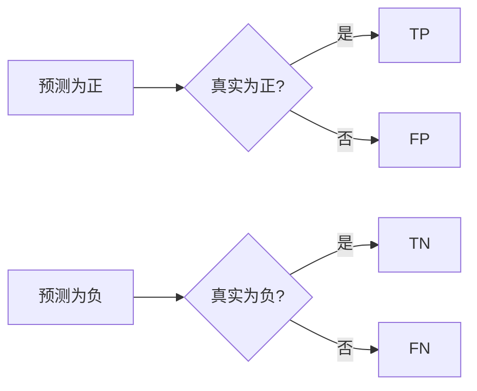
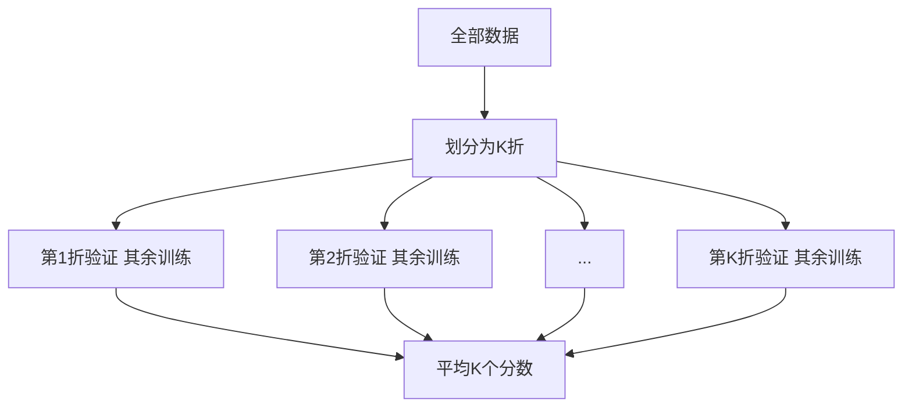
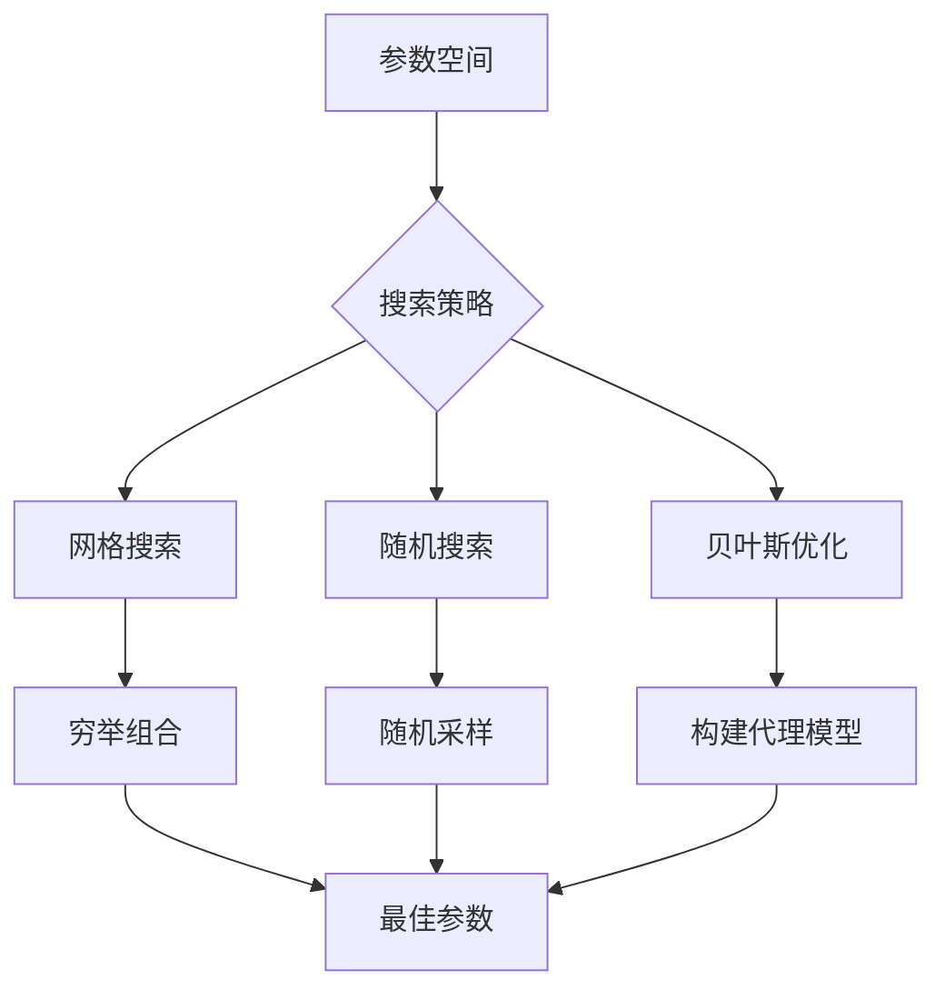
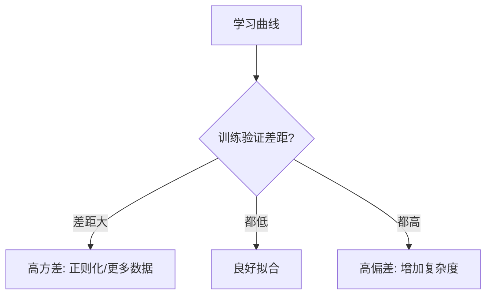
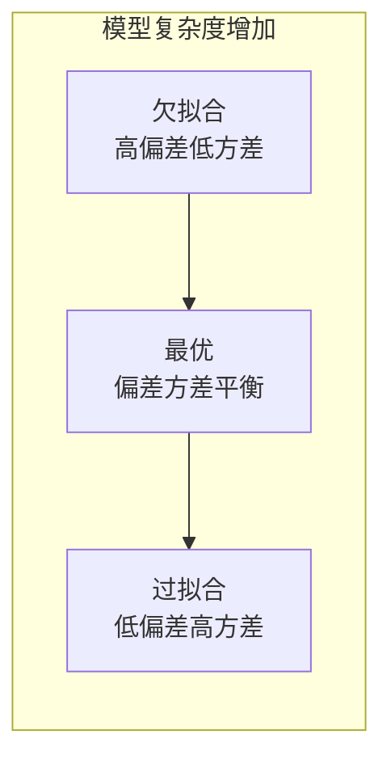

# 模型评估与调优

## 1. 评估指标

### 分类指标
- **混淆矩阵**：TP、TN、FP、FN
- **Accuracy**：(TP+TN)/(TP+TN+FP+FN) — 适合平衡数据
- **Precision（精确率）**：TP/(TP+FP) — 关注"预测为正的正确率"
- **Recall（召回率）**：TP/(TP+FN) — 关注"找全正例"
- **F1-Score**：2×P×R/(P+R) — 精确率与召回率的调和平均
- **ROC-AUC**：ROC 曲线下面积，评估排序能力
- **PR-AUC**：精度-召回曲线下面积（适合不平衡）
- **Log Loss**：交叉熵损失，评估概率输出

$$ \text{Precision} = \frac{TP}{TP+FP}, \quad \text{Recall} = \frac{TP}{TP+FN}, \quad F1 = \frac{2 \times P \times R}{P + R} $$



```python
from sklearn.metrics import (confusion_matrix, classification_report,
                             roc_curve, auc, precision_recall_curve,
                             accuracy_score, f1_score, log_loss)
from sklearn.datasets import make_classification
import numpy as np

np.random.seed(42)
y_true = np.random.randint(0, 2, 200)
y_pred = np.random.randint(0, 2, 200)
y_prob = np.random.rand(200)

cm = confusion_matrix(y_true, y_pred)
print(f"混淆矩阵:\n{cm}")
print(f"准确率: {accuracy_score(y_true, y_pred):.4f}")
print(f"F1: {f1_score(y_true, y_pred):.4f}")
print(f"Log Loss: {log_loss(y_true, y_prob):.4f}")
print(f"\n分类报告:\n{classification_report(y_true, y_pred, target_names=['负类', '正类'])}")

# ROC 曲线
fpr, tpr, _ = roc_curve(y_true, y_prob)
roc_auc = auc(fpr, tpr)
print(f"ROC-AUC: {roc_auc:.4f}")

# PR 曲线
precision, recall, _ = precision_recall_curve(y_true, y_prob)
print(f"PR-AUC: {auc(recall, precision):.4f}")
```

### 回归指标
- **MSE（均方误差）**：Σ(y-ŷ)²/n
- **RMSE**：√MSE，与原始单位一致
- **MAE（平均绝对误差）**：Σ|y-ŷ|/n
- **R²（决定系数）**：1 - SS_res/SS_tot
- **MAPE（平均绝对百分比误差）**：Σ|(y-ŷ)/y|/n × 100%

```python
from sklearn.metrics import mean_squared_error, mean_absolute_error, r2_score

y_true_reg = np.array([3.0, 2.5, 4.0, 5.5, 6.0])
y_pred_reg = np.array([2.8, 2.7, 4.2, 5.0, 6.3])

print(f"MSE : {mean_squared_error(y_true_reg, y_pred_reg):.4f}")
print(f"RMSE: {np.sqrt(mean_squared_error(y_true_reg, y_pred_reg)):.4f}")
print(f"MAE : {mean_absolute_error(y_true_reg, y_pred_reg):.4f}")
print(f"R²  : {r2_score(y_true_reg, y_pred_reg):.4f}")

mape = np.mean(np.abs((y_true_reg - y_pred_reg) / y_true_reg)) * 100
print(f"MAPE: {mape:.2f}%")
```

### 案例：不平衡数据下的指标陷阱

Accuracy 在高不平衡数据上极具误导性，应同时看 PR-AUC 与 F1。下面构造 95:5 不平衡集演示。

```python
import numpy as np
from sklearn.metrics import (accuracy_score, f1_score, precision_score,
                             recall_score, average_precision_score)
from sklearn.linear_model import LogisticRegression
from sklearn.datasets import make_classification

# 95% 负类, 5% 正类
X, y = make_classification(n_samples=2000, n_features=10, n_informative=4,
                           weights=[0.95], random_state=42)
clf = LogisticRegression(class_weight="balanced").fit(X, y)
y_pred = clf.predict(X)
y_prob = clf.predict_proba(X)[:, 1]

print(f"Accuracy : {accuracy_score(y, y_pred):.4f}")
print(f"Precision: {precision_score(y, y_pred):.4f}")
print(f"Recall   : {recall_score(y, y_pred):.4f}")
print(f"F1       : {f1_score(y, y_pred):.4f}")
print(f"PR-AUC   : {average_precision_score(y, y_prob):.4f}")
```


### 聚类指标
- **内部指标**：轮廓系数、Davies-Bouldin Index、Calinski-Harabasz Index
- **外部指标**：ARI（调整兰德指数）、NMI（归一化互信息）

```python
from sklearn.metrics import (silhouette_score, davies_bouldin_score,
                             calinski_harabasz_score, adjusted_rand_score,
                             normalized_mutual_info_score)
from sklearn.cluster import KMeans

X = np.random.randn(300, 5)
kmeans = KMeans(n_clusters=4, random_state=42).fit(X)
labels = kmeans.labels_

true_labels = np.random.randint(0, 4, 300)
print(f"轮廓系数: {silhouette_score(X, labels):.4f}")
print(f"Davies-Bouldin: {davies_bouldin_score(X, labels):.4f}")
print(f"Calinski-Harabasz: {calinski_harabasz_score(X, labels):.1f}")
print(f"ARI: {adjusted_rand_score(true_labels, labels):.4f}")
print(f"NMI: {normalized_mutual_info_score(true_labels, labels):.4f}")
```

## 2. 验证策略

### 留出法 Hold-out
- 训练集（60-80%）+ 验证集（10-20%）+ 测试集（10-20%）
- 适合大数据集
- **分层采样**：保持类别比例

```python
from sklearn.model_selection import train_test_split

X, y = np.random.randn(1000, 10), np.random.randint(0, 2, 1000)
X_train, X_test, y_train, y_test = train_test_split(X, y, test_size=0.2, random_state=42)
X_train, X_val, y_train, y_val = train_test_split(X_train, y_train, test_size=0.2, random_state=42)
print(f"训练: {X_train.shape[0]}, 验证: {X_val.shape[0]}, 测试: {X_test.shape[0]}")

# 分层采样
X_train_s, X_test_s, y_train_s, y_test_s = train_test_split(
    X, y, test_size=0.2, stratify=y, random_state=42)
print(f"原始正例比例: {y.mean():.2f}, 分层后训练: {y_train_s.mean():.2f}")
```

### K 折交叉验证
- 数据分为 K 份，轮流用 K-1 份训练、1 份验证
- **K=5 或 10** 为常见选择
- **分层 K 折**：每折保持类别比例
- **重复 K 折**：多次重复降低随机性



```python
from sklearn.datasets import make_classification
from sklearn.model_selection import (cross_val_score, cross_validate,
                                     KFold, StratifiedKFold, RepeatedKFold)
from sklearn.svm import SVC

X, y = make_classification(n_samples=300, n_features=10, random_state=42)

# 基本K折
scores = cross_val_score(SVC(kernel="rbf"), X, y, cv=5)
print(f"5折CV: {scores.mean():.4f} ± {scores.std():.4f}")

# 分层K折
strat_scores = cross_val_score(SVC(kernel="rbf"), X, y, cv=StratifiedKFold(5))
print(f"分层5折CV: {strat_scores.mean():.4f} ± {strat_scores.std():.4f}")

# 重复K折
rep_scores = cross_val_score(SVC(kernel="rbf"), X, y, cv=RepeatedKFold(n_splits=5, n_repeats=3))
print(f"重复5折CV: {rep_scores.mean():.4f} ± {rep_scores.std():.4f}")

# 详细指标
cv_results = cross_validate(
    SVC(kernel="rbf"), X, y, cv=5,
    scoring=["accuracy", "f1", "roc_auc"]
)
for metric in ["test_accuracy", "test_f1", "test_roc_auc"]:
    print(f"{metric}: {cv_results[metric].mean():.4f} ± {cv_results[metric].std():.4f}")
```

### 留一法（LOO）
- K=N 的极端 K 折
- 计算量大，适合小样本（<200）

```python
from sklearn.datasets import make_classification
from sklearn.model_selection import LeaveOneOut

X_small, y_small = make_classification(n_samples=50, n_features=5, random_state=42)
loo = LeaveOneOut()
loo_scores = cross_val_score(SVC(kernel="linear"), X_small, y_small, cv=loo)
print(f"LOO 准确率: {loo_scores.mean():.4f}")
```

### 时间序列验证
- 前向链验证：训练集滚动扩大
- 不可使用未来数据预测过去

```python
from sklearn.model_selection import TimeSeriesSplit

ts_data = np.random.randn(365, 1)
ts_cv = TimeSeriesSplit(n_splits=5)
for i, (train_idx, test_idx) in enumerate(ts_cv.split(ts_data)):
    print(f"折{i+1}: 训练 {len(train_idx)} 天 -> 测试 {len(test_idx)} 天")
```

## 3. 超参数调优

### 网格搜索 Grid Search
- 穷举所有参数组合
- **维度诅咒**：参数越多，组合爆炸

```python
from sklearn.datasets import make_classification
from sklearn.model_selection import GridSearchCV

X, y = make_classification(n_samples=300, n_features=10, random_state=42)
param_grid = {
    "C": [0.1, 1.0, 10.0],
    "gamma": ["scale", "auto", 0.1, 0.01],
    "kernel": ["rbf"]
}
gs = GridSearchCV(SVC(), param_grid, cv=5, scoring="accuracy", n_jobs=-1, verbose=0)
gs.fit(X, y)
print(f"网格搜索最佳参数: {gs.best_params_}")
print(f"最佳CV分数: {gs.best_score_:.4f}")
print(f"测试集分数: {gs.score(X, y):.4f}")
```

### 随机搜索 Random Search
- 参数空间随机采样
- 比网格搜索更高效（Bergstra & Bengio 2012）

```python
from sklearn.model_selection import RandomizedSearchCV
from scipy.stats import loguniform, uniform

param_dist = {
    "C": loguniform(0.01, 100),
    "gamma": loguniform(0.001, 1.0),
    "kernel": ["rbf"]
}
rs = RandomizedSearchCV(
    SVC(), param_dist, n_iter=30, cv=5, scoring="accuracy",
    random_state=42, n_jobs=-1
)
rs.fit(X, y)
print(f"随机搜索最佳参数: {rs.best_params_}")
print(f"最佳CV分数: {rs.best_score_:.4f}")
```

### 贝叶斯优化
- **原理**：构建代理模型（高斯过程），平衡探索-利用
- **工具**：Optuna、Hyperopt、BayesianOptimization
- **Tree-structured Parzen Estimator (TPE)**：Optuna 默认

```python
# Optuna 示例（需 pip install optuna）
def objective(trial):
    C = trial.suggest_float("C", 1e-3, 1e2, log=True)
    gamma = trial.suggest_float("gamma", 1e-4, 1.0, log=True)
    kernel = trial.suggest_categorical("kernel", ["rbf", "linear"])
    scores = cross_val_score(SVC(C=C, gamma=gamma, kernel=kernel), X, y, cv=3)
    return scores.mean()

study = optuna.create_study(direction="maximize", study_name="SVM优化")
study.optimize(objective, n_trials=30)
print(f"Optuna 最佳参数: {study.best_params}")
print(f"Optuna 最佳值: {study.best_value:.4f}")
```



### 学习曲线诊断

```python
from sklearn.model_selection import learning_curve

train_sizes, train_scores, val_scores = learning_curve(
    RandomForestClassifier(n_estimators=100), X, y,
    cv=5, train_sizes=np.linspace(0.1, 1.0, 5), scoring="accuracy"
)
for i, size in enumerate(train_sizes):
    print(f"训练集大小={size}: 训练准确率={train_scores[i].mean():.3f}, "
          f"验证准确率={val_scores[i].mean():.3f}")
```

### 自动化调参工具
| 工具 | 搜索算法 | 分布式 | 可视化 | 内置早停 |
|------|---------|-------|-------|---------|
| Optuna | TPE + 多采样 | ✓ | ✓ | ✓ |
| Hyperopt | TPE + 随机 | ✓ | ✗ | ✗ |
| Ray Tune | 多算法 | ✓ | ✓ | ✓ |
| GridSearchCV | 网格 | ✗ | ✗ | ✗ |
| RandomizedSearchCV | 随机 | ✗ | ✗ | ✗ |

### 案例：用学习曲线判断该加数据还是降复杂度

学习曲线显示训练/验证误差随样本量收敛情况。若二者仍有大 gap 则是方差问题（需正则化）；若都很高则是偏差问题（需更复杂模型）。

```python
import numpy as np
from sklearn.model_selection import learning_curve
from sklearn.linear_model import LogisticRegression
from sklearn.ensemble import RandomForestClassifier
from sklearn.datasets import make_classification

X, y = make_classification(n_samples=800, n_features=20, n_informative=5, random_state=42)

for name, model in [("线性(高偏差风险)", LogisticRegression(max_iter=1000)),
                    ("随机森林(高方差风险)", RandomForestClassifier(max_depth=20))]:
    sizes, tr, va = learning_curve(model, X, y, cv=4,
                                   train_sizes=np.linspace(0.2, 1.0, 5))
    print(f"{name}: 训练末点 训练={tr[-1].mean():.3f} 验证={va[-1].mean():.3f}")
```



## 4. 过拟合与欠拟合

### 诊断
- **过拟合**：训练误差低、验证误差高 → 降低模型复杂度、正则化、更多数据
- **欠拟合**：训练误差高、验证误差高 → 增加复杂度、更少正则化、更多特征

```python
# 诊断示例
np.random.seed(42)
X = np.random.randn(100, 20)
y = X[:, 0] + 0.5 * X[:, 1] + np.random.randn(100) * 0.1

models = {
    "欠拟合 (线性)": LinearRegression(),
    "过拟合 (高次多项式)": Pipeline([
        ("poly", PolynomialFeatures(degree=15, include_bias=False)),
        ("lr", LinearRegression())
    ]),
    "正拟合 (Ridge正则化)": Pipeline([
        ("poly", PolynomialFeatures(degree=15, include_bias=False)),
        ("ridge", Ridge(alpha=10.0))
    ])
}
for name, model in models.items():
    train_scores, val_scores = [], []
    for size in np.linspace(20, 100, 5):
        idx = np.random.choice(100, int(size), replace=False)
        model.fit(X[idx], y[idx])
        train_scores.append(r2_score(y[idx], model.predict(X[idx])))
        val_idx = [i for i in range(100) if i not in idx]
        val_scores.append(r2_score(y[val_idx], model.predict(X[val_idx])))
    print(f"{name}: 训练R²={np.mean(train_scores):.3f}, 验证R²={np.mean(val_scores):.3f}")
```

### 缓解策略
- **正则化**：L1/L2/Elastic Net
- **早停**：验证误差不再下降时停止
- **Dropout**：随机丢弃神经元
- **数据增强**：扩充训练数据
- **集成方法**：降低方差

## 5. 偏差-方差权衡



- **偏差**：模型预测与真实值的偏离程度
- **方差**：模型对训练集波动的敏感程度
- **权衡**：增加复杂度 → 降低偏差 → 增加方差

## 6. AB 测试
- **假设检验**：H₀（无差异）vs H₁（有显著差异）
- **统计显著性**：p-value < 0.05
- **功效分析**：确定所需样本量
- **AA 测试**：验证分流均匀性
- **MDE（最小可检测效应）**：检测能力
