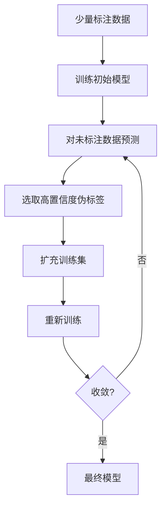
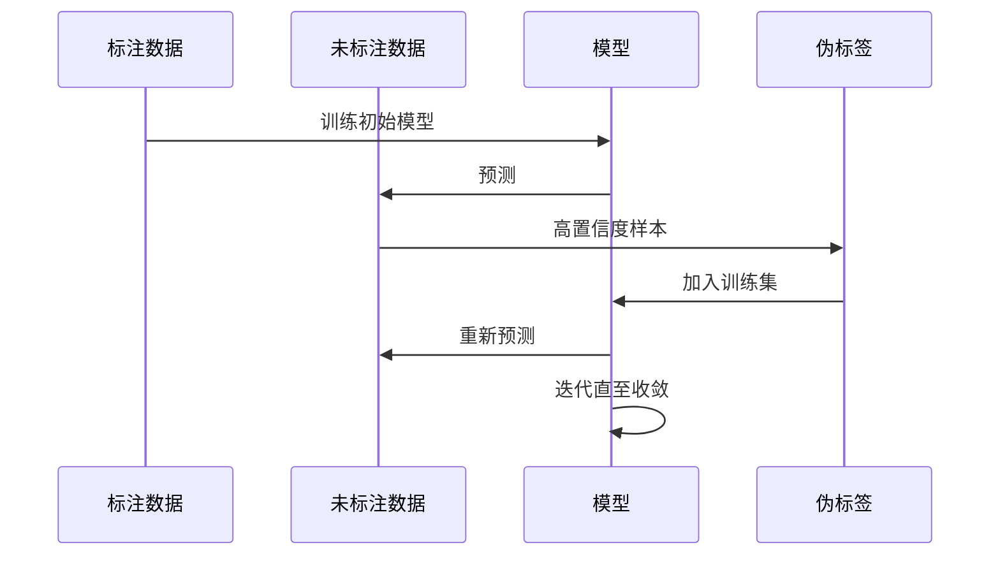
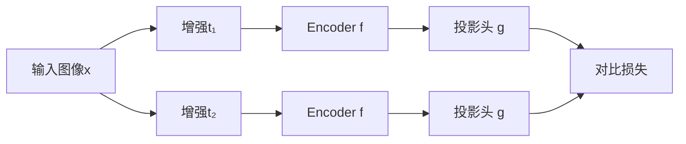
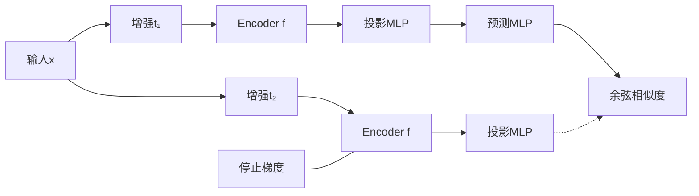
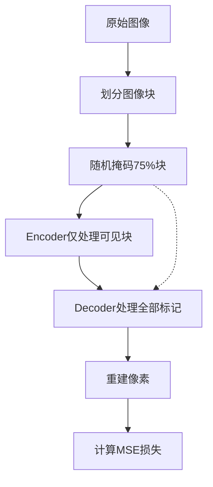

# 半监督与自监督学习

## 1. 半监督学习

### 核心思想
半监督学习利用少量标注数据 + 大量未标注数据提升模型性能，显著降低标注成本。

$$ \mathcal{L} = \mathcal{L}_{labeled} + \lambda \cdot \mathcal{L}_{unlabeled} $$

### 自训练 Self-Training



```python
from sklearn.ensemble import RandomForestClassifier
from sklearn.semi_supervised import SelfTrainingClassifier
from sklearn.datasets import make_classification
import numpy as np

X, y = make_classification(n_samples=500, n_features=10, n_informative=6,
                           n_classes=2, random_state=42)

# 仅使用10%标注数据
rng = np.random.RandomState(42)
labeled_mask = rng.rand(len(y)) < 0.1
y_semi = y.copy()
y_semi[~labeled_mask] = -1  # 未标注标记为 -1

print(f"标注样本: {labeled_mask.sum()}, 未标注样本: {(~labeled_mask).sum()}")

# 自训练
base_clf = RandomForestClassifier(n_estimators=100, random_state=42)
self_training = SelfTrainingClassifier(base_clf, threshold=0.75, verbose=False)
self_training.fit(X, y_semi)
print(f"自训练准确率: {self_training.score(X, y):.4f}")

# 对比: 仅使用标注数据
base_clf.fit(X[labeled_mask], y[labeled_mask])
print(f"仅标注数据准确率: {base_clf.score(X, y):.4f}")
```

### 一致性正则化
- **原理**：同一输入的不同增强版本应产生一致输出
- **Π-Model**：两次随机增强后的输出一致性损失
- **Temporal Ensembling**：维护 EMA 预测作为目标
- **Mean Teacher**：教师模型（EMA 学生权重）生成目标
- **FixMatch**：强增强的伪标签 + 弱增强的预测

$$ \mathcal{L}_{consistency} = \|f(x + \epsilon_1) - f(x + \epsilon_2)\|^2 $$

```python
# 一致性正则化模拟（简化版）
np.random.seed(42)
X_labeled = np.random.randn(50, 5)
y_labeled = (X_labeled[:, 0] + X_labeled[:, 1] > 0).astype(int)
X_unlabeled = np.random.randn(450, 5)

# 模拟教师-学生一致性训练步骤
epsilon1, epsilon2 = np.random.randn(*X_unlabeled.shape) * 0.1, np.random.randn(*X_unlabeled.shape) * 0.1
x_aug1 = X_unlabeled + epsilon1
x_aug2 = X_unlabeled + epsilon2

# 用简单模型模拟一致性损失
from sklearn.linear_model import LogisticRegression
model = LogisticRegression()
model.fit(X_labeled, y_labeled)
p1 = model.predict_proba(x_aug1)
p2 = model.predict_proba(x_aug2)
consistency_loss = np.mean((p1 - p2) ** 2)
print(f"一致性损失: {consistency_loss:.6f}")
```

### 半监督学习流程



### 半监督算法对比

| 方法 | 核心机制 | 优缺点 | 适用场景 |
|------|---------|-------|---------|
| Self-Training | 伪标签迭代 | 简单但误差累积 | 通用 |
| Co-Training | 多视图特征 | 需特征分割 | 多视角数据 |
| FixMatch | 一致性+伪标签 | 2020 年 SOTA，简洁高效 | 图像分类 |
| MixMatch | 混合增强 | 计算量大 | 半监督图像 |
| Noisy Student | 噪声注入 | 大模型效果好 | 大规模数据 |
| Mean Teacher | EMA 教师模型 | 稳定训练 | 通用 |

## 2. 自监督学习

### 对比学习 Contrastive Learning

#### SimCLR（2020）
- **正样本**：同一图像两次随机增强
- **负样本**：批次内其他所有图像
- **损失**：NT-Xent（归一化温度缩放交叉熵）
- **关键**：大批次（4096）负样本多

$$ \mathcal{L}_{NT-Xent} = -\log \frac{\exp(\text{sim}(z_i, z_j)/\tau)}{\sum_{k=1}^{2N} \mathbb{1}_{k \neq i} \exp(\text{sim}(z_i, z_k)/\tau)} $$



```python
# SimCLR 对比损失实现
import torch
import torch.nn.functional as F

def nt_xent_loss(z, temperature=0.5):
    N = z.shape[0] // 2
    z = F.normalize(z, dim=1)
    sim_matrix = torch.mm(z, z.T) / temperature

    labels = torch.cat([torch.arange(N) * 2 + 1,
                        torch.arange(N) * 2])
    labels = labels.to(z.device)

    mask = torch.eye(2 * N, dtype=torch.bool, device=z.device)
    sim_matrix = sim_matrix[~mask].view(2 * N, -1)

    return F.cross_entropy(sim_matrix, labels)

z = torch.randn(8, 128)  # 4个正样本对, batch=8
loss = nt_xent_loss(z)
print(f"SimCLR 对比损失: {loss.item():.4f}")
```

#### MoCo（Momentum Contrast）
- **动态字典**：队列维护负样本，无需大批次
- **动量编码器**：平滑更新编码器，保持特征一致性
- **MoCo V3**：ViT 适用

```python
# MoCo 动量编码器更新模拟
def momentum_update(student_net, teacher_net, m=0.999):
    with torch.no_grad():
        for param_s, param_t in zip(student_net.parameters(), teacher_net.parameters()):
            param_t.data = m * param_t.data + (1 - m) * param_s.data
```

#### SimSiam / BYOL（非负样本）
- **无负样本**：仅用正样本对
- **停止梯度**：防止坍塌到常数解
- **预测头**：一个分支额外加预测 MLP



### 掩码图像建模 Masked Image Modeling

- **MAE（Masked Autoencoder, 2021）**：随机掩码 75% 图像块，Decoder 重建像素
- **原理**：类似 BERT 的完形填空
- **对称性**：非对称 Encoder-Decoder（Encoder 只看可见块）



### 自监督在 NLP
- **Masked LM**：BERT 掩码 15% token
- **Causal LM**：GPT 自回归预测
- **Sentence-level**：NSP（下一句预测）、SOP（句子顺序）

```python
# BERT 掩码语言模型模拟
text = "The quick brown fox jumps over the lazy dog"
tokens = text.lower().split()
mask_idx = 3
tokens[mask_idx] = "[MASK]"
print(f"掩码后的序列: {' '.join(tokens)}")
```

### 自监督在语音
- **Wav2Vec 2.0**：量化 + 掩码 + 对比学习
- **HuBERT**：聚类作为伪标签

## 3. 伪标签生成策略对比

| 策略 | 选择标准 | 优势 | 风险 |
|------|---------|------|------|
| 硬阈值 | 预测概率 > T | 简单 | 校准不佳会误选 |
| Top-K | 概率最高的K个 | 控制数量 | 可能引入低质量 |
| 熵过滤 | 低熵 = 高置信度 | 理论上更优 | 计算稍复杂 |
| 一致性过滤 | 多次预测一致 | 鲁棒性高 | 需多次推理 |

```python
# 伪标签过滤策略对比
np.random.seed(42)
probabilities = np.random.rand(1000)
entropies = -probabilities * np.log(probabilities + 1e-10) - (1 - probabilities) * np.log(1 - probabilities + 1e-10)

# 策略1: 硬阈值选75%以上
n_threshold = (probabilities > 0.75).sum()
print(f"阈值法(0.75): {n_threshold} 个")

# 策略2: Top-K
k = 200
top_k_idx = np.argsort(probabilities)[-k:]
print(f"Top-K({k}): {len(top_k_idx)} 个")

# 策略3: 低熵过滤
low_entropy = (entropies < 0.3).sum()
print(f"低熵法(<0.3): {low_entropy} 个")
```

## 4. 2025-2026 趋势
- **DINOv2**：ViT 自监督特征，无需微调即可直接用于下游任务
- **I-JEPA**：ImageJEPA，基于图像块的预测，比 MAE 更语义
- **自监督 + 大模型**：CLIP 类图文对比学习仍是主流预训练范式
- **多模态自监督**：文本+图像+音频联合预训练
