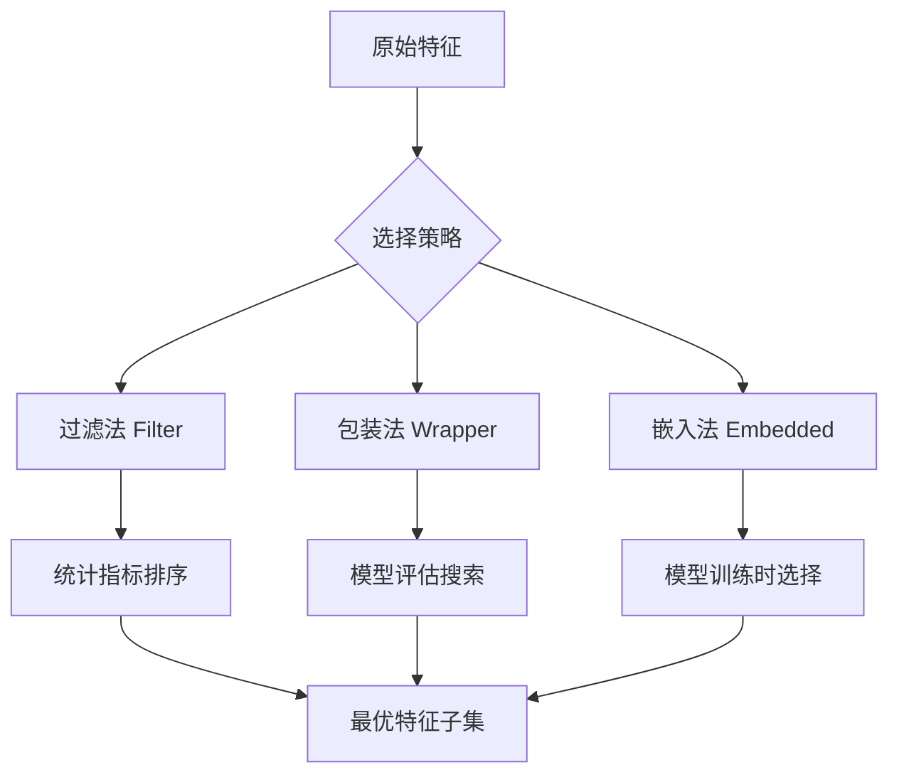
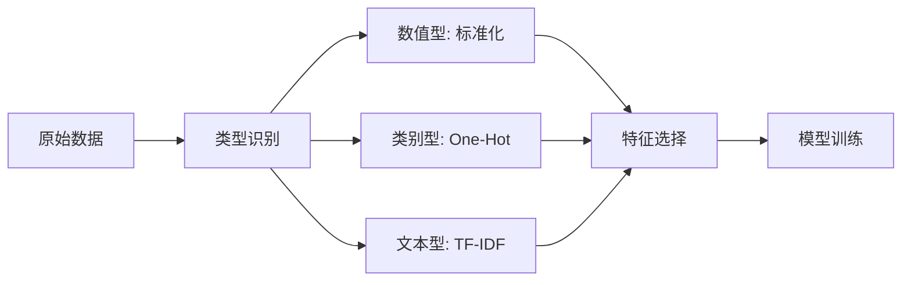

# 特征工程与选择

## 1. 特征类型

| 类型 | 示例 | 处理方法 |
|------|------|---------|
| 数值型 | 年龄、价格 | 标准化/归一化/分箱 |
| 类别型 | 颜色、城市 | One-Hot/Label/Target 编码 |
| 文本型 | 评论、描述 | TF-IDF/Embedding |
| 时间型 | 日期、时间戳 | 周几/月份/节假日/滑动统计 |
| 空间型 | 地址、坐标 | 经纬度聚类/区域编码 |

## 2. 特征编码

### One-Hot 编码
- 优点：无大小关系假设
- 缺点：高维稀疏（类别多 >100 时慎用）

```python
from sklearn.preprocessing import OneHotEncoder, LabelEncoder
import numpy as np

categories = np.array(["red", "blue", "green", "blue", "red"]).reshape(-1, 1)
ohe = OneHotEncoder(sparse_output=False)
encoded = ohe.fit_transform(categories)
print(f"One-Hot 编码结果:\n{encoded}")
print(f"类别: {ohe.categories_}")

# 处理高基数类别 - 使用 Top-K 编码
from sklearn.feature_extraction.text import CountVectorizer
rare_threshold = 2
categories_high = np.array(["A"] * 50 + ["B"] * 30 + ["C"] * 10 +
                           [chr(ord('D') + i) for i in range(10)] * 1)
unique, counts = np.unique(categories_high, return_counts=True)
rare = unique[counts < rare_threshold]
print(f"低频类别({len(rare)}个): {rare}")
```

### Label Encoding
- 适合：有序类别（如 小学<中学<大学）
- 注意：对无序类别引入错误顺序关系

```python
le = LabelEncoder()
labels = le.fit_transform(categories.ravel())
print(f"Label 编码: {labels}")
```

### Target Encoding
- 原理：用目标变量均值编码类别
- 风险：目标泄露 → 需要 K-Fold 交叉编码
- 工具：category_encoders 库

```python
# Target Encoding 模拟实现
np.random.seed(42)
X_cat = np.random.choice(["A", "B", "C", "D"], size=500)
y_target = np.random.randn(500)

from sklearn.model_selection import KFold
kf = KFold(n_splits=5, shuffle=True, random_state=42)
target_encoded = np.zeros(500)

for train_idx, val_idx in kf.split(X_cat):
    X_train_cat = X_cat[train_idx]
    y_train_target = y_target[train_idx]
    means = {}
    for cat in ["A", "B", "C", "D"]:
        mask = X_train_cat == cat
        if mask.sum() > 0:
            means[cat] = y_train_target[mask].mean()
        else:
            means[cat] = y_train_target.mean()
    for cat in ["A", "B", "C", "D"]:
        target_encoded[val_idx[X_cat[val_idx] == cat]] = means[cat]

print(f"Target 编码值范围: [{target_encoded.min():.3f}, {target_encoded.max():.3f}]")
```

### Embedding 编码
- 深度学习自动学习类别嵌入
- 适合：上万个类别（如用户ID、商品ID）

## 3. 特征缩放

| 方法 | 公式 | 适用 |
|------|------|------|
| 标准化 Z-score | (x-μ)/σ | 正态分布数据 |
| 归一化 Min-Max | (x-min)/(max-min) | 有界数据 |
| Robust | (x-median)/IQR | 有离群点 |
| 单位向量 | x/||x|| | 文本/稀疏向量 |

```python
from sklearn.preprocessing import StandardScaler, MinMaxScaler, RobustScaler, Normalizer

np.random.seed(42)
X = np.random.randn(500, 4)
X_outliers = X.copy()
X_outliers[0, :] = [100, -100, 50, -50]

scalers = {
    "StandardScaler": StandardScaler(),
    "MinMaxScaler": MinMaxScaler(),
    "RobustScaler": RobustScaler(),
    "Normalizer": Normalizer()
}
for name, scaler in scalers.items():
    X_scaled = scaler.fit_transform(X_outliers)
    print(f"{name:15s} 均值={X_scaled.mean(0).round(3)}, 标准差={X_scaled.std(0).round(3)}")
```

## 4. 特征构造

### 多项式特征
- x², x³, x₁·x₂ 组合特征
- 工具：sklearn PolynomialFeatures

```python
from sklearn.preprocessing import PolynomialFeatures

X = np.array([[1, 2], [3, 4], [5, 6]])
poly = PolynomialFeatures(degree=2, include_bias=True, interaction_only=False)
X_poly = poly.fit_transform(X)
print(f"原始特征: {X.shape}")
print(f"多项式特征: {X_poly.shape}")
print(f"特征名称: {poly.get_feature_names_out()}")
print(f"多项式特征矩阵:\n{X_poly}")

# 仅交互特征（无平方项）
poly_inter = PolynomialFeatures(degree=2, interaction_only=True, include_bias=False)
X_inter = poly_inter.fit_transform(X)
print(f"交互特征(无平方): {poly_inter.get_feature_names_out()}")
```

### 交叉组合
- 类别×类别：笛卡尔积完成一阶交互
- 数值×类别：每个类别下的统计量（均值/方差）
- 数值×数值：比率、差值、乘积

```python
# 数值交叉特征构造
A = np.array([1.0, 2.0, 3.0, 4.0])
B = np.array([5.0, 6.0, 7.0, 8.0])
features = np.column_stack([
    A, B, A * B, A / (B + 1e-8), A - B, A + B
])
print(f"数值交叉特征:\n{features.round(2)}")
```

### 时间特征
- 周期：年/月/周/日/小时/分钟
- 衍生：节假日标记、季节、连续天数
- 滑动窗口：近 N 天均值/标准差/趋势

```python
from datetime import datetime, timedelta

dates = [datetime(2024, 1, 1) + timedelta(days=i) for i in range(365)]
time_features = np.column_stack([
    [d.month for d in dates],
    [d.weekday() for d in dates],
    [d.day for d in dates],
    [(d.weekday() >= 5).astype(int) for d in dates],  # 是否周末
    [d.timetuple().tm_yday for d in dates]  # 年中第几天
])
print(f"时间特征示例:\n{time_features[:5]}")
print(f"特征维度: {time_features.shape[1]}")
```

### 领域特征
- **NLP**：字数、情感分、词性比例
- **CV**：颜色直方图、纹理特征、边缘密度
- **时序**：差分、傅里叶变换、自相关

## 5. 特征选择

### 过滤法 Filter
| 方法 | 适合 | 说明 |
|------|------|------|
| 方差阈值 | 所有 | 移除方差为 0 的常量特征 |
| 相关系数 | 回归 | 目标与特征的 Pearson/ Spearman |
| 卡方检验 | 分类 | 类别特征+分类目标 |
| 互信息 | 通用 | 非线性相关度量 |

```python
from sklearn.feature_selection import (SelectKBest, f_classif, chi2,
                                       mutual_info_classif, VarianceThreshold)
from sklearn.datasets import make_classification

X, y = make_classification(n_samples=500, n_features=20, n_informative=5,
                           n_redundant=5, n_repeated=5, random_state=42)

# 方差阈值
sel_variance = VarianceThreshold(threshold=0.01)
X_var = sel_variance.fit_transform(X)
print(f"方差过滤: {X.shape[1]} -> {X_var.shape[1]} 个特征")

# SelectKBest + f_classif (ANOVA)
selector_f = SelectKBest(score_func=f_classif, k=8)
X_f = selector_f.fit_transform(X, y)
print(f"ANOVA F 值: {selector_f.scores_.round(3)}")
print(f"选中的特征索引: {selector_f.get_support(indices=True)}")

# 互信息
selector_mi = SelectKBest(score_func=mutual_info_classif, k=8)
X_mi = selector_mi.fit_transform(X, y)
print(f"互信息评分: {selector_mi.scores_.round(3)}")
```

### 包装法 Wrapper
- **前向选择**：逐步添加最有用的特征
- **后向消除**：逐步移除最无关的特征
- **递归特征消除 RFE**：用模型权重排序，逐轮移除

```python
from sklearn.feature_selection import RFE, RFECV
from sklearn.svm import SVC

X, y = make_classification(n_samples=300, n_features=15, n_informative=5, random_state=42)

# RFE
estimator = SVC(kernel="linear")
rfe = RFE(estimator, n_features_to_select=6)
rfe.fit(X, y)
print(f"RFE 特征排序: {rfe.ranking_}")
print(f"选中的特征: {np.where(rfe.support_)[0]}")

# RFECV (自动选特征数)
rfecv = RFECV(estimator=SVC(kernel="linear"), cv=5, scoring="accuracy")
rfecv.fit(X, y)
print(f"RFECV 最优特征数: {rfecv.n_features_}")
print(f"特征排名: {rfecv.ranking_}")
```

### 嵌入法 Embedded
- **L1 正则化（Lasso）**：自动将不重要特征系数压缩为 0
- **Tree Importance**：随机森林/XGBoost 内置特征重要性
- **Permutation Importance**：特征值洗牌后的性能下降量

```python
from sklearn.linear_model import LogisticRegression
from sklearn.ensemble import RandomForestClassifier
from sklearn.inspection import permutation_importance

X, y = make_classification(n_samples=500, n_features=20, n_informative=6, random_state=42)

# L1 特征选择
lr_l1 = LogisticRegression(penalty="l1", solver="saga", C=0.1, random_state=42)
lr_l1.fit(X, y)
n_selected = (lr_l1.coef_ != 0).sum()
print(f"L1 选中特征数: {n_selected}")

# 树模型特征重要性
rf = RandomForestClassifier(n_estimators=100, random_state=42)
rf.fit(X, y)
print(f"特征重要性: {rf.feature_importances_.round(3)}")
print(f"Top-5 特征索引: {rf.feature_importances_.argsort()[::-1][:5]}")

# Permutation Importance
perm_importance = permutation_importance(rf, X, y, n_repeats=10, random_state=42)
print(f"Permutation Importance: {perm_importance.importances_mean.round(4)}")
```



### 特征选择方法对比

| 方法 | 计算开销 | 与模型交互 | 稳定性 | 适用数据量 |
|------|---------|-----------|-------|-----------|
| 方差阈值 | 极低 | 无 | 稳定 | 任意 |
| 相关系数 | 低 | 无 | 一般 | 大样本 |
| 互信息 | 中等 | 无 | 稳定 | 任意 |
| RFE | 高 | 依赖模型 | 一般 | 小-中 |
| L1 | 低 | 线性模型 | 稳定 | 中-大 |
| Tree Importance | 中等 | 树模型 | 稳定 | 中-大 |
| Permutation | 高 | 任何模型 | 稳定 | 中 |

## 6. 降维
- **PCA**：无监督线性降维
- **LDA**：有监督线性降维，最大化类间/类内距离
- **t-SNE / UMAP**：可视化降维，非线性
- **Autoencoder**：神经网络降维，强非线性

```python
from sklearn.decomposition import PCA
from sklearn.discriminant_analysis import LinearDiscriminantAnalysis

X, y = make_classification(n_samples=300, n_features=30, n_informative=10, n_classes=3, random_state=42)

# PCA
pca = PCA(n_components=10)
X_pca = pca.fit_transform(X)
print(f"PCA 累计方差比: {pca.explained_variance_ratio_.cumsum()[-1]:.3f}")

# LDA (有监督)
lda = LinearDiscriminantAnalysis(n_components=2)
X_lda = lda.fit_transform(X, y)
print(f"LDA 降维: {X.shape} -> {X_lda.shape}")
```

## 7. 完整的特征工程 Pipeline

```python
from sklearn.pipeline import Pipeline
from sklearn.compose import ColumnTransformer

numeric_features = [0, 1, 2]
categorical_features = [3, 4]

preprocessor = ColumnTransformer(
    transformers=[
        ("num", StandardScaler(), numeric_features),
        ("cat", OneHotEncoder(handle_unknown="ignore"), categorical_features)
    ]
)

pipeline = Pipeline([
    ("preprocessor", preprocessor),
    ("selector", SelectKBest(score_func=f_classif, k=10)),
    ("classifier", RandomForestClassifier(n_estimators=100))
])

print("特征工程 Pipeline 构建完成")
print(f"变换器: {preprocessor.transformers_}")
```



## 8. 特征工程自动化
- **Featuretools**：自动特征衍生（DFS 深度特征合成）
- **AutoGluon Tabular**：自动特征工程+模型选择
- **Optuna + sklearn Pipeline**：特征组合搜索
- **2025-2026**：LLM 自动建议特征（LLM 理解数据语义生成特征策略）
