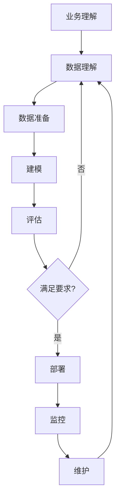
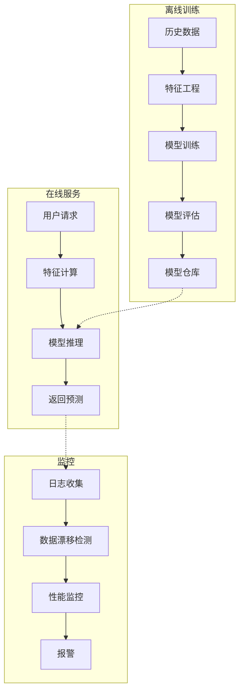
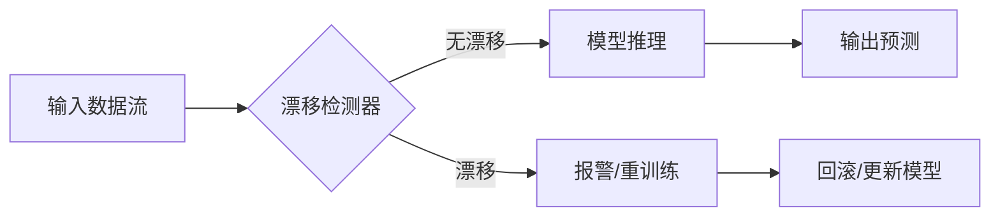
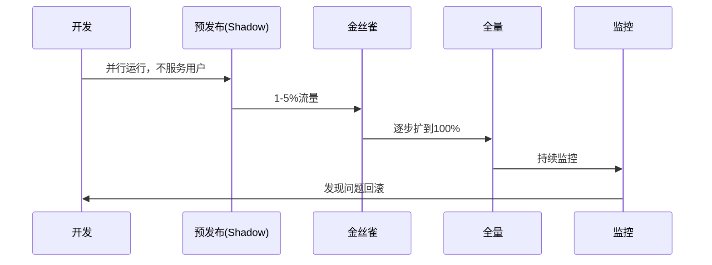

# 机器学习生产实践

## 1. 项目工作流


### CRISP-DM 详细工作流



## 2. 实验管理

### 实验追踪
- **WandB / MLflow / Neptune**：超参/指标/模型/数据版本记录
- **关键记录**：
  - 超参数配置
  - 训练/验证指标曲线
  - 模型权重
  - 数据/代码版本

```python
# MLflow 实验追踪示例（需 pip install mlflow）
import mlflow
import mlflow.sklearn
from sklearn.ensemble import RandomForestClassifier
from sklearn.model_selection import cross_val_score
from sklearn.datasets import make_classification

X, y = make_classification(n_samples=500, n_features=20, random_state=42)

def run_experiment(n_estimators, max_depth, experiment_name="default"):
    with mlflow.start_run(run_name=f"rf_{n_estimators}_{max_depth}"):
        rf = RandomForestClassifier(
            n_estimators=n_estimators,
            max_depth=max_depth,
            random_state=42
        )
        scores = cross_val_score(rf, X, y, cv=5, scoring="accuracy")

        mlflow.log_param("n_estimators", n_estimators)
        mlflow.log_param("max_depth", max_depth)
        mlflow.log_metric("cv_accuracy_mean", scores.mean())
        mlflow.log_metric("cv_accuracy_std", scores.std())

        mlflow.sklearn.log_model(rf, "model")
        print(f"实验 rf_{n_estimators}_{max_depth}: 准确率={scores.mean():.4f}")

# 运行一次示例
print("MLflow 实验追踪初始化完成")
run_experiment(100, 10)
```

### 可重复性
- **固定随机种子**
- **容器化环境**（Docker）
- **Conda/Pip 锁定依赖版本**
- **DVC 数据版本控制**

```python
# 随机种子固定最佳实践
import random
import numpy as np

def set_all_seeds(seed=42):
    random.seed(seed)
    np.random.seed(seed)
    try:
        import torch
        torch.manual_seed(seed)
        torch.cuda.manual_seed_all(seed)
    except ImportError:
        pass
    try:
        import tensorflow as tf
        tf.random.set_seed(seed)
    except ImportError:
        pass

set_all_seeds(42)
print("随机种子已固定 (seed=42)")
```

## 3. 模型选型指南

| 数据规模 | 特征类型 | 推荐模型 |
|---------|---------|---------|
| 小（<1万）| 表格 | XGBoost / LightGBM |
| 中（1-10万）| 混合 | AutoML / Ensemble |
| 大（10万+）| 非结构化 | 深度学习 |
| 文本 | 文本 | BERT / LLM |
| 时间序列 | 时序 | Prophet / LSTM / N-BEATS |

### 模型选择矩阵

| 需求 | 线性模型 | 树模型 | 深度学习 |
|------|---------|-------|---------|
| 可解释性 | ★★★★★ | ★★★ | ★ |
| 训练速度 | ★★★★★ | ★★★★ | ★★ |
| 预测速度 | ★★★★★ | ★★★★ | ★★★ |
| 小样本性能 | ★★★★ | ★★★★ | ★ |
| 非结构化数据 | ★ | ★★ | ★★★★★ |
| 无需特征工程 | ★ | ★★★ | ★★★★★ |

### 模型序列化与保存

```python
import pickle
import joblib
from sklearn.ensemble import RandomForestRegressor

X = np.random.randn(500, 10)
y = X[:, 0] + X[:, 1] + np.random.randn(500) * 0.1

model = RandomForestRegressor(n_estimators=100, random_state=42)
model.fit(X, y)

# joblib 保存
joblib.dump(model, "model_rf.pkl")
loaded_model = joblib.load("model_rf.pkl")
predictions = loaded_model.predict(X[:3])
print(f"模型保存/加载成功, 预测结果: {predictions.round(3)}")

# pickel 保存
with open("model_rf_v2.pkl", "wb") as f:
    pickle.dump(model, f)
with open("model_rf_v2.pkl", "rb") as f:
    loaded_v2 = pickle.load(f)
print(f"Pickle 加载后 R²: {loaded_v2.score(X, y):.4f}")
```

## 4. 部署架构

### 部署模式
| 模式 | 特点 | 适用 |
|------|------|------|
| 批量 | 定时/触发，离线 | 报表/预测 |
| 实时 API | REST/gRPC 在线 | 实时决策 |
| 流式 | Kafka/Flink | 在线学习 |
| 嵌入式 | 端设备部署 | IoT/移动 |



### FastAPI 模型服务示例

```python
# model_service.py (FastAPI 部署用)
from fastapi import FastAPI, HTTPException
from pydantic import BaseModel
import joblib
import numpy as np

app = FastAPI(title="ML推理服务")

class PredictionRequest(BaseModel):
    features: list[list[float]]

class PredictionResponse(BaseModel):
    predictions: list[float]
    model_version: str

# 初始化时加载模型
@app.on_event("startup")
def load_model():
    global model
    model = joblib.load("model_rf.pkl")
    print("模型已加载")

@app.post("/predict", response_model=PredictionResponse)
def predict(request: PredictionRequest):
    X = np.array(request.features)
    predictions = model.predict(X).tolist()
    return PredictionResponse(
        predictions=predictions,
        model_version="v1.0.0"
    )

@app.get("/health")
def health():
    return {"status": "healthy", "model_loaded": True}

print("API服务代码示例 (运行需: uvicorn 06-生产实践:app)")
```

### 健康监控
- **数据漂移**：输入分布变化检测
- **概念漂移**：X-Y 关系变化检测
- **模型性能衰减**：指标下降报警

```python
# 漂移检测示例
from scipy.stats import ks_2samp

np.random.seed(42)
train_distribution = np.random.normal(0, 1, 10000)
online_distribution = np.random.normal(0.5, 1.2, 1000)

stat, p_value = ks_2samp(train_distribution, online_distribution)
print(f"KS 统计量: {stat:.4f}, p-value: {p_value:.4f}")
if p_value < 0.05:
    print("⚠️ 检测到数据漂移! 分布显著不同")
else:
    print("✅ 分布无显著变化")

# 简单漂移检测器
def detect_drift(reference, current, threshold=0.05):
    stat, p = ks_2samp(reference, current)
    return {"drift_detected": p < threshold, "p_value": p, "statistic": stat}

result = detect_drift(train_distribution, online_distribution)
print(f"漂移检测结果: {result}")
```



## 5. A/B 测试
- 新旧模型对比实验
- **指标**：业务指标（转化率/CTR/留存）
- **分流**：随机/分层流量分配

```python
# A/B 测试模拟
np.random.seed(42)
n_users = 10000
group_a = np.random.choice(n_users, n_users // 2, replace=False)
group_b = np.setdiff1d(np.arange(n_users), group_a)

model_a_ctr = np.random.beta(100, 900, n_users)  # 10% CTR
model_b_ctr = np.random.beta(110, 890, n_users)  # 11% CTR

observed_a = model_a_ctr[group_a].mean()
observed_b = model_b_ctr[group_b].mean()
lift = (observed_b - observed_a) / observed_a * 100
print(f"A组CTR: {observed_a:.4f}, B组CTR: {observed_b:.4f}, 提升: {lift:.2f}%")
```

## 6. 模型生命周期
1. 开发 → 2. 预发布（shadow mode）→ 3. 金丝雀发布 → 4. 全量部署 → 5. 监控 → 6. 回滚/更新



### CI/CD 工作流


## 7. 常见坑

| 问题 | 现象 | 解决方法 |
|------|------|---------|
| 数据泄露 | 离线指标极高，线上很差 | 严格时间分割，检查特征来源 |
| 训练-服务偏差 | 线上特征与训练不一致 | 统一特征计算逻辑，离线在线验证 |
| 标签泄露 | 标签出现在特征中 | 仔细检查特征生成时间戳 |
| 过度优化 | 离线指标漂亮但线上效果差 | 简化模型，早停，交叉验证 |
| 数据漂移 | 模型逐渐失效 | 定期重训练，监控输入分布 |
| 概念漂移 | X-Y关系变化 | 在线学习，定期评估 |

```python
# 数据泄露检查示例
import pandas as pd
from sklearn.model_selection import train_test_split

np.random.seed(42)
n = 1000
df = pd.DataFrame({
    "feature_1": np.random.randn(n),
    "feature_2": np.random.randn(n),
    "target_shifted": np.random.randn(n),  # 泄露的未来数据
    "target": np.random.randint(0, 2, n)
})

# 错误: 使用了 future 信息
X_tainted = df[["feature_1", "feature_2", "target_shifted"]]
y = df["target"]
X_train, X_test, y_train, y_test = train_test_split(X_tainted, y, test_size=0.2, random_state=42)

lr_tainted = LogisticRegression()
lr_tainted.fit(X_train, y_train)
print(f"含泄露数据 - 训练集: {lr_tainted.score(X_train, y_train):.4f}, "
      f"测试集: {lr_tainted.score(X_test, y_test):.4f}")

# 正确: 移除泄露特征
X_clean = df[["feature_1", "feature_2"]]
X_train_c, X_test_c, y_train_c, y_test_c = train_test_split(X_clean, y, test_size=0.2, random_state=42)
lr_clean = LogisticRegression()
lr_clean.fit(X_train_c, y_train_c)
print(f"无泄露数据 - 训练集: {lr_clean.score(X_train_c, y_train_c):.4f}, "
      f"测试集: {lr_clean.score(X_test_c, y_test_c):.4f}")
```

### 特征一致性验证

```python
# 训练-服务特征一致性检查
training_features = ["age", "income", "city", "timestamp"]
online_features = ["age", "salary", "city", "timestamp"]

missing_in_online = set(training_features) - set(online_features)
extra_in_online = set(online_features) - set(training_features)
if missing_in_online:
    print(f"⚠️ 线上缺少特征: {missing_in_online}")
if extra_in_online:
    print(f"⚠️ 线上多余特征: {extra_in_online}")
if not missing_in_online and not extra_in_online:
    print("✅ 训练-服务特征一致")
```
