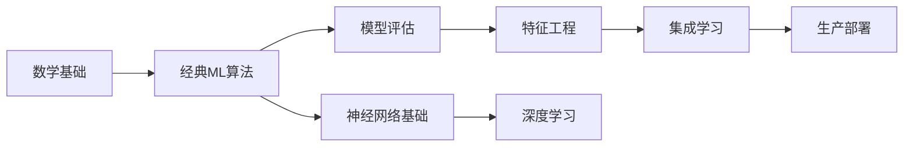
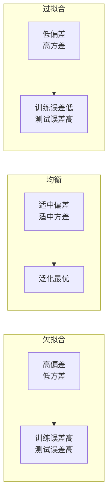

# 机器学习基础

## 概述

机器学习（Machine Learning, ML）是 AI 的核心基石，通过数据驱动的方式让计算机从经验中学习。本模块覆盖从经典算法到现代技术的完整知识体系。

## 目录

```
00-机器学习基础/
├── README.md              ← 当前文件：总览与学习路线
├── 01-监督学习.md          # 回归/分类/集成方法/SVM/决策树
├── 02-无监督学习.md        # 聚类/降维/密度估计/异常检测
├── 03-强化学习.md          # MDP/Q-Learning/策略梯度/多智能体
├── 04-半监督与自监督.md    # 一致性正则化/对比学习/MAE
├── 05-模型评估与调优.md    # 交叉验证/指标/超参搜索/偏差方差
├── 06-特征工程与选择.md    # 特征构造/编码/降维/选择
└── 07-生产实践.md          # 数据流水线/可重复性/MLOps简介
```

## 学习路线



| 层级 | 目标 | 推荐章节 |
|------|------|---------|
| 入门 | 理解基本概念，能运行 sklearn | 01, 02, 05 |
| 进阶 | 掌握算法原理，调参优化 | 03, 04, 06 |
| 大师 | 进阶理论，自定义模型 | 07 + 论文阅读 |

## 核心概念速览

### 学习范式对比
| 范式 | 数据要求 | 典型算法 | 应用场景 |
|------|---------|---------|---------|
| 监督学习 | 有标签 | 线性回归、SVM、随机森林 | 预测、分类 |
| 无监督学习 | 无标签 | K-Means、PCA、DBSCAN | 聚类、降维 |
| 半监督学习 | 少量标签 | 自训练、一致性正则 | 标注成本高 |
| 自监督学习 | 无标签 | 对比学习、MAE | 表示学习 |
| 强化学习 | 交互数据 | DQN、PPO | 游戏、机器人 |

### 偏差-方差权衡


## 推荐工具与库

- **scikit-learn**：经典 ML 算法一站式
- **XGBoost/LightGBM/CatBoost**：梯度提升三巨头
- **Optuna**：超参数优化
- **Pandas/NumPy**：数据处理
- **MLflow**：实验跟踪
