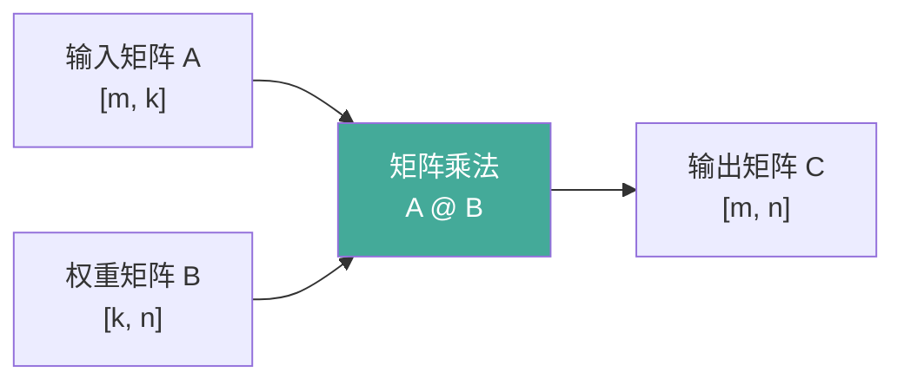
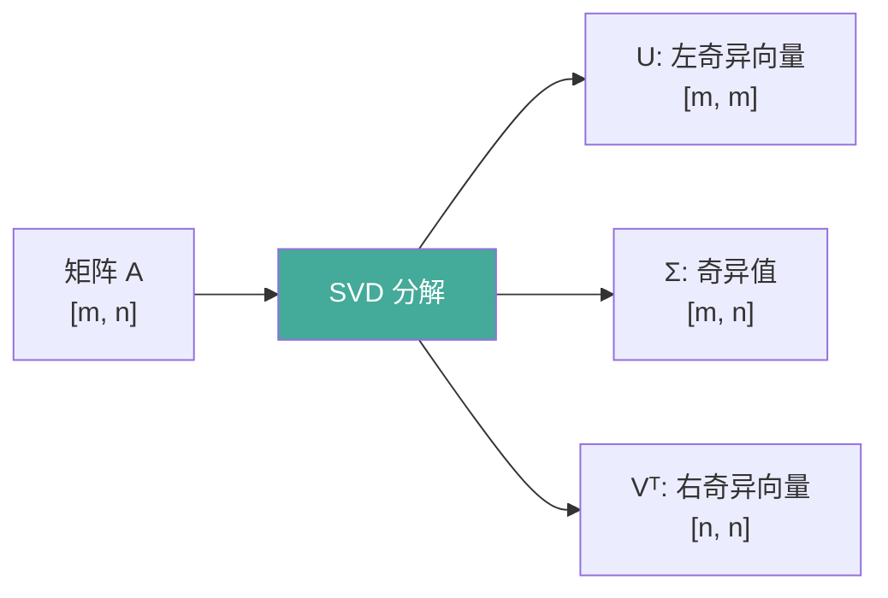
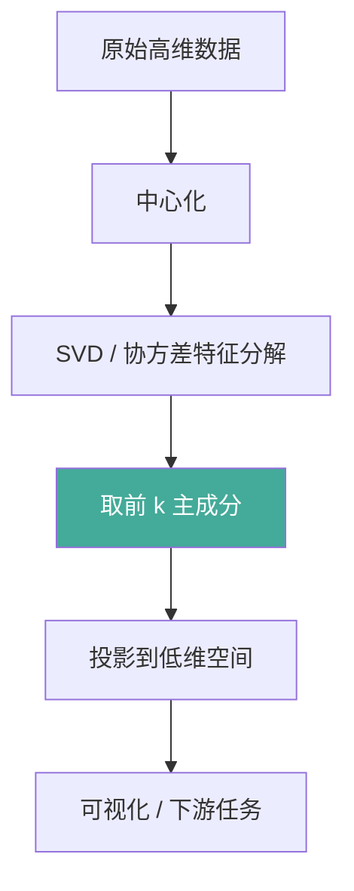

# 线性代数

深度学习中的张量运算、矩阵分解与降维，本质都是线性代数的工程化应用。本文梳理向量/矩阵运算、特征值分解、SVD、PCA 的数学基础，并给出 NumPy 可运行案例。

## 1. 向量与矩阵基础

### 向量运算
向量是标量的一维数组，常见运算包括点积、外积、范数。

```python
import numpy as np

a = np.array([1.0, 2.0, 3.0])
b = np.array([4.0, 5.0, 6.0])

dot = np.dot(a, b)                 # 点积 = 32
outer = np.outer(a, b)             # 外积: [3,3]
norm_l2 = np.linalg.norm(a)        # L2 范数 = sqrt(14)
cos_sim = dot / (norm_l2 * np.linalg.norm(b))   # 余弦相似度
```

### 矩阵运算
矩阵乘法不满足交换律（AB ≠ BA），但满足结合律 (AB)C = A(BC)。



```python
A = np.random.randn(4, 3)
B = np.random.randn(3, 5)
C = A @ B                          # 形状 [4, 5]
```

## 2. 特征值分解

对方阵 A，若存在标量 λ 与非零向量 v 满足 `A v = λ v`，则 λ 为特征值、v 为特征向量。对称矩阵可正交对角化：`A = Q Λ Qᵀ`。

```python
S = np.array([[2.0, 1.0], [1.0, 2.0]])
eigvals, eigvecs = np.linalg.eig(S)
# eigvals ≈ [3, 1]; eigvecs 列是特征向量
```

## 3. 奇异值分解 SVD

任意矩阵 `A ∈ ℝ^{m×n}` 可分解为 `A = U Σ Vᵀ`，其中 U、V 为正交矩阵，Σ 为奇异值对角阵。SVD 是 PCA、压缩、伪逆的基础。



### 不同分解方法对比

| 分解方法 | 适用矩阵 | 形式 | 主要用途 |
|---------|---------|------|---------|
| 特征值分解 | 方阵 | A = QΛQᵀ | 主成分、动力学 |
| SVD | 任意矩阵 | A = UΣVᵀ | 压缩、伪逆、降噪 |
| LU 分解 | 方阵 | A = LU | 线性方程组求解 |
| QR 分解 | 任意矩阵 | A = QR | 最小二乘、正交化 |
| Cholesky | 对称正定 | A = LLᵀ | 高效求逆、采样 |

## 4. 主成分分析 PCA

PCA 通过协方差矩阵的特征分解（或 SVD）找到方差最大的正交方向，实现降维与去相关。

```python
def pca(X: np.ndarray, k: int) -> tuple[np.ndarray, np.ndarray]:
    """对数据中心化后取前 k 个主成分。返回 (投影, 主成分)。"""
    Xc = X - X.mean(axis=0)
    U, S, Vt = np.linalg.svd(Xc, full_matrices=False)
    components = Vt[:k]                  # [k, n]
    projected = Xc @ components.T        # [m, k]
    return projected, components

X = np.random.randn(200, 5)
proj, comp = pca(X, k=2)
print("降维后形状:", proj.shape)          # (200, 2)
```

## 5. 案例：SVD 图像压缩

用 SVD 保留前 k 个奇异值重建灰度图，实现无损趋势下的高压缩比。

```python
import numpy as np
from PIL import Image

def svd_compress(img: np.ndarray, k: int) -> np.ndarray:
    """用前 k 个奇异值重建图像。img: [h, w] 灰度。"""
    U, S, Vt = np.linalg.svd(img, full_matrices=False)
    S_k = np.diag(S[:k])
    recon = (U[:, :k] @ S_k @ Vt[:k, :])
    return np.clip(recon, 0, 255)

# 假设 img 为 0-255 灰度图
# img = np.asarray(Image.open("lena.png").convert("L"), dtype=float)
# for k in [10, 50, 100]:
#     r = svd_compress(img, k)
#     ratio = (img.size) / (k * (img.shape[0] + img.shape[1] + 1))
#     print(f"k={k}, 压缩比≈{ratio:.1f}x")
```

| k (奇异值数) | 相对存储 | 主观质量 |
|-------------|---------|---------|
| 10 | 极低 | 轮廓可见，细节丢失 |
| 50 | 低 | 清晰可辨 |
| 100 | 中 | 接近原图 |

## 6. 案例：PCA 降维可视化

在 3D 瑞士卷(模拟)数据上演示 PCA 将高维降到 2D 的可视化流程。

```python
import numpy as np
import matplotlib.pyplot as plt

def swiss_roll(n: int = 500) -> np.ndarray:
    t = np.linspace(0, 4 * np.pi, n)
    x = t * np.cos(t)
    y = t * np.sin(t)
    z = np.random.randn(n) * 0.3
    return np.stack([x, y, z], axis=1)

data = swiss_roll()
proj, _ = pca(data, k=2)
print("PCA 投影前两维方差占比示例:", np.linalg.svd(data - data.mean(0), compute_uv=False)[:2])
# plt.scatter(proj[:, 0], proj[:, 1]); plt.show()   # 可视化
```


