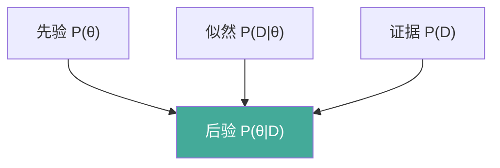
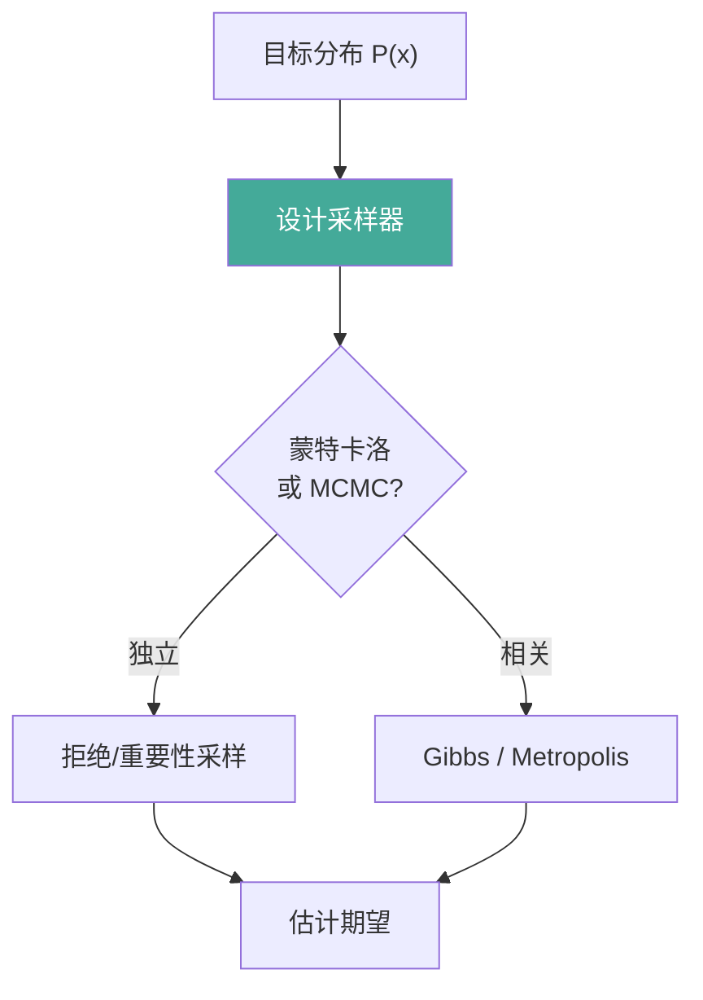

# 概率论与统计

概率论为机器学习提供不确定性建模的语言。本文覆盖贝叶斯定理、常见分布、最大似然估计、KL 散度与采样方法，并给出可运行案例。

## 1. 贝叶斯定理

贝叶斯公式 `P(A|B) = P(B|A) P(A) / P(B)` 表达「后验 = 似然 × 先验 / 证据」，是贝叶斯推断的基石。



## 2. 常见概率分布

| 分布族 | 参数 | 支撑 | 典型用途 |
|-------|------|------|---------|
| 伯努利 | p | {0,1} | 二分类标签 |
| 二项分布 | n, p | {0..n} | 多次试验成功数 |
| 高斯/正态 | μ, σ | ℝ | 连续噪声、先验 |
| 指数族 | λ | [0,∞) | 间隔、寿命 |
| 泊松 | λ | ℕ | 计数事件 |
| 均匀分布 | a, b | [a,b] | 随机初始化 |
| 狄利克雷 | α | 单纯形 | 类别分布先验 |
| 多元高斯 | μ, Σ | ℝⁿ | 数据生成、VAE 先验 |

## 3. 最大似然估计 MLE

MLE 寻找使观测数据概率最大的参数：`θ* = argmax P(D|θ)`，常取对数化简。

```python
import numpy as np

def mle_gaussian(x: np.ndarray) -> tuple[float, float]:
    """高斯分布 MLE 估计。x: [n] 样本。"""
    mu = x.mean()
    sigma2 = x.var(ddof=0)            # MLE 用无偏性修正 0
    return mu, sigma2

samples = np.random.randn(1000) * 2.0 + 1.0
mu, s2 = mle_gaussian(samples)
print(f"估计 mu={mu:.2f}, sigma={s2 ** 0.5:.2f}")   # 接近 1.0, 2.0
```

## 4. KL 散度与交叉熵

KL 散度 `DKL(P‖Q)` 衡量两分布的差异（非对称）。交叉熵 `H(P,Q) = H(P) + DKL(P‖Q)`，是分类损失的核心。

```python
def kl_div(p: np.ndarray, q: np.ndarray) -> float:
    """离散 KL 散度 D_KL(p||q)，要求 q>0。"""
    p = p / p.sum(); q = q / q.sum()
    return float(np.sum(p * np.log(p / q)))

p = np.array([0.7, 0.3]); q = np.array([0.5, 0.5])
print("KL(P||Q) =", kl_div(p, q))    # > 0
```

## 5. 采样方法

蒙特卡洛通过随机采样估计积分；Gibbs 采样是 MCMC 在多维下的坐标轮换采样法。



## 6. 案例：贝叶斯更新实战

用抛硬币观测数据，迭代更新「硬币偏置 θ」的后验（Beta-二项共轭）。

```python
import numpy as np

def bayes_update(alpha: float, beta: float, heads: int, tails: int) -> tuple[float, float]:
    """Beta 先验 + 二项似然 → Beta 后验（共轭）。"""
    a_post = alpha + heads
    b_post = beta + tails
    return a_post, b_post

a, b = 1.0, 1.0                      # 均匀先验 Beta(1,1)
for h, t in [(3, 1), (2, 0), (5, 2)]:
    a, b = bayes_update(a, b, h, t)
    print(f"后验均值={a/(a+b):.3f}, 参数=({a},{b})")
# 观测越多，均值越接近真实偏置
```

## 7. 案例：蒙特卡洛估计 π

在单位正方形内撒点，落在四分之一圆内的比例 ≈ π/4。

```python
import numpy as np

def estimate_pi(n: int = 1_000_000) -> float:
    """蒙特卡洛投点法估计 π。"""
    x = np.random.rand(n)
    y = np.random.rand(n)
    inside = (x ** 2 + y ** 2) <= 1.0
    return 4.0 * inside.mean()

for n in [1000, 100000, 1000000]:
    print(f"n={n:>8}, π≈{estimate_pi(n):.4f}")
```

## 8. 案例：Gibbs 采样二维高斯

对二元高斯，利用条件分布轮换采样，逼近联合分布。

```python
import numpy as np

def gibbs_2d_gaussian(steps: int = 5000, rho: float = 0.8) -> np.ndarray:
    """Gibbs 采样二元标准高斯（相关系数 rho）。返回 [steps, 2]。"""
    samples = np.zeros((steps, 2))
    x, y = 0.0, 0.0
    for i in range(steps):
        # 条件: x|y ~ N(rho*y, 1-rho^2)
        x = rho * y + np.sqrt(1 - rho ** 2) * np.random.randn()
        # 条件: y|x ~ N(rho*x, 1-rho^2)
        y = rho * x + np.sqrt(1 - rho ** 2) * np.random.randn()
        samples[i] = [x, y]
    return samples

s = gibbs_2d_gaussian(2000)
print("样本相关系数估计:", np.corrcoef(s.T)[0, 1])   # 接近 0.8
```
