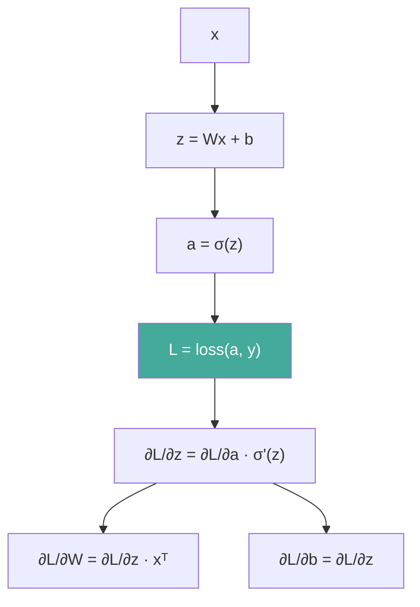

# 模型数学基础

理解神经网络训练，需要导数、梯度、链式法则、Jacobian/Hessian 与信息论的工具。本文给出数学直觉、从零反向传播案例与激活函数导数对比表。

## 1. 导数与梯度

标量函数 `f(x)` 的导数量化变化率；多元函数 `f(x)` 的梯度 `∇f` 指向上升最快方向，反向即下降最快方向（梯度下降）。

```python
import numpy as np

def numerical_grad(f, x: np.ndarray, eps: float = 1e-5) -> np.ndarray:
    """中心差分数值梯度校验。f: 标量函数。"""
    g = np.zeros_like(x)
    for i in range(x.size):
        dx = np.zeros_like(x); dx[i] = eps
        g[i] = (f(x + dx) - f(x - dx)) / (2 * eps)
    return g
```

## 2. 链式法则与计算图

复合函数求导 `dy/dx = (dy/du)(du/dx)`。反向传播即沿计算图自顶向下连乘局部梯度。



## 3. Jacobian 与 Hessian

- **Jacobian J**：向量值函数 `f: ℝⁿ→ℝᵐ` 的一阶偏导矩阵 `[m, n]`。
- **Hessian H**：标量函数二阶偏导矩阵 `[n, n]`，对称；正定对应局部极小。

```python
def hessian(f, x: np.ndarray, eps: float = 1e-4) -> np.ndarray:
    """数值 Hessian（对称）。"""
    n = x.size; H = np.zeros((n, n))
    for i in range(n):
        for j in range(n):
            e_i = np.zeros_like(x); e_i[i] = eps
            e_j = np.zeros_like(x); e_j[j] = eps
            H[i, j] = (f(x + e_i + e_j) - f(x + e_i) - f(x + e_j) + f(x)) / eps ** 2
    return H
```

## 4. 凸优化直觉

凸函数满足「局部极小即全局极小」，梯度下降可收敛到最优。深度学习损失多为非凸，但凸优化工具（如 L2 正则化、凸松弛）提供稳定性。

## 5. 信息论：熵与交叉熵

- 熵 `H(P) = -Σ p log p`：分布的不确定性。
- 交叉熵 `H(P,Q) = -Σ p log q`：用 Q 编码 P 的平均比特。
- 最小化交叉熵等价于最小化 KL 散度（P 固定时）。

```python
def cross_entropy(logits: np.ndarray, y_true: int) -> float:
    """多分类交叉熵（logits 未归一化）。"""
    exps = np.exp(logits - logits.max())
    probs = exps / exps.sum()
    return float(-np.log(probs[y_true] + 1e-12))
```

## 6. 激活函数导数对比

| 激活函数 | 函数 | 导数 | 梯度特性 |
|---------|------|------|---------|
| Sigmoid | 1/(1+e⁻ˣ) | σ(1−σ) | 最大 0.25，易消失 |
| Tanh | (eˣ−e⁻ˣ)/(eˣ+e⁻ˣ) | 1−tanh² | 最大 1，仍衰减 |
| ReLU | max(0,x) | x>0:1, x≤0:0 | 正数区保持 |
| LeakyReLU | max(αx,x) | x>0:1, x≤0:α | 负区非零 |
| Softmax | eˣᵢ/Σeˣⱼ | diag(p)−ppᵀ | 雅可比矩阵 |
| GELU | xΦ(x) | Φ(x)+xφ(x) | 平滑，近似恒等 |

## 7. 案例：手写反向传播（纯 NumPy）

仅用 NumPy 实现两层 MLP 的反向传播，验证链式法则落地。

```python
import numpy as np

def train_twolayer(x: np.ndarray, y: np.ndarray, steps: int = 2000, lr: float = 0.1):
    """纯 NumPy 二层网络，sigmoid 输出做二分类。"""
    n, d = x.shape
    W1 = np.random.randn(d, 8) * 0.1
    b1 = np.zeros(8)
    W2 = np.random.randn(8, 1) * 0.1
    b2 = np.zeros(1)
    for _ in range(steps):
        # 前向
        z1 = x @ W1 + b1
        a1 = 1 / (1 + np.exp(-z1))
        z2 = a1 @ W2 + b2
        a2 = 1 / (1 + np.exp(-z2))
        loss = -np.mean(y * np.log(a2 + 1e-12) + (1 - y) * np.log(1 - a2 + 1e-12))
        # 反向（链式法则）
        dz2 = (a2 - y.reshape(-1, 1)) / n          # [n,1]
        dW2 = a1.T @ dz2                            # [8,1]
        db2 = dz2.sum(axis=0)
        da1 = dz2 @ W2.T                           # [n,8]
        dz1 = da1 * a1 * (1 - a1)                  # sigmoid 导数
        dW1 = x.T @ dz1                            # [d,8]
        db1 = dz1.sum(axis=0)
        W1 -= lr * dW1; b1 -= lr * db1
        W2 -= lr * dW2; b2 -= lr * db2
    return loss

np.random.seed(0)
x = np.random.randn(100, 3)
y = (x[:, 0] + x[:, 1] > 0).astype(float)
print("末步损失:", train_twolayer(x, y))
```

## 8. 案例：交叉熵梯度推导代码

推导 `∂L/∂z = p − onehot(y)` 并用代码验证数值梯度一致。

```python
import numpy as np

def ce_grad_logits(logits: np.ndarray, y_true: int) -> np.ndarray:
    """softmax 交叉熵对 logits 的梯度 = p - onehot。"""
    exps = np.exp(logits - logits.max())
    p = exps / exps.sum()
    g = p.copy()
    g[y_true] -= 1.0
    return g

logits = np.array([2.0, 1.0, 0.1])
y = 0
g = ce_grad_logits(logits, y)
# 数值校验
eps = 1e-5; num = np.zeros_like(logits)
for i in range(len(logits)):
    lp = logits.copy(); lp[i] += eps
    lm = logits.copy(); lm[i] -= eps
    num[i] = (cross_entropy(lp, y) - cross_entropy(lm, y)) / (2 * eps)
print("解析梯度:", g, "\n数值梯度:", num)
```
