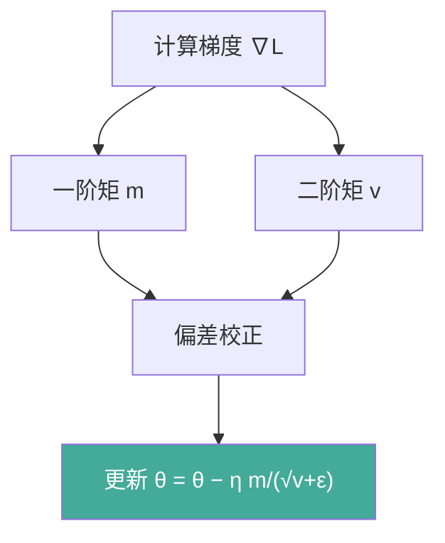

# 优化理论与正则

模型训练即最小化损失函数的过程。本文梳理梯度下降变体、学习率调度、正则化手段，并从零实现 Adam、warmup 调度与权重衰减对比。

## 1. 梯度下降变体

| 优化器 | 更新规则 | 动量 | 自适应学习率 | 特点 |
|-------|---------|------|-------------|------|
| SGD | θ − η∇ | 否 | 否 | 简单、泛化好 |
| SGD+Momentum | v=βv+∇; θ−ηv | 是 | 否 | 加速、抑震荡 |
| RMSProp | 二阶矩归一 | 否 | 是 | 适应稀疏梯度 |
| Adam | 一/二阶矩校正 | 是 | 是 | 默认首选 |
| AdamW | 解耦权重衰减 | 是 | 是 | 正则更干净 |
| LAMB | 层自适应 | 是 | 是 | 超大 batch |



## 2. 学习率调度

固定学习率易陷局部或震荡。常见策略：step、cosine、warmup、plateau。

```python
def cosine_lr(t: int, t_max: int, lr0: float = 0.1) -> float:
    """余弦退火学习率。"""
    return lr0 * 0.5 * (1 + np.cos(np.pi * t / t_max))

def warmup_lr(t: int, warmup: int, lr0: float = 0.1) -> float:
    """线性 warmup 调度。"""
    return lr0 * min(1.0, t / max(1, warmup))
```

## 3. 正则化手段

- **L1 正则**：`λ‖θ‖₁`，诱导稀疏。
- **L2 正则**：`λ‖θ‖₂²`，权重衰减，抑制过拟合。
- **Dropout**：随机置零，近似集成。
- **早停**：验证损失回升即停。

## 4. 案例：从零实现 Adam

按标准 Adam 公式实现（含偏差校正），与 PyTorch 对照。

```python
import numpy as np

def adam_step(theta: np.ndarray, grad: np.ndarray, m: np.ndarray, v: np.ndarray,
              t: int, lr: float = 0.01, beta1: float = 0.9, beta2: float = 0.999,
              eps: float = 1e-8) -> tuple:
    """单步 Adam 更新，返回 (新theta, m, v)。"""
    m = beta1 * m + (1 - beta1) * grad
    v = beta2 * v + (1 - beta2) * (grad ** 2)
    m_hat = m / (1 - beta1 ** t)
    v_hat = v / (1 - beta2 ** t)
    theta = theta - lr * m_hat / (np.sqrt(v_hat) + eps)
    return theta, m, v

theta = np.array([0.0, 0.0])
m, v = np.zeros(2), np.zeros(2)
for t in range(1, 101):
    grad = np.array([2 * theta[0] - 1, 2 * theta[1] + 0.5])   # 简单二次目标
    theta, m, v = adam_step(theta, grad, m, v, t, lr=0.1)
print("Adam 收敛点:", theta)        # 接近 [0.5, -0.25]
```

## 5. 案例：学习率 warmup 调度器

对比 warmup 与否的训练曲线对早期稳定性的影响。

```python
import numpy as np

def schedule(t: int, warmup: int = 5, total: int = 50, lr0: float = 0.1) -> float:
    if t < warmup:
        return lr0 * (t + 1) / warmup              # 线性升温
    return lr0 * 0.5 * (1 + np.cos(np.pi * (t - warmup) / (total - warmup)))

curve = [schedule(t) for t in range(50)]
print("前 6 步学习率:", [round(c, 3) for c in curve[:6]])
# warmup 避免初期大梯度破坏已初始化参数
```

## 6. 案例：权重衰减效果对比

在含噪声数据上对比 L2 正则强度对测试误差的影响。

```python
import numpy as np

def fit_with_decay(x: np.ndarray, y: np.ndarray, wd: float, steps: int = 2000, lr: float = 0.05):
    """带 L2 权重衰减的线性回归。"""
    n, d = x.shape
    w = np.zeros(d)
    for _ in range(steps):
        pred = x @ w
        grad = (2 / n) * (x.T @ (pred - y)) + 2 * wd * w   # + λw
        w -= lr * grad
    return w

np.random.seed(1)
x = np.random.randn(50, 10)
true_w = np.random.randn(10)
y = x @ true_w + np.random.randn(50) * 0.5
for wd in [0.0, 0.01, 0.1]:
    w = fit_with_decay(x, y, wd)
    err = np.mean((w - true_w) ** 2)
    print(f"wd={wd}: 参数误差={err:.3f}")
# 适度 wd 降低过拟合，过大则欠拟合
```


