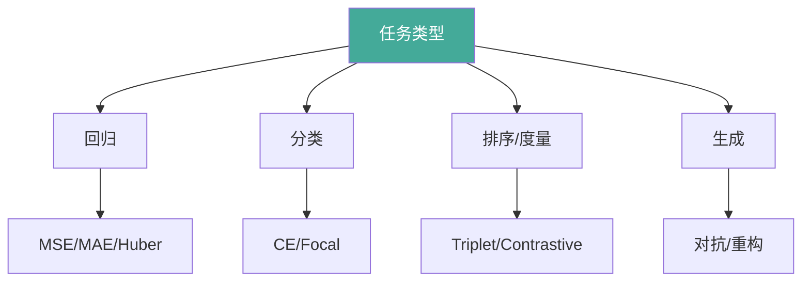

# 损失函数选择

损失函数定义「模型在做什么」，直接决定学习信号。本文按任务梳理回归、分类、排序、生成损失，并给出 Focal Loss 与 Triplet Loss 实战。

## 1. 回归损失

| 损失 | 公式 | 对异常值 | 适用 |
|------|------|---------|------|
| MSE (L2) | 1/n Σ(y−ŷ)² | 敏感 | 高斯噪声、平滑目标 |
| MAE (L1) | 1/n Σ|y−ŷ| | 鲁棒 | 异常值多 |
| Huber | |y−ŷ|≤δ: ½e²; else δ(|e|−δ/2) | 折中 | 兼顾两者 |
| Smooth L1 | 同上（δ=1） | 折中 | 目标检测 bbox |

```python
import numpy as np

def huber(y: np.ndarray, p: np.ndarray, delta: float = 1.0) -> float:
    e = np.abs(y - p)
    return float(np.mean(np.where(e <= delta, 0.5 * e ** 2, delta * (e - 0.5 * delta))))
```

## 2. 分类损失

| 损失 | 形式 | 适用 | 备注 |
|------|------|------|------|
| Cross Entropy | −Σ y log ŷ | 多分类 | 标准选择 |
| BCE | −[y log ŷ+(1−y)log(1−ŷ)] | 二分类 | 配 sigmoid |
| Focal Loss | −(1−p_t)^γ log p_t | 类别不平衡 | 难样本加权 |
| Label Smoothing CE | 软化 one-hot | 防过自信 | 提升泛化 |

## 3. 排序与度量学习损失

| 损失 | 核心思想 | 用途 |
|------|---------|------|
| Triplet | max(0, d(a,p)−d(a,n)+m) | 人脸/检索 |
| Contrastive | 正对拉近、负对推远 | 孪生网络 |
| InfoNCE | 对比互信息下界 | 自监督/CLIP |

## 4. 生成损失

| 损失 | 范式 | 说明 |
|------|------|------|
| 对抗损失 | min_G max_D | GAN 极小极大 |
| 重构损失 | ‖x−dec(x)‖ | AE/VAE |
| ELBO | −重构 + KL | VAE 证据下界 |



## 5. 案例：Focal Loss 处理类别不平衡

在极度不平衡数据上，Focal Loss 降低易分样本权重，聚焦难样本。

```python
import numpy as np

def focal_loss(probs: np.ndarray, y_true: np.ndarray, gamma: float = 2.0,
               alpha: float = 0.25) -> float:
    """probs: [n] 正类概率; y_true: [n] 0/1。"""
    p_t = np.where(y_true == 1, probs, 1 - probs)
    alpha_t = np.where(y_true == 1, alpha, 1 - alpha)
    ce = -np.log(np.clip(p_t, 1e-12, 1.0))
    return float(np.mean(alpha_t * (1 - p_t) ** gamma * ce))

# 模拟: 大量易分负样本 + 少量难正样本
probs = np.concatenate([np.full(95, 0.95), np.array([0.4, 0.45, 0.5, 0.55, 0.6])])
y = np.concatenate([np.zeros(95), np.ones(5)])
print("Focal Loss:", focal_loss(probs, y, gamma=2.0))
print("普通 CE:", -np.mean(np.where(y == 1, np.log(probs), np.log(1 - probs))))
# Focal 对难样本(正类)赋予更高梯度权重
```

## 6. 案例：Triplet Loss 度量学习

构建锚点-正样本-负样本三元组，学习嵌入空间使同类更近、异类更远。

```python
import numpy as np

def triplet_loss(a: np.ndarray, p: np.ndarray, n: np.ndarray, margin: float = 1.0) -> float:
    """a/p/n: [d] 向量。"""
    d_ap = np.sum((a - p) ** 2)
    d_an = np.sum((a - n) ** 2)
    return float(max(0.0, d_ap - d_an + margin))

def triplet_step(emb: np.ndarray, a_idx: int, p_idx: int, n_idx: int,
                 lr: float = 0.1, margin: float = 1.0) -> np.ndarray:
    a, p, n = emb[a_idx], emb[p_idx], emb[n_idx]
    loss = triplet_loss(a, p, n, margin)
    if loss > 0:
        # 解析梯度下降（仅示意）
        emb[a_idx] -= lr * 2 * (a - p - a + n)
        emb[p_idx] -= lr * 2 * (p - a)
        emb[n_idx] -= lr * 2 * (n - a)
    return emb

emb = np.random.randn(6, 4)
emb = triplet_step(emb, 0, 1, 2)        # 拉近 0-1，推远 0-2
print("单步后 Triplet 损失:", triplet_loss(emb[0], emb[1], emb[2]))
```

## 7. 按任务选损失速查

| 任务 | 推荐损失 | 备注 |
|------|---------|------|
| 连续值回归 | MSE / Smooth L1 | 异常值多换 MAE |
| 二分类 | BCEWithLogits | 数值稳定 |
| 多分类 | CrossEntropy | 含 softmax |
| 不平衡分类 | Focal / 加权 CE | γ=2 常用 |
| 检索/人脸 | Triplet / ArcFace | 度量学习 |
| 生成模型 | 对抗 / ELBO | GAN/VAE |
