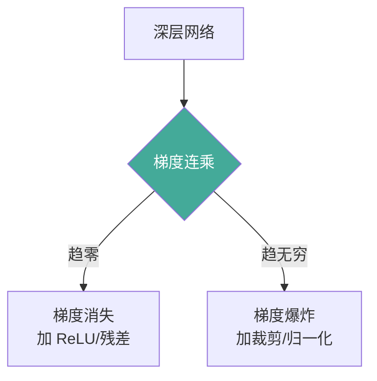

# 数值计算

深度学习依赖浮点运算，数值不稳定会引发梯度爆炸/消失、溢出等问题。本文梳理浮点精度、归一化与数值稳定技巧，并给出手搓实现案例。

## 1. 浮点精度

IEEE 754 单精度(float32)约 7 位有效十进制，双精度(float64)约 15 位。深度学习中混合精度训练需关注下溢/上溢与舍入误差累积。

```python
import numpy as np
print(np.finfo(np.float32).eps)    # ~1.2e-7 机器精度
print(np.finfo(np.float64).eps)    # ~2.2e-16
```

## 2. 梯度爆炸与消失

深层网络中连乘梯度 `∏ ∂h_i/∂h_{i-1}` 易趋零或无穷。对策：归一化、残差连接、合理初始化、梯度裁剪。



## 3. 归一化方法对比

| 方法 | 归一化维度 | 统计量 | 适用 |
|------|-----------|--------|------|
| BatchNorm | N,H,W 对 C | 批次均值/方差 | CNN（需大 batch） |
| LayerNorm | 特征维 | 单样本均值/方差 | Transformer/RNN |
| RMSNorm | 特征维 | 仅 RMS，无均值 | LLM（更省算力） |
| InstanceNorm | H,W | 单样本单通道 | 风格迁移 |
| GroupNorm | 特征分组 | 组内统计 | 小 batch |

## 4. 数值稳定技巧

- **log-sum-exp**：`log Σ e^{x_i} = max(x) + log Σ e^{x_i−max}` 防溢出。
- **softmax 减去最大值**：分母分子同乘常数不变，避免 e^x 溢出。
- **稳定交叉熵**：先 log_softmax 再取目标。

```python
import numpy as np

def logsumexp(x: np.ndarray) -> float:
    """数值稳定 log-sum-exp。"""
    m = np.max(x)
    return float(m + np.log(np.sum(np.exp(x - m))))

def softmax_stable(x: np.ndarray) -> np.ndarray:
    z = x - np.max(x)
    e = np.exp(z)
    return e / e.sum()
```

## 5. 案例：softmax 数值稳定实现

对比朴素 softmax（大 logits 溢出）与稳定版本。

```python
import numpy as np

def softmax_naive(x: np.ndarray) -> np.ndarray:
    e = np.exp(x)                     # 大值会溢出 inf
    return e / e.sum()

def softmax_stable(x: np.ndarray) -> np.ndarray:
    z = x - np.max(x)                 # 平移不变
    e = np.exp(z)
    return e / e.sum()

x = np.array([1000.0, 1001.0, 1002.0])
try:
    print("朴素:", softmax_naive(x))  # 可能产生 nan/inf
except Exception as ex:
    print("朴素溢出:", ex)
print("稳定:", softmax_stable(x))     # 正常 [0.09,0.24,0.67]
```

## 6. 案例：LayerNorm 手搓

实现 LayerNorm：对单样本特征维做标准化，再仿射变换。

```python
import numpy as np

def layer_norm(x: np.ndarray, gamma: np.ndarray, beta: np.ndarray,
               eps: float = 1e-5) -> np.ndarray:
    """x: [n, d]; 沿特征维 d 归一化。"""
    mu = x.mean(axis=-1, keepdims=True)
    var = x.var(axis=-1, keepdims=True)
    xhat = (x - mu) / np.sqrt(var + eps)
    return gamma * xhat + beta

x = np.random.randn(4, 8)
gamma = np.ones(8); beta = np.zeros(8)
out = layer_norm(x, gamma, beta)
print("输出均值≈0:", out.mean(axis=-1).round(4))
print("输出方差≈1:", out.var(axis=-1).round(4))
```

## 7. 案例：梯度裁剪

对全局梯度范数裁剪，防止梯度爆炸；RMSNorm 演示（更轻量）。

```python
import numpy as np

def clip_grad(grad: np.ndarray, max_norm: float = 1.0) -> np.ndarray:
    """按全局 L2 范数裁剪。"""
    norm = np.linalg.norm(grad)
    if norm > max_norm:
        grad = grad * (max_norm / norm)
    return grad

def rms_norm(x: np.ndarray, gamma: np.ndarray, eps: float = 1e-8) -> np.ndarray:
    """RMSNorm: 不减去均值，仅除以 RMS。"""
    rms = np.sqrt(np.mean(x ** 2, axis=-1, keepdims=True) + eps)
    return gamma * (x / rms)

g = np.array([3.0, 4.0])              # 范数=5
print("裁剪后:", clip_grad(g, 1.0))    # [0.6,0.8]
print("RMSNorm 形状:", rms_norm(np.random.randn(2, 4), np.ones(4)).shape)
```


