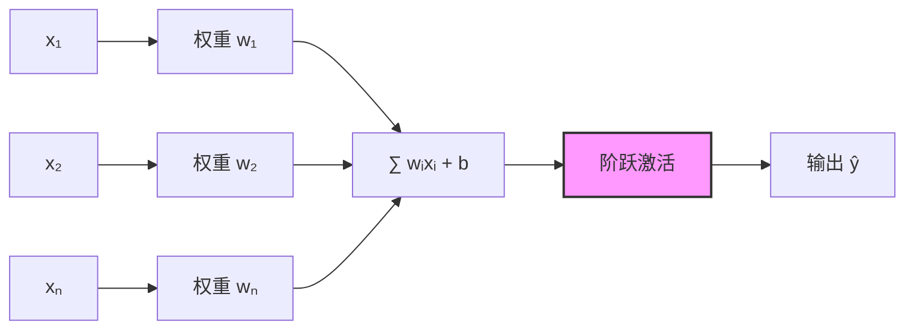
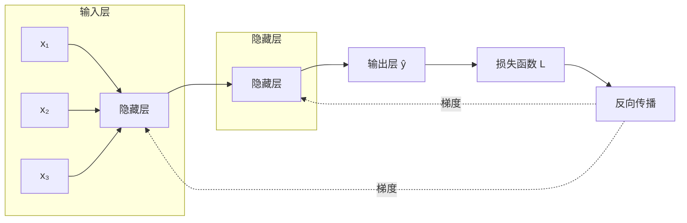
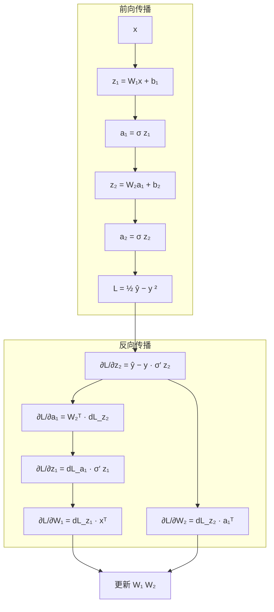
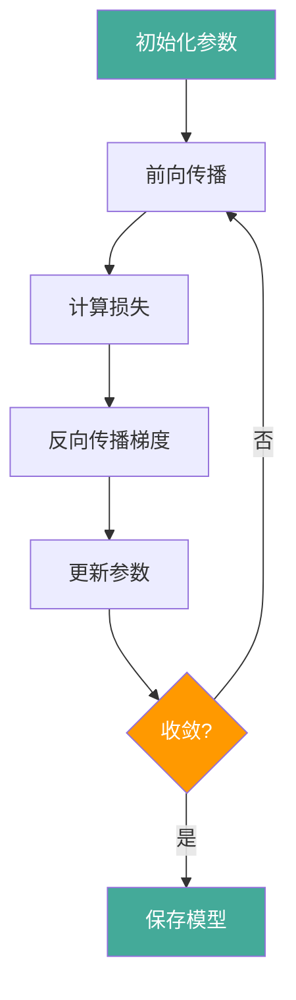

# 神经网络基础

## 1. 神经元与感知机

### MP 神经元模型（McCulloch-Pitts, 1943）
- 加权求和 → 阈值激活 → 输出 0/1
- 局限性：只能解决线性可分问题

### 感知机（Perceptron, Rosenblatt 1958）



- **学习**：错误驱动更新 w = w + η(y - ŷ)x
- **局限**：无法解决 XOR 问题（Minsky 1969）
- PyTorch 手动实现感知机：

```python
import torch

def perceptron_step(x, y, w, b, lr=0.01):
    y_pred = torch.sign(torch.mv(w, x) + b)
    y_pred = torch.where(y_pred >= 0, 1, -1)
    for i in range(len(w)):
        w[i] += lr * (y - y_pred) * x[i]
    b += lr * (y - y_pred)
    return w, b

w = torch.randn(2)
b = torch.zeros(1)
X = torch.tensor([[1.0, 1.0], [1.0, -1.0], [-1.0, 1.0], [-1.0, -1.0]])
y = torch.tensor([1.0, -1.0, -1.0, -1.0])
for epoch in range(10):
    for i in range(len(X)):
        w, b = perceptron_step(X[i], y[i], w, b, lr=0.1)
```

### 多层感知机 MLP
- **结构**：输入层 + 隐藏层 + 输出层
- **万能逼近定理**：单隐层可逼近任意连续函数
- **激活函数**：引入非线性（Sigmoid/Tanh/ReLU）



PyTorch 实现 MLP：

```python
import torch.nn as nn

class MLP(nn.Module):
    def __init__(self, d_in, d_hidden, d_out):
        super().__init__()
        self.net = nn.Sequential(
            nn.Linear(d_in, d_hidden),
            nn.ReLU(),
            nn.Linear(d_hidden, d_hidden),
            nn.ReLU(),
            nn.Linear(d_hidden, d_out),
        )

    def forward(self, x):
        return self.net(x)

model = MLP(784, 256, 10)
x = torch.randn(32, 784)
logits = model(x)
```

## 2. 反向传播 Backpropagation



- **链式法则**：∂L/∂w = ∂L/∂ŷ × ∂ŷ/∂z × ∂z/∂w
- **计算图**：前向传播计算输出，反向传播计算梯度
- **自动微分**：PyTorch 自动处理

```python
x = torch.randn(32, 784)
y = torch.randint(0, 10, (32,))
model = MLP(784, 256, 10)
criterion = nn.CrossEntropyLoss()
optimizer = torch.optim.SGD(model.parameters(), lr=0.01)

logits = model(x)
loss = criterion(logits, y)
optimizer.zero_grad()
loss.backward()
optimizer.step()
```

## 3. 激活函数

| 激活函数 | 公式 | 范围 | 特点 |
|---------|------|------|------|
| Sigmoid | 1/(1+e⁻ˣ) | (0,1) | 梯度消失严重 |
| Tanh | (eˣ-e⁻ˣ)/(eˣ+e⁻ˣ) | (-1,1) | 零中心，梯度消失 |
| ReLU | max(0,x) | [0,∞) | 解决梯度消失，Dying ReLU |
| LeakyReLU | max(αx,x) | (-∞,∞) | 缓解 Dying ReLU |
| ELU | x≥0:x, x<0:α(eˣ-1) | (-α,∞) | 光滑，负值饱和 |
| GELU | x·Φ(x) | (-∞,∞) | 平滑 ReLU，Transformer 标配 |
| Swish/SiLU | x·σ(x) | (-∞,∞) | 自门控，DL 晚期层常用 |
| PReLU | max(αx,x), α可学习 | (-∞,∞) | 参数化负斜率 |

PyTorch 常见激活函数实现对比：

```python
import torch.nn.functional as F

x = torch.linspace(-5, 5, 100)
sigmoid = torch.sigmoid(x)
tanh = torch.tanh(x)
relu = F.relu(x)
leaky_relu = F.leaky_relu(x, 0.1)
gelu = F.gelu(x)
silu = F.silu(x)  # Swish
```

## 4. 损失函数

| 类型 | 损失函数 | PyTorch API | 说明 |
|------|---------|-------------|------|
| 回归 | MSE Loss | `MSELoss()` | L2 损失，对异常值敏感 |
| 回归 | MAE Loss | `L1Loss()` | L1 损失，对异常值鲁棒 |
| 回归 | Huber Loss | `HuberLoss(delta=1.0)` | MSE+MAE 混合 |
| 二分类 | BCE Loss | `BCEWithLogitsLoss()` | 数值稳定版本 |
| 多分类 | Cross Entropy | `CrossEntropyLoss()` | LogSoftmax+NLLLoss |
| 对比学习 | Triplet Loss | `TripletMarginLoss()` | 锚点+正+负样本 |
| KL 散度 | KL Divergence | `KLDivLoss()` | 分布匹配 |

```python
criterion_reg = nn.MSELoss()
criterion_cls = nn.CrossEntropyLoss()
criterion_bce = nn.BCEWithLogitsLoss()
criterion_triplet = nn.TripletMarginLoss(margin=1.0)

pred = torch.randn(4, 10)
target = torch.randint(0, 10, (4,))
loss = criterion_cls(pred, target)
```

## 5. 权重初始化

| 方法 | 分布 | 方差 | 适用激活函数 |
|------|------|------|------------|
| Xavier Uniform | U(-a, a) | 2/(n_in + n_out) | Sigmoid, Tanh |
| Xavier Normal | N(0, σ²) | 2/(n_in + n_out) | Sigmoid, Tanh |
| He Uniform | U(-a, a) | 2/n_in | ReLU, LeakyReLU |
| He Normal | N(0, σ²) | 2/n_in | ReLU, LeakyReLU |
| Orthogonal | 正交矩阵 | 1 | RNN |
| Zero/Constant | 常数 | 0 | 偏置/bias |

```python
def init_weights(m):
    if isinstance(m, nn.Linear):
        nn.init.kaiming_normal_(m.weight, mode='fan_in', nonlinearity='relu')
        nn.init.zeros_(m.bias)

model = MLP(784, 256, 10)
model.apply(init_weights)
```

## 6. 正则化技术

| 方法 | 原理 | PyTorch 实现 | 适用 |
|------|------|-------------|------|
| L1/L2 正则化 | 权重范数惩罚 | `weight_decay` 参数 | 所有模型 |
| Dropout | 随机丢弃神经元 | `nn.Dropout(p=0.5)` | 全连接层 |
| Batch Normalization | 规范批次输入 | `nn.BatchNorm1d/2d()` | CNN/MLP |
| Layer Normalization | 逐样本规范 | `nn.LayerNorm(dim)` | Transformer/RNN |
| Data Augmentation | 数据扩充 | `torchvision.transforms` | CV/NLP |
| Early Stopping | 验证集早停 | 自定义回调 | 所有模型 |
| Label Smoothing | 软化标签 | `nn.CrossEntropyLoss(label_smoothing=0.1)` | 分类 |
| Stochastic Depth | 随机跳过层 | `droppath` 包 | 深度网络 |

```python
class RegularizedMLP(nn.Module):
    def __init__(self, d_in=784, d_hidden=256, d_out=10):
        super().__init__()
        self.fc1 = nn.Linear(d_in, d_hidden)
        self.bn1 = nn.BatchNorm1d(d_hidden)
        self.drop1 = nn.Dropout(0.3)
        self.fc2 = nn.Linear(d_hidden, d_hidden)
        self.bn2 = nn.BatchNorm1d(d_hidden)
        self.drop2 = nn.Dropout(0.3)
        self.fc3 = nn.Linear(d_hidden, d_out)

    def forward(self, x):
        x = self.drop1(F.relu(self.bn1(self.fc1(x))))
        x = self.drop2(F.relu(self.bn2(self.fc2(x))))
        return self.fc3(x)
```

## 7. 训练流程



完整训练循环：

```python
def train_one_epoch(model, loader, optimizer, criterion, device):
    model.train()
    total_loss = 0
    for x, y in loader:
        x, y = x.to(device), y.to(device)
        logits = model(x)
        loss = criterion(logits, y)
        optimizer.zero_grad()
        loss.backward()
        optimizer.step()
        total_loss += loss.item()
    return total_loss / len(loader)

def evaluate(model, loader, criterion, device):
    model.eval()
    total_loss, correct = 0, 0
    with torch.no_grad():
        for x, y in loader:
            x, y = x.to(device), y.to(device)
            logits = model(x)
            loss = criterion(logits, y)
            total_loss += loss.item()
            correct += (logits.argmax(1) == y).sum().item()
    acc = correct / len(loader.dataset)
    return total_loss / len(loader), acc
```

- **Epoch**：完整遍历数据集一次
- **Batch**：一次前向传播的样本数
- **Iteration**：一个 Batch 的训练步数
- **Mini-Batch SGD**：折中 Batch GD 和 SGD

| 模式 | 更新频率 | 梯度噪声 | 收敛稳定性 | 适用场景 |
|------|---------|---------|-----------|---------|
| Batch GD (B=全部) | 每 epoch 1 次 | 无 | 稳定但慢 | 小数据集 |
| Mini-Batch (B=32/64) | 每 batch 1 次 | 中等 | 好 | 通用选择 |
| SGD (B=1) | 每样本 1 次 | 高 | 震荡大 | 在线学习 |

## 8. 案例：从零训练 MLP 做二分类

本案例用合成的两簇数据，完整演示「数据生成 → 模型 → 训练 → 评估」闭环，并对比激活函数对收敛的影响。


```python
import torch
import torch.nn as nn
import torch.nn.functional as F

def make_data(n: int = 200) -> tuple[torch.Tensor, torch.Tensor]:
    """生成两类线性可分点：在圆盘内/外。返回 (x: [n,2], y: [n])。"""
    torch.manual_seed(0)
    r_in = torch.rand(n // 2, 1) * 0.5          # 内圈半径 [0, 0.5)
    r_out = 0.5 + torch.rand(n // 2, 1) * 0.5   # 外圈半径 [0.5, 1)
    theta = torch.rand(n, 1) * 2 * torch.pi
    x_in = torch.cat([r_in * torch.cos(theta[:n // 2]), r_in * torch.sin(theta[:n // 2])], 1)
    x_out = torch.cat([r_out * torch.cos(theta[n // 2:]), r_out * torch.sin(theta[n // 2:])], 1)
    x = torch.cat([x_in, x_out], 0)             # 形状: [200, 2]
    y = torch.cat([torch.zeros(n // 2), torch.ones(n // 2)]).long()
    return x, y

class TinyMLP(nn.Module):
    def __init__(self, act: str = "relu"):
        super().__init__()
        self.net = nn.Sequential(
            nn.Linear(2, 16),
            nn.ReLU() if act == "relu" else nn.Tanh(),
            nn.Linear(16, 16),
            nn.ReLU() if act == "relu" else nn.Tanh(),
            nn.Linear(16, 2),
        )
    def forward(self, x: torch.Tensor) -> torch.Tensor:
        return self.net(x)                        # 形状: [b, 2]

x, y = make_data()
model = TinyMLP("relu")
opt = torch.optim.SGD(model.parameters(), lr=0.1)
for epoch in range(200):
    logits = model(x)
    loss = F.cross_entropy(logits, y)
    opt.zero_grad(); loss.backward(); opt.step()
acc = (model(x).argmax(1) == y).float().mean().item()
print(f"ReLU MLP 准确率: {acc:.3f}")             # 预期接近 1.0
```

## 9. 案例：激活函数梯度消失可视化对比

对比 Sigmoid 与 ReLU 在深层网络中的梯度传播，解释「为什么 ReLU 是默认选择」。

```python
import torch

def grad_flow(act: str, depth: int = 10) -> float:
    """模拟 deep 层链式梯度，返回末层梯度大小（相对输入）。"""
    g = 1.0
    for _ in range(depth):
        if act == "sigmoid":
            g *= 0.25   # sigmoid 导数最大值约 0.25
        else:
            g *= 1.0    # ReLU 正数区导数为 1
    return g

print("10 层后梯度(相对值):", {"sigmoid": grad_flow("sigmoid"), "relu": grad_flow("relu")})
# sigmoid: 0.25^10 ≈ 1e-6 (消失); relu: 1.0 (保持)
```

| 激活 | 10 层链式梯度(理论) | 结论 |
|------|-------------------|------|
| Sigmoid | ~1e-6 | 深层基本无梯度 |
| Tanh | ~1e-3 | 仍显著衰减 |
| ReLU | 1.0 | 梯度可直达浅层 |
