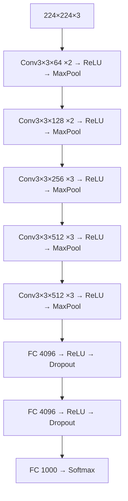
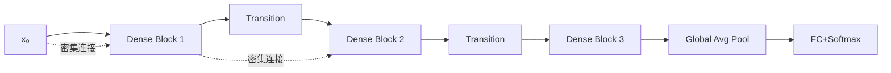
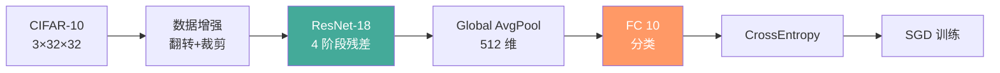

# CNN 卷积神经网络

## 1. 卷积操作

### 基本概念
- **卷积核（Kernel）**：可学习的特征检测器，通常 3×3 或 5×5
- **特征图（Feature Map）**：卷积输出，每个通道检测一种特征
- **参数共享**：同一个卷积核在图像上滑动，大幅减少参数量
- **局部连接**：每个输出点只连接输入的局部区域（感受野）

```mermaid
graph TD
    subgraph 输入图像 H×W×C
    IMG[32×32×3]
    end
    subgraph 卷积核 K×K×C×F
    K1[3×3×3 conv → 64个特征图]
    end
    subgraph 输出特征图
    FM[32×32×64]
    end
    IMG -->|滑动卷积| K1 -->|ReLU| FM
    FM -->|MaxPool 2×2| POOL[16×16×64]
    POOL -->|Conv 3×3×64→128| FM2[16×16×128]
    FM2 -->|Global Avg Pool| GAP[128维向量]
    GAP -->|FC| OUT[分类输出]
```

手动实现 2D 卷积：

```python
import torch.nn.functional as F

def conv2d_manual(x, weight, bias=None, stride=1, padding=0):
    b, c, h, w = x.shape
    f, _, k, _ = weight.shape
    h_out = (h + 2*padding - k) // stride + 1
    w_out = (w + 2*padding - k) // stride + 1
    x_pad = F.pad(x, [padding]*4)
    out = torch.zeros(b, f, h_out, w_out)
    for i in range(h_out):
        for j in range(w_out):
            h_start, w_start = i*stride, j*stride
            x_slice = x_pad[:, :, h_start:h_start+k, w_start:w_start+k]
            out[:, :, i, j] = torch.tensordot(x_slice, weight, dims=([1,2,3], [1,2,3]))
    if bias is not None:
        out += bias.view(1, -1, 1, 1)
    return out

x = torch.randn(1, 3, 32, 32)
w = torch.randn(16, 3, 3, 3)
out = conv2d_manual(x, w, stride=2, padding=1)
```

### 卷积参数

| 参数 | 说明 | 作用 | 典型值 |
|------|------|------|--------|
| Kernel Size | 卷积核大小 | 决定感受野 | 1×1, 3×3, 7×7 |
| Stride | 滑动步长 | 控制输出尺寸 | 1, 2 |
| Padding | 边缘填充 | 保持空间尺寸 | 'same', 0, 1 |
| Dilation | 空洞率 | 扩大感受野不增参数 | 1, 2, 4 |
| Groups | 分组数 | 减少计算量 | 1, depthwise=通道数 |
| Output Padding | 转置卷积输出补丁 | 控制上采样尺寸 | 0, 1 |

```python
# PyTorch 标准卷积
conv = nn.Conv2d(in_channels=3, out_channels=64,
                 kernel_size=3, stride=1, padding=1)
# 深度可分离卷积
depthwise = nn.Conv2d(64, 64, 3, padding=1, groups=64)
pointwise = nn.Conv2d(64, 128, 1)
# 空洞卷积
dilated = nn.Conv2d(3, 64, 3, padding=2, dilation=2)
```

### 1×1 卷积
- **降维/升维**：改变通道数（如 256→64→256 瓶颈）
- **跨通道交互**：融合不同通道信息
- **瓶颈层的核心**：Inception、ResNet 广泛使用

## 2. 池化 Pooling

| 类型 | 操作 | PyTorch | 特点 |
|------|------|---------|------|
| 最大池化 | 区域取最大值 | `nn.MaxPool2d(k=2)` | 保留最强特征，平移不变 |
| 平均池化 | 区域取平均值 | `nn.AvgPool2d(k=2)` | 保留整体分布 |
| 全局平均池化 | 全图取平均 | `nn.AdaptiveAvgPool2d(1)` | 替代 FC，减少参数量 |
| 全局最大池化 | 全图取最大 | `nn.AdaptiveMaxPool2d(1)` | 替代 FC |

```python
pool_max = nn.MaxPool2d(kernel_size=2, stride=2)
pool_avg = nn.AvgPool2d(kernel_size=2, stride=2)
pool_gap = nn.AdaptiveAvgPool2d((1, 1))

x = torch.randn(1, 64, 32, 32)
y_max = pool_max(x)
y_gap = pool_gap(x).view(1, -1)
```

## 3. 经典架构

### LeNet-5（1998）— 开山之作


```python
class LeNet5(nn.Module):
    def __init__(self, num_classes=10):
        super().__init__()
        self.features = nn.Sequential(
            nn.Conv2d(1, 6, 5),
            nn.Tanh(),
            nn.AvgPool2d(2),
            nn.Conv2d(6, 16, 5),
            nn.Tanh(),
            nn.AvgPool2d(2),
        )
        self.classifier = nn.Sequential(
            nn.Linear(16*5*5, 120),
            nn.Tanh(),
            nn.Linear(120, 84),
            nn.Tanh(),
            nn.Linear(84, num_classes),
        )

    def forward(self, x):
        x = self.features(x)
        x = x.view(x.size(0), -1)
        return self.classifier(x)
```

### AlexNet（2012）— 深度学习引爆点
- 5 卷积 + 3 全连接 + ReLU + Dropout
- ImageNet 分类冠军，GPU 并行训练
- 数据增强 + LRN 局部响应归一化

### VGGNet（2014）— 深度增加



- 全部用 3×3 小卷积，堆叠到 16/19 层
- 结构统一，参数量大（138M）

### Inception / GoogLeNet（2014）
- 多尺度卷积并列（1×1, 3×3, 5×5）
- 1×1 降维控制计算量
- 辅助分类器缓解梯度消失

```python
class InceptionBlock(nn.Module):
    def __init__(self, c_in, c1, c3_r, c3, c5_r, c5, c_pool):
        super().__init__()
        self.b1 = nn.Conv2d(c_in, c1, 1)
        self.b2 = nn.Sequential(
            nn.Conv2d(c_in, c3_r, 1),
            nn.Conv2d(c3_r, c3, 3, padding=1),
        )
        self.b3 = nn.Sequential(
            nn.Conv2d(c_in, c5_r, 1),
            nn.Conv2d(c5_r, c5, 5, padding=2),
        )
        self.b4 = nn.Sequential(
            nn.MaxPool2d(3, stride=1, padding=1),
            nn.Conv2d(c_in, c_pool, 1),
        )

    def forward(self, x):
        return torch.cat([self.b1(x), self.b2(x), self.b3(x), self.b4(x)], 1)
```

### ResNet（2015）— 里程碑突破
- **残差连接**：F(x)+x，解决梯度消失
- **152 层**首次训练成功
- **Bottleneck**：1×1→3×3→1×1 降维再升维

```python
class ResidualBlock(nn.Module):
    expansion = 1
    def __init__(self, c_in, c_out, stride=1):
        super().__init__()
        self.conv1 = nn.Conv2d(c_in, c_out, 3, stride, 1, bias=False)
        self.bn1 = nn.BatchNorm2d(c_out)
        self.conv2 = nn.Conv2d(c_out, c_out, 3, 1, 1, bias=False)
        self.bn2 = nn.BatchNorm2d(c_out)
        self.shortcut = nn.Sequential()
        if stride != 1 or c_in != c_out:
            self.shortcut = nn.Sequential(
                nn.Conv2d(c_in, c_out, 1, stride, bias=False),
                nn.BatchNorm2d(c_out),
            )

    def forward(self, x):
        out = F.relu(self.bn1(self.conv1(x)))
        out = self.bn2(self.conv2(out))
        out += self.shortcut(x)
        return F.relu(out)

class Bottleneck(nn.Module):
    expansion = 4
    def __init__(self, c_in, c_out, stride=1):
        super().__init__()
        w = c_out
        self.conv1 = nn.Conv2d(c_in, w, 1, bias=False)
        self.bn1 = nn.BatchNorm2d(w)
        self.conv2 = nn.Conv2d(w, w, 3, stride, 1, bias=False)
        self.bn2 = nn.BatchNorm2d(w)
        self.conv3 = nn.Conv2d(w, c_out * 4, 1, bias=False)
        self.bn3 = nn.BatchNorm2d(c_out * 4)
        self.shortcut = nn.Sequential()
        if stride != 1 or c_in != c_out * 4:
            self.shortcut = nn.Sequential(
                nn.Conv2d(c_in, c_out * 4, 1, stride, bias=False),
                nn.BatchNorm2d(c_out * 4),
            )

    def forward(self, x):
        out = F.relu(self.bn1(self.conv1(x)))
        out = F.relu(self.bn2(self.conv2(out)))
        out = self.bn3(self.conv3(out))
        out += self.shortcut(x)
        return F.relu(out)
```

### DenseNet（2017）— 密集连接



### MobileNet（2017-2024）— 轻量级
- **深度可分离卷积**：Depthwise + Pointwise，计算量减少 8-9×
- MobileNetV2/V3/V4：倒残差 + 注意力

```python
class DepthwiseSeparableConv(nn.Module):
    def __init__(self, c_in, c_out, k=3):
        super().__init__()
        self.depthwise = nn.Conv2d(c_in, c_in, k, padding=k//2, groups=c_in)
        self.pointwise = nn.Conv2d(c_in, c_out, 1)

    def forward(self, x):
        return self.pointwise(self.depthwise(x))
```

### 经典架构对比

| 模型 | 年份 | 层数 | 参数量 | Top-1 Acc | 核心创新 |
|------|------|------|--------|-----------|---------|
| LeNet-5 | 1998 | 5 | 60K | - | 第一个 CNN |
| AlexNet | 2012 | 8 | 60M | 56.5% | ReLU+Dropout+GPU |
| VGG-16 | 2014 | 16 | 138M | 71.6% | 小卷积堆叠 |
| GoogLeNet | 2014 | 22 | 7M | 69.8% | Inception 模块 |
| ResNet-152 | 2015 | 152 | 60M | 78.6% | 残差连接 |
| DenseNet-121 | 2017 | 121 | 8M | 75.0% | 密集连接 |
| MobileNetV3 | 2019 | - | 2.5M | 67.4% | 深度可分卷积 |
| EfficientNet-B7 | 2019 | - | 66M | 84.4% | 复合缩放 |
| ConvNeXt | 2022 | - | 89M | 87.8% | CNN 现代化 |

## 4. 现代 CNN（2022-2026）

### ConvNeXt（2022）
- 纯卷积架构，借鉴 ViT 设计策略
- **关键**：GELU + LayerNorm + 大卷积核 7×7
- **结论**：CNN 与 Transformer 的差距主要来自训练技巧

### RepVGG / MobileOne
- **结构重参数化**：训练时多分支，推理时融合为单分支
- 推理速度快，适合部署

### FasterNet（2023）
- **部分卷积（PConv）**：只对部分通道卷积
- 计算量更低

## 5. 训练技巧

### 数据增强

```python
from torchvision import transforms

train_transform = transforms.Compose([
    transforms.RandomResizedCrop(224),
    transforms.RandomHorizontalFlip(p=0.5),
    transforms.RandomRotation(15),
    transforms.ColorJitter(brightness=0.2, contrast=0.2, saturation=0.2),
    transforms.ToTensor(),
    transforms.Normalize(mean=[0.485, 0.456, 0.406], std=[0.229, 0.224, 0.225]),
])

test_transform = transforms.Compose([
    transforms.Resize(256),
    transforms.CenterCrop(224),
    transforms.ToTensor(),
    transforms.Normalize(mean=[0.485, 0.456, 0.406], std=[0.229, 0.224, 0.225]),
])

# Mixup 实现
def mixup(x, y, alpha=1.0):
    lam = torch.distributions.Beta(alpha, alpha).sample()
    batch_size = x.size(0)
    idx = torch.randperm(batch_size)
    mixed_x = lam * x + (1 - lam) * x[idx]
    mixed_y = lam * F.one_hot(y, num_classes=10) + (1 - lam) * F.one_hot(y[idx], num_classes=10)
    return mixed_x, mixed_y
```

- **基础**：随机翻转/旋转/裁剪/颜色抖动
- **Mixup**：图像和标签线性混合
- **CutMix**：区域替换混合
- **RandAugment**：随机选择增强组合
- **AutoAugment**：搜索最优增强策略

### 正则化
- Label Smoothing、Dropout、DropBlock、Stochastic Depth
- **实践建议**：BatchNorm 的 momentum 默认 0.1，大批次可调至 0.01

## 6. 应用场景

| 任务 | 模型选型 | 部署考虑 | LR 建议 | Batch Size |
|------|---------|---------|---------|-----------|
| 图像分类 | ResNet / ConvNeXt | 实时用 MobileNet | 0.1 (SGD) | 256-512 |
| 细粒度分类 | EfficientNet / ViT | 预训练微调 | 1e-5 (AdamW) | 32-128 |
| 目标检测 | YOLOv8 / DETR | TensorRT 优化 | 1e-4 | 16-64 |
| 语义分割 | DeepLabV3+ / UNet | 轻量级 | 0.01 (SGD) | 16-32 |
| 特征提取 | ResNet / DINOv2 | 迁移学习 | 1e-4 | 64-256 |
| 移动端 | MobileNet V4 | 量化部署 | 1e-3 (Adam) | 32-128 |

## 7. 案例：用 CNN 做 CIFAR-10 图像分类（ResNet-18 风格）

完整可运行示例：数据增强 + 小 ResNet + 训练循环，演示 CNN 端到端落地。



```python
import torch
import torch.nn as nn
import torch.nn.functional as F

def make_resnet18_cifar(num_classes: int = 10) -> nn.Module:
    """极简 ResNet-18 骨架（适配 32×32 输入）。"""
    def block(cin, cout, stride=1):
        return nn.Sequential(
            nn.Conv2d(cin, cout, 3, stride, 1, bias=False),
            nn.BatchNorm2d(cout), nn.ReLU(inplace=True),
            nn.Conv2d(cout, cout, 3, 1, 1, bias=False),
            nn.BatchNorm2d(cout),
        )
    class ResAdd(nn.Module):
        def __init__(self, cin, cout, stride=1):
            super().__init__()
            self.blk = block(cin, cout, stride)
            self.short = nn.Sequential()
            if stride != 1 or cin != cout:
                self.short = nn.Sequential(
                    nn.Conv2d(cin, cout, 1, stride, bias=False),
                    nn.BatchNorm2d(cout))
        def forward(self, x):
            return F.relu(self.blk(x) + self.short(x))
    return nn.Sequential(
        nn.Conv2d(3, 64, 3, 1, 1, bias=False), nn.BatchNorm2d(64), nn.ReLU(),
        ResAdd(64, 64), ResAdd(64, 64),
        ResAdd(64, 128, stride=2), ResAdd(128, 128),
        ResAdd(128, 256, stride=2), ResAdd(256, 256),
        nn.AdaptiveAvgPool2d(1), nn.Flatten(), nn.Linear(256, num_classes))

model = make_resnet18_cifar()
x = torch.randn(8, 3, 32, 32)          # 形状: [8, 3, 32, 32]
out = model(x)                          # 形状: [8, 10]
print("ResNet-18 CIFAR 输出形状:", tuple(out.shape))

# 训练一步（伪数据）
opt = torch.optim.SGD(model.parameters(), lr=0.1, momentum=0.9, weight_decay=5e-4)
y = torch.randint(0, 10, (8,))
loss = F.cross_entropy(out, y)
opt.zero_grad(); loss.backward(); opt.step()
```

## 8. 案例：转置卷积 / 上采样 对比（语义分割 / 生成）

解码器常用三种上采样方式，代价与质量不同。

| 方式 | 参数量 | 可学习 | 棋盘伪影 | 适用 |
|------|--------|--------|---------|------|
| 转置卷积 `ConvTranspose2d` | 有 | ✓ | 易产生 | 需要学习上采样 |
| 最近邻+卷积 | 无(上采样) | ✓(仅卷积) | 较少 | 分割/U-Net |
| 双线性插值+卷积 | 无(插值) | ✓(仅卷积) | 少 | 稳定上采样 |

```python
# 转置卷积上采样 2×
tc = nn.ConvTranspose2d(64, 32, kernel_size=2, stride=2)
# 最近邻上采样 + 普通卷积
up = nn.Sequential(nn.Upsample(scale_factor=2, mode="nearest"), nn.Conv2d(64, 32, 3, padding=1))

x = torch.randn(1, 64, 16, 16)
y_tc = tc(x)       # 形状: [1, 32, 32, 32]
y_up = up(x)       # 形状: [1, 32, 32, 32]
print("上采样输出形状:", tuple(y_tc.shape), tuple(y_up.shape))
```
