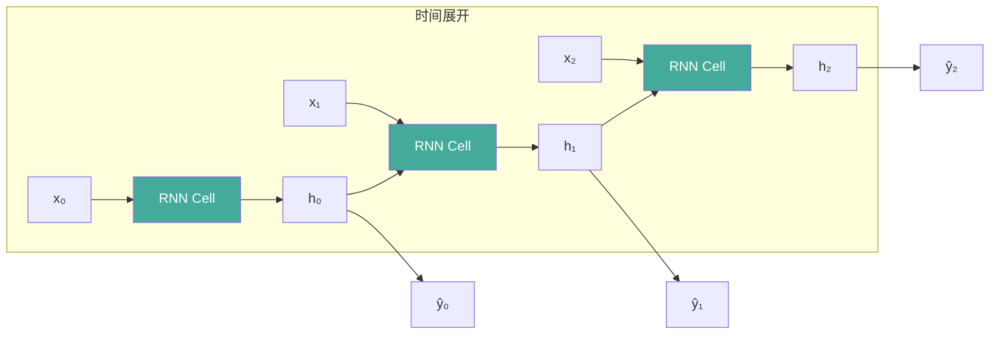
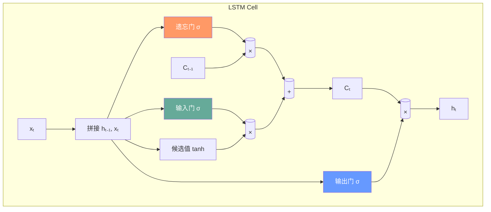
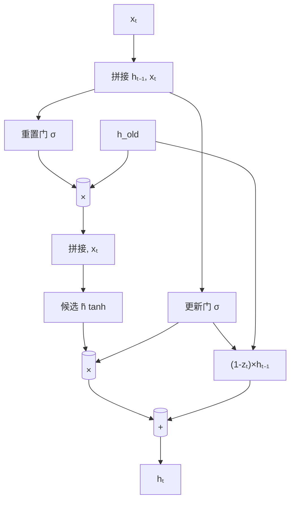

# RNN 与序列模型

## 1. RNN 基础

### 循环神经网络
- **核心**：隐状态在时间步间循环传递
- **公式**：h_t = tanh(W_hh·h_{t-1} + W_xh·x_t + b_h)



手动实现简单 RNN Cell：

```python
import torch.nn as nn

class RNNAll(nn.Module):
    def __init__(self, d_in, d_hid):
        super().__init__()
        self.W_xh = nn.Linear(d_in, d_hid)
        self.W_hh = nn.Linear(d_hid, d_hid)

    def forward(self, x, h=None):
        b, t, d = x.shape
        if h is None:
            h = torch.zeros(b, self.W_hh.weight.size(0), device=x.device)
        outs = []
        for i in range(t):
            h = torch.tanh(self.W_xh(x[:, i]) + self.W_hh(h))
            outs.append(h)
        return torch.stack(outs, 1), h

rnn = RNNAll(128, 256)
x = torch.randn(4, 10, 128)
out, h_last = rnn(x)
```

### 梯度问题

| 问题 | 原因 | 后果 | 解决方案 |
|------|------|------|---------|
| 梯度消失 | 链式法则连乘 < 1 | 长距离信息丢失 | LSTM/GRU/残差连接 |
| 梯度爆炸 | 链式法则连乘 > 1 | 训练不稳定NaN | 梯度裁剪 |

```python
# 梯度裁剪
torch.nn.utils.clip_grad_norm_(model.parameters(), max_norm=1.0)
# 或按值裁剪
torch.nn.utils.clip_grad_value_(model.parameters(), clip_value=0.5)
```

## 2. LSTM（Long Short-Term Memory, 1997）

### 门控机制
- **遗忘门**：决定丢弃哪些旧信息 f_t = σ(W_f·[h_{t-1}, x_t] + b_f)
- **输入门**：决定存储哪些新信息 i_t = σ(W_i·[h_{t-1}, x_t] + b_i)
- **输出门**：决定输出哪些信息 o_t = σ(W_o·[h_{t-1}, x_t] + b_o)
- **细胞状态 C_t**：长期记忆通道



手动实现 LSTM Cell：

```python
class LSTMCell(nn.Module):
    def __init__(self, d_in, d_hid):
        super().__init__()
        d = d_hid
        self.W_ih = nn.Linear(d_in, 4 * d)
        self.W_hh = nn.Linear(d_hid, 4 * d)

    def forward(self, x, state):
        h, c = state
        gates = self.W_ih(x) + self.W_hh(h)
        i, f, g, o = gates.chunk(4, 1)
        i, f, g, o = torch.sigmoid(i), torch.sigmoid(f), torch.tanh(g), torch.sigmoid(o)
        c = f * c + i * g
        h = o * torch.tanh(c)
        return h, (h, c)

# PyTorch 标准 LSTM
lstm = nn.LSTM(input_size=128, hidden_size=256, num_layers=2,
               batch_first=True, dropout=0.2, bidirectional=True)
x = torch.randn(4, 10, 128)
out, (h, c) = lstm(x)
```

### LSTM 优势
- 有效解决梯度消失（细胞状态 C 的加法更新保持梯度流通）
- 长程依赖建模优于简单 RNN
- **实践参数**：hidden_size=512, num_layers=2, dropout=0.3, lr=1e-3 (Adam)

## 3. GRU（Gated Recurrent Unit, 2014）

### 简化 LSTM
- **更新门**：合并遗忘门+输入门 z_t = σ(W_z·[h_{t-1}, x_t])
- **重置门**：控制历史信息的利用 r_t = σ(W_r·[h_{t-1}, x_t])
- 新记忆：h̃_t = tanh(W·[r_t ⊙ h_{t-1}, x_t])
- 最终隐藏：h_t = (1 - z_t) ⊙ h_{t-1} + z_t ⊙ h̃_t
- 参数量更少，训练更快



```python
class GRUCell(nn.Module):
    def __init__(self, d_in, d_hid):
        super().__init__()
        d = d_hid
        self.W_iz = nn.Linear(d_in, d)
        self.W_hz = nn.Linear(d_hid, d)
        self.W_ir = nn.Linear(d_in, d)
        self.W_hr = nn.Linear(d_hid, d)
        self.W_in = nn.Linear(d_in, d)
        self.W_hn = nn.Linear(d_hid, d)

    def forward(self, x, h):
        z = torch.sigmoid(self.W_iz(x) + self.W_hz(h))
        r = torch.sigmoid(self.W_ir(x) + self.W_hr(h))
        n = torch.tanh(self.W_in(x) + self.W_hn(r * h))
        h = (1 - z) * h + z * n
        return h

gru = nn.GRU(128, 256, num_layers=2, batch_first=True, dropout=0.2)
x = torch.randn(4, 10, 128)
out, h = gru(x)
```

## 4. 序列预测完整示例

```python
class SequencePredictor(nn.Module):
    def __init__(self, vocab_size, d_emb=256, d_hid=512, n_layers=2):
        super().__init__()
        self.emb = nn.Embedding(vocab_size, d_emb)
        self.lstm = nn.LSTM(d_emb, d_hid, n_layers, batch_first=True, dropout=0.3)
        self.head = nn.Linear(d_hid, vocab_size)

    def forward(self, x, hidden=None):
        x = self.emb(x)
        out, hidden = self.lstm(x, hidden)
        logits = self.head(out)
        return logits, hidden

# 温度采样
def sample(model, start, length, temp=0.8, device='cpu'):
    model.eval()
    with torch.no_grad():
        x = start.unsqueeze(0).to(device)
        hidden = None
        outputs = start.tolist()
        for _ in range(length):
            logits, hidden = model(x, hidden)
            logits = logits[:, -1, :] / temp
            probs = F.softmax(logits, dim=-1)
            next_tok = torch.multinomial(probs, 1)
            outputs.append(next_tok.item())
            x = next_tok
    return outputs
```

## 5. 双向 RNN
- **前向**：从左到右编码 h→
- **后向**：从右到左编码 h←
- **拼接**：每个位置获得双向上下文 h_t = [h→_t; h←_t]

```python
birnn = nn.LSTM(128, 256, bidirectional=True, batch_first=True)
x = torch.randn(4, 10, 128)
out, _ = birnn(x)  # out.shape = (4, 10, 512) 因为双向拼接
```

## 6. 序列模型对比

| 维度 | RNN | LSTM | GRU | Transformer |
|------|-----|------|-----|------------|
| 并行 | ✗ 串行 | ✗ 串行 | ✗ 串行 | ✓ 并行 |
| 长程依赖 | 弱 | 强 | 强 | 极强 |
| 参数量 | 少 | 中 | 少 | 多 |
| 计算复杂度 | O(n·d²) | O(n·d²) | O(n·d²) | O(n²·d) |
| 推理速度 | 快 | 中 | 中 | 中(KV Cache) |
| 训练稳定性 | 差 | 好 | 好 | 较好 |
| 适用场景 | 简单序列 | 长序列 | 中等序列 | 大规模 |
| 时间步200+ | 不可用 | 可用 | 可用 | 最佳 |

## 7. 实践参数推荐

| 参数 | RNN | LSTM | GRU |
|------|-----|------|-----|
| 隐藏层大小 | 128-256 | 256-512 | 256-512 |
| 层数 | 1-2 | 2-3 | 2-3 |
| Dropout | 0-0.3 | 0.2-0.5 | 0.2-0.5 |
| 学习率(Adam) | 1e-3 | 1e-3 | 1e-3 |
| 梯度裁剪阈值 | 1.0 | 1.0 | 1.0 |
| 批次大小 | 32-128 | 32-64 | 32-64 |

## 8. 应用场景

| 任务 | 模型选择 | 说明 |
|------|---------|------|
| 语言模型 | LSTM/Transformer | 长文本用 Transformer |
| 机器翻译 | LSTM Enc-Dec/BiLSTM | 低资源用 LSTM |
| 情感分析 | BiLSTM + Attention | 双向捕捉上下文 |
| 时间序列 | LSTM/GRU | 金融/天气预测 |
| 语音识别 | LSTM + CTC | 序列到序列对齐 |
| 手写识别 | MD-LSTM | 多维 LSTM |

## 9. 案例：字符级语言模型训练（LSTM 实战）

从零训练一个字符级语言模型：字符映射 → 批次构建 → 训练 → 生成文本。


```python
import torch
import torch.nn as nn
import torch.nn.functional as F

text = "深度学习让序列建模更简单deeplearning"
chars = sorted(set(text))
stoi = {c: i for i, c in enumerate(chars)}
itos = {i: c for c, i in stoi.items()}
vocab = len(chars)

class CharLM(nn.Module):
    def __init__(self, vocab: int, d_hid: int = 128):
        super().__init__()
        self.emb = nn.Embedding(vocab, d_hid)
        self.lstm = nn.LSTM(d_hid, d_hid, 2, batch_first=True, dropout=0.2)
        self.head = nn.Linear(d_hid, vocab)
    def forward(self, x):
        h = self.emb(x)
        out, _ = self.lstm(h)
        return self.head(out)                  # 形状: [b, t, vocab]

def encode(s: str) -> torch.Tensor:
    return torch.tensor([stoi[c] for c in s], dtype=torch.long)

def train_step(model, opt, seq_len: int = 10):
    idx = torch.randint(0, len(text) - seq_len, (1,))
    chunk = text[idx: idx + seq_len + 1]
    x = encode(chunk[:-1]).unsqueeze(0)        # 形状: [1, t]
    y = encode(chunk[1:]).unsqueeze(0)
    logits = model(x)
    loss = F.cross_entropy(logits.view(-1, vocab), y.view(-1))
    opt.zero_grad(); loss.backward()
    torch.nn.utils.clip_grad_norm_(model.parameters(), 1.0)
    opt.step()
    return loss.item()

model = CharLM(vocab)
opt = torch.optim.Adam(model.parameters(), lr=1e-3)
for step in range(200):
    train_step(model, opt)

# 温度采样生成
with torch.no_grad():
    ctx = encode("深")
    for _ in range(12):
        logits = model(ctx.unsqueeze(0))[:, -1] / 0.8
        nxt = torch.multinomial(F.softmax(logits, -1), 1)
        ctx = torch.cat([ctx, nxt])
    print("生成:", "".join(itos[i] for i in ctx))
```

## 10. 案例：Seq2Seq vs 注意力 Seq2Seq 对比

机器翻译等任务中，是否引入注意力对长句性能影响巨大。

| 结构 | 编码器末态传递 | 长句表现 | 参数量 | 实现难度 |
|------|--------------|---------|--------|---------|
| 朴素 Seq2Seq (LSTM Enc-Dec) | 仅最后隐状态 | 差(>30词) | 少 | 低 |
| 注意力 Seq2Seq | 每步对齐所有隐状态 | 好 | 中 | 中 |
| Transformer | 全局自注意力 | 极强 | 多 | 高 |

```python
# 注意力 Seq2Seq 解码一步（Bahdanau 风格）
def attn_decode_step(dec_hidden, enc_outputs, attn):
    """dec_hidden: [1, d]; enc_outputs: [src_len, d]; attn: Linear(2d, 1)。"""
    src_len = enc_outputs.size(0)
    dec_rep = dec_hidden.unsqueeze(0).expand(src_len, -1)   # [src_len, d]
    e = attn(torch.cat([dec_rep, enc_outputs], -1)).tanh()  # [src_len, 1]
    alpha = F.softmax(e, 0)                                  # 注意力权重
    ctx = (alpha * enc_outputs).sum(0, keepdim=True)         # 上下文向量
    return ctx, alpha
```
