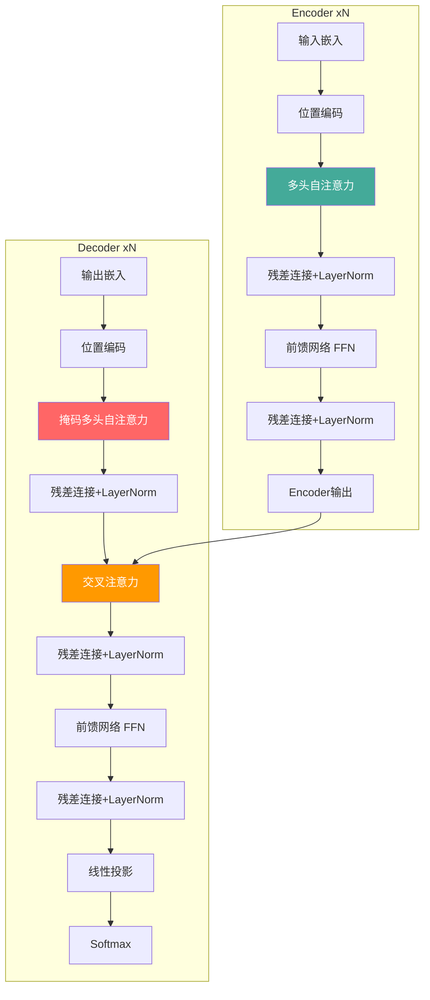
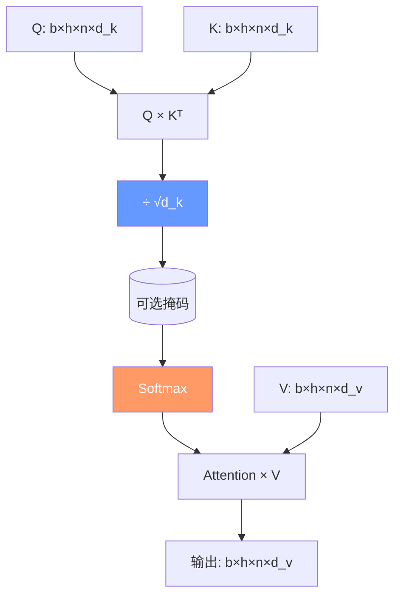
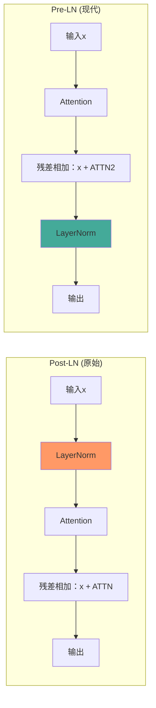

# Transformer 架构

## 1. 原始 Transformer

### 整体结构



### 缩放点积注意力 Scaled Dot-Product Attention



- **公式**：Attention(Q,K,V) = softmax(QK^T/√d_k)V
- **Q**：Query 查询，当前词要"问"什么
- **K**：Key 键，所有词"被问"的回答特征
- **V**：Value 值，实际要提取的信息
- **缩放因子 1/√d_k**：防止点积过大使 softmax 梯度消失

手动实现注意力机制：

```python
def scaled_dot_product_attention(Q, K, V, mask=None):
    d_k = Q.size(-1)
    scores = torch.matmul(Q, K.transpose(-2, -1)) / (d_k ** 0.5)
    if mask is not None:
        scores = scores.masked_fill(mask == 0, float('-inf'))
    attn = F.softmax(scores, dim=-1)
    return torch.matmul(attn, V), attn

q = torch.randn(4, 8, 16, 64)
k = torch.randn(4, 8, 16, 64)
v = torch.randn(4, 8, 16, 64)
out, attn_weights = scaled_dot_product_attention(q, k, v)
```

### 多头注意力 Multi-Head Attention

```python
class MultiHeadAttention(nn.Module):
    def __init__(self, d_model, n_heads, dropout=0.1):
        super().__init__()
        assert d_model % n_heads == 0
        self.d_k = d_model // n_heads
        self.n_heads = n_heads
        self.W_q = nn.Linear(d_model, d_model)
        self.W_k = nn.Linear(d_model, d_model)
        self.W_v = nn.Linear(d_model, d_model)
        self.W_o = nn.Linear(d_model, d_model)
        self.dropout = nn.Dropout(dropout)

    def forward(self, Q, K, V, mask=None):
        b = Q.size(0)
        Q = self.W_q(Q).view(b, -1, self.n_heads, self.d_k).transpose(1, 2)
        K = self.W_k(K).view(b, -1, self.n_heads, self.d_k).transpose(1, 2)
        V = self.W_v(V).view(b, -1, self.n_heads, self.d_k).transpose(1, 2)
        scores = torch.matmul(Q, K.transpose(-2, -1)) / (self.d_k ** 0.5)
        if mask is not None:
            scores = scores.masked_fill(mask == 0, float('-inf'))
        attn = self.dropout(F.softmax(scores, dim=-1))
        out = torch.matmul(attn, V).transpose(1, 2).contiguous().view(b, -1, self.n_heads * self.d_k)
        return self.W_o(out)

mha = MultiHeadAttention(d_model=512, n_heads=8)
x = torch.randn(4, 16, 512)
out = mha(x, x, x)  # Self-attention
```

### 位置编码

| 方法 | 公式/原理 | 使用模型 |
|------|-----------|---------|
| Sinusoidal PE | PE(pos,2i)=sin(pos/10000^{2i/d}) | 原始 Transformer |
| 可学习 PE | 嵌入表：nn.Embedding(max_len, d_model) | BERT |
| RoPE | 旋转矩阵编码相对位置 | LLaMA, GPT-NeoX |
| ALiBi | 线性偏置注意力分数 | BLOOM |
| T5 Bias | 可学习相对位置偏置 | T5 |
| NoPE | 无位置编码（因果模型隐含位置） | 部分实验 |

### 前馈网络 FFN

```python
class FFN(nn.Module):
    def __init__(self, d_model, d_ff, activation=F.relu, dropout=0.1):
        super().__init__()
        self.fc1 = nn.Linear(d_model, d_ff)
        self.fc2 = nn.Linear(d_ff, d_model)
        self.dropout = nn.Dropout(dropout)
        self.act = activation

    def forward(self, x):
        return self.fc2(self.dropout(self.act(self.fc1(x))))

# SwiGLU FFN (LLaMA 系列)
class SwiGLUFFN(nn.Module):
    def __init__(self, d_model, d_ff):
        super().__init__()
        d_ff = int(2 * d_ff / 3)  # SwiGLU 有3个投影，调整维度
        self.fc1 = nn.Linear(d_model, d_ff)
        self.fc2 = nn.Linear(d_model, d_ff)
        self.fc3 = nn.Linear(d_ff, d_model)

    def forward(self, x):
        return self.fc3(F.silu(self.fc1(x)) * self.fc2(x))
```

### 完整 Transformer Encoder Block

```python
class TransformerEncoderBlock(nn.Module):
    def __init__(self, d_model, n_heads, d_ff, dropout=0.1):
        super().__init__()
        self.attn = MultiHeadAttention(d_model, n_heads, dropout)
        self.ffn = SwiGLUFFN(d_model, d_ff)
        self.norm1 = nn.LayerNorm(d_model)
        self.norm2 = nn.LayerNorm(d_model)
        self.dropout = nn.Dropout(dropout)

    def forward(self, x, mask=None):
        x = x + self.dropout(self.attn(self.norm1(x), self.norm1(x), self.norm1(x), mask))
        x = x + self.dropout(self.ffn(self.norm2(x)))
        return x
```

## 2. Transformer 为什么有效

| 特性 | CNN | RNN/LSTM | Transformer |
|------|-----|----------|------------|
| 长程依赖 | 需深层堆叠 | 梯度消失问题 | ✓ 直接 O(1) 路径 |
| 并行计算 | ✓ | ✗ 串行 | ✓ |
| 全局感受野 | ✗ 局部 | ✓ | ✓ |
| 计算复杂度 | O(n·k²·c) | O(n·d²) | O(n²·d) |
| 参数量 | 少 | 中 | 大 |
| 可解释性 | 特征图 | 隐状态 | 注意力权重 |
| 位置编码 | 隐式(空间结构) | 隐式(时间步) | 显式需要 |

## 3. 关键改进

### Pre-LN vs Post-LN



- **Post-LN（原始）**：残差之前做 LN，训练不稳定，需 warmup
- **Pre-LN（现代）**：残差之后做 LN，训练更稳定，无需 warmup
- 所有现代模型（GPT/BERT/LLaMA/T5）都使用 Pre-LN

### 注意力变体

```python
# Flash Attention V2 使用方式
with torch.backends.cuda.sdp_kernel(enable_flash=True, enable_math=False):
    out = F.scaled_dot_product_attention(q, k, v)

# Grouped Query Attention (GQA)
class GQA(nn.Module):
    def __init__(self, d_model, n_heads, n_kv_heads):
        super().__init__()
        self.n_heads = n_heads
        self.n_kv_heads = n_kv_heads
        self.d_k = d_model // n_heads
        self.W_q = nn.Linear(d_model, d_model)
        self.W_k = nn.Linear(d_model, self.d_k * n_kv_heads)
        self.W_v = nn.Linear(d_model, self.d_k * n_kv_heads)
        self.W_o = nn.Linear(d_model, d_model)

    def forward(self, Q, K, V, mask=None):
        b = Q.size(0)
        Q = self.W_q(Q).view(b, -1, self.n_heads, self.d_k).transpose(1, 2)
        K = self.W_k(K).view(b, -1, self.n_kv_heads, self.d_k).transpose(1, 2)
        V = self.W_v(V).view(b, -1, self.n_kv_heads, self.d_k).transpose(1, 2)
        K = K.repeat_interleave(self.n_heads // self.n_kv_heads, dim=1)
        V = V.repeat_interleave(self.n_heads // self.n_kv_heads, dim=1)
        return F.scaled_dot_product_attention(Q, K, V, mask)
```

- **Flash Attention V1-V3**：IO 感知，分块计算，减少 HBM 读写
- **PagedAttention**：类虚拟内存 KV Cache 管理
- **Multi-Query / Grouped Query Attention**：减少 KV 头数
- **Multi-head Latent Attention**：低秩压缩 KV Cache（DeepSeek）

### 高效 Transformer

| 方法 | 复杂度 | 核心思想 | 适用 |
|------|--------|---------|------|
| Linformer | O(n) | 低秩近似 KV | 中等长度 |
| Performer | O(n) | FAVOR+ 核方法 | 通用 |
| Reformer | O(n log n) | LSH 哈希 + 可逆层 | 超长序列 |
| Longformer | O(n) | 滑动窗口+全局 | 文档 |
| BigBird | O(n) | 稀疏+全局+随机 | 通用 |
| FlashAttention | O(n²)实际快 | IO 感知 CUDA 优化 | GPU |

## 4. 模型维度配置

| 模型 | d_model | Layers | Heads | d_ff | 参数量 |
|------|---------|--------|-------|------|--------|
| BERT-Base | 768 | 12 | 12 | 3072 | 110M |
| BERT-Large | 1024 | 24 | 16 | 4096 | 340M |
| GPT-2 XL | 1600 | 48 | 25 | 6400 | 1.5B |
| GPT-3 | 12288 | 96 | 96 | 49152 | 175B |
| LLaMA 7B | 4096 | 32 | 32 | 11008 | 6.7B |
| LLaMA 65B | 8192 | 80 | 64 | 22016 | 65B |
| DeepSeek V2 | 4096 | 60 | 32 | 12288 | 236B(MoE) |
| DeepSeek V4 | 7168 | 78 | 56 | 21504 | ~1T(MoE) |

## 5. Transformer 变体

### Encoder-Only（BERT 类）
- 双向注意力，适合理解任务
- 分类、NER、抽取式 QA

### Decoder-Only（GPT 类）
- 因果注意力（只看到左侧）
- 生成任务、LLM、对话

### Encoder-Decoder（T5 类）
- 完整 Seq2Seq 结构
- 翻译、摘要、多任务统一

```python
# GPT 风格因果自回归模型
class CausalTransformer(nn.Module):
    def __init__(self, vocab_size, d_model=512, n_layers=6, n_heads=8, d_ff=2048):
        super().__init__()
        self.emb = nn.Embedding(vocab_size, d_model)
        self.pos_emb = nn.Embedding(2048, d_model)
        self.blocks = nn.ModuleList([
            TransformerEncoderBlock(d_model, n_heads, d_ff) for _ in range(n_layers)
        ])
        self.ln = nn.LayerNorm(d_model)
        self.head = nn.Linear(d_model, vocab_size)

    def forward(self, x):
        b, t = x.shape
        pos = torch.arange(t, device=x.device).unsqueeze(0)
        x = self.emb(x) + self.pos_emb(pos)
        mask = torch.triu(torch.ones(t, t, device=x.device), diagonal=1).bool()
        for block in self.blocks:
            x = block(x, mask=~mask)
        return self.head(self.ln(x))
```

## 6. 2025-2026 趋势
- **混合注意力**：Transformer + SSM（Mamba）混合层
- **超大 MoE Transformer**：DeepSeek 等将 MoE 路由引入 Transformer
- **线性注意力**：在不牺牲质量下接近 O(n) 复杂度
- **长上下文优化**：百万级 token 成为现实
- **Speculative Decoding**：2-3× 推理加速
- **KV Cache 量化**：INT4/FP8 缓存压缩
