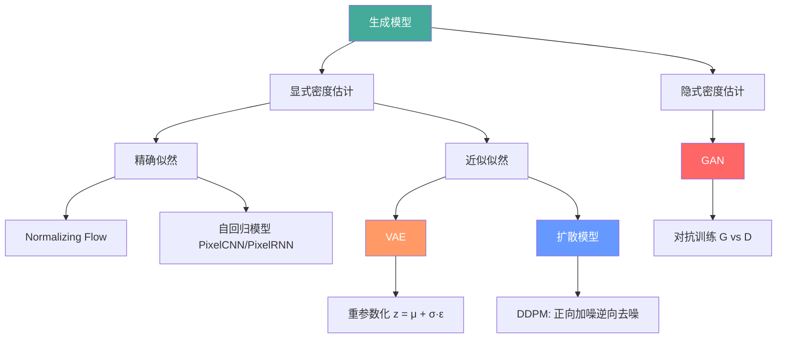
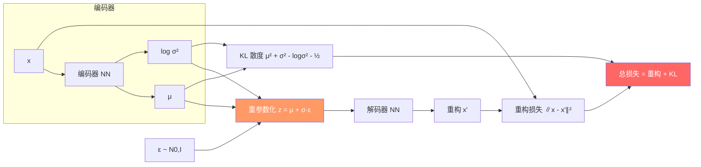
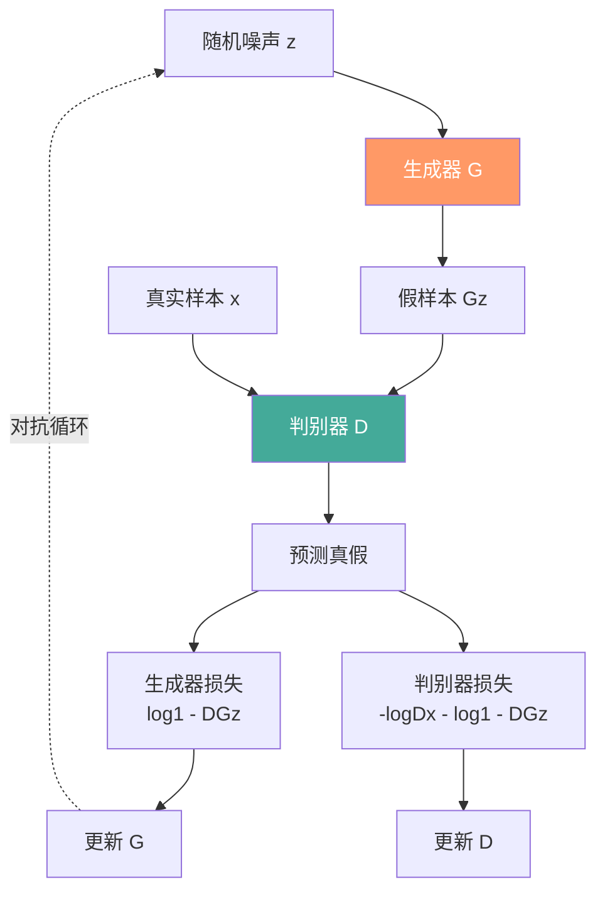
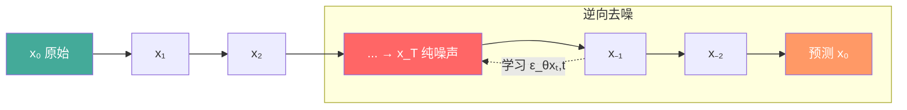
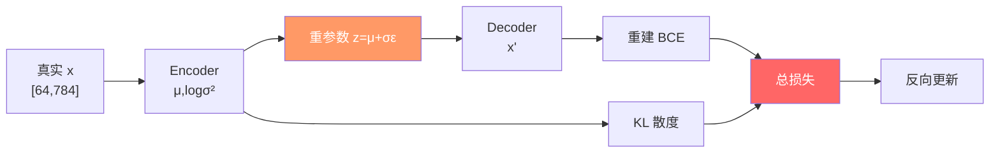

# 生成模型

## 1. 生成模型分类



## 2. 变分自编码器 VAE

### 原理
- **编码器**：输入 x → 潜在分布 q(z|x)（均值 μ 和方差 σ²）
- **重参数化**：z = μ + σ·ε，ε~N(0,I)，保持可微
- **解码器**：z → 重构 x'



PyTorch 实现 VAE：

```python
class VAE(nn.Module):
    def __init__(self, d_in=784, d_hid=256, d_lat=20):
        super().__init__()
        self.enc = nn.Sequential(
            nn.Linear(d_in, d_hid),
            nn.ReLU(),
            nn.Linear(d_hid, d_hid),
            nn.ReLU(),
        )
        self.fc_mu = nn.Linear(d_hid, d_lat)
        self.fc_logvar = nn.Linear(d_hid, d_lat)
        self.dec = nn.Sequential(
            nn.Linear(d_lat, d_hid),
            nn.ReLU(),
            nn.Linear(d_hid, d_hid),
            nn.ReLU(),
            nn.Linear(d_hid, d_in),
            nn.Sigmoid(),
        )

    def encode(self, x):
        h = self.enc(x)
        return self.fc_mu(h), self.fc_logvar(h)

    def reparameterize(self, mu, logvar):
        std = torch.exp(0.5 * logvar)
        eps = torch.randn_like(std)
        return mu + eps * std

    def decode(self, z):
        return self.dec(z)

    def forward(self, x):
        mu, logvar = self.encode(x)
        z = self.reparameterize(mu, logvar)
        return self.decode(z), mu, logvar

def vae_loss(recon_x, x, mu, logvar):
    recon = F.binary_cross_entropy(recon_x, x.view(-1, 784), reduction='sum')
    kl = -0.5 * torch.sum(1 + logvar - mu.pow(2) - logvar.exp())
    return recon + kl

model = VAE()
x = torch.randn(64, 784)
x_hat, mu, logvar = model(x)
loss = vae_loss(x_hat, x, mu, logvar)
```

### VAE 变体
| 变体 | 改进 | 损失变化 | 效果 |
|------|------|---------|------|
| β-VAE | 加重 KL 项 | β·KL | 隐变量解耦 |
| VQ-VAE | 离散隐变量，矢量量化 | + 直通估计 | 高质量压缩 |
| VQ-VAE-2 | 层次化 VQ | 多层 VQ | 高分辨率生成 |

## 3. 生成对抗网络 GAN

### 对抗训练



PyTorch 实现 GAN：

```python
class Generator(nn.Module):
    def __init__(self, d_noise=100, d_out=784):
        super().__init__()
        self.net = nn.Sequential(
            nn.Linear(d_noise, 256),
            nn.ReLU(),
            nn.BatchNorm1d(256),
            nn.Linear(256, 512),
            nn.ReLU(),
            nn.BatchNorm1d(512),
            nn.Linear(512, d_out),
            nn.Tanh(),
        )

    def forward(self, z):
        return self.net(z)

class Discriminator(nn.Module):
    def __init__(self, d_in=784):
        super().__init__()
        self.net = nn.Sequential(
            nn.Linear(d_in, 256),
            nn.LeakyReLU(0.2),
            nn.Linear(256, 128),
            nn.LeakyReLU(0.2),
            nn.Linear(128, 1),
        )

    def forward(self, x):
        return self.net(x)

def train_gan_step(G, D, real, optim_G, optim_D, device='cpu'):
    b = real.size(0)
    z = torch.randn(b, 100, device=device)
    fake = G(z)
    real_score = D(real)
    fake_score = D(fake.detach())
    loss_D = F.binary_cross_entropy_with_logits(real_score, torch.ones_like(real_score)) + \
             F.binary_cross_entropy_with_logits(fake_score, torch.zeros_like(fake_score))
    optim_D.zero_grad()
    loss_D.backward()
    optim_D.step()
    z = torch.randn(b, 100, device=device)
    fake = G(z)
    fake_score = D(fake)
    loss_G = F.binary_cross_entropy_with_logits(fake_score, torch.ones_like(fake_score))
    optim_G.zero_grad()
    loss_G.backward()
    optim_G.step()
    return loss_D.item(), loss_G.item()
```

### 训练难点
- **模式崩塌（Mode Collapse）**：G 只生成少数模式
- **不收敛**：D 太强/G 太弱的不平衡
- **梯度消失**：D 完美区分后 G 无梯度

### 改进方法
| 方法 | 核心改进 | 训练稳定性 | 样本质量 |
|------|---------|-----------|---------|
| GAN | 原始对抗 | ★ | ★★★ |
| WGAN | Wasserstein 距离 | ★★★ | ★★★ |
| WGAN-GP | 梯度惩罚 | ★★★★ | ★★★★ |
| SN-GAN | 谱归一化 | ★★★★★ | ★★★★★ |
| SAGAN | 自注意力 | ★★★★ | ★★★★★ |
| BigGAN | 大批次+截断 | ★★★ | ★★★★★ |

## 4. 扩散模型

### 正向扩散过程



```python
def forward_diffusion(x0, t, alpha_bar, sqrt_alpha_bar, sqrt_one_minus_alpha_bar):
    noise = torch.randn_like(x0)
    x_t = sqrt_alpha_bar[t] * x0 + sqrt_one_minus_alpha_bar[t] * noise
    return x_t, noise

class DDPM(nn.Module):
    def __init__(self, T=1000, beta_start=1e-4, beta_end=0.02):
        super().__init__()
        self.T = T
        self.beta = torch.linspace(beta_start, beta_end, T)
        self.alpha = 1 - self.beta
        self.alpha_bar = torch.cumprod(self.alpha, dim=0)
        self.sqrt_alpha_bar = torch.sqrt(self.alpha_bar)
        self.sqrt_one_minus_alpha_bar = torch.sqrt(1 - self.alpha_bar)

    def forward(self, x0, t):
        noise = torch.randn_like(x0)
        x_t = self.sqrt_alpha_bar[t] * x0 + self.sqrt_one_minus_alpha_bar[t] * noise
        return x_t, noise

    def sample(self, model, shape, device='cpu'):
        model.eval()
        x = torch.randn(shape, device=device)
        with torch.no_grad():
            for t in reversed(range(self.T)):
                t_tensor = torch.full((shape[0],), t, device=device)
                pred_noise = model(x, t_tensor)
                if t > 0:
                    z = torch.randn_like(x)
                else:
                    z = 0
                x = (1 / torch.sqrt(self.alpha[t])) * \
                    (x - (1 - self.alpha[t]) / torch.sqrt(1 - self.alpha_bar[t]) * pred_noise) + \
                    torch.sqrt(self.beta[t]) * z
        return x
```

### DDPM vs DDIM vs DPM-Solver

| 方法 | 采样步数 | 确定性 | 质量 | 速度提升 |
|------|---------|--------|------|---------|
| DDPM | 1000 步 | 随机 | 最高 | 1× |
| DDIM | 50-100 步 | 确定 | 略低 | 10-20× |
| DPM-Solver | 10-25 步 | 确定 | 接近高质量 | 40-100× |
| LCM/LMS | 1-4 步 | 确定 | 中等 | 250-1000× |

### 潜在扩散模型 LDM（Stable Diffusion）
- 在潜空间（VQ-VAE 编码）做扩散
- 加入文本/图像条件控制
- 计算量大幅降低，1024×1024 可行

## 5. 自回归模型

### PixelCNN / PixelRNN
- 逐个像素生成，依赖之前所有像素
- **Masked Convolution**：掩蔽未来像素

```python
class MaskedConv2d(nn.Conv2d):
    def __init__(self, mask_type, *args, **kwargs):
        super().__init__(*args, **kwargs)
        self.register_buffer('mask', torch.ones_like(self.weight))
        h, w = self.mask.shape[-2:]
        self.mask[:, :, h//2, w//2 + (mask_type == 'B'):] = 0
        self.mask[:, :, h//2 + 1:] = 0

    def forward(self, x):
        return F.conv2d(x, self.weight * self.mask, self.bias, self.stride, self.padding)
```

### 图像 GPT（iGPT）
- 图像分块序列化 → GPT 自回归预测
- 类似 ViT 的自回归版本

## 6. Normalizing Flow
- **可逆变换**：x 与 z（潜变量）之间的双向可逆映射
- **精确对数似然**：log p(x) = log p(z) + log|det J|
- **代表**：RealNVP、Glow、Flow++
- **局限**：需要可逆架构，表达能力受限

## 7. 生成模型对比

| 模型 | 样本质量 | 多样性 | 训练难度 | 采样速度 | 条件控制 | 似然计算 |
|------|---------|-------|---------|---------|---------|---------|
| GAN | ★★★★★ | ★★★ | ★★ | ★★★★★ | ★★★ | 无 |
| VAE | ★★★ | ★★★★★ | ★★★★ | ★★★★★ | ★★★ | 下界 |
| 扩散模型 | ★★★★★ | ★★★★★ | ★★ | ★★ | ★★★★★ | 下界 |
| 自回归 | ★★★★ | ★★★★ | ★★ | ★ | ★★★★ | 精确 |
| Flow | ★★★ | ★★★ | ★ | ★★★ | ★★★ | 精确 |

## 8. 2025-2026 趋势
- **扩散 Transformer（DiT）**：替代 UNet 的扩散骨干
- **一致性模型（CM）**：一步生成，极速采样
- **Flow Matching**：扩散模型的连续归一化流替代
- **3D 生成**：扩散模型做 3D 资产生成（TripoSR, Stable 3D）
- **视频扩散**：Sora 掀起的视频生成热潮
- **Rectified Flow**：Stable Diffusion 3 使用的直流通路

## 9. 案例：训练 VAE 并采样生成新样本

完整演示 VAE 的单步训练与从潜空间随机采样重建，验证「编码-解码」闭环。



```python
import torch
import torch.nn.functional as F

model = VAE(d_in=784, d_hid=256, d_lat=20)
opt = torch.optim.Adam(model.parameters(), lr=1e-3)

# 单步训练（伪 MNIST 数据）
x = torch.rand(64, 784)
x_hat, mu, logvar = model(x)
loss = vae_loss(x_hat, x, mu, logvar)
opt.zero_grad(); loss.backward(); opt.step()
print("VAE 训练损失:", round(loss.item(), 1))

# 从标准正态采样生成新样本
with torch.no_grad():
    z = torch.randn(8, 20)                 # 形状: [8, 20]
    samples = model.decode(z)              # 形状: [8, 784]，取值 [0,1]
print("生成样本形状:", tuple(samples.shape))
```

## 10. 案例：DDPM 训练一步与加速采样对比

演示噪声预测模型的单步训练，并对比不同采样器的速度/质量权衡。

```python
import torch
import torch.nn.functional as F

# 极简 UNet 风格噪声预测器（占位）
class SimpleUNet(torch.nn.Module):
    def __init__(self):
        super().__init__()
        self.net = torch.nn.Sequential(
            torch.nn.Linear(784, 256), torch.nn.ReLU(),
            torch.nn.Linear(256, 784))
    def forward(self, x, t):
        return self.net(x.view(x.size(0), -1)).view_as(x)

model = SimpleUNet()
opt = torch.optim.Adam(model.parameters(), lr=2e-4)
ddpm = DDPM(T=1000)

# 训练一步：预测加入的噪声
x0 = torch.rand(32, 1, 28, 28)
t = torch.randint(0, 1000, (32,))
x_t, noise = ddpm.forward(x0, t)            # x_t: [32,1,28,28]
pred = model(x_t, t)
loss = F.mse_loss(pred, noise)
opt.zero_grad(); loss.backward(); opt.step()
print("DDPM 噪声预测 MSE:", round(loss.item(), 4))
```

| 采样器 | 步数 | 单步成本 | 累计耗时(相对) | 质量 |
|--------|------|---------|---------------|------|
| DDPM | 1000 | 1× | 1000× | 最高 |
| DDIM | 50 | 1× | 50× | 略低 |
| DPM-Solver++ | 20 | 1× | 20× | 接近 |
| LCM | 4 | 1× | 4× | 中等 |

> 实践建议：追求质量用 DDIM 50 步，追求实时用 LCM/Consistency 4 步。
