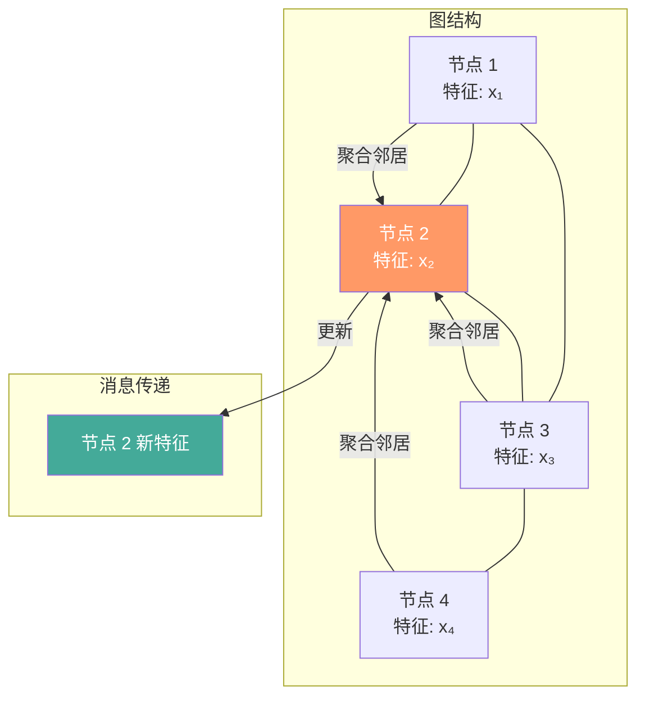
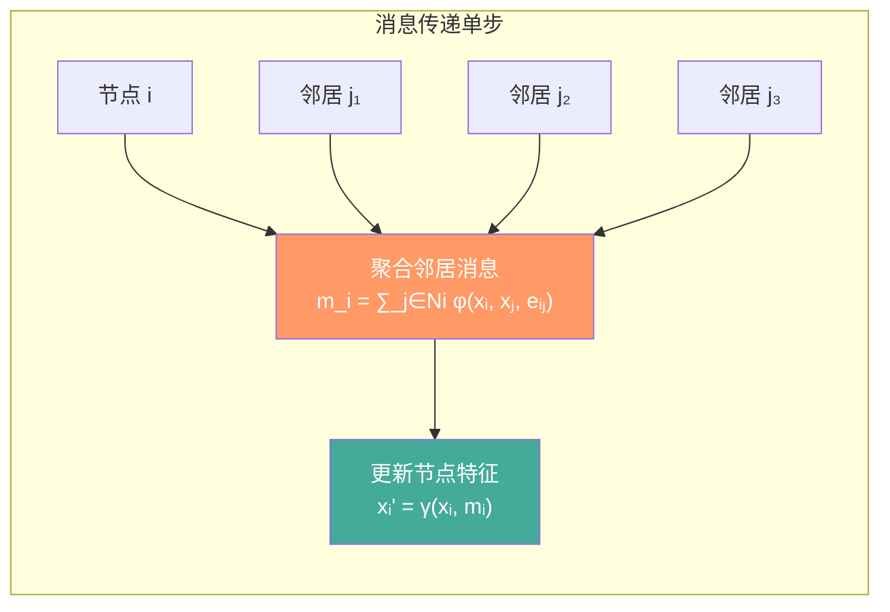
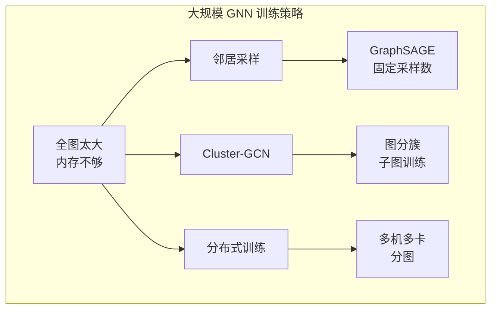

# 图神经网络 GNN

## 1. 图表示基础

### 图的定义
- **节点（Node）**：实体
- **边（Edge）**：关系
- **邻接矩阵 A**：节点连接关系
- **特征矩阵 X**：节点属性
- **度矩阵 D**：节点度数



### 图任务类型

| 任务 | 层次 | 输入 | 输出 | 示例 |
|------|------|------|------|------|
| 节点分类 | 节点 | 图结构+节点特征 | 节点标签 | 论文主题分类 |
| 链接预测 | 边 | 部分图 | 边存在概率 | 社交关系推荐 |
| 图分类 | 全图 | 多个图 | 图标签 | 分子性质预测 |
| 节点聚类 | 节点 | 图结构 | 聚类分配 | 社区发现 |
| 图生成 | 全图 | 条件 | 新图 | 分子生成 |

## 2. 经典模型

### 消息传递框架（Message Passing）



### GCN（Graph Convolutional Network, 2016）
- **核心公式**：H^{(l+1)} = σ(÷H^{(l)}·W^{(l)})
- Ã = D^{-1/2}(A+I)D^{-1/2}（归一化邻接矩阵）
- **本质**：邻居特征聚合 + 线性变换

手动实现 GCN 层：

```python
class GCNLayer(nn.Module):
    def __init__(self, d_in, d_out):
        super().__init__()
        self.W = nn.Linear(d_in, d_out, bias=False)
        self.bias = nn.Parameter(torch.zeros(d_out))

    def forward(self, x, adj):
        support = self.W(x)
        output = torch.mm(adj, support)
        return F.relu(output + self.bias)

# 归一化邻接矩阵
def normalize_adj(A):
    A_hat = A + torch.eye(A.size(0))
    D = torch.diag(A_hat.sum(1).pow(-0.5))
    return D @ A_hat @ D

A = torch.tensor([[0,1,1],[1,0,1],[1,1,0]], dtype=torch.float)
X = torch.randn(3, 64)
A_norm = normalize_adj(A)
layer = GCNLayer(64, 128)
out = layer(X, A_norm)
```

### GAT（Graph Attention Network, 2017）
- **注意力机制**：为不同邻居分配不同权重
- **多头注意力**：多个注意力头拼接

```python
class GATLayer(nn.Module):
    def __init__(self, d_in, d_out, alpha=0.2):
        super().__init__()
        self.W = nn.Linear(d_in, d_out, bias=False)
        self.a = nn.Parameter(torch.zeros(2 * d_out))
        self.leaky = nn.LeakyReLU(alpha)

    def forward(self, x, adj):
        h = self.W(x)
        a_input = torch.cat([h.repeat(1, h.size(0)).view(h.size(0)*h.size(0), -1),
                             h.repeat(h.size(0), 1)], dim=1).view(h.size(0), -1, 2 * h.size(1))
        e = self.leaky(torch.matmul(a_input, self.a))
        attention = torch.where(adj > 0, e, torch.full_like(e, -1e9))
        alpha = F.softmax(attention, dim=1)
        return F.elu(torch.bmm(alpha, h))

gat = GATLayer(64, 128)
out = gat(X, A.unsqueeze(0))
```

### GraphSAGE（2017）
- **采样聚合**：随机采样邻居，适合大规模图
- **聚合函数**：Mean/LSTM/Pooling

```python
class SAGELayer(nn.Module):
    def __init__(self, d_in, d_out, agg='mean'):
        super().__init__()
        self.W_self = nn.Linear(d_in, d_out)
        self.W_neigh = nn.Linear(d_in, d_out)
        self.agg = agg

    def forward(self, x, adj):
        neigh = torch.mm(adj, x)
        if self.agg == 'mean':
            neigh_sum = neigh
            count = adj.sum(1, keepdim=True) + 1e-8
            neigh_mean = neigh_sum / count
        elif self.agg == 'max':
            neigh_mean = torch.where(adj > 0, x.unsqueeze(0), torch.zeros_like(x)).max(1).values
        h_self = self.W_self(x)
        h_neigh = self.W_neigh(neigh_mean)
        return F.relu(h_self + h_neigh)
```

### GIN（Graph Isomorphism Network, 2019）
- **理论**：WL 图同构测试的上界
- **比 GCN/GAT 表达更强**

```python
class GINLayer(nn.Module):
    def __init__(self, d_in, d_out, eps=0.0):
        super().__init__()
        self.mlp = nn.Sequential(
            nn.Linear(d_in, d_out),
            nn.BatchNorm1d(d_out),
            nn.ReLU(),
            nn.Linear(d_out, d_out),
        )
        self.eps = eps

    def forward(self, x, adj):
        neigh_sum = torch.mm(adj, x)
        x_agg = (1 + self.eps) * x + neigh_sum
        return self.mlp(x_agg)
```

### 完整 2 层 GCN 模型

```python
class GCN(nn.Module):
    def __init__(self, d_in, d_hid, d_out):
        super().__init__()
        self.conv1 = GCNLayer(d_in, d_hid)
        self.conv2 = GCNLayer(d_hid, d_out)
        self.dropout = nn.Dropout(0.5)

    def forward(self, x, adj):
        x = self.dropout(F.relu(self.conv1(x, adj)))
        x = self.conv2(x, adj)
        return F.log_softmax(x, dim=1)

# 训练
model = GCN(d_in=1433, d_hid=16, d_out=7)
optimizer = torch.optim.Adam(model.parameters(), lr=0.01, weight_decay=5e-4)

def train(model, x, adj, y, idx_train):
    model.train()
    logits = model(x, adj)
    loss = F.nll_loss(logits[idx_train], y[idx_train])
    optimizer.zero_grad()
    loss.backward()
    optimizer.step()
    return loss.item()
```

### 经典 GNN 对比

| 模型 | 年份 | 聚合方式 | 参数量 | 表达力 | 适用场景 |
|------|------|---------|--------|-------|---------|
| GCN | 2016 | 度归一化求和 | 少 | 低 | 同构图中等规模 |
| GAT | 2017 | 注意力加权 | 中 | 中 | 异构图/重要性不同 |
| GraphSAGE | 2017 | 采样+Mean/LSTM | 中 | 中 | 大规模图 |
| GIN | 2019 | MLP+求和 | 中 | 高(WL) | 图分类 |
| GatedGCN | 2017 | 门控+边特征 | 多 | 中 | 边特征重要 |
| GPS | 2022 | GNN+Transformer | 多 | 高 | 通用/超大图 |

## 3. 图 Transformer
- **Graphormer**（2021）：中心编码 + 空间编码 + 边编码
- **GPS**（2022）：GNN + Transformer 混合层

## 4. 应用场景

### 推荐系统
- **协同过滤**：用户-物品交互图 → 节点表示
- **社交推荐**：朋友关系传递偏好
- **序列推荐**：Session 图建模（SR-GNN）

### 药物发现
- **分子性质预测**：原子为节点，化学键为边
- **分子生成**：生成符合要求的分子图
- **蛋白质结构**：氨基酸图为节点

### 知识图谱
- **知识图谱补全**：链接预测
- **推理**：多跳关系推理

### 物理/交通
- **天气预报**：气象站网格图
- **交通流量**：路网图预测

## 5. 大规模训练



- **Cluster-GCN**：图分簇 + 子图训练
- **邻居采样**：GraphSAGE 采样策略（每层采样 2-25 个邻居）
- **Gradient Checkpointing**：节省显存
- **实践参数**：lr=0.01 (Adam), hidden=16-256, dropout=0.5, weight_decay=5e-4

## 6. 2025-2026 前沿
- **Graph + LLM**：LLM 增强图推理（GraphRAG）
- **Temporal GNN**：动态图（随时间变化）
- **Heterogeneous GNN**：多种节点/边类型
- **Equivariant GNN**：等变图网络（物理/分子模拟）
- **Large-scale GNN**：百亿节点图训练
