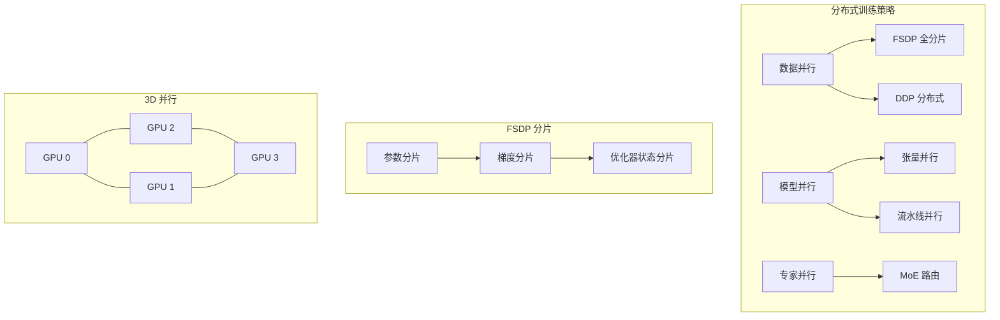

# 模型训练与优化

## 1. 优化器

### 经典优化器

| 优化器 | 更新公式 | 特点 | 适用场景 |
|--------|---------|------|---------|
| SGD | w = w - η·g | 简单，泛化好 | CV 经典 |
| SGD+Momentum | v=μv+g, w=w-η·v | 加速收敛，抑制震荡 | 通用 |
| AdaGrad | w=w-η·g/√(G+ε) | 自适应 LR，G 累积梯度平方 | 稀疏梯度 |
| RMSProp | w=w-η·g/√(E[g²]+ε) | 指数移动平均梯度平方 | RNN |
| Adam | m=β₁m+(1-β₁)g, v=β₂v+(1-β₂)g² | 自适应+动量 | 默认选择 |
| AdamW | Adam + 解耦权重衰减 | 正则化更好 | Transformer 首选 |
| NAdam | Adam + Nesterov 动量 | 更快收敛 | NLP |
| RAdam | Adam + 修正方差 | 训练更稳 | 小批次 |

### 最新优化器

```python
# AdamW (PyTorch 标准)
optimizer = torch.optim.AdamW(model.parameters(), lr=3e-4, weight_decay=0.1)

# SGD with Momentum
optimizer = torch.optim.SGD(model.parameters(), lr=0.1, momentum=0.9, weight_decay=1e-4)

# Lion 优化器 (符号动量) -- 手动实现
class Lion(torch.optim.Optimizer):
    def __init__(self, params, lr=1e-4, betas=(0.9, 0.99), weight_decay=0.0):
        defaults = dict(lr=lr, betas=betas, weight_decay=weight_decay)
        super().__init__(params, defaults)

    def step(self):
        for group in self.param_groups:
            for p in group['params']:
                if p.grad is None: continue
                g = p.grad.data
                if group['weight_decay'] > 0:
                    g = g + group['weight_decay'] * p.data
                state = self.state[p]
                if 'exp_avg' not in state:
                    state['exp_avg'] = torch.zeros_like(p.data)
                m = state['exp_avg']
                beta1, beta2 = group['betas']
                m.mul_(beta1).add_(g, alpha=1 - beta1)
                update = m.sign()
                p.data.add_(update, alpha=-group['lr'])
                m.mul_(beta2).add_(g, alpha=1 - beta2)

# Muon 优化器 (Newton-Schulz 正交化，简化版)
class Muon(torch.optim.Optimizer):
    def __init__(self, params, lr=1e-3, momentum=0.95, newton_schulz_steps=5):
        defaults = dict(lr=lr, momentum=momentum, ns_steps=newton_schulz_steps)
        super().__init__(params, defaults)

    def step(self):
        for group in self.param_groups:
            for p in group['params']:
                if p.grad is None or p.ndim < 2: continue
                g = p.grad.data
                state = self.state[p]
                if 'momentum_buffer' not in state:
                    state['momentum_buffer'] = torch.zeros_like(g)
                buf = state['momentum_buffer']
                buf.mul_(group['momentum']).add_(g)
                for _ in range(group['ns_steps']):
                    buf = 0.5 * buf @ (3 * torch.eye(buf.size(0), device=buf.device) - buf @ buf.T)
                p.data.add_(buf, alpha=-group['lr'])
```

- **Lion（2023）**：符号动量，仅跟踪动量符号，省显存
- **Muon（2024）**：Newton-Schulz 正交化梯度，适合 LLM 预训练
- **Sophia（2023）**：二阶信息裁剪，比 Adam 快 2×

### 学习率调度

```python
# 余弦退火 + Warmup
total_steps = 100000
warmup_steps = 1000
optimizer = torch.optim.AdamW(model.parameters(), lr=3e-4)

def get_cosine_schedule_with_warmup(optimizer, warmup, total):
    def lr_lambda(step):
        if step < warmup:
            return step / warmup
        return 0.5 * (1 + torch.cos(torch.tensor((step - warmup) / (total - warmup) * torch.pi)))
    return torch.optim.lr_scheduler.LambdaLR(optimizer, lr_lambda)

scheduler = get_cosine_schedule_with_warmup(optimizer, warmup_steps, total_steps)

# OneCycle LR
scheduler = torch.optim.lr_scheduler.OneCycleLR(
    optimizer, max_lr=3e-4, total_steps=total_steps,
    pct_start=0.1, anneal_strategy='cos'
)
```

| 策略 | 特点 | 适用 | 典型参数 |
|------|------|------|---------|
| 余弦退火 | 先快后慢平滑下降 | 通用 | T_max=epochs |
| OneCycle | 升温→降温 | 快速收敛 | pct_start=0.1-0.3 |
| Warmup | 线性升温 | 训练初期稳定 | warmup_steps=1000 |
| ReduceLROnPlateau | 指标不降时减 LR | 调试阶段 | patience=5, factor=0.5 |
| InverseSqrt | 按步数倒数的平方根下降 | Transformer | warmup + sqrt decay |

## 2. 初始化

### 常见初始化

| 方法 | 分布 | 激活函数 | 原理 |
|------|------|---------|------|
| Xavier/Glorot Uniform | U(-√(6/(n_in+n_out)), √(6/(n_in+n_out))) | tanh/sigmoid | 保持输入输出方差一致 |
| Xavier/Glorot Normal | N(0, √(2/(n_in+n_out))) | tanh/sigmoid | - |
| Kaiming/He Uniform | U(-√(6/n_in), √(6/n_in)) | ReLU | 考虑 ReLU 非对称性 |
| Kaiming/He Normal | N(0, √(2/n_in)) | ReLU/LeakyReLU | - |
| Orthogonal | 正交矩阵 | RNN | 正交矩阵防止梯度消失 |
| DeepSeek V4 Init | 特殊缩放 | 各种 | Birkhoff 多面体 |

```python
def init_weights(model, method='kaiming'):
    for m in model.modules():
        if isinstance(m, (nn.Linear, nn.Conv2d)):
            if method == 'kaiming':
                nn.init.kaiming_normal_(m.weight, mode='fan_in', nonlinearity='relu')
            elif method == 'xavier':
                nn.init.xavier_uniform_(m.weight)
            elif method == 'orthogonal':
                nn.init.orthogonal_(m.weight)
            if m.bias is not None:
                nn.init.zeros_(m.bias)
```

## 3. 正则化

### 权重正则化

```python
# L2 正则化 (weight_decay in optimizer)
opt = torch.optim.AdamW(model.parameters(), lr=3e-4, weight_decay=0.1)

# L1 正则化 (手动)
l1_lambda = 1e-5
l1_loss = sum(p.abs().sum() for p in model.parameters())
total_loss = ce_loss + l1_lambda * l1_loss
```

### Dropout 变体
| 方法 | 丢弃对象 | PyTorch API | 典型概率 |
|------|---------|-------------|---------|
| Dropout | 神经元 | `nn.Dropout(p)` | 0.1-0.5 |
| DropConnect | 权重 | 自定义 | 0.5 |
| Spatial Dropout | 完整通道 | `nn.Dropout2d(p)` | 0.1-0.3 |
| Stochastic Depth | 整个层 | `droppath` 包 | 0.1-0.5 |
| Attention Dropout | 注意力权重 | `nn.Dropout(p)` (attn) | 0.1-0.2 |

```python
# Stochastic Depth (简化)
class BlockWithDropPath(nn.Module):
    def __init__(self, block, survival_prob=0.8):
        super().__init__()
        self.block = block
        self.survival_prob = survival_prob

    def forward(self, x):
        if not self.training:
            return self.block(x)
        if torch.rand(1) < self.survival_prob:
            return self.block(x) / self.survival_prob
        return x
```

### 归一化

| 方法 | 归一化维度 | 公式 | 适用 |
|------|-----------|------|------|
| BatchNorm | batch×H×W | (x-μ_B)/σ_B × γ + β | CV, CNN |
| LayerNorm | C×H×W | (x-μ_L)/σ_L × γ + β | NLP, Transformer |
| InstanceNorm | H×W | (x-μ_I)/σ_I × γ + β | 图像风格化 |
| GroupNorm | G groups×H×W | (x-μ_G)/σ_G × γ + β | 小批次 |
| RMSNorm | 全维度 | x / RMS(x) × γ | 替代 LayerNorm |
| LayerScale | 逐通道 | x × diag(α) | ViT 训练稳定 |

```python
bn = nn.BatchNorm1d(256)
ln = nn.LayerNorm(256)
gn = nn.GroupNorm(num_groups=32, num_channels=256)
```

## 4. 分布式训练



### FSDP（Fully Sharded Data Parallel）简化示例

```python
# FSDP 包装模型
from torch.distributed.fsdp import FullyShardedDataParallel as FSDP
from torch.distributed.fsdp.wrap import transformer_auto_wrap_policy

model = GPT()
model = FSDP(
    model,
    auto_wrap_policy=transformer_auto_wrap_policy,
    sharding_strategy=ShardingStrategy.FULL_SHARD,
    device_id=torch.cuda.current_device(),
)

# 训练代码与标准训练相同
optimizer = torch.optim.AdamW(model.parameters(), lr=3e-4)
for x, y in dataloader:
    loss = model(x)
    loss.backward()
    optimizer.step()
    optimizer.zero_grad()
```

### 混合精度训练

```python
from torch.cuda.amp import autocast, GradScaler

scaler = GradScaler()
model = model.cuda()

for x, y in dataloader:
    x, y = x.cuda(), y.cuda()
    optimizer.zero_grad()
    with autocast(dtype=torch.bfloat16):  # BF16
        logits = model(x)
        loss = criterion(logits, y)
    scaler.scale(loss).backward()
    scaler.unscale_(optimizer)
    torch.nn.utils.clip_grad_norm_(model.parameters(), 1.0)
    scaler.step(optimizer)
    scaler.update()
```

| 精度 | 位数 | 指数位 | 尾数位 | 范围 | 适用 |
|------|------|--------|--------|------|------|
| FP32 | 32 | 8 | 23 | 3.4×10³⁸ | 主权重 |
| FP16 | 16 | 5 | 10 | 6.6×10⁴ | 加速训练 |
| BF16 | 16 | 8 | 7 | 3.4×10³⁸ | 动态范围大 |
| FP8(E4M3) | 8 | 4 | 3 | 448 | 前向传播 |
| FP8(E5M2) | 8 | 5 | 2 | 57344 | 反向传播 |
| FP4 | 4 | - | - | 低 | 量化推理 |

### 梯度累积

```python
accumulation_steps = 4
optimizer.zero_grad()
for i, (x, y) in enumerate(dataloader):
    logits = model(x)
    loss = criterion(logits, y)
    loss = loss / accumulation_steps
    loss.backward()
    if (i + 1) % accumulation_steps == 0:
        torch.nn.utils.clip_grad_norm_(model.parameters(), 1.0)
        optimizer.step()
        optimizer.zero_grad()
```

## 5. 可重复性与调试

```python
import random, numpy as np

def set_seed(seed=42):
    random.seed(seed)
    np.random.seed(seed)
    torch.manual_seed(seed)
    torch.cuda.manual_seed_all(seed)
    torch.backends.cudnn.deterministic = True
    torch.backends.cudnn.benchmark = False

# 梯度监控
total_norm = 0
for p in model.parameters():
    if p.grad is not None:
        param_norm = p.grad.data.norm(2)
        total_norm += param_norm.item() ** 2
total_norm = total_norm ** 0.5
print(f"Gradient norm: {total_norm:.4f}")
```

## 6. 训练工程经验

| 问题 | 可能原因 | 排查方向 |
|------|---------|---------|
| Loss 不下降 | LR 太小 / 梯度消失 / 数据错误 | 检查梯度范数、数据标签 |
| Loss 震荡 | LR 太大 / 批次太小 | 降低 LR、增大 batch |
| Loss NaN | 梯度爆炸 / 除零 / log(0) | 梯度裁剪、检查输入 |
| Overfitting | 模型太大 / 数据少 | 增大正则化、数据增强 |
| Underfitting | 模型太小 / 欠训练 | 增大模型、更多训练 |
| 显存 OOM | 批次太大 / 模型太大 | 梯度检查点、混合精度、减小批次 |
| 训练慢 | IO 瓶颈 / 计算瓶颈 | 增加 num_workers, 用 FusedAdam |

### 关键实践参数速查

| 模型 | 优化器 | LR | Batch Size | Weight Decay | 梯度裁剪 |
|------|--------|-----|-----------|-------------|---------|
| MLP | Adam | 1e-3 | 64-256 | 1e-4 | - |
| CNN (ResNet) | SGD+Momentum | 0.1 | 256-512 | 1e-4 | - |
| LSTM | Adam | 1e-3 | 32-64 | 1e-5 | 1.0 |
| Transformer (BERT) | AdamW | 1e-4 | 256-4096 | 0.01 | - |
| GPT (LLaMA) | AdamW | 3e-4 | 512-4096 | 0.1 | 1.0 |
| GNN | Adam | 0.01 | 全图 | 5e-4 | - |
| Diffusion | Adam | 1e-4 | 64-256 | 0 | - |
