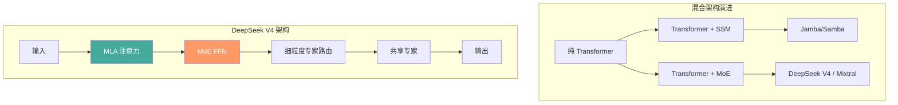
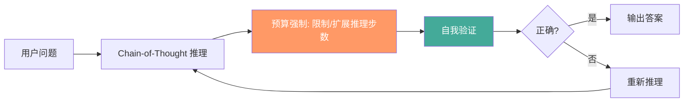
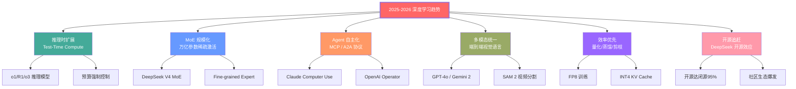

# 深度学习最新进展（2025-2026）

## 1. 架构创新

### 混合架构



- **Transformer + SSM 混合**：Jamba、Samba 等模型融合注意力和 Mamba
- **MoE 成为标准**：几乎所有前沿大模型（DeepSeek V4、Mixtral、Gemini）采用 MoE
- **DeepSeek 创新**：
  - **Multi-head Latent Attention (MLA)**：低秩压缩 KV Cache 90%+
  - **DeepSeekMoE**：细粒度专家 + 共享专家，激活参数效率高
  - **Auxiliary-Loss-Free Load Balancing**：无辅助损失的动态负载均衡

```python
# Flash Attention 伪代码 (V3 / FP8)
def flash_attention_v3(Q, K, V, block_size=128):
    """IO-aware tiled attention with FP8 compute"""
    b, h, n, d = Q.shape
    out = torch.zeros_like(Q)
    for row_start in range(0, n, block_size):
        row_end = min(row_start + block_size, n)
        Q_block = Q[:, :, row_start:row_end].to(torch.float8_e4m3fn)
        lse = torch.zeros(b, h, block_size, device=Q.device)
        for col_start in range(0, n, block_size):
            col_end = min(col_start + block_size, n)
            K_block = K[:, :, col_start:col_end].to(torch.float8_e4m3fn)
            V_block = V[:, :, col_start:col_end].to(torch.float8_e4m3fn)
            S = torch.matmul(Q_block, K_block.transpose(-2, -1)) / (d ** 0.5)
            m = S.max(-1, keepdim=True).values
            P = torch.exp(S - m)
            lse_new = torch.log(torch.exp(lse - m) + P.sum(-1, keepdim=True))
            out_block = torch.matmul(P.to(torch.float16), V_block.to(torch.float16))
            out[:, :, row_start:row_end] = \
                (torch.exp(lse - lse_new) * out[:, :, row_start:row_end]) + \
                (torch.exp(torch.log(P.sum(-1, keepdim=True)) + m - lse_new) * out_block)
            lse = lse_new
    return out

# MoE 路由 (简化)
class MoERouter(nn.Module):
    def __init__(self, d_model, n_experts, top_k=2):
        super().__init__()
        self.gate = nn.Linear(d_model, n_experts)
        self.top_k = top_k
        self.n_experts = n_experts

    def forward(self, x):
        logits = self.gate(x)
        top_k_logits, top_k_indices = logits.topk(self.top_k, dim=-1)
        return top_k_indices, F.softmax(top_k_logits, dim=-1)

class MoE(nn.Module):
    def __init__(self, d_model, d_ff, n_experts=8, top_k=2):
        super().__init__()
        self.router = MoERouter(d_model, n_experts, top_k)
        self.experts = nn.ModuleList([
            SwiGLUFFN(d_model, d_ff) for _ in range(n_experts)
        ])

    def forward(self, x):
        b, t, d = x.shape
        x_flat = x.view(-1, d)
        indices, weights = self.router(x_flat)
        out = torch.zeros_like(x_flat)
        for i, expert in enumerate(self.experts):
            mask = (indices == i).any(-1)
            if mask.any():
                idx = torch.where(mask)[0]
                expert_mask = (indices[idx] == i)
                expert_weights = weights[idx][expert_mask]
                expert_out = expert(x_flat[idx])
                out[idx] += expert_out * expert_weights.unsqueeze(-1)
        return out.view(b, t, d)
```

### 高效注意力

| 方法 | 复杂度 | KV Cache 节省 | 训练加速 | 推理加速 |
|------|--------|-------------|---------|---------|
| Flash Attention V1 | O(n²) 实际快 | - | 2-4× | - |
| Flash Attention V2 | O(n²) 实际快 | - | 2-3× | - |
| Flash Attention V3 | O(n²) FP8 | - | 3-5× | 2× |
| Multi-Query Attention | O(n·d) | 4× | 1.2× | 1.5× |
| Grouped Query Attention | O(n·d) | 2-8× | 1.1× | 1.3× |
| Multi-head Latent Attention | O(n·d) | 10-20× | - | 2-3× |
| 线性注意力 | O(n) | - | - | 适用于长序列 |

## 2. 训练技术

### 精度进化
- **BF16** → **FP8** → **FP4** 训练
- DeepSeek V4/V3 使用 FP8 训练全部模型
- **Muon 优化器**：DeepSeek V4 使用的正交化梯度

```python
# FP8 训练 (简化概念)
from torch.cuda.amp import autocast

class FP8Linear(nn.Module):
    def __init__(self, d_in, d_out):
        super().__init__()
        self.weight = nn.Parameter(torch.empty(d_out, d_in))

    def forward(self, x):
        w_fp8 = self.weight.to(torch.float8_e4m3fn)
        x_fp8 = x.to(torch.float8_e4m3fn)
        out = torch.matmul(x_fp8, w_fp8.t())
        return out.to(torch.bfloat16)
```

### 分布式训练
- **FP8 通信**：AllReduce 用 FP8 减少带宽
- **数据+模型+专家并行**：3D 并行成为训练标配
- **异步分布式**：减少同步开销

### 数据工程
- **高质量数据** > 模型规模（DeepSeek V4 强调数据质量）
- **数据去重 / 质量过滤**：FineWeb、DCLM、Dolma
- **合成数据**：Self-Play 生成训练数据（DeepSeek-R1 的强化学习）

## 3. 推理技术

### 推理时扩展（RoI / Test-Time Compute）



- **Chain-of-Thought + RL**：训练模型"多思考"（o1/R1 推理模型）
- **预算强制**：控制推理计算量（想多长/想多短）
- **验证者模型**：验证推理正确性

### 高效推理

| 技术 | 加速比 | 原理 | 适用 |
|------|--------|------|------|
| 推测解码 | 2-3× | 草稿模型 + 目标模型验证 | 自回归 LLM |
| PagedAttention | 吞吐 2-4× | 类虚拟内存 KV Cache | vLLM |
| Continuous Batching | 吞吐 2-3× | 动态批处理请求 | 在线服务 |
| KV Cache 量化 (INT4) | 显存 4× | INT4 量化 KV 缓存 | 长上下文 |
| Expert 并行 | 显存分散 | MoE 专家分配到不同 GPU | MoE 模型 |
| SpecInfer | 3-4× | 树状推测解码 | 批量推理 |

```python
# 推测解码 (简化伪代码)
def speculative_decoding(target_model, draft_model, prefix, max_new=256, gamma=5):
    generated = prefix
    while len(generated) < max_new:
        draft_tokens = []
        for _ in range(gamma):
            logits = draft_model(generated)
            next_tok = sample(logits[:, -1])
            generated = torch.cat([generated, next_tok], dim=-1)
            draft_tokens.append(next_tok)
        target_logits = target_model(generated)
        for i, draft_tok in enumerate(draft_tokens):
            if target_logits[0, -(gamma - i), :].argmax() != draft_tok:
                generated = generated[:, :-(gamma - i)]
                break
    return generated
```

## 4. 多模态与基础模型

| 领域 | 2025-2026 里程碑 | 代表模型 | 关键能力 |
|------|-----------------|---------|---------|
| 语言 | 万亿参数开源 | DeepSeek V4, LLaMA 4 | 推理, 长上下文 |
| 图像 | 通用视觉基础模型 | SAM 2, DINOv2 | 分割, 特征 |
| 视频 | 高保真视频生成 | Sora, Veo, Kling | 文生视频 |
| 语音 | 实时端到端 | GPT-4o, CosyVoice 2 | 语音对话 |
| 代码 | AI 编程全流程 | Cursor, Copilot, Codex CLI | 代码生成+debug |
| 机器人 | 通用操作模型 | RT-2, π0, Figure 02 | 物理世界交互 |
| 科学 | AI for Science | AlphaFold 3, GNoME | 蛋白质, 材料 |

## 5. 关键趋势总结



| 趋势 | 关键论文/技术 | 影响力 |
|------|-------------|--------|
| 推理时扩展 | OpenAI o1/r1、DeepSeek-R1 | 改变 LLM 范式 |
| MoE 规模化 | DeepSeek V4、Mixtral 8×22B | 万亿参数 LLM 可行 |
| 多模态统一 | GPT-4o、Gemini 2.0 | 单一模型处理所有模态 |
| 长上下文 | 1M+ token 上下文窗口 | 文档级理解/分析 |
| Agent 系统 | MCP、A2A、Computer Use | AI 从对话走向行动 |

## 6. 开源 vs 闭源

| 维度 | 闭源（GPT-4/Claude/Gemini）| 开源（LLaMA/DeepSeek/Qwen） |
|------|---------------------------|----------------------------|
| 能力 | 最强（多模态/推理） | 追赶中，差距缩小至 5% |
| 可控性 | 低 | 高（可本地部署/微调） |
| 成本 | 按 token 付费 | 自托管（长期低成本） |
| 生态 | API 生态丰富 | 社区活跃（HuggingFace） |
| 透明度 | 低（不公开权重） | 高（权重/数据/训练细节） |
| 推理模型 | 闭源（o1/o3） | 开源（DeepSeek-R1） |
| 多模态 | GPT-4o 领先 | LLaVA 等追赶 |
| 代码能力 | Claude 3.5 Sonnet 领先 | DeepSeek Coder 接近 |

- **2025 转折**：DeepSeek V4 开源后，开源能力达到闭源 95%+
- **开源推理模型**：DeepSeek-R1 开源推理链训练方法
- **开放权重模型**成为新标准（LLaMA 4, DeepSeek V4, Qwen 3）
