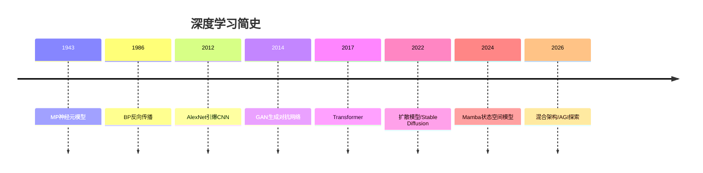

# 深度学习

## 概述

深度学习（Deep Learning）是机器学习的子领域，利用多层神经网络自动学习数据的分层特征表示。本模块覆盖从基础到前沿的完整知识体系。

## 目录

```
01-深度学习/
├── README.md              ← 当前：总览与架构图谱
├── 01-神经网络基础.md      # 感知机/BP/激活函数/初始化/正则化
├── 02-CNN卷积神经网络.md   # 卷积/池化/经典架构/目标检测/分割
├── 03-RNN与序列模型.md    # RNN/LSTM/GRU/双向RNN
├── 04-Transformer架构.md  # 自注意力/Multi-Head/位置编码/变体
├── 05-生成模型.md          # GAN/VAE/扩散模型/流模型
├── 06-图神经网络GNN.md     # GCN/GAT/消息传递/图分类
├── 07-模型训练与优化.md   # 优化器/正则化/学习率/分布式
└── 08-最新进展.md          # 状态空间模型/Mamba/混合架构
```

## 发展历程



## 连接主义 vs 符号主义

| 特性 | 深度学习 | 传统机器学习 |
|------|---------|-------------|
| 特征工程 | 自动学习 | 手动设计 |
| 数据需求 | 大量 | 中等 |
| 计算需求 | GPU/TPU | CPU 足够 |
| 可解释性 | 黑盒 | 较好 |
| 表示能力 | 极强 | 有限 |
