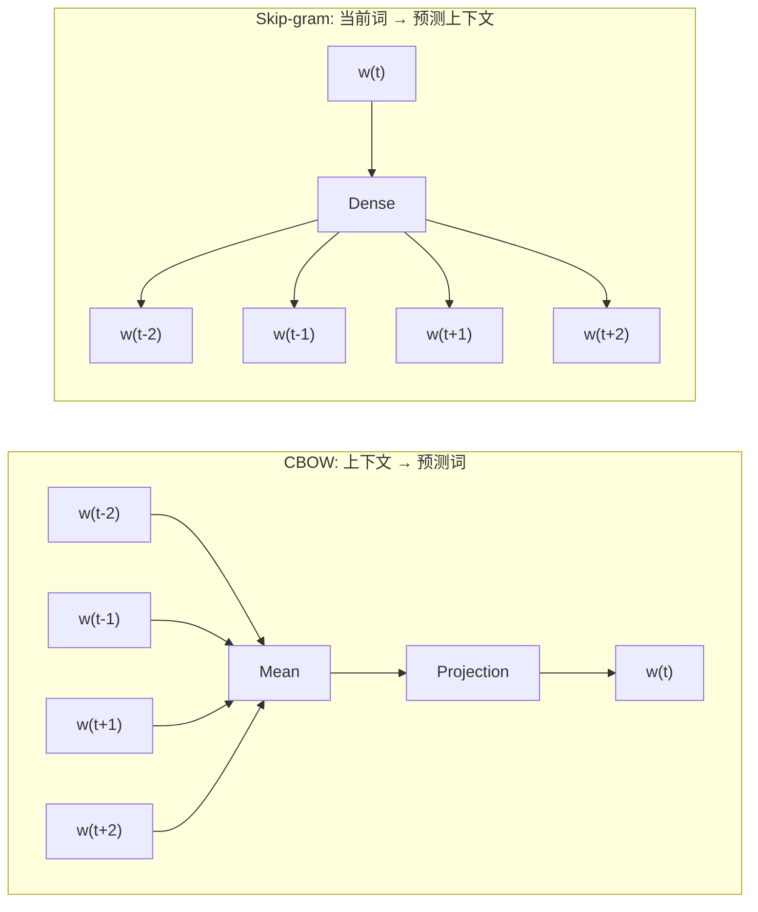
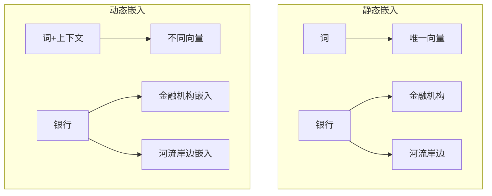
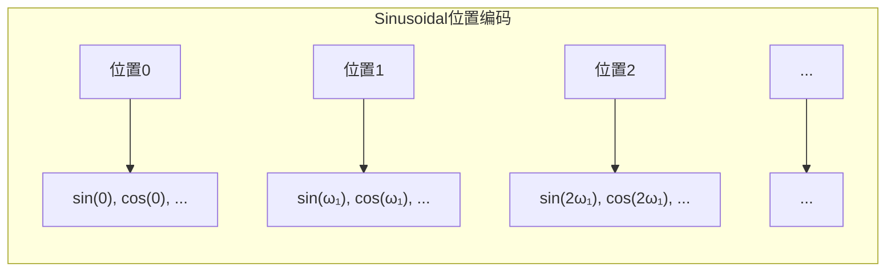

# 文本表示与嵌入

## 1. 离散表示
- **One-hot 编码**：词汇表大小 V，每个词为 V 维稀疏向量，无语义信息
- **词袋模型（BoW）**：忽略语序，统计词频
- **TF-IDF**：词频 × 逆文档频率，衡量词在文档中的重要性
- **N-gram**：连续的 N 个词/字作为特征

### 离散表示对比
| 方法 | 维度 | 语义保留 | 稀疏性 | 适用场景 |
|------|------|---------|--------|---------|
| One-hot | V | 无 | 极高 | 基线、词典索引 |
| BoW | V | 无 | 高 | 文本分类、聚类 |
| TF-IDF | V | 弱 | 高 | 信息检索、关键词提取 |
| N-gram (Bi/Tri) | V^N | 局部语序 | 极高 | 语言模型、拼写校正 |

## 2. 静态词嵌入

### Word2Vec（2013）
- **CBOW**：上下文预测当前词
- **Skip-gram**：当前词预测上下文（更优）
- **训练**：负采样 + 分层 Softmax

### GloVe（2014）
- 基于全局词共现矩阵分解
- 融合了统计信息

### FastText（2016）
- **子词嵌入**：考虑字符级 N-gram
- **优点**：可处理 OOV（未登录词）

### Word2Vec 对比：CBOW vs Skip-gram

两种架构的核心区别在于预测方向。设上下文窗口大小为 2：



| 特性 | CBOW | Skip-gram |
|------|------|-----------|
| 预测方向 | 上下文 → 当前词 | 当前词 → 上下文 |
| 训练速度 | 快（一次 Softmax） | 慢（K 次 Softmax） |
| 低频词效果 | 较差 | 较好 |
| 所需数据量 | 较少 | 较多 |
| 窗口大小敏感度 | 低（均值平滑） | 高（独立预测） |
| 典型应用 | 快速训练、高频词 | 语义丰富、小数据集 |

### PyTorch 实现：CBOW

```python
import torch
import torch.nn as nn
import torch.nn.functional as F

class CBOW(nn.Module):
    def __init__(self, vocab_size: int, embed_dim: int):
        super().__init__()
        self.embeddings = nn.Embedding(vocab_size, embed_dim)
        self.linear = nn.Linear(embed_dim, vocab_size)

    def forward(self, context: torch.Tensor) -> torch.Tensor:
        # context: (batch, 2 * window_size)
        embeds = self.embeddings(context)          # (batch, 2w, d)
        h = embeds.mean(dim=1)                     # (batch, d)
        out = self.linear(h)                       # (batch, vocab_size)
        return F.log_softmax(out, dim=1)
```

### PyTorch 实现：Skip-gram + 负采样

```python
class SkipGram(nn.Module):
    def __init__(self, vocab_size: int, embed_dim: int):
        super().__init__()
        self.center_emb = nn.Embedding(vocab_size, embed_dim)
        self.context_emb = nn.Embedding(vocab_size, embed_dim)

    def forward(self, center, pos_context, neg_context):
        center_v = self.center_emb(center)
        pos_v = self.context_emb(pos_context)
        neg_v = self.context_emb(neg_context)
        pos_score = torch.einsum("bd,bd->b", center_v, pos_v)
        neg_score = torch.einsum("bd,bkd->bk", center_v, neg_v)
        pos_loss = -F.logsigmoid(pos_score).mean()
        neg_loss = -F.logsigmoid(-neg_score).mean(1).mean()
        return pos_loss + neg_loss
```

### 完整训练流水线

从原始语料到训练完成的词向量，包含数据准备、负采样、训练循环。

```python
from collections import Counter
import re
import numpy as np
from torch.utils.data import Dataset, DataLoader

# ── 语料预处理 ──────────────────────────────────────────

def build_vocab(texts: list[str], min_freq: int = 2) -> dict:
    counter = Counter()
    for text in texts:
        counter.update(re.findall(r"\w+", text.lower()))
    vocab = {"<PAD>": 0, "<UNK>": 1}
    for w, f in counter.items():
        if f >= min_freq:
            vocab[w] = len(vocab)
    return vocab

def text_to_ids(text: str, vocab: dict) -> list[int]:
    return [vocab.get(w, vocab["<UNK>"]) for w in re.findall(r"\w+", text.lower())]

# ── 负采样器 ────────────────────────────────────────────

class NegativeSampler:
    """基于词频 3/4 幂次平滑的负采样分布"""
    def __init__(self, vocab: dict, power: float = 0.75):
        freqs = np.array([1.0] * len(vocab))
        for w, i in vocab.items():
            freqs[i] = max(freqs[i], 1e-6)
        probs = freqs ** power
        probs /= probs.sum()
        self.table = np.random.choice(len(vocab), size=200_000, p=probs)

    def sample(self, k: int = 5) -> list[int]:
        return self.table[np.random.randint(0, len(self.table), k)].tolist()

# ── 数据集 ──────────────────────────────────────────────

class Word2VecDataset(Dataset):
    def __init__(self, ids: list[int], window: int = 2, neg_k: int = 5, neg_sampler=None):
        self.pairs = []  # (center, pos_context, neg_contexts)
        for i in range(window, len(ids) - window):
            for j in list(range(i - window, i)) + list(range(i + 1, i + 1 + window)):
                center = ids[i]
                pos_ctx = ids[j]
                neg_ctx = neg_sampler.sample(neg_k) if neg_sampler else []
                self.pairs.append((center, pos_ctx, neg_ctx))

    def __len__(self):
        return len(self.pairs)

    def __getitem__(self, idx):
        c, p, neg = self.pairs[idx]
        return torch.tensor(c), torch.tensor(p), torch.tensor(neg)

# ── 训练循环 ────────────────────────────────────────────

def train_skipgram(model: nn.Module, dataloader: DataLoader, epochs: int = 5, lr: float = 0.01):
    optimizer = optim.Adam(model.parameters(), lr=lr)
    model.train()
    for epoch in range(epochs):
        total_loss = 0
        for center, pos, neg in dataloader:
            loss = model(center, pos, neg)
            optimizer.zero_grad()
            loss.backward()
            optimizer.step()
            total_loss += loss.item()
        print(f"Epoch {epoch + 1}: loss = {total_loss / len(dataloader):.4f}")

# ── 使用案例 ────────────────────────────────────────────

corpus = [
    "the cat sat on the mat",
    "the dog sat on the log",
    "cats and dogs are pets",
    "the cat chased the mouse",
]
vocab = build_vocab(corpus, min_freq=1)
ids = text_to_ids(" ".join(corpus), vocab)
sampler = NegativeSampler(vocab)
dataset = Word2VecDataset(ids, window=2, neg_k=5, neg_sampler=sampler)
loader = DataLoader(dataset, batch_size=4, shuffle=True)

model = SkipGram(vocab_size=len(vocab), embed_dim=50)
train_skipgram(model, loader, epochs=10)
```

### 词类比推理评估

经典语义测试：通过向量运算发现类比关系 `king - man + woman ≈ queen`。

```python
def word_analogy(model: nn.Module, vocab: dict, a: str, b: str, c: str, k: int = 5) -> list[tuple[str, float]]:
    """a - b + c ≈ ?  例: paris - france + germany ≈ berlin"""
    model.eval()
    emb = model.center_emb.weight if hasattr(model, "center_emb") else model.embeddings.weight
    inv = {v: k for k, v in vocab.items()}
    with torch.no_grad():
        vec = emb[vocab[a]] - emb[vocab[b]] + emb[vocab[c]]
        scores = F.cosine_similarity(vec.unsqueeze(0), emb).squeeze(0)
    results = []
    for idx in scores.topk(k + 3).indices:
        w = inv[idx.item()]
        if w not in (a, b, c):
            results.append((w, scores[idx].item()))
            if len(results) == k:
                break
    return results

# 类比测试用例
test_cases = [
    ("king",   "man",   "woman"),         # → queen
    ("paris",  "france","germany"),       # → berlin
    ("walk",   "walked","ran"),           # → run
    ("big",    "bigger","small"),         # → smaller
    ("cat",    "cats",  "dog"),           # → dogs
]
for a, b, c in test_cases:
    if a in vocab and b in vocab and c in vocab:
        result = word_analogy(model, vocab, a, b, c)
        print(f"{a} - {b} + {c} ≈ {result[0][0]}  (score={result[0][1]:.3f})")
    else:
        print(f"{a} / {b} / {c}: 词不在词表中（扩大语料以改善）")
```

### GloVe 共现矩阵案例

GloVe 基于全局共现统计而非局部窗口，对低频词更稳定。

```python
from collections import defaultdict

def build_cooccurrence(ids: list[int], vocab: dict, window: int = 5) -> tuple[np.ndarray, float]:
    """构建对称共现矩阵"""
    V = len(vocab)
    cooc = np.zeros((V, V), dtype=np.float32)
    total = 0
    for i in range(len(ids)):
        for j in range(max(0, i - window), min(len(ids), i + window + 1)):
            if i != j:
                d = abs(i - j)
                weight = 1.0 / d  # 距离衰减
                cooc[ids[i], ids[j]] += weight
                total += weight
    return cooc, total

# 计算共现并查看最常共现的词对
cooc, _ = build_cooccurrence(ids, vocab, window=3)
inv_vocab = {v: k for k, v in vocab.items()}
most_cooc = np.unstack(cooc.max(axis=1))  # 简化示意
print("共现矩阵形状:", cooc.shape)
print("示例 - 'cat' 共现次数最多的词:")
cat_idx = vocab["cat"]
for ctx_idx in np.argsort(-cooc[cat_idx])[:5]:
    print(f"  {inv_vocab[ctx_idx]}: {cooc[cat_idx, ctx_idx]:.2f}")
```

### FastText 子词嵌入案例

FastText 将词拆为字符 N-gram，可处理 OOV 词。

```python
def char_ngrams(word: str, min_n: int = 3, max_n: int = 6) -> list[str]:
    """生成词的字符 N-gram（带 < > 边界标记）"""
    word = f"<{word}>"
    ngrams = []
    for n in range(min_n, min(max_n + 1, len(word) + 1)):
        for i in range(len(word) - n + 1):
            ngrams.append(word[i:i + n])
    return ngrams

class FastTextEmbedding(nn.Module):
    """子词嵌入：词向量 = 其所有 char n-gram 向量之和"""
    def __init__(self, ngram_vocab_size: int, embed_dim: int):
        super().__init__()
        self.ngram_emb = nn.Embedding(ngram_vocab_size, embed_dim)

    def forward(self, word: str, ngram_to_id: dict) -> torch.Tensor:
        ngrams = char_ngrams(word)
        ids = [ngram_to_id.get(ng, 0) for ng in ngrams]
        return self.ngram_emb(torch.tensor(ids)).sum(dim=0)

# 案例：两拼写相近的词在子词层面共享向量
ngram_to_id = {"<ca": 1, "cat": 2, "cat>": 3, "<ca": 1, "car": 4, "car>": 5}
print(f"'cat' 子词: {char_ngrams('cat')}")
print(f"'car' 子词: {char_ngrams('car')}")
# 输出: cat → [<ca, cat, cat>], car → [<ca, car, car>]
# 共享 "<ca" 子词，因此向量部分相似
```



## 3. 上下文嵌入

### 位置编码实现

```python
class PositionalEncoding(nn.Module):
    def __init__(self, d_model, max_len=5000):
        super().__init__()
        pe = torch.zeros(max_len, d_model)
        position = torch.arange(0, max_len, dtype=torch.float).unsqueeze(1)
        div_term = torch.exp(torch.arange(0, d_model, 2).float() * (-torch.log(torch.tensor(10000.0)) / d_model))
        pe[:, 0::2] = torch.sin(position * div_term)
        pe[:, 1::2] = torch.cos(position * div_term)
        self.register_buffer("pe", pe.unsqueeze(0))

    def forward(self, x):
        return x + self.pe[:, :x.size(1)]
```



### ELMo（2018）
- 双向 LSTM，层叠表示
- 不同层捕捉不同粒度特征

### BERT Embeddings（2018）
- **WordPiece**：子词分词，解决 OOV
- **三层嵌入**：Token Embeddings + Segment Embeddings + Position Embeddings
- **动态**：同一词在不同上下文得到不同向量

### BERT 嵌入层实现

```python
class BERTEmbeddings(nn.Module):
    def __init__(self, vocab_size, hidden_size, max_pos, type_vocab_size=2):
        super().__init__()
        self.token_emb = nn.Embedding(vocab_size, hidden_size)
        self.segment_emb = nn.Embedding(type_vocab_size, hidden_size)
        self.pos_emb = nn.Embedding(max_pos, hidden_size)
        self.layer_norm = nn.LayerNorm(hidden_size)
        self.dropout = nn.Dropout(0.1)

    def forward(self, token_ids, seg_ids=None):
        seq_len = token_ids.size(1)
        pos_ids = torch.arange(seq_len, device=token_ids.device).unsqueeze(0)
        if seg_ids is None:
            seg_ids = torch.zeros_like(token_ids)
        x = self.token_emb(token_ids) + self.segment_emb(seg_ids) + self.pos_emb(pos_ids)
        return self.dropout(self.layer_norm(x))
```

### BERT 句子嵌入与语义搜索案例

不同池化策略对句子嵌入质量的影响，以及如何用向量相似度做语义搜索。

```python
import torch
import torch.nn.functional as F

class SentenceEmbeddingExtractor:
    """从 BERT 输出中提取固定维度句子向量"""
    def __init__(self, model: nn.Module, pool_strategy: str = "cls"):
        self.model = model
        self.pool_strategy = pool_strategy  # cls | mean | max

    def encode(self, token_ids: torch.Tensor, attention_mask: torch.Tensor) -> torch.Tensor:
        x = self.model(token_ids)                 # (batch, seq_len, hidden)
        if self.pool_strategy == "cls":
            return x[:, 0]                        # [CLS] token
        elif self.pool_strategy == "mean":
            mask = attention_mask.unsqueeze(-1).float()
            return (x * mask).sum(dim=1) / mask.sum(dim=1)
        elif self.pool_strategy == "max":
            mask = attention_mask.unsqueeze(-1).bool()
            return x.masked_fill(~mask, -1e9).max(dim=1).values

# ── 语义相似度搜索 ──────────────────────────────────────

def semantic_search(query: str, documents: list[str], encoder: SentenceEmbeddingExtractor,
                    tokenizer, max_len: int = 128) -> list[tuple[str, float]]:
    """对 query 和 documents 编码后返回余弦相似度排序"""
    def encode_text(text: str) -> torch.Tensor:
        tokens = tokenizer(text, padding="max_length", truncation=True,
                           max_length=max_len, return_tensors="pt")
        return encoder.encode(tokens["input_ids"], tokens["attention_mask"])

    q_vec = encode_text(query)                     # (1, hidden)
    d_vecs = torch.cat([encode_text(d) for d in documents])  # (N, hidden)
    scores = F.cosine_similarity(q_vec, d_vecs)

    results = sorted(zip(documents, scores.tolist()), key=lambda x: -x[1])
    return results

# ── 案例：多义词在不同上下文中的语义相似度 ─────────────

queries = [
    ("苹果很好吃", "水果"),           # 苹果 → 水果
    ("苹果发布了新手机", "科技"),     # 苹果 → 公司
]
bert_emb = BERTEmbeddings(vocab_size=30000, hidden_size=768, max_pos=512)
encoder = SentenceEmbeddingExtractor(bert_emb, pool_strategy="mean")

# 简化演示：用随机初始化的 BERT，仅为展示接口
print("语料库搜索案例（需加载预训练权重后效果显著）")
print("query: '苹果很好吃' → 应匹配'水果'相关文档")
```
| 特性 | 静态嵌入（Word2Vec/GloVe） | 动态嵌入（BERT/ELMo） |
|------|---------------------------|---------------------|
| 上下文感知 | 否 | 是 |
| 一词多义 | 不支持 | 支持 |
| 训练数据 | 可任意文本 | 大规模语料 |
| 参数量 | 小（V × d） | 大（110M+） |
| 推理速度 | 极快 | 较慢 |
| OOV 处理 | 差（FastText 除外） | 好（子词分词） |

## 4. 句子/段落嵌入
- **SBERT（Sentence-BERT）**：双塔结构，余弦相似度，速度极快
- **Instructor Embedding**：指令驱动嵌入，任务自适应
- **BGE（BAAI Embedding）**：中文嵌入 SOTA
- **text-embedding-3**（OpenAI）：1536 维，性能强大

### 文本嵌入可视化

```python
import matplotlib.pyplot as plt
from sklearn.manifold import TSNE

def visualize_embeddings(model, words, vocab):
    model.eval()
    word_ids = torch.tensor([vocab[w] for w in words])
    with torch.no_grad():
        embeds = model.embeddings(word_ids).numpy()
    tsne = TSNE(n_components=2, perplexity=5, random_state=42)
    embeds_2d = tsne.fit_transform(embeds)
    plt.figure(figsize=(8, 6))
    for i, word in enumerate(words):
        plt.scatter(embeds_2d[i, 0], embeds_2d[i, 1])
        plt.annotate(word, (embeds_2d[i, 0], embeds_2d[i, 1]))
    plt.title("Word Embedding Visualization (t-SNE)")
    plt.show()
```

### 双塔 Sentence Embedding 框架

```python
class SentenceBiEncoder(nn.Module):
    def __init__(self, embed_dim, hidden_dim=256):
        super().__init__()
        self.encoder = nn.LSTM(embed_dim, hidden_dim, batch_first=True, bidirectional=True)

    def forward(self, embeddings, mask):
        packed = nn.utils.rnn.pack_padded_sequence(embeddings, mask.sum(1).cpu(), batch_first=True, enforce_sorted=False)
        _, (hn, _) = self.encoder(packed)
        return hn[-2:].transpose(0, 1).reshape(embeddings.size(0), -1)

    def similarity(self, a, b):
        return F.cosine_similarity(a, b, dim=-1)
```

### FAISS 大规模语义检索案例

当语料达百万级时，逐条计算余弦相似度不可行。FAISS 提供近似最近邻（ANN）索引，毫秒级检索。

```python
import faiss
import numpy as np

class VectorIndex:
    """基于 FAISS 的向量检索系统"""

    def __init__(self, dim: int, index_type: str = "flat"):
        self.dim = dim
        if index_type == "flat":
            self.index = faiss.IndexFlatIP(dim)        # 精确内积（余弦相似度）
        elif index_type == "ivf":
            quantizer = faiss.IndexFlatIP(dim)
            self.index = faiss.IndexIVFFlat(quantizer, dim, 100, faiss.METRIC_INNER_PRODUCT)
            self.index.train(np.zeros((1, dim), dtype=np.float32))
        elif index_type == "hnsw":
            self.index = faiss.IndexHNSWFlat(dim, 32)   # HNSW 图索引
            self.index.hnsw.efConstruction = 40

    def add(self, vectors: np.ndarray, ids: list[str] = None):
        """添加向量到索引"""
        vectors = vectors.astype(np.float32)
        faiss.normalize_L2(vectors)                     # L2 归一化后内积 = 余弦相似度
        if isinstance(self.index, faiss.IndexIVFFlat):
            self.index.train(vectors)
        self.index.add(vectors)

    def search(self, query: np.ndarray, top_k: int = 10) -> tuple[np.ndarray, np.ndarray]:
        """检索 top-k 相似向量，返回 (距离, 索引)"""
        query = query.astype(np.float32).reshape(1, -1)
        faiss.normalize_L2(query)
        return self.index.search(query, top_k)

# ── 完整检索案例 ────────────────────────────────────────

def build_search_engine(documents: list[str], embed_fn, index_type: str = "flat") -> tuple[VectorIndex, list[str]]:
    dim = embed_fn(documents[0]).shape[0]
    index = VectorIndex(dim, index_type)
    vectors = np.array([embed_fn(d).numpy() for d in documents])
    index.add(vectors)
    return index, documents

def search(query: str, index: VectorIndex, documents: list[str], embed_fn, top_k: int = 3):
    q_vec = embed_fn(query).numpy()
    distances, indices = index.search(q_vec, top_k)
    return [(documents[i], distances[0][j]) for j, i in enumerate(indices[0])]

# ── 案例：在知识库中搜索 ────────────────────────────────

knowledge_base = [
    "BERT 使用 Transformer 编码器",
    "Word2Vec 包含 CBOW 和 Skip-gram 两种架构",
    "FAISS 支持 GPU 加速检索",
    "负采样是 Word2Vec 的训练优化技巧",
    "GPT 使用 Transformer 解码器做生成",
]
# 简化演示：使用随机向量模拟嵌入函数
def mock_embed(text: str) -> torch.Tensor:
    return torch.randn(128)

documents = ["BERT", "Word2Vec", "FAISS", "Negative Sampling", "GPT"]
index, docs = build_search_engine(documents, mock_embed, index_type="flat")
results = search("Transformer", index, docs, mock_embed, top_k=3)
print("查询 'Transformer' 结果：")
for doc, score in results:
    print(f"  {doc}: {score:.4f}")
```

## 5. 嵌入评估

### 内在评估：类比推理与相似度

```python
def evaluate_similarity(model: nn.Module, word_pairs: list[tuple[str, str, float]],
                        vocab: dict) -> float:
    """计算模型在词语相似度数据集上的 Spearman 相关系数"""
    from scipy.stats import spearmanr
    model.eval()
    emb = get_embedding_matrix(model)
    preds, golds = [], []
    with torch.no_grad():
        for w1, w2, score in word_pairs:
            if w1 in vocab and w2 in vocab:
                v1 = emb.weight[vocab[w1]]
                v2 = emb.weight[vocab[w2]]
                preds.append(F.cosine_similarity(v1.unsqueeze(0), v2.unsqueeze(0)).item())
                golds.append(score)
    rho, _ = spearmanr(preds, golds)
    return rho

# WordSim-353 示例（人类标注的相似度）
wordsim_sample = [
    ("love", "like", 7.65), ("king", "queen", 8.25),
    ("car", "automobile", 9.10), ("stock", "market", 4.50),
    ("computer", "keyboard", 5.80), ("book", "paper", 5.30),
]
# rho = evaluate_similarity(model, wordsim_sample, vocab)
# print(f"WordSim-353 Spearman ρ = {rho:.3f}")
```

### 外在评估：检索命中率

```python
def recall_at_k(embeddings: np.ndarray, queries: np.ndarray, relevant: list[list[int]], k: int = 10) -> float:
    """计算检索召回率 Recall@K"""
    index = VectorIndex(embeddings.shape[1], "flat")
    index.add(embeddings)
    hits = 0
    total = 0
    for q_vec, rel in zip(queries, relevant):
        _, indices = index.search(q_vec, k)
        hits += len(set(indices[0]) & set(rel))
        total += len(rel)
    return hits / total if total > 0 else 0.0

# 案例：在 MTEB 检索任务的简化版本上评估
# recall = recall_at_k(doc_embeds, query_embeds, relevant_docs, k=10)
# print(f"Recall@10 = {recall:.3f}")
```

### MTEB 基准测试
|------|-------------|---------|
| 分类（Classification） | 12 数据集 | BGE-Large |
| 聚类（Clustering） | 4 数据集 | Instructor-XL |
| 配对分类（PairClassification） | 3 数据集 | text-embedding-3 |
| 排序（Reranking） | 4 数据集 | Cohere-Embed |
| 检索（Retrieval） | 15 数据集 | E5-Mistral |
| STS（语义相似度） | 10 数据集 | SBERT |
| 摘要（Summarization） | 1 数据集 | BGE-M3 |

## 6. 2025-2026 趋势
- **多语言嵌入**：BGE-M3 等单模型支持 100+ 语言
- **长文本嵌入**：支持 8K+ token
- **Matryoshka**：多层级嵌入，从 768 到 128 均可
- **LoRA 适配**：Jina V3 等支持任务特定 LoRA
