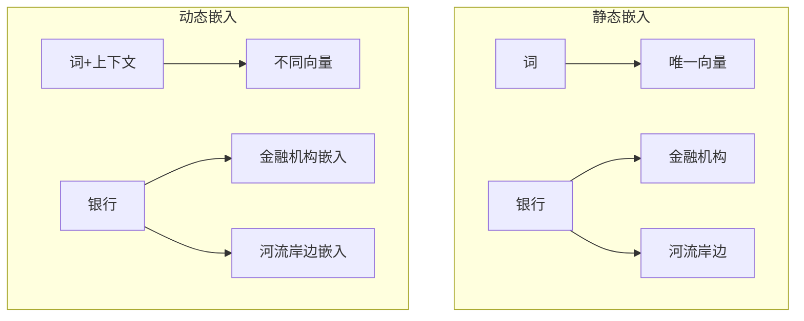

# 文本表示与嵌入

## 1. 离散表示
- **One-hot 编码**：词汇表大小 V，每个词为 V 维稀疏向量，无语义信息
- **词袋模型（BoW）**：忽略语序，统计词频
- **TF-IDF**：词频 × 逆文档频率，衡量词在文档中的重要性
- **N-gram**：连续的 N 个词/字作为特征

### 离散表示对比
| 方法 | 维度 | 语义保留 | 稀疏性 | 适用场景 |
|------|------|---------|--------|---------|
| One-hot | V | 无 | 极高 | 基线、词典索引 |
| BoW | V | 无 | 高 | 文本分类、聚类 |
| TF-IDF | V | 弱 | 高 | 信息检索、关键词提取 |
| N-gram (Bi/Tri) | V^N | 局部语序 | 极高 | 语言模型、拼写校正 |

## 2. 静态词嵌入

### Word2Vec（2013）
- **CBOW**：上下文预测当前词
- **Skip-gram**：当前词预测上下文（更优）
- **训练**：负采样 + 分层 Softmax

### GloVe（2014）
- 基于全局词共现矩阵分解
- 融合了统计信息

### FastText（2016）
- **子词嵌入**：考虑字符级 N-gram
- **优点**：可处理 OOV（未登录词）

### Word2Vec 对比：CBOW vs Skip-gram

```mermaid
graph LR
    subgraph CBOW
    A1[w_{t-2}] --> D[SUM]
    A2[w_{t-1}] --> D
    A3[w_{t+1}] --> D
    A4[w_{t+2}] --> D
    D --> E[Softmax]
    E --> F[w_t]
    end
    subgraph Skip-gram
    G[w_t] --> H[Dense]
    H --> I1[Softmax] --> J1[w_{t-2}]
    H --> I2[Softmax] --> J2[w_{t-1}]
    H --> I3[Softmax] --> J3[w_{t+1}]
    H --> I4[Softmax] --> J4[w_{t+2}]
    end
```

| 特性 | CBOW | Skip-gram |
|------|------|-----------|
| 预测方向 | 上下文 → 当前词 | 当前词 → 上下文 |
| 训练速度 | 快 | 慢（K 个预测） |
| 低频词效果 | 较差 | 较好 |
| 所需数据量 | 较少 | 较多 |
| 窗口大小敏感度 | 低 | 高 |
| 典型应用 | 快速训练、高频词 | 语义丰富、小数据集 |

### PyTorch 实现：CBOW

```python
import torch
import torch.nn as nn
import torch.nn.functional as F

class CBOW(nn.Module):
    def __init__(self, vocab_size, embed_dim):
        super().__init__()
        self.embeddings = nn.Embedding(vocab_size, embed_dim)
        self.linear = nn.Linear(embed_dim, vocab_size)

    def forward(self, context):
        embeds = self.embeddings(context)
        h = embeds.mean(dim=1)
        out = self.linear(h)
        return F.log_softmax(out, dim=1)
```

### PyTorch 实现：Skip-gram + 负采样

```python
class SkipGram(nn.Module):
    def __init__(self, vocab_size, embed_dim):
        super().__init__()
        self.center_emb = nn.Embedding(vocab_size, embed_dim)
        self.context_emb = nn.Embedding(vocab_size, embed_dim)

    def forward(self, center, pos_context, neg_context):
        center_v = self.center_emb(center)
        pos_v = self.context_emb(pos_context)
        neg_v = self.context_emb(neg_context)
        pos_score = torch.einsum("bd,bd->b", center_v, pos_v)
        neg_score = torch.einsum("bd,bkd->bk", center_v, neg_v)
        pos_loss = -F.logsigmoid(pos_score).mean()
        neg_loss = -F.logsigmoid(-neg_score).mean(1).mean()
        return pos_loss + neg_loss
```



## 3. 上下文嵌入

### 位置编码实现

```python
class PositionalEncoding(nn.Module):
    def __init__(self, d_model, max_len=5000):
        super().__init__()
        pe = torch.zeros(max_len, d_model)
        position = torch.arange(0, max_len, dtype=torch.float).unsqueeze(1)
        div_term = torch.exp(torch.arange(0, d_model, 2).float() * (-torch.log(torch.tensor(10000.0)) / d_model))
        pe[:, 0::2] = torch.sin(position * div_term)
        pe[:, 1::2] = torch.cos(position * div_term)
        self.register_buffer("pe", pe.unsqueeze(0))

    def forward(self, x):
        return x + self.pe[:, :x.size(1)]
```

```mermaid
graph LR
    subgraph Sinusoidal位置编码
    A[位置0] --> B[sin(0), cos(0), ...]
    C[位置1] --> D[sin(ω₁), cos(ω₁), ...]
    E[位置2] --> F[sin(2ω₁), cos(2ω₁), ...]
    G[...] --> H[...]
    end
```

### ELMo（2018）
- 双向 LSTM，层叠表示
- 不同层捕捉不同粒度特征

### BERT Embeddings（2018）
- **WordPiece**：子词分词，解决 OOV
- **三层嵌入**：Token Embeddings + Segment Embeddings + Position Embeddings
- **动态**：同一词在不同上下文得到不同向量

### BERT 嵌入层实现

```python
class BERTEmbeddings(nn.Module):
    def __init__(self, vocab_size, hidden_size, max_pos, type_vocab_size=2):
        super().__init__()
        self.token_emb = nn.Embedding(vocab_size, hidden_size)
        self.segment_emb = nn.Embedding(type_vocab_size, hidden_size)
        self.pos_emb = nn.Embedding(max_pos, hidden_size)
        self.layer_norm = nn.LayerNorm(hidden_size)
        self.dropout = nn.Dropout(0.1)

    def forward(self, token_ids, seg_ids=None):
        seq_len = token_ids.size(1)
        pos_ids = torch.arange(seq_len, device=token_ids.device).unsqueeze(0)
        if seg_ids is None:
            seg_ids = torch.zeros_like(token_ids)
        x = self.token_emb(token_ids) + self.segment_emb(seg_ids) + self.pos_emb(pos_ids)
        return self.dropout(self.layer_norm(x))
```

### 静态 vs 动态嵌入对比
| 特性 | 静态嵌入（Word2Vec/GloVe） | 动态嵌入（BERT/ELMo） |
|------|---------------------------|---------------------|
| 上下文感知 | 否 | 是 |
| 一词多义 | 不支持 | 支持 |
| 训练数据 | 可任意文本 | 大规模语料 |
| 参数量 | 小（V × d） | 大（110M+） |
| 推理速度 | 极快 | 较慢 |
| OOV 处理 | 差（FastText 除外） | 好（子词分词） |

## 4. 句子/段落嵌入
- **SBERT（Sentence-BERT）**：双塔结构，余弦相似度，速度极快
- **Instructor Embedding**：指令驱动嵌入，任务自适应
- **BGE（BAAI Embedding）**：中文嵌入 SOTA
- **text-embedding-3**（OpenAI）：1536 维，性能强大

### 文本嵌入可视化

```python
import matplotlib.pyplot as plt
from sklearn.manifold import TSNE

def visualize_embeddings(model, words, vocab):
    model.eval()
    word_ids = torch.tensor([vocab[w] for w in words])
    with torch.no_grad():
        embeds = model.embeddings(word_ids).numpy()
    tsne = TSNE(n_components=2, perplexity=5, random_state=42)
    embeds_2d = tsne.fit_transform(embeds)
    plt.figure(figsize=(8, 6))
    for i, word in enumerate(words):
        plt.scatter(embeds_2d[i, 0], embeds_2d[i, 1])
        plt.annotate(word, (embeds_2d[i, 0], embeds_2d[i, 1]))
    plt.title("Word Embedding Visualization (t-SNE)")
    plt.show()
```

### 双塔 Sentence Embedding 框架

```python
class SentenceBiEncoder(nn.Module):
    def __init__(self, embed_dim, hidden_dim=256):
        super().__init__()
        self.encoder = nn.LSTM(embed_dim, hidden_dim, batch_first=True, bidirectional=True)

    def forward(self, embeddings, mask):
        packed = nn.utils.rnn.pack_padded_sequence(embeddings, mask.sum(1).cpu(), batch_first=True, enforce_sorted=False)
        _, (hn, _) = self.encoder(packed)
        return hn[-2:].transpose(0, 1).reshape(embeddings.size(0), -1)

    def similarity(self, a, b):
        return F.cosine_similarity(a, b, dim=-1)
```

## 5. 嵌入评估
- **类比推理**：king - man + woman ≈ queen
- **相似度**：WordSim-353、SimLex-999
- **MTEB**：大规模文本嵌入基准，2024 标准

| 任务 | MTEB 基准测试 | 代表模型 |
|------|-------------|---------|
| 分类（Classification） | 12 数据集 | BGE-Large |
| 聚类（Clustering） | 4 数据集 | Instructor-XL |
| 配对分类（PairClassification） | 3 数据集 | text-embedding-3 |
| 排序（Reranking） | 4 数据集 | Cohere-Embed |
| 检索（Retrieval） | 15 数据集 | E5-Mistral |
| STS（语义相似度） | 10 数据集 | SBERT |
| 摘要（Summarization） | 1 数据集 | BGE-M3 |

## 6. 2025-2026 趋势
- **多语言嵌入**：BGE-M3 等单模型支持 100+ 语言
- **长文本嵌入**：支持 8K+ token
- **Matryoshka**：多层级嵌入，从 768 到 128 均可
- **LoRA 适配**：Jina V3 等支持任务特定 LoRA
