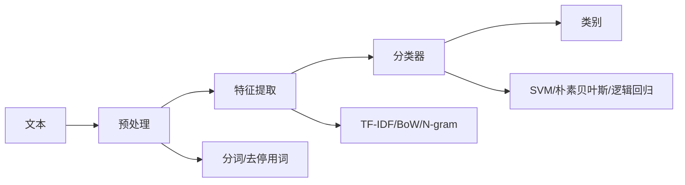
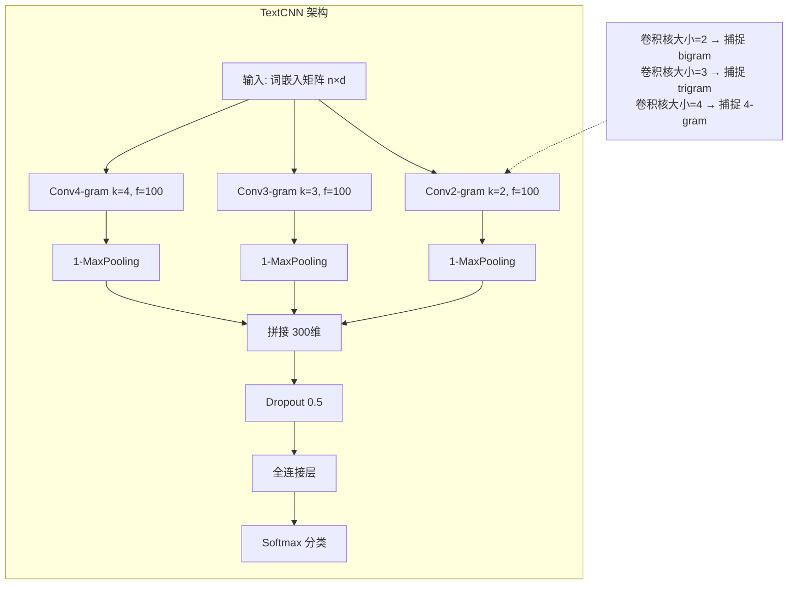

# 文本分类与情感分析

## 1. 文本分类概述

### 任务定义
- **二分类**：垃圾邮件检测、正负面情感
- **多分类**：新闻分类、意图识别
- **多标签分类**：属性识别、标签推荐
- **层次分类**：大类→小类的树形结构

### 分类类型对比
| 类型 | 输出形式 | 损失函数 | 示例 |
|------|---------|---------|------|
| 二分类 | 1 个 sigmoid | BCELoss | 正面/负面 |
| 多分类 | K 个 softmax | CrossEntropyLoss | 体育/财经/科技 |
| 多标签 | K 个 sigmoid | BCEWithLogitsLoss | 喜剧+动作+爱情 |
| 层次分类 | 树形路径 | 层级 Softmax | 动物→哺乳动物→狗 |

## 2. 传统方法

### 特征 + 分类器



### 常用分类器
| 分类器 | 优点 | 缺点 |
|-------|------|------|
| 朴素贝叶斯 | 快速，小样本好 | 特征独立假设强 |
| SVM | 高维有效 | 调参复杂 |
| 逻辑回归 | 可解释性好 | 线性边界 |
| XGBoost | 特征交互好 | 高维稀疏效果差 |

## 3. 深度学习方法

### FastText（2016）
- 词向量平均 + 层次 Softmax
- 子词 N-gram 处理 OOV
- 极快，适合大规模分类

### PyTorch 实现：FastText

```python
class FastText(nn.Module):
    def __init__(self, vocab_size, embed_dim, num_classes, ngram_vocab_size=0):
        super().__init__()
        self.word_emb = nn.EmbeddingBag(vocab_size, embed_dim, mode="mean")
        self.ngram_emb = nn.EmbeddingBag(ngram_vocab_size, embed_dim, mode="mean") if ngram_vocab_size else None
        self.fc = nn.Linear(embed_dim, num_classes)

    def forward(self, words, ngrams=None):
        h = self.word_emb(words)
        if ngrams is not None and self.ngram_emb is not None:
            h = h + self.ngram_emb(ngrams)
        return self.fc(h)
```

### TextCNN（2015）
- 多尺度卷积核（2/3/4-gram）捕捉 n-gram 特征
- 最大池化 → 拼接 → 全连接分类

### PyTorch 实现：TextCNN

```python
class TextCNN(nn.Module):
    def __init__(self, vocab_size, embed_dim, num_classes, kernel_sizes=(2, 3, 4), num_filters=100):
        super().__init__()
        self.embedding = nn.Embedding(vocab_size, embed_dim)
        self.convs = nn.ModuleList([
            nn.Conv1d(embed_dim, num_filters, k, padding=k - 1) for k in kernel_sizes
        ])
        self.dropout = nn.Dropout(0.5)
        self.fc = nn.Linear(len(kernel_sizes) * num_filters, num_classes)

    def forward(self, x):
        x = self.embedding(x).permute(0, 2, 1)
        conv_out = [F.relu(conv(x)).max(dim=-1)[0] for conv in self.convs]
        cat = torch.cat(conv_out, dim=1)
        return self.fc(self.dropout(cat))
```



### BiLSTM + Attention

### PyTorch 实现：BiLSTM-Attention

```python
class BiLSTM_Attention(nn.Module):
    def __init__(self, vocab_size, embed_dim, hidden_dim, num_classes, num_layers=2):
        super().__init__()
        self.embedding = nn.Embedding(vocab_size, embed_dim)
        self.lstm = nn.LSTM(embed_dim, hidden_dim, num_layers, bidirectional=True, batch_first=True, dropout=0.3)
        self.attn = nn.Linear(hidden_dim * 2, 1)
        self.fc = nn.Linear(hidden_dim * 2, num_classes)
        self.dropout = nn.Dropout(0.3)

    def forward(self, x, mask=None):
        x = self.dropout(self.embedding(x))
        out, _ = self.lstm(x)
        scores = self.attn(out).squeeze(-1)
        if mask is not None:
            scores = scores.masked_fill(~mask.bool(), -1e9)
        attn_weights = F.softmax(scores, dim=1).unsqueeze(1)
        context = torch.bmm(attn_weights, out).squeeze(1)
        return self.fc(context)
```

### BERT / RoBERTa 微调
- **[CLS] Token** 表示整句信息
- 微调所有层或仅顶部
- 2020 年后 SOTA，全面超越非预训练方法

### BERT 微调伪代码

```python
class BERTForClassification(nn.Module):
    def __init__(self, bert_model, num_classes, freeze_bert=False):
        super().__init__()
        self.bert = bert_model
        self.dropout = nn.Dropout(0.1)
        self.classifier = nn.Linear(768, num_classes)
        if freeze_bert:
            for p in self.bert.parameters():
                p.requires_grad = False

    def forward(self, input_ids, attn_mask, token_type_ids=None):
        out = self.bert(input_ids, attention_mask=attn_mask, token_type_ids=token_type_ids)
        cls_token = out.last_hidden_state[:, 0, :]
        return self.classifier(self.dropout(cls_token))
```

### 深度方法对比
| 模型 | 参数量 | 速度 | OOV 处理 | 小样本 | 语义理解 |
|------|-------|------|---------|-------|---------|
| FastText | 极小 | 极快 | 好（子词） | 好 | 弱 |
| TextCNN | 小 | 快 | 差 | 中 | 中 |
| BiLSTM-Attn | 中 | 中 | 差 | 中 | 较好 |
| BERT 微调 | 大 | 慢 | 好 | 差 | 强 |
| LLM Prompt | 极大 | 慢 | 好 | 极好 | 最强 |

## 4. 情感分析详解

### 粒度划分
| 粒度 | 任务 | 示例 |
|------|------|------|
| 文档级 | 整体情感 | 影评正面/负面 |
| 句子级 | 单句情感 | "电池续航很好"→正面 |
| 方面级 ABSA | 属性级情感 | "价格合理但质量差" |
| 细粒度 | 情感强度 | 1-5 星评分 |

### ABSA（Aspect-Based Sentiment Analysis）
- **方面提取**：从评论中提取属性词（价格/质量/服务）
- **情感分类**：对每个属性分类（正面/中性/负面）
- **模型**：BERT + CRF 提取 + 注意力分类

### ABSA 简化实现

```python
class ABSAModel(nn.Module):
    def __init__(self, bert_model, num_aspects, num_sentiments=3):
        super().__init__()
        self.bert = bert_model
        self.aspect_extractor = nn.Linear(768, num_aspects)
        self.sentiment_cls = nn.Linear(768 * 2, num_sentiments)

    def forward(self, input_ids, attn_mask):
        out = self.bert(input_ids, attention_mask=attn_mask).last_hidden_state
        aspect_logits = self.aspect_extractor(out)
        aspect_ids = aspect_logits.argmax(-1)
        aspect_mask = (aspect_ids > 0).float().unsqueeze(-1)
        aspect_repr = (out * aspect_mask).sum(dim=1) / aspect_mask.sum(dim=1).clamp(min=1)
        sent_logits = self.sentiment_cls(torch.cat([out[:, 0], aspect_repr], dim=-1))
        return aspect_logits, sent_logits
```

### 情感资源
- **词典**：SentiWordNet、HowNet 情感词
- **数据集**：IMDB、Yelp、SST、SemEval ABSA
- **中文**：ChnSentiCorp、Weibo Sentiment

## 5. 2025-2026 趋势
- **LLM Prompt 分类**：GPT-4/Claude 零样本分类达到甚至超过微调水平
- **少样本分类**：SetFit（Sentence-BERT 微调）、LLM 上下文学习
- **多模态情感**：文本+语音+表情联合分析
- **可解释性**：SHAP/LIME 解释分类决策
- **实时分类**：流式情感分析，在线评论实时监控

## 6. 评估指标
| 指标 | 适用 |
|------|------|
| Accuracy | 平衡类别 |
| Macro F1 | 类别不平衡 |
| Weighted F1 | 按样本加权 |
| AUC-ROC | 排序能力 |
| 混淆矩阵 | 错误分析 |

### PyTorch 评估函数

```python
def compute_metrics(preds, labels):
    preds = preds.argmax(-1)
    correct = (preds == labels).sum().item()
    accuracy = correct / len(labels)
    true_pos = ((preds == 1) & (labels == 1)).sum().float()
    false_pos = ((preds == 1) & (labels == 0)).sum().float()
    false_neg = ((preds == 0) & (labels == 1)).sum().float()
    precision = true_pos / (true_pos + false_pos + 1e-10)
    recall = true_pos / (true_pos + false_neg + 1e-10)
    f1 = 2 * precision * recall / (precision + recall + 1e-10)
    return {"acc": accuracy, "f1": f1.item(), "precision": precision.item(), "recall": recall.item()}
```
