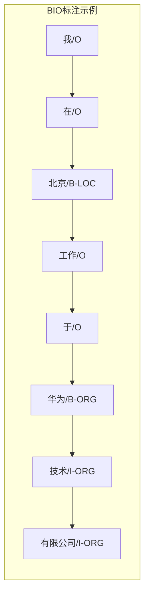
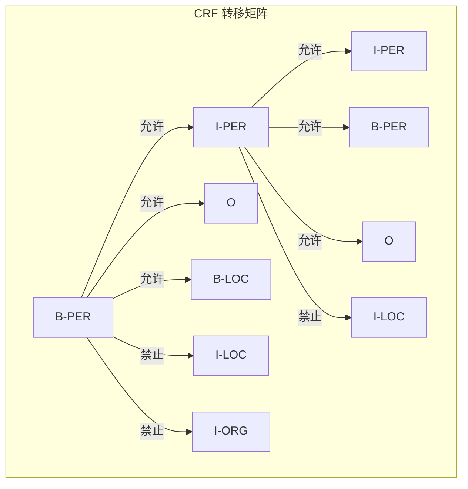
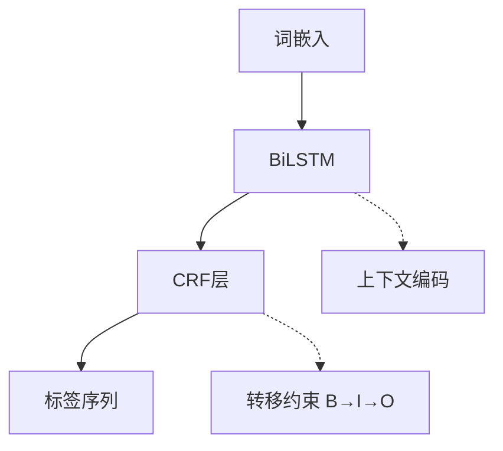

# 序列标注

## 1. 任务定义
序列标注是给输入序列每个位置分配标签的任务，是 NLP 中最基础的结构化预测问题。

### 典型任务
| 任务 | 输入 | 输出 | 应用 |
|------|------|------|------|
| 命名实体识别 NER | "Apple在纽约" | B-ORG / B-LOC / O | 信息抽取 |
| 词性标注 POS | "I love NLP" | PRP / VBP / NN | 预处理 |
| 组块分析 Chunking | "the red car" | B-NP / I-NP / O | 句法分析 |
| 角色标注 SRL | "他打了球" | 施事/动作/受事 | 语义理解 |

## 2. 标注体系

### BIO 标注体系详解
- **B** (Begin)：实体的开始 token
- **I** (Inside)：实体内部的 token
- **O** (Outside)：非实体 token



### BILOU 标注体系
- **B** (Begin)：实体开始
- **I** (Inside)：实体内部
- **L** (Last)：实体结束
- **O** (Outside)：非实体
- **U** (Unit)：单 token 实体

| 特性 | BIO | BIOES/BILOU |
|------|-----|-------------|
| 标签数 | 2N+1 | 4N+1 |
| 信息量 | 无结束标记 | 包含结束位置 |
| 边界清晰度 | 较低 | 更高 |
| 实现复杂度 | 简单 | 稍复杂 |
| 常见领域 | 通用 NER | 竞赛/高精度任务 |

### PyTorch：BIO 编码/解码

```python
def bio_encode(tokens, entities):
    labels = ["O"] * len(tokens)
    for entity_type, start, end in entities:
        if end - start == 1:
            labels[start] = f"B-{entity_type}"
        else:
            labels[start] = f"B-{entity_type}"
            for i in range(start + 1, end):
                labels[i] = f"I-{entity_type}"
    return labels

def bio_decode(labels):
    entities, i = [], 0
    while i < len(labels):
        if labels[i].startswith("B-"):
            entity_type = labels[i][2:]
            start = i
            i += 1
            while i < len(labels) and labels[i] == f"I-{entity_type}":
                i += 1
            entities.append((entity_type, start, i))
        else:
            i += 1
    return entities
```

## 3. 模型架构演进

### 传统方法
- **CRF（条件随机场）**：建模标签转移概率
- **特征工程**：词形/前后缀/上下文窗口
- **HMM**：生成式，强独立性假设

### CRF 转移约束



### BiLSTM-CRF（2015-2018）



### PyTorch 实现：简化 BiLSTM-CRF

```python
class BiLSTM_CRF(nn.Module):
    def __init__(self, vocab_size, embed_dim, hidden_dim, num_tags):
        super().__init__()
        self.embedding = nn.Embedding(vocab_size, embed_dim)
        self.lstm = nn.LSTM(embed_dim, hidden_dim, bidirectional=True, batch_first=True)
        self.proj = nn.Linear(hidden_dim * 2, num_tags)
        self.transitions = nn.Parameter(torch.randn(num_tags, num_tags))
        self.transitions.data[0, :] = -10000
        self.transitions.data[:, 0] = -10000

    def forward(self, x, mask=None):
        x = self.embedding(x)
        out, _ = self.lstm(x)
        emissions = self.proj(out)
        return emissions

    def decode(self, emissions, mask):
        batch_size, seq_len, num_tags = emissions.shape
        scores = emissions[:, 0]
        backpointers = []
        for t in range(1, seq_len):
            next_scores = scores.unsqueeze(2) + self.transitions.unsqueeze(0)
            best_scores, best_tags = next_scores.max(dim=1)
            scores = best_scores + emissions[:, t]
            backpointers.append(best_tags)
        best_tags_final = scores.argmax(dim=-1)
        result = [best_tags_final]
        for bp in reversed(backpointers):
            best_tags_final = bp.gather(1, best_tags_final.unsqueeze(1)).squeeze(1)
            result.insert(0, best_tags_final)
        return torch.stack(result, dim=1)
```

### BERT + 线性层
- **BERT 编码**：上下文感知表示
- **线性分类**：每个 token 独立分类
- **+CRF**：加上转移约束进一步提升

### BERT + Linear NER 实现

```python
class BERT_NER(nn.Module):
    def __init__(self, bert_model, num_tags):
        super().__init__()
        self.bert = bert_model
        self.classifier = nn.Linear(768, num_tags)

    def forward(self, input_ids, attn_mask):
        out = self.bert(input_ids, attention_mask=attn_mask).last_hidden_state
        logits = self.classifier(out)
        return logits
```

### 模型架构对比
| 模型 | 上下文建模 | 标签依赖 | 速度 | 精度 |
|------|-----------|---------|------|------|
| HMM | 无 | 一阶转移 | 极快 | 低 |
| CRF | 窗口特征 | 高阶转移 | 快 | 中 |
| BiLSTM-CRF | 双向 | 转移约束 | 中 | 高 |
| BERT-Linear | 深度双向 | 独立 | 慢 | 很高 |
| BERT-CRF | 深度双向 | 转移约束 | 慢 | 最高 |

### 2025-2026 趋势
- **LLM 作为标注器**：GPT-4/Claude 通过 prompt 完成 NER
- **指令微调**：用标注格式数据微调 LLM
- **Few-shot NER**：少量示例 + LLM 泛化
- **嵌套实体**：多层标签标注（如 "北京大学" 中 "北京" 是 LOC）

## 4. 评估指标
| 指标 | 严格 | 宽松 | 说明 |
|------|------|------|------|
| Exact Match | ✓ | | 实体边界和类型完全正确 |
| Partial | | ✓ | 部分重叠也算正确 |
| Token-level | | ✓ | 每个 token 分类精度 |

### NER 评估实现

```python
def ner_evaluate(true_entities, pred_entities):
    true_set = set((t, s, e) for t, s, e in true_entities)
    pred_set = set((t, s, e) for t, s, e in pred_entities)
    tp = len(true_set & pred_set)
    fp = len(pred_set - true_set)
    fn = len(true_set - pred_set)
    precision = tp / (tp + fp) if (tp + fp) > 0 else 0
    recall = tp / (tp + fn) if (tp + fn) > 0 else 0
    f1 = 2 * precision * recall / (precision + recall) if (precision + recall) > 0 else 0
    return {"precision": precision, "recall": recall, "f1": f1}
```
