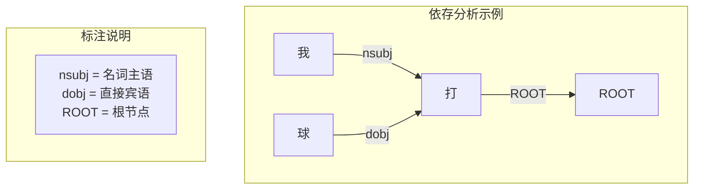

# 句法与语义分析

## 1. 句法分析 Parsing

### 成分句法分析 Constituency Parsing
- 将句子分解为短语结构树
- **PCFG**：概率上下文无关文法 + CKY 解码
- **自注意力编码器**：BERT + Span 分类
- **应用**：语法检查、文本生成引导

```
        S
      /   \
     NP    VP
    / \   / \
  Det N   V  NP
  |   |   |  /\
 The cat  saw Det N
              |  |
             a  dog
```

### 依存句法分析 Dependency Parsing
- 表示词间修饰关系（修饰词 → 中心词）
- **Eisner 算法**：基于图的依存解码
- **Transition-based**：Arc-Eager / Arc-Standard
- **神经依存分析**：BiLSTM / BERT + MLP 分类



### 依存分析简化实现

```python
class DependencyParser(nn.Module):
    def __init__(self, vocab_size, embed_dim, hidden_dim):
        super().__init__()
        self.embedding = nn.Embedding(vocab_size, embed_dim)
        self.lstm = nn.LSTM(embed_dim, hidden_dim, bidirectional=True, batch_first=True)
        self.arc_mlp = nn.Linear(hidden_dim * 2, hidden_dim)
        self.label_mlp = nn.Linear(hidden_dim * 2, hidden_dim)

    def forward(self, words):
        x = self.embedding(words)
        out, _ = self.lstm(x)
        arc_repr = self.arc_mlp(out)
        label_repr = self.label_mlp(out)
        return arc_repr, label_repr

    def predict_arcs(self, arc_repr):
        scores = torch.bmm(arc_repr, arc_repr.transpose(1, 2))
        scores = scores + torch.triu(torch.full_like(scores, -1e9), diagonal=1)
        return scores.argmax(dim=-1)
```

### 依存分析算法对比
| 方法 | 类型 | 复杂度 | 准确性 | 代表工具 |
|------|------|--------|-------|---------|
| Eisner 算法 | 基于图 | O(n³) | 高 | MSTParser |
| Arc-Eager | 基于转移 | O(n) | 中 | spaCy |
| Arc-Standard | 基于转移 | O(n) | 中 | CoreNLP |
| BiLSTM + Biaffine | 神经 | O(n²) | 很高 | Dozat & Manning |
| BERT + 图 | 神经 | O(n²) | 最高 | Supar |

### 成分句法分析器框架

```python
class ConstituencyParser(nn.Module):
    def __init__(self, bert_model, hidden_dim):
        super().__init__()
        self.bert = bert_model
        self.span_cls = nn.Linear(768 * 2, hidden_dim)
        self.label_cls = nn.Linear(hidden_dim, 50)

    def forward(self, input_ids, attn_mask, spans):
        out = self.bert(input_ids, attention_mask=attn_mask).last_hidden_state
        span_reprs = []
        for s, e in spans:
            span_repr = torch.cat([out[:, s], out[:, e - 1]], dim=-1)
            span_reprs.append(self.span_cls(span_repr))
        return self.label_cls(torch.stack(span_reprs, dim=1))
```

## 2. 语义角色标注 Semantic Role Labeling
- **谓词-论元结构**：谁对谁做了什么
  - "他打了球" → 施事(他) 动作(打) 受事(球)
- **PropBank / FrameNet**：标注体系
- **方法**：BiLSTM-CRF / BERT + 多分类

### SRL 简化实现

```python
class SRLModel(nn.Module):
    def __init__(self, bert_model, num_roles):
        super().__init__()
        self.bert = bert_model
        self.pred_cls = nn.Linear(768, 1)
        self.role_cls = nn.Linear(768 * 2, num_roles)

    def forward(self, input_ids, attn_mask, pred_positions):
        out = self.bert(input_ids, attention_mask=attn_mask).last_hidden_state
        pred_mask = torch.zeros_like(out[:, :, 0])
        for i, pos in enumerate(pred_positions):
            pred_mask[i, pos] = 1
        pred_repr = (out * pred_mask.unsqueeze(-1)).sum(dim=1, keepdim=True)
        role_repr = torch.cat([out, pred_repr.expand(-1, out.size(1), -1)], dim=-1)
        role_logits = self.role_cls(role_repr)
        pred_logits = self.pred_cls(out).squeeze(-1)
        return pred_logits, role_logits
```

## 3. 语义相似度
| 粒度 | 方法 | 应用 |
|------|------|------|
| 词级 | 词嵌入余弦相似度 | 同义词检测 |
| 句级 | Sentence-BERT / SimCSE | 语义搜索 |
| 文档级 | 向量嵌入相似度 | 文档聚类 |

### PyTorch 语义相似度计算

```python
class SentenceSimilarity(nn.Module):
    def __init__(self, vocab_size, embed_dim=300, hidden_dim=256):
        super().__init__()
        self.embedding = nn.Embedding(vocab_size, embed_dim)
        self.encoder = nn.LSTM(embed_dim, hidden_dim, bidirectional=True, batch_first=True)

    def encode(self, x, mask):
        x = self.embedding(x)
        lengths = mask.sum(1).cpu()
        packed = nn.utils.rnn.pack_padded_sequence(x, lengths, batch_first=True, enforce_sorted=False)
        _, (hn, _) = self.encoder(packed)
        return hn[-2:].transpose(0, 1).reshape(x.size(0), -1)

    def similarity(self, a, b):
        a_vec = F.normalize(a, p=2, dim=-1)
        b_vec = F.normalize(b, p=2, dim=-1)
        return torch.mm(a_vec, b_vec.T)

    def loss_fn(self, a, b, labels):
        sim = F.cosine_similarity(a, b)
        return F.mse_loss(sim, labels)
```

### SimCSE（对比学习句子嵌入）

```python
class SimCSE(nn.Module):
    def __init__(self, bert_model, mlp_dim=256):
        super().__init__()
        self.encoder = bert_model
        self.mlp = nn.Sequential(
            nn.Linear(768, mlp_dim),
            nn.GELU(),
            nn.Linear(mlp_dim, mlp_dim),
        )

    def forward(self, input_ids, attn_mask):
        out = self.encoder(input_ids, attention_mask=attn_mask).last_hidden_state[:, 0]
        return self.mlp(out)

    def contrastive_loss(self, z1, z2, temp=0.05):
        batch_size = z1.size(0)
        z = torch.cat([z1, z2], dim=0)
        z = F.normalize(z, dim=-1)
        sim = torch.mm(z, z.T) / temp
        labels = torch.arange(batch_size, device=z.device)
        labels = torch.cat([labels, labels], dim=0)
        loss = F.cross_entropy(sim, labels)
        return loss
```

### 语义相似度方法对比
| 方法 | 表示类型 | 训练数据 | 维度 | 推理速度 | MTEB STS |
|------|---------|---------|------|---------|----------|
| 词嵌入平均 | 静态 | 无监督 | 300 | 极快 | 0.55 |
| SBERT | 动态 | 有监督 NLI | 768 | 快 | 0.82 |
| SimCSE-BERT | 动态 | 无监督+dropout | 768 | 快 | 0.80 |
| SimCSE-RoBERTa | 动态 | 无监督 | 1024 | 中 | 0.81 |
| Instructor | 动态+指令 | 多任务 | 768 | 中 | 0.83 |
| BGE-Large | 动态 | 检索+STS | 1024 | 中 | 0.85 |

## 4. 语义解析 Semantic Parsing
- **自然语言 → 逻辑形式**
  - "北京的人口是多少" → query("人口", "北京")
- **应用**：Text-to-SQL、知识图谱问答
- **方法**：Seq2Seq 生成逻辑形式

### Text-to-SQL 简化实现

```python
class TextToSQL(nn.Module):
    def __init__(self, bert_model, vocab_size, hidden_dim=512):
        super().__init__()
        self.encoder = bert_model
        self.decoder = nn.LSTM(768, hidden_dim, batch_first=True)
        self.out_proj = nn.Linear(hidden_dim, vocab_size)

    def forward(self, input_ids, attn_mask, sql_ids=None, teacher_forcing=True):
        enc_out = self.encoder(input_ids, attention_mask=attn_mask).last_hidden_state
        if teacher_forcing and sql_ids is not None:
            dec_in = sql_ids[:, :-1]
            dec_emb = self.decoder(dec_in.unsqueeze(-1).float())[0]
            return self.out_proj(dec_emb)
        return self.greedy_decode(enc_out)

    def greedy_decode(self, enc_out, max_len=50):
        batch_size = enc_out.size(0)
        dec_input = torch.zeros(batch_size, 1, device=enc_out.device).long()
        outputs = []
        for _ in range(max_len):
            dec_out, _ = self.decoder(dec_input[:, -1:].unsqueeze(-1).float())
            logits = self.out_proj(dec_out)
            pred = logits.argmax(-1)
            outputs.append(pred)
            dec_input = torch.cat([dec_input, pred], dim=1)
        return torch.cat(outputs, dim=1)
```

## 5. 现代趋势
- **大模型语义**：LLM 隐式建模语义，无需显式结构
- **语义角色隐式学习**：注意力模式对应角色
- **联合句法语义**：多任务学习

### 联合句法-语义多任务模型

```python
class JointParser(nn.Module):
    def __init__(self, bert_model, num_pos, num_dep, num_srl):
        super().__init__()
        self.bert = bert_model
        self.pos_head = nn.Linear(768, num_pos)
        self.dep_head = nn.Linear(768 * 2, num_dep)
        self.srl_head = nn.Linear(768 * 2, num_srl)

    def forward(self, input_ids, attn_mask):
        out = self.bert(input_ids, attention_mask=attn_mask).last_hidden_state
        pos_logits = self.pos_head(out)
        dep_logits = self.dep_head(torch.cat([out.unsqueeze(2).expand(-1, -1, out.size(1), -1),
                                               out.unsqueeze(1).expand(-1, out.size(1), -1, -1)], dim=-1))
        srl_logits = self.srl_head(torch.cat([out.unsqueeze(2).expand(-1, -1, out.size(1), -1),
                                               out.unsqueeze(1).expand(-1, out.size(1), -1, -1)], dim=-1))
        return pos_logits, dep_logits, srl_logits
```
