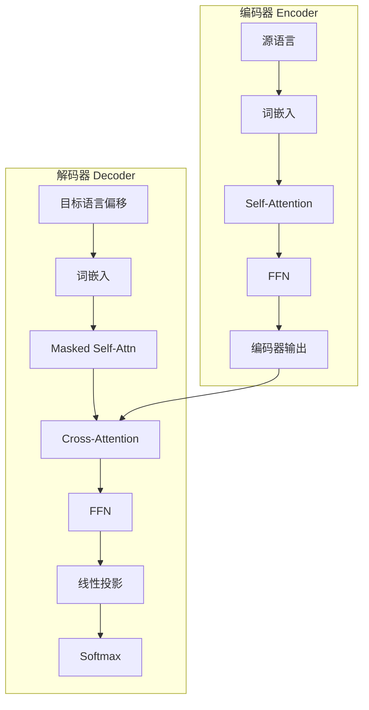

# 机器翻译与文本摘要

## 1. 机器翻译

### 方法演进


### 编码-解码架构



### 统计机器翻译 SMT
- **短语表**：将短语翻译概率对齐
- **语言模型**：目标语言流畅性
- **解码**：多特征组合搜索

### 神经机器翻译 NMT
- **编码-解码架构**：RNN/LSTM
- **注意力机制**：Bahdanau Attention（2015）
- **Transformer（2017）**：自注意力，并行计算

### PyTorch 实现：简化 Transformer 翻译模型

```python
class SimplifiedTransformer(nn.Module):
    def __init__(self, src_vocab, tgt_vocab, d_model=256, nhead=4, num_layers=3):
        super().__init__()
        self.src_emb = nn.Embedding(src_vocab, d_model)
        self.tgt_emb = nn.Embedding(tgt_vocab, d_model)
        self.pos_enc = PositionalEncoding(d_model)
        self.encoder = nn.TransformerEncoder(nn.TransformerEncoderLayer(d_model, nhead, batch_first=True), num_layers)
        self.decoder = nn.TransformerDecoder(nn.TransformerDecoderLayer(d_model, nhead, batch_first=True), num_layers)
        self.out_proj = nn.Linear(d_model, tgt_vocab)

    def forward(self, src, tgt, src_mask=None, tgt_mask=None):
        src = self.pos_enc(self.src_emb(src))
        tgt = self.pos_enc(self.tgt_emb(tgt))
        memory = self.encoder(src, src_key_padding_mask=src_mask)
        out = self.decoder(tgt, memory, tgt_mask=tgt_mask, memory_key_padding_mask=src_mask)
        return self.out_proj(out)

    def generate(self, src, max_len=50, bos_id=2, eos_id=3):
        self.eval()
        src = self.pos_enc(self.src_emb(src))
        memory = self.encoder(src)
        ys = torch.full((src.size(0), 1), bos_id, dtype=torch.long, device=src.device)
        for _ in range(max_len):
            tgt = self.pos_enc(self.tgt_emb(ys))
            causal_mask = nn.Transformer.generate_square_subsequent_mask(ys.size(1), device=ys.device)
            out = self.decoder(tgt, memory, tgt_mask=causal_mask)
            pred = self.out_proj(out[:, -1:])
            next_token = pred.argmax(-1)
            ys = torch.cat([ys, next_token], dim=1)
            if (next_token == eos_id).all():
                break
        return ys
```

### Bahdanau Attention 实现

```python
class BahdanauAttention(nn.Module):
    def __init__(self, hidden_dim):
        super().__init__()
        self.W1 = nn.Linear(hidden_dim, hidden_dim)
        self.W2 = nn.Linear(hidden_dim, hidden_dim)
        self.V = nn.Linear(hidden_dim, 1)

    def forward(self, query, values):
        query = query.unsqueeze(1)
        scores = self.V(torch.tanh(self.W1(query) + self.W2(values)))
        attn_weights = F.softmax(scores, dim=1)
        context = torch.bmm(attn_weights.transpose(-2, -1), values)
        return context.squeeze(1), attn_weights.squeeze(-1)
```

### BLEU 计算实现

```python
def compute_bleu(reference, hypothesis, max_n=4):
    ref_tokens = reference.split()
    hyp_tokens = hypothesis.split()
    precisions = []
    for n in range(1, max_n + 1):
        ref_ngrams = Counter(zip(*[ref_tokens[i:] for i in range(n)]))
        hyp_ngrams = Counter(zip(*[hyp_tokens[i:] for i in range(n)]))
        match = sum(min(hyp_ngrams[ng], ref_ngrams[ng]) for ng in hyp_ngrams)
        total = sum(hyp_ngrams.values())
        precisions.append(match / total if total > 0 else 0)
    bp = min(1, len(ref_tokens) / len(hyp_tokens)) if len(hyp_tokens) > 0 else 0
    if len(hyp_tokens) < len(ref_tokens):
        bp = 0
    if min(precisions) == 0:
        return 0.0
    return bp * math.exp(sum(math.log(p) for p in precisions) / max_n)
```

### 翻译模型对比
| 模型 | 参数量 | 并行化 | 长距离依赖 | 推理速度 | WMT 中英 BLEU |
|------|-------|--------|-----------|---------|--------------|
| RNN Seq2Seq | 50M | 差 | 弱 | 慢 | 22.0 |
| +Attention | 60M | 差 | 中 | 慢 | 26.5 |
| Transformer Base | 65M | 好 | 强 | 快 | 27.3 |
| Transformer Big | 213M | 好 | 强 | 中 | 28.5 |
| mBART | 680M | 好 | 强 | 中 | 30.1 |
| NLLB-200 | 3.3B | 好 | 强 | 慢 | 32.5 |
| GPT-4 | 1.8T+ | 好 | 极强 | 慢 | 35.0+ |

### 当前 SOTA
- **多语言翻译**：
  - **NLLB（Meta, 2022）**：200 种语言
  - **mT5 / mBART**：多语言 Seq2Seq
  - **M2M-100**：100 种语言的直接翻译
- **LLM 翻译**：
  - **GPT-4 / Claude**：高质量翻译，理解上下文
  - **DeepSeek**：中英翻译业界领先
  - **ALMA**：LLM 翻译后微调

### 评估指标
| 指标 | 优点 | 缺点 |
|------|------|------|
| BLEU | 自动计算 | 对流畅性不敏感 |
| BLEURT | 学习式评估 | 计算成本高 |
| COMET | 语义匹配 | 依赖预训练模型 |

## 2. 文本摘要

### 摘要类型
| 类型 | 方法 | 输出 |
|------|------|------|
| 抽取式 | 选择原文句子 | 原文中的句子 |
| 生成式 | 理解后重写 | 全新文本 |
| 单文档 | 一篇文档 | 简短摘要 |
| 多文档 | 多篇文档 | 综合摘要 |
| 对话摘要 | 对话记录 | 会议纪要 |

### 抽取式方法
- **TextRank**：基于图排序（类似 PageRank）
- **Lead-3**：前 3 句简单基线
- **BERTSUM**：BERT [CLS] + 句子分类

### BERTSUM 抽取式摘要实现

```python
class BERTSUM(nn.Module):
    def __init__(self, bert_model):
        super().__init__()
        self.bert = bert_model
        self.sentence_classifier = nn.Linear(768, 1)
        self.sigmoid = nn.Sigmoid()

    def forward(self, input_ids, attn_mask, sent_positions):
        out = self.bert(input_ids, attention_mask=attn_mask).last_hidden_state
        sent_reprs = []
        for s, e in sent_positions:
            sent_reprs.append(out[:, s:e].mean(dim=1))
        sent_reprs = torch.stack(sent_reprs, dim=1)
        scores = self.sentence_classifier(sent_reprs).squeeze(-1)
        return self.sigmoid(scores)
```

### 生成式方法
- **BART / T5**：预训练 Seq2Seq 微调
- **PEGASUS**：间隙句子生成作为预训练目标
- **Longformer**：长文档摘要

### 摘要生成（简化 BART 类）

```python
class Summarizer(nn.Module):
    def __init__(self, encoder, decoder, vocab_size, d_model=256):
        super().__init__()
        self.encoder = encoder
        self.decoder = decoder
        self.out_proj = nn.Linear(d_model, vocab_size)

    def forward(self, src, tgt):
        memory = self.encoder(src)
        out = self.decoder(tgt, memory)
        return self.out_proj(out)

    def summarize(self, src, max_len=100, bos_id=2, eos_id=3):
        self.eval()
        memory = self.encoder(src)
        ys = torch.full((src.size(0), 1), bos_id, dtype=torch.long, device=src.device)
        for _ in range(max_len):
            out = self.decoder(ys, memory)
            logits = self.out_proj(out[:, -1:])
            next_token = logits.argmax(-1)
            ys = torch.cat([ys, next_token], dim=1)
            if (next_token == eos_id).all():
                break
        return ys
```

### ROUGE 计算实现

```python
def compute_rouge(reference, hypothesis, n=1):
    ref_tokens = reference.split()
    hyp_tokens = hypothesis.split()
    ref_ngrams = Counter(zip(*[ref_tokens[i:] for i in range(n)]))
    hyp_ngrams = Counter(zip(*[hyp_tokens[i:] for i in range(n)]))
    match = sum(min(hyp_ngrams[ng], ref_ngrams[ng]) for ng in hyp_ngrams)
    precision = match / sum(hyp_ngrams.values()) if sum(hyp_ngrams.values()) > 0 else 0
    recall = match / sum(ref_ngrams.values()) if sum(ref_ngrams.values()) > 0 else 0
    f1 = 2 * precision * recall / (precision + recall) if (precision + recall) > 0 else 0
    return {"precision": precision, "recall": recall, "f1": f1}

def compute_rouge_l(reference, hypothesis):
    ref_tokens = reference.split()
    hyp_tokens = hypothesis.split()
    m, n = len(ref_tokens), len(hyp_tokens)
    dp = [[0] * (n + 1) for _ in range(m + 1)]
    for i in range(1, m + 1):
        for j in range(1, n + 1):
            if ref_tokens[i - 1] == hyp_tokens[j - 1]:
                dp[i][j] = dp[i - 1][j - 1] + 1
            else:
                dp[i][j] = max(dp[i - 1][j], dp[i][j - 1])
    lcs = dp[m][n]
    precision = lcs / n if n > 0 else 0
    recall = lcs / m if m > 0 else 0
    f1 = 2 * precision * recall / (precision + recall) if (precision + recall) > 0 else 0
    return {"precision": precision, "recall": recall, "f1": f1}
```

### LLM 摘要
- **GPT-4 / Claude**：零样本摘要，质量高
- **长上下文**：一次性输入整本书
- **可控摘要**：长度/风格/视角控制

### 评估
- **ROUGE**：N-gram 重叠（ROUGE-1/2/L）
- **人工评估**：忠实度/完整性/流畅性

### 摘要模型对比
| 模型 | 类型 | 参数量 | 最大输入 | 处理OOV | 抽象能力 |
|------|------|-------|---------|--------|---------|
| TextRank | 抽取式 | 0 | 任意 | - | 无 |
| BERTSUM | 抽取式 | 110M | 512 | 好 | 无 |
| BART | 生成式 | 406M | 1024 | 好 | 强 |
| T5-Large | 生成式 | 770M | 512 | 好 | 强 |
| PEGASUS | 生成式 | 568M | 512 | 好 | 极强 |
| Longformer | 生成式 | 406M | 4096 | 好 | 强 |
| GPT-4 | 生成式 | 1.8T+ | 128K | 极好 | 极强 |

## 3. 2025-2026 趋势
- **LLM 端到端翻译**：无需配对数据也能翻译（跨语言对齐）
- **语音到语音翻译**：源语言语音 → 目标语言语音
- **同声传译**：流式翻译，低延迟
- **长文本摘要**：百万级 token 输入
- **事实性摘要**：减少 LLM 幻觉
