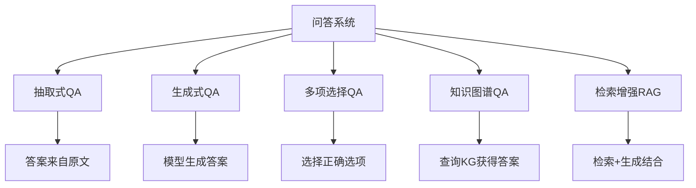
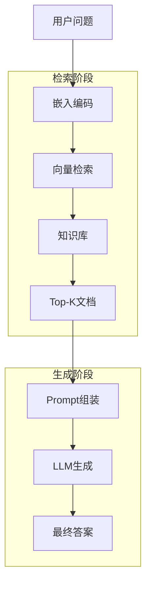

# 问答系统

## 1. 问答类型



### QA 类型对比
| 类型 | 输入 | 输出 | 推理需求 | 代表数据集 |
|------|------|------|---------|-----------|
| 抽取式 | 问题 + 文档 | 文本片段 | 低 | SQuAD |
| 生成式 | 问题 ± 文档 | 自由文本 | 高 | TriviaQA |
| 多项选择 | 问题 + 选项 | 选项索引 | 中 | MMLU |
| 知识图谱 | 问题 + KG | 结构化答案 | 高 | WebQuestions |
| RAG | 问题 + 知识库 | 检索+生成 | 高 | NQ, HotpotQA |

### 抽取式 QA
- **输入**：问题 + 上下文文档
- **输出**：答案在文档中的起止位置
- **代表数据集**：SQuAD 1.1/2.0、Natural Questions
- **方法**：BERT/RoBERTa 预测 start/end logits
- **指标**：EM（精确匹配）、F1

### PyTorch 实现：抽取式 QA（SQuAD 风格）

```python
class ExtractiveQA(nn.Module):
    def __init__(self, bert_model):
        super().__init__()
        self.bert = bert_model
        self.start_classifier = nn.Linear(768, 1)
        self.end_classifier = nn.Linear(768, 1)

    def forward(self, input_ids, attn_mask, token_type_ids):
        out = self.bert(input_ids, attention_mask=attn_mask, token_type_ids=token_type_ids).last_hidden_state
        start_logits = self.start_classifier(out).squeeze(-1)
        end_logits = self.end_classifier(out).squeeze(-1)
        return start_logits, end_logits

    def predict(self, input_ids, attn_mask, token_type_ids, max_answer_len=30):
        start_logits, end_logits = self.forward(input_ids, attn_mask, token_type_ids)
        start_probs = F.softmax(start_logits, dim=-1)
        end_probs = F.softmax(end_logits, dim=-1)
        batch_size, seq_len = start_probs.shape
        best_start, best_end = -1, -1
        best_score = -1e9
        for s in range(seq_len):
            for e in range(s, min(s + max_answer_len, seq_len)):
                score = start_probs[:, s] * end_probs[:, e]
                if score.item() > best_score:
                    best_score = score.item()
                    best_start, best_end = s, e
        return best_start, best_end
```

### 生成式 QA
- **输入**：问题 + 可选上下文
- **输出**：模型生成的自由文本答案
- **代表**：T5、BART、GPT-4
- **优势**：可以回答需要推理的问题
- **NLG 指标**：ROUGE、BLEURT、人工评分

### PyTorch 实现：生成式 QA

```python
class GenerativeQA(nn.Module):
    def __init__(self, encoder, decoder, vocab_size, d_model=768):
        super().__init__()
        self.encoder = encoder
        self.decoder = decoder
        self.out_proj = nn.Linear(d_model, vocab_size)

    def forward(self, question, context, answer):
        memory = self.encoder(torch.cat([question, context], dim=1))
        out = self.decoder(answer, memory)
        return self.out_proj(out)

    def answer(self, question, context, max_len=50, bos_id=0, eos_id=2):
        self.eval()
        memory = self.encoder(torch.cat([question, context], dim=1))
        ys = torch.full((question.size(0), 1), bos_id, dtype=torch.long, device=question.device)
        for _ in range(max_len):
            out = self.decoder(ys, memory)
            logits = self.out_proj(out[:, -1:])
            token = logits.argmax(-1)
            ys = torch.cat([ys, token], dim=1)
            if (token == eos_id).all():
                break
        return ys
```

### 知识图谱 QA
- **结构查询**：自然语言 → SPARQL/图查询
- **方法**：
  - Seq2Seq 生成查询
  - 实体链接 + 关系预测

### 实体链接 + 关系预测实现

```python
class KGQA(nn.Module):
    def __init__(self, bert_model, num_entities, num_relations):
        super().__init__()
        self.bert = bert_model
        self.entity_cls = nn.Linear(768, num_entities)
        self.relation_cls = nn.Linear(768, num_relations)

    def forward(self, input_ids, attn_mask):
        out = self.bert(input_ids, attention_mask=attn_mask).last_hidden_state
        cls_repr = out[:, 0, :]
        entity_logits = self.entity_cls(cls_repr)
        relation_logits = self.relation_cls(cls_repr)
        return entity_logits, relation_logits
```

## 2. 数据集

| 数据集 | 类型 | 规模 | 特点 |
|--------|------|------|------|
| SQuAD 2.0 | 抽取式 | 10 万 | 含不可回答问题 |
| Natural Questions | 抽取式/生成式 | 30 万 | Google 真实搜索日志 |
| TriviaQA | 生成式 | 95 万 | 百科问答 |
| HotpotQA | 多跳推理 | 11 万 | 需要多文档推理 |
| WebQuestions | KG QA | 5,810 | Freebase 查询 |
| MS MARCO | 生成式 | 100 万 | Bing 搜索日志 |

### EM/F1 评估实现

```python
def squad_metrics(pred_start, pred_end, true_start, true_end, pred_text, true_text):
    def normalize(text):
        import re
        return re.sub(r"\s+", " ", text.strip().lower())
    em = 1 if pred_start == true_start and pred_end == true_end else 0
    pred_tokens = normalize(pred_text).split()
    true_tokens = normalize(true_text).split()
    common = Counter(pred_tokens) & Counter(true_tokens)
    num_common = sum(common.values())
    precision = num_common / len(pred_tokens) if pred_tokens else 0
    recall = num_common / len(true_tokens) if true_tokens else 0
    f1 = 2 * precision * recall / (precision + recall) if (precision + recall) > 0 else 0
    return {"EM": em, "F1": f1}
```

## 3. 检索增强 RAG

### RAG 管道架构



### PyTorch 实现：RAG 检索+生成管道

```python
class RAGPipeline:
    def __init__(self, retriever, generator, embed_dim=768, top_k=3):
        self.retriever = retriever
        self.generator = generator
        self.doc_embeddings = None
        self.documents = []
        self.top_k = top_k

    def index_documents(self, documents, batch_size=32):
        self.documents = documents
        all_embeds = []
        for i in range(0, len(documents), batch_size):
            batch = documents[i:i + batch_size]
            embeds = self.retriever.encode(batch)
            all_embeds.append(embeds)
        self.doc_embeddings = torch.cat(all_embeds, dim=0)

    def retrieve(self, query, k=None):
        k = k or self.top_k
        q_emb = self.retriever.encode([query])
        scores = torch.mm(q_emb, self.doc_embeddings.T).squeeze(0)
        top_indices = scores.topk(k).indices
        return [self.documents[i] for i in top_indices], scores[top_indices]

    def generate(self, query, docs=None):
        if docs is None:
            docs, _ = self.retrieve(query)
        context = "\n".join(f"[{i+1}] {d}" for i, d in enumerate(docs))
        prompt = f"基于以下信息回答问题。\n\n信息:\n{context}\n\n问题: {query}\n回答:"
        return self.generator.generate(prompt)
```

### RAG vs 纯检索 vs 纯生成
| 特性 | 纯检索（稀疏/密集） | 纯生成（LLM） | RAG |
|------|-------------------|--------------|-----|
| 知识新鲜度 | 高（可随时更新索引） | 低（训练截止） | 高 |
| 幻觉风险 | 无 | 高 | 低 |
| 可验证性 | 高（来源可见） | 低 | 高 |
| 推理能力 | 无 | 强 | 中/强 |
| OOD 问题 | 无法回答 | 可能幻觉 | 可告知无答案 |
| 计算成本 | 低 | 高 | 中 |

### RAG 检索器 + 生成器实现

```python
class DenseRetriever(nn.Module):
    def __init__(self, bert_model):
        super().__init__()
        self.encoder = bert_model

    def encode(self, texts):
        encoded = self.encoder.tokenizer(texts, padding=True, truncation=True, return_tensors="pt")
        out = self.encoder(**encoded).last_hidden_state[:, 0, :]
        return F.normalize(out, dim=-1)

class GeneratorWrapper:
    def __init__(self, model, tokenizer):
        self.model = model
        self.tokenizer = tokenizer

    def generate(self, prompt, max_len=200):
        inputs = self.tokenizer(prompt, return_tensors="pt")
        out = self.model.generate(**inputs, max_new_tokens=max_len)
        return self.tokenizer.decode(out[0], skip_special_tokens=True)
```

## 4. 2025-2026 趋势
- **长文档 QA**：百万 token 上下文，从任何位置检索
- **多模态 QA**：图文+VQA
- **多跳推理**：多步推理链
- **Agentic QA**：自主搜索 + 验证 + 工具调用

### 多跳推理实现

```python
class MultiHopQA(nn.Module):
    def __init__(self, retriever, reader, max_hops=3):
        super().__init__()
        self.retriever = retriever
        self.reader = reader
        self.max_hops = max_hops

    def answer(self, question, max_hops=None):
        max_hops = max_hops or self.max_hops
        query = question
        all_contexts = []
        for hop in range(max_hops):
            docs, scores = self.retriever.retrieve(query, k=2)
            all_contexts.extend(docs)
            context_text = " ".join(all_contexts[-4:])
            query = f"{question} 已知: {context_text}"
        combined = " ".join(all_contexts[:8])
        return self.reader.generate(f"问题: {question}\n上下文: {combined}\n回答:")
```
