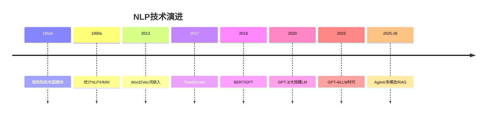

# 自然语言处理 NLP

## 概述

自然语言处理（NLP）让机器理解、生成和处理人类语言。从规则系统到大型语言模型，NLP 经历了革命性变化。

## 目录

```
02-自然语言处理NLP/
├── README.md
├── 01-文本表示与嵌入.md    # Embedding/TF-IDF/T5/BERT嵌入
├── 02-文本分类与情感分析.md# CNN/RNN/BERT分类/情感/FastText
├── 03-序列标注.md          # NER/POS/CRF/BiLSTM-CRF
├── 04-句法与语义分析.md    # 句法树/依存分析/语义角色/AMR
├── 05-机器翻译与摘要.md    # Seq2Seq/注意力/NMT/评估
├── 06-问答系统.md          # 抽取式/生成式/多跳/表格QA
└── 07-传统NLP工具.md       # 分词/词性标注/句法/知识图谱
```

## 发展脉络



## NLP 任务分类

| 任务级别 | 示例 | 传统方法 | 现代方法 |
|---------|------|---------|---------|
| 词级别 | 分词、词性标注 | CRF/HMM | BERT Token 分类 |
| 句子级别 | 分类、情感 | SVM/朴素贝叶斯 | BERT 句子分类 |
| 序列级别 | NER、抽取 | BiLSTM-CRF | BERT-CRF |
| 生成级别 | 翻译、摘要 | Seq2Seq+Attention | LLM Prompt |
| 对话级别 | 多轮对话 | 检索/生成混合 | ChatGPT/Claude |
