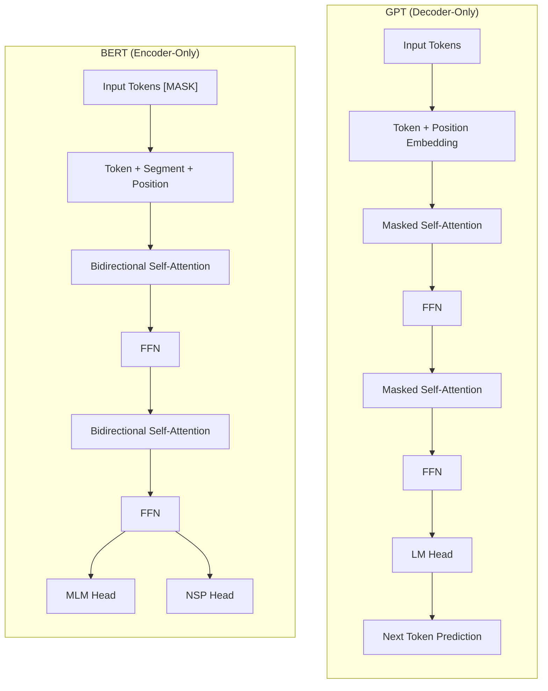
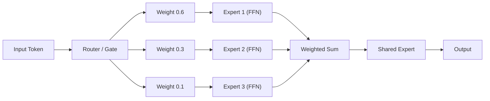
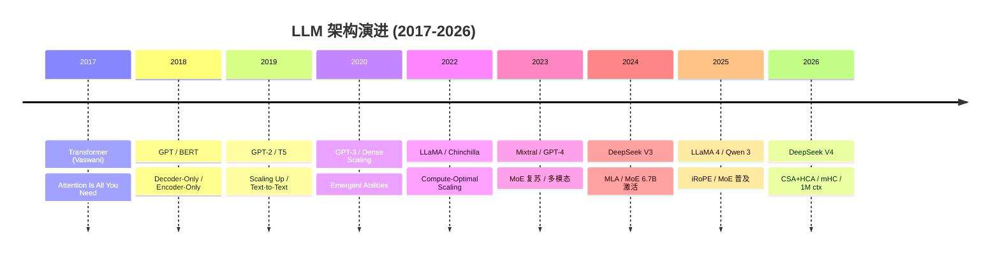
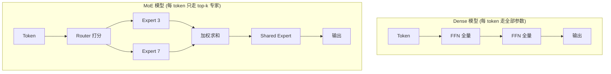

# 模型架构演进

## 1. 基础架构
- **Transformer 原始架构**：Encoder-Decoder、Self-Attention、Multi-Head Attention、Positional Encoding、LayerNorm、FFN
- **GPT 系列**：Decoder-Only、Causal LM、Autoregressive Generation
- **BERT 系列**：Encoder-Only、Masked LM、双向上下文
- **T5 系列**：Encoder-Decoder、Text-to-Text 统一框架

## 2. 主流模型架构变体（2025-2026）

### DeepSeek 系列
- **DeepSeek V3**：MoE（671B 总参/37B 激活）、MLA（Multi-head Latent Attention）、DeepSeekMoE 细粒度专家分配、128 个路由专家 + 1 个共享专家
- **DeepSeek R1**：基于 V3 的推理优化版本，GRPO 训练、思维链推理、强化学习后训练
- **DeepSeek V3.2**：685B 总参/37B 激活，MLA + DSA（DeepSeek Sparse Attention），256 专家 + 8+1 激活
- **DeepSeek V4-Pro**（2026.4）：1.6T 总参/49B 激活，1M 上下文窗口，混合注意力（CSA + HCA），mHC 残差连接，Muon 优化器
- **DeepSeek V4-Flash**：284B 总参/13B 激活，同样 1M 上下文，轻量高效版

### LLaMA 系列
- **LLaMA 3**：RMSNorm、SwiGLU、RoPE、GQA
- **LLaMA 4 Scout**（2025）：109B 总参/17B 激活，iRoPE（交错 RoPE），16 专家 MoE
- **LLaMA 4 Maverick**：400B 总参/17B 激活，128 专家 MoE，激活率仅 4.3%
- **LLaMA 4 Behemoth**：2T 总参/288B 激活，16 专家（未发布）

### Qwen 系列
- **Qwen 2.5**：SwiGLU、RoPE、QKV 融合
- **Qwen 3**（2025）：235B 总参/22B 激活，128 专家 MoE，GQA，动态推理深度控制
- **Qwen 3.5**（2026）：397B MoE，多模态扩展
- **Qwen 3.7 Max**（2026）：最新旗舰，MMLU-Pro 89.6%，原生 Anthropic API 协议，35 小时自主编程

### Gemini 系列
- **Gemini 2.5 Pro**：原生多模态，长上下文（1M+ tokens），推理能力大幅提升
- **Gemini 3 Pro**（2025.12）：~2-4T 总参/~150-200B 激活，Sparse MoE，深度推理
- **Gemini 3.1 Pro**（2026.2）：改进推理能力，MMLU-Pro 91.0%，GPQA Diamond 94.3%

### Claude 系列
- **Claude 3.5 Sonnet**：Constitutional AI，工具使用稳定
- **Claude 4 Opus/Sonnet**（2025）：长上下文 200K tokens，代理稳定性优化
- **Claude Opus 4.5/4.7/4.8**（2025-2026）：SWE-bench 领先，MMLU 91.2%
- **Claude Fable 5**（2026）：顶级代码能力，SWE-bench Pro 80.0%，但已被暂停

### 其他重要模型
- **Mistral Large 3**：Sliding Window Attention、GQA、Rolling Buffer KV Cache
- **Kimi K2**（Moonshot AI）：1.0T 参数 MoE，超长上下文推理
- **GLM-5**（Zhipu AI）：~753B MoE，MIT 开源
- **NVIDIA Nemotron 3 Ultra**：253B，多模态开源权重
- **OLMo 2/Hybrid**（AI2）：混合注意力层（Hybrid Attention），融合 Transformer 与状态空间模型
- **Phi-4**（Microsoft）：小模型（14B）高性能，85.1 MMLU，适合本地部署

## 3. 注意力机制演进
- **Full Attention**：O(n²) 计算复杂度
- **Sparse Attention**：固定稀疏模式
- **Sliding Window Attention**：固定窗口局部注意力
- **Flash Attention V1/V2/V3**：IO 感知的精确注意力，通过 tiling 减少 HBM 读写
  - V3 利用 Hopper FP8 Tensor Core，异步 WGMMA
- **Multi-Query Attention (MQA)**：多 Query 共享单一 Key/Value 头
- **Grouped Query Attention (GQA)**：分组共享 KV 头，MHA 与 MQA 的折中
- **Multi-head Latent Attention (MLA)**：低秩压缩 KV 缓存，DeepSeek V3 首创，减少 5-10× KV Cache
- **PagedAttention**：类虚拟内存管理 KV Cache，减少显存碎片（vLLM）
- **Ring Attention**：分布式长上下文注意力，跨设备分块计算
- **DeepSeek Sparse Attention (DSA)**：DeepSeek V3.2，top-k 稀疏注意力
- **Compressed Sparse Attention (CSA)**（DeepSeek V4）：沿序列维度压缩 KV Cache 后做 DSA
- **Heavily Compressed Attention (HCA)**（DeepSeek V4）：更强压缩率的 KV Cache，保持密集注意力
- **Hybrid Attention**（DeepSeek V4）：CSA + HCA 交错组合，1M 上下文仅需 V3.2 的 10% KV Cache 和 27% FLOPs
- **iRoPE（Interleaved RoPE）**（LLaMA 4）：交错位置编码，改进长上下文外推

## 4. 位置编码方案
- **Absolute PE**：Sinusoidal、可学习
- **Relative PE**：T5 Bias、ALiBi
- **Rotary PE (RoPE)**：旋转矩阵编码相对位置，外推到更长序列
- **iRoPE（Interleaved RoPE）**：LLaMA 4 使用，多组 Query Head 交错不同频率 RoPE
- **No Position (NoPE)**：无显式位置编码（如 ModernBERT）
- **NTK-aware Scaled RoPE**：高频维度和低频维度非均匀缩放，长上下文外推
- **YaRN**：改进的 NTK 缩放 + 注意力温度调整

## 5. 激活函数选择
- ReLU -> GELU -> SwiGLU（当前主流，约 2/3 参数量为 FFN 部分）
- **LLaMA 系列**默认 SwiGLU，hidden_dim = 8/3 * intermediate_size
- **GeGLU**、**SwiGLU** 及其变体成为标准

## 6. 归一化与残差连接
- LayerNorm -> RMSNorm（去除均值计算，减少约 50% 归一化开销）
- Pre-Norm vs Post-Norm（Pre-Norm 训练更稳定）
- Sandwich-Norm（在残差连接前后均做归一化）
- **Manifold-Constrained Hyper-Connections (mHC)**（DeepSeek V4）：
  - 扩展残差流维度，残差映射矩阵约束在 Birkhoff 多面体（双随机矩阵）
  - 保证 Lipschitz 常数 ≤ 1，训练更稳定，表达能力更强
  - 使用 Sinkhorn-Knopp 迭代（20 步）投影

## 7. 混合专家模型 MoE
- **路由策略**：Top-k Routing、Noisy Top-k、Expert Choice Routing、Hash Layer
- **负载均衡**：辅助 Loss（Importance Loss、Load Loss）、Z-loss 正则化
- **专家分配**：细粒度专家（DeepSeekMoE）、共享专家隔离
- **训练稳定性**：Token 丢弃、梯度累计、路由器温度控制
- **激活率趋势**：从 ~30%（早期）降低到 4-10%（当前）
  - DeepSeek V4：49B/1.6T = 3.1%
  - LLaMA 4 Maverick：17B/400B = 4.3%
  - Qwen3：22B/235B = 9.4%
- **MoE 后训练挑战**：专家路由在 RLHF/DPO 阶段不稳定，需要特殊的后训练策略

## 8. 上下文长度扩展
- **位置编码插值**：NTK-aware Scaled RoPE、YaRN、线性插值
- **混合注意力**：CSA + HCA 组合实现百万级上下文（DeepSeek V4 达到 1M token）
- **分段处理**：窗口扩展、位置 ID 偏移
- **长上下文评估工具**：RULER、LongBench、L-Eval、Needle In A Haystack、MRCR（DeepSeek 内部检索基准）

## 9. 训练优化器演进
- **AdamW**：当前默认标准
- **Sophia**：基于对角 Hessian 估计的二阶优化器
- **Muon 优化器**（2025-2026）：DeepSeek V4 采用
  - 基于 Newton-Schulz 迭代的矩阵正交化
  - 比 AdamW 收敛更快，训练更稳定
  - 首次在大规模 LLM 训练中验证了非 Adam 优化器的可行性

## 10. 多 Token 预测 MTP
- **Multi-Token Prediction**：DeepSeek V3/V4 保留策略
- 单次前向传播预测多个未来 Token
- 提高训练效率，改善推理时的规划能力
- 与 MoE 架构天然兼容

## 11. 推理时扩展 Inference-Time Scaling
- **思维链推理**：CoT 在推理时扩展计算量提升准确率
- **多数投票/自一致性**：多次采样后聚合
- **多级推理模式**：
  - DeepSeek V4：Non-think（快速）、Think High（深度）、Think Max（最大努力）
  - 用户可根据任务难度选择推理深度
- **Test-time Compute Scaling Laws**：推理时计算量增加与准确率的幂律关系

## 12. PyTorch 代码示例

### 12.1 GPT Decoder-Only 简化实现

```python
import torch
import torch.nn as nn
import torch.nn.functional as F

class CausalSelfAttention(nn.Module):
    def __init__(self, d_model, n_head, dropout=0.1):
        super().__init__()
        self.n_head = n_head
        self.d_head = d_model // n_head
        self.c_attn = nn.Linear(d_model, 3 * d_model)
        self.c_proj = nn.Linear(d_model, d_model)
        self.dropout = nn.Dropout(dropout)
        self.register_buffer("mask", torch.tril(torch.ones(1, 1, 8192, 8192)).view(1, 1, 8192, 8192) == 0)

    def forward(self, x):
        B, T, C = x.shape
        qkv = self.c_attn(x).chunk(3, dim=-1)
        q, k, v = [t.view(B, T, self.n_head, self.d_head).transpose(1, 2) for t in qkv]
        attn = (q @ k.transpose(-2, -1)) * (self.d_head ** -0.5)
        attn = attn.masked_fill(self.mask[:, :, :T, :T], float('-inf'))
        attn = F.softmax(attn, dim=-1)
        attn = self.dropout(attn)
        y = (attn @ v).transpose(1, 2).contiguous().view(B, T, C)
        return self.c_proj(y)

class GPTBlock(nn.Module):
    def __init__(self, d_model, n_head, d_ff, dropout=0.1):
        super().__init__()
        self.ln1 = nn.LayerNorm(d_model)
        self.attn = CausalSelfAttention(d_model, n_head, dropout)
        self.ln2 = nn.LayerNorm(d_model)
        self.mlp = nn.Sequential(
            nn.Linear(d_model, d_ff),
            nn.GELU(),
            nn.Linear(d_ff, d_model),
            nn.Dropout(dropout),
        )

    def forward(self, x):
        x = x + self.attn(self.ln1(x))
        x = x + self.mlp(self.ln2(x))
        return x

class SimplifiedGPT(nn.Module):
    def __init__(self, vocab_size, d_model=768, n_head=12, n_layer=12, d_ff=3072, max_len=8192):
        super().__init__()
        self.token_embedding = nn.Embedding(vocab_size, d_model)
        self.pos_embedding = nn.Embedding(max_len, d_model)
        self.blocks = nn.ModuleList([GPTBlock(d_model, n_head, d_ff) for _ in range(n_layer)])
        self.ln_f = nn.LayerNorm(d_model)
        self.lm_head = nn.Linear(d_model, vocab_size, bias=False)
        self.token_embedding.weight = self.lm_head.weight

    def forward(self, x):
        B, T = x.shape
        pos = torch.arange(0, T, device=x.device).unsqueeze(0)
        x = self.token_embedding(x) + self.pos_embedding(pos)
        for block in self.blocks:
            x = block(x)
        x = self.ln_f(x)
        return self.lm_head(x)
```

### 12.2 BERT Encoder-Only 简化实现

```python
class BertAttention(nn.Module):
    def __init__(self, d_model, n_head, dropout=0.1):
        super().__init__()
        self.n_head = n_head
        self.d_head = d_model // n_head
        self.qkv = nn.Linear(d_model, 3 * d_model)
        self.proj = nn.Linear(d_model, d_model)
        self.dropout = nn.Dropout(dropout)

    def forward(self, x, mask=None):
        B, T, C = x.shape
        qkv = self.qkv(x).chunk(3, dim=-1)
        q, k, v = [t.view(B, T, self.n_head, self.d_head).transpose(1, 2) for t in qkv]
        attn = (q @ k.transpose(-2, -1)) * (self.d_head ** -0.5)
        if mask is not None:
            attn = attn.masked_fill(mask.unsqueeze(1).unsqueeze(2) == 0, float('-inf'))
        attn = F.softmax(attn, dim=-1)
        attn = self.dropout(attn)
        y = (attn @ v).transpose(1, 2).contiguous().view(B, T, C)
        return self.proj(y)

class SimplifiedBERT(nn.Module):
    def __init__(self, vocab_size, d_model=768, n_head=12, n_layer=12, d_ff=3072):
        super().__init__()
        self.token_embedding = nn.Embedding(vocab_size, d_model)
        self.pos_embedding = nn.Embedding(512, d_model)
        self.segment_embedding = nn.Embedding(2, d_model)
        self.blocks = nn.ModuleList([
            nn.ModuleDict({
                'attention': BertAttention(d_model, n_head),
                'ln1': nn.LayerNorm(d_model),
                'mlp': nn.Sequential(nn.Linear(d_model, d_ff), nn.GELU(), nn.Linear(d_ff, d_model)),
                'ln2': nn.LayerNorm(d_model),
            }) for _ in range(n_layer)
        ])
        self.ln_f = nn.LayerNorm(d_model)
        self.mlm_head = nn.Linear(d_model, vocab_size)
        self.nsp_head = nn.Linear(d_model, 2)

    def forward(self, x, seg=None, mask=None):
        if seg is None:
            seg = torch.zeros_like(x)
        B, T = x.shape
        pos = torch.arange(0, T, device=x.device).unsqueeze(0)
        x = self.token_embedding(x) + self.pos_embedding(pos) + self.segment_embedding(seg)
        for block in self.blocks:
            x = x + block['attention'](block['ln1'](x), mask)
            x = x + block['mlp'](block['ln2'](x))
        x = self.ln_f(x)
        return self.mlm_head(x), self.nsp_head(x[:, 0])
```

### 12.3 T5 Encoder-Decoder 简化实现

```python
class T5Block(nn.Module):
    def __init__(self, d_model, n_head, d_ff, is_decoder=False):
        super().__init__()
        self.is_decoder = is_decoder
        self.self_attn = BertAttention(d_model, n_head)
        self.self_ln = nn.LayerNorm(d_model)
        if is_decoder:
            self.cross_attn = BertAttention(d_model, n_head)
            self.cross_ln = nn.LayerNorm(d_model)
        self.mlp = nn.Sequential(nn.Linear(d_model, d_ff), nn.ReLU(), nn.Linear(d_ff, d_model))
        self.mlp_ln = nn.LayerNorm(d_model)

    def forward(self, x, enc_out=None, self_mask=None, cross_mask=None):
        x = x + self.self_attn(self.self_ln(x), self_mask)
        if self.is_decoder and enc_out is not None:
            x = x + self.cross_attn(self.cross_ln(x), cross_mask)
        x = x + self.mlp(self.mlp_ln(x))
        return x

class SimplifiedT5(nn.Module):
    def __init__(self, vocab_size, d_model=512, n_head=8, n_enc=6, n_dec=6, d_ff=2048):
        super().__init__()
        self.shared = nn.Embedding(vocab_size, d_model)
        self.encoder = nn.ModuleList([T5Block(d_model, n_head, d_ff, is_decoder=False) for _ in range(n_enc)])
        self.decoder = nn.ModuleList([T5Block(d_model, n_head, d_ff, is_decoder=True) for _ in range(n_dec)])
        self.lm_head = nn.Linear(d_model, vocab_size, bias=False)
        self.shared.weight = self.lm_head.weight

    def forward(self, enc_x, dec_x, enc_mask=None, dec_mask=None):
        enc_h = self.shared(enc_x)
        for block in self.encoder:
            enc_h = block(enc_h, self_mask=enc_mask)
        dec_h = self.shared(dec_x)
        for block in self.decoder:
            dec_h = block(dec_h, enc_out=enc_h, self_mask=dec_mask, cross_mask=enc_mask)
        return self.lm_head(dec_h)
```

### 12.4 RoPE 位置编码实现

```python
class RotaryPositionalEmbedding(nn.Module):
    def __init__(self, d_model, max_len=8192, base=10000.0):
        super().__init__()
        inv_freq = 1.0 / (base ** (torch.arange(0, d_model, 2).float() / d_model))
        self.register_buffer("inv_freq", inv_freq)
        t = torch.arange(max_len).float()
        freqs = torch.einsum("i,j->ij", t, inv_freq)
        self.register_buffer("cos", freqs.cos())
        self.register_buffer("sin", freqs.sin())

    def forward(self, x, offset=0):
        seq_len = x.shape[1]
        cos = self.cos[offset:offset + seq_len].unsqueeze(0).unsqueeze(0)
        sin = self.sin[offset:offset + seq_len].unsqueeze(0).unsqueeze(0)
        x1, x2 = x[..., ::2], x[..., 1::2]
        x_rotated = torch.cat([-x2, x1], dim=-1)
        return x * cos + x_rotated * sin

def apply_rotary(q, k, cos, sin):
    q1, q2 = q[..., ::2], q[..., 1::2]
    k1, k2 = k[..., ::2], k[..., 1::2]
    q_rot = torch.cat([-q2, q1], dim=-1)
    k_rot = torch.cat([-k2, k1], dim=-1)
    return q * cos + q_rot * sin, k * cos + k_rot * sin
```

### 12.5 MoE 路由实现

```python
class MoERouter(nn.Module):
    def __init__(self, d_model, num_experts, top_k=2, z_loss_weight=0.001):
        super().__init__()
        self.gate = nn.Linear(d_model, num_experts, bias=False)
        self.top_k = top_k
        self.z_loss_weight = z_loss_weight

    def forward(self, x):
        logits = self.gate(x)
        logits = F.softplus(logits)
        top_k_vals, top_k_idx = torch.topk(logits, self.top_k, dim=-1)
        weights = F.softmax(top_k_vals, dim=-1)
        return weights, top_k_idx, logits

    def load_balancing_loss(self, logits, top_k_idx, tokens_per_expert):
        route_prob = F.softmax(logits, dim=-1)
        prob_mean = route_prob.mean(dim=0)
        load_mean = tokens_per_expert / tokens_per_expert.sum()
        aux_loss = torch.sum(prob_mean * load_mean) * self.top_k
        z_loss = logits.float().logsumexp(dim=-1).pow(2).mean() * self.z_loss_weight
        return aux_loss + z_loss

class MoELayer(nn.Module):
    def __init__(self, d_model, d_ff, num_experts, top_k=2):
        super().__init__()
        self.router = nn.Linear(d_model, num_experts, bias=False)
        self.experts = nn.ModuleList([
            nn.Sequential(nn.Linear(d_model, d_ff), nn.GELU(), nn.Linear(d_ff, d_model))
            for _ in range(num_experts)
        ])
        self.top_k = top_k
        self.shared_expert = nn.Sequential(nn.Linear(d_model, d_ff), nn.GELU(), nn.Linear(d_ff, d_model))

    def forward(self, x):
        B, T, C = x.shape
        x_flat = x.view(-1, C)
        logits = self.router(x_flat)
        weights, indices = torch.topk(F.softmax(logits, dim=-1), self.top_k, dim=-1)
        out = torch.zeros_like(x_flat)
        for i in range(self.top_k):
            expert_out = torch.zeros_like(x_flat)
            for e_idx in range(len(self.experts)):
                mask = indices[:, i] == e_idx
                if mask.any():
                    expert_out[mask] = self.experts[e_idx](x_flat[mask])
            out = out + weights[:, i:i+1] * expert_out
        return (out + self.shared_expert(x_flat)).view(B, T, C)
```

### 12.6 MLA (Multi-head Latent Attention) 简化实现

```python
class MultiHeadLatentAttention(nn.Module):
    def __init__(self, d_model, n_head, latent_dim=64):
        super().__init__()
        self.n_head = n_head
        self.d_head = d_model // n_head
        self.latent_dim = latent_dim
        self.kv_proj = nn.Linear(d_model, latent_dim)
        self.q_proj = nn.Linear(d_model, d_model)
        self.kv_up = nn.Linear(latent_dim, d_model * 2)
        self.out_proj = nn.Linear(d_model, d_model)

    def forward(self, x, past_kv=None):
        B, T, C = x.shape
        q = self.q_proj(x).view(B, T, self.n_head, self.d_head).transpose(1, 2)
        latent = self.kv_proj(x)
        if past_kv is not None:
            latent = torch.cat([past_kv, latent], dim=1)
        kv = self.kv_up(latent)
        k, v = kv.chunk(2, dim=-1)
        k = k.view(B, -1, self.n_head, self.d_head).transpose(1, 2)
        v = v.view(B, -1, self.n_head, self.d_head).transpose(1, 2)
        attn = (q @ k.transpose(-2, -1)) * (self.d_head ** -0.5)
        attn = F.softmax(attn, dim=-1)
        y = (attn @ v).transpose(1, 2).contiguous().view(B, T, C)
        return self.out_proj(y), latent.detach()
```

## 13. Mermaid 架构图

### 13.1 GPT vs BERT 架构对比



### 13.2 MoE 路由图



### 13.3 模型架构演进时间线



## 14. 对比表格

### 14.1 三大架构对比

| 维度 | GPT (Decoder-Only) | BERT (Encoder-Only) | T5 (Encoder-Decoder) |
|------|-------------------|--------------------|---------------------|
| 注意力掩码 | Causal Mask | Bidirectional | Causal Enc + Bidirectional Dec |
| 生成方式 | 自回归 | 非自回归 | Enc-Dec 生成 |
| 训练目标 | CLM (Next Token) | MLM + NSP | Span Corruption |
| 参数量效率 | 中等 | 高（双向理解） | 低（两套参数） |
| 推理速度 | O(n) 串行 | O(1) 并行 | O(n) 串行 |
| 代表模型 | GPT-4/LLaMA/DeepSeek | BERT/RoBERTa/ModernBERT | T5/Flan-T5/UL2 |
| 2026 主流地位 | 绝对主流 | 嵌入/分类场景 | 少量翻译任务 |

### 14.2 注意力机制复杂度对比

| 注意力类型 | 计算复杂度 | KV Cache 空间 | 长上下文能力 | 代表模型 |
|-----------|-----------|--------------|------------|---------|
| Full Attention | O(n²) | O(n × d) × L | 差 | 原始 Transformer |
| Sliding Window | O(n × w) | O(w × d) × L | 中等 | Mistral |
| Flash Attention | O(n²) 实际 IO 加速 | O(n × d) × L | 中等 | 几乎所有现代模型 |
| GQA | O(n²) | O(n × d/g) × L | 好 | LLaMA 3 / Gemini |
| MLA | O(n²) | O(n × r) × L, r << d | 很好 | DeepSeek V3/V4 |
| CSA + HCA | O(n × k) 稀疏 | O(n × r) 高度压缩 | 极好 | DeepSeek V4 |

### 14.3 激活函数对比

| 激活函数 | 计算开销 | 模型质量 | 需激活值存储 | 主流使用 |
|---------|---------|---------|------------|---------|
| ReLU | 低 | 差 | 否 | 早期模型 |
| GELU (tanh) | 中 | 好 | 是 | BERT |
| SwiGLU | 高 (3个线性层) | 最好 | 是 | LLaMA/Qwen/DeepSeek |
| GeGLU | 高 | 好 | 是 | PaLM |
| ReGLU | 高 | 好 | 是 | 少用 |

### 14.4 位置编码方案对比

| 方案 | 外推能力 | 计算开销 | 相对位置感知 | 代表模型 |
|------|---------|---------|------------|---------|
| Sinusoidal | 有限 | 低 | 部分 | 原始 Transformer |
| 可学习 PE | 差 | 低 | 否 | BERT / GPT-2 |
| RoPE | 好 | 低 | 是 | LLaMA / Qwen / GPT-4 |
| iRoPE | 极好 | 低 | 是 | LLaMA 4 |
| ALiBi | 极好 | 极低 | 是 | MosaicML |
| NoPE | — | 零 | — | ModernBERT |
| YaRN | 极好 | 低 | 是 | 外推扩展方案 |

### 14.5 归一化方法对比

| 方法 | 公式 | 额外参数量 | 计算量 | 训练稳定性 |
|------|------|-----------|-------|-----------|
| LayerNorm | (x-μ)/σ × γ + β | 2d | 高（需计算均值方差） | 好 |
| RMSNorm | x/σ_rms × γ | d | 低（去均值） | 好 |
| Pre-Norm | x + F(LN(x)) | 2d × L | 中 | 最好 |
| Post-Norm | LN(x + F(x)) | 2d × L | 中 | 差（需 warmup） |
| mHC | M(p) × [x; F(x)] | d × (r+1) | 高（Sinkhorn 迭代） | 极好 |

## 15. 实现案例

### 案例：从零拼装一个迷你 MoE Transformer Block

下面把前面讲到的 RMSNorm、RoPE、GQA/SwigLU FFN、MoE 路由串起来，构造一个可直接运行的微型块，便于理解各模块如何组合：

```python
import torch
import torch.nn as nn
import torch.nn.functional as F

class RMSNorm(nn.Module):
    def __init__(self, d, eps=1e-6):
        super().__init__()
        self.weight = nn.Parameter(torch.ones(d))
        self.eps = eps
    def forward(self, x):
        # 仅按方差归一化，去掉均值计算
        return x * torch.rsqrt(x.pow(2).mean(-1, keepdim=True) + self.eps) * self.weight

class SwiGLUFFN(nn.Module):
    def __init__(self, d, d_ff):
        super().__init__()
        self.w1 = nn.Linear(d, d_ff, bias=False)
        self.w2 = nn.Linear(d_ff, d, bias=False)
        self.w3 = nn.Linear(d, d_ff, bias=False)
    def forward(self, x):
        # SwiGLU(x) = (SiLU(xW1) * xW3) W2
        return self.w2(F.silu(self.w1(x)) * self.w3(x))

class MiniMoEBlock(nn.Module):
    def __init__(self, d, n_head, d_ff, n_experts=4, top_k=2, n_kv_heads=2):
        super().__init__()
        self.n_head = n_head
        self.d_head = d // n_head
        self.n_kv = n_kv_heads
        self.q = nn.Linear(d, d, bias=False)
        # GQA：KV 头数少于 Q 头数，缓存更省
        self.kv = nn.Linear(d, 2 * self.n_kv * self.d_head, bias=False)
        self.o = nn.Linear(d, d, bias=False)
        self.attn_norm = RMSNorm(d)
        self.moe_norm = RMSNorm(d)
        self.experts = nn.ModuleList([SwiGLUFFN(d, d_ff) for _ in range(n_experts)])
        self.gate = nn.Linear(d, n_experts, bias=False)
        self.top_k = top_k
        self.shared = SwiGLUFFN(d, d_ff)

    def forward(self, x, cos, sin):
        B, T, C = x.shape
        h = self.attn_norm(x)
        q = self.q(h).view(B, T, self.n_head, self.d_head).transpose(1, 2)
        k, v = self.kv(h).view(B, T, 2, self.n_kv, self.d_head).transpose(1, 2).chunk(2, dim=1)
        # 简易 RoPE：这里省略旋转细节，仅演示形状拼装
        scores = (q @ k.transpose(-2, -1)) * (self.d_head ** -0.5)
        attn = F.softmax(scores, dim=-1)
        ctx = attn @ v
        ctx = ctx.transpose(1, 2).contiguous().view(B, T, C)
        x = x + self.o(ctx)

        h2 = self.moe_norm(x)
        logits = self.gate(h2)
        topk = torch.topk(logits, self.top_k, dim=-1)
        out = torch.zeros_like(h2)
        for j in range(self.top_k):
            idx = topk.indices[..., j]
            w = topk.values[..., j].softmax(dim=-1)
            for e in range(len(self.experts)):
                mask = (idx == e)
                if mask.any():
                    out[mask] += w[mask].unsqueeze(-1) * self.experts[e](h2[mask])
        x = x + out + self.shared(h2)  # 共享专家每 token 都参与
        return x

if __name__ == "__main__":
    d, T = 256, 16
    block = MiniMoEBlock(d, n_head=8, d_ff=512, n_experts=4, top_k=2, n_kv_heads=2)
    x = torch.randn(2, T, d)
    y = block(x, None, None)
    print("输入形状", tuple(x.shape), "输出形状", tuple(y.shape))
```

### 案例：MoE 与 Dense 的激活成本对比

同样总参数量下，MoE 每次前向只激活部分专家。以下代码直观对比两者的「激活参数量」差异：

```python
def count_params(m):
    return sum(p.numel() for p in m.parameters())

class DenseModel(nn.Module):
    def __init__(self, d, layers):
        super().__init__()
        self.blocks = nn.ModuleList([SwiGLUFFN(d, d * 4) for _ in range(layers)])
    def forward(self, x):
        for b in self.blocks:
            x = x + b(x)
        return x

class MoEModel(nn.Module):
    def __init__(self, d, layers, n_experts=8, top_k=2):
        super().__init__()
        self.blocks = nn.ModuleList([MiniMoEBlock(d, 8, d * 4, n_experts, top_k, 2) for _ in range(layers)])
    def forward(self, x, cos=None, sin=None):
        for b in self.blocks:
            x = b(x, cos, sin)
        return x

dense = DenseModel(256, 4)
moe = MoEModel(256, 4, n_experts=8, top_k=2)
print(f"Dense 总参数: {count_params(dense)/1e6:.1f}M (100% 激活)")
print(f"MoE 总参数: {count_params(moe)/1e6:.1f}M, 但每层仅激活 {2/8*100:.0f}% 专家 + 共享专家")
```

### 案例：用 mermaid 说明 MoE 与 Dense 的结构差异


