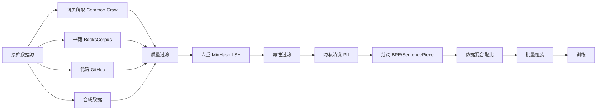
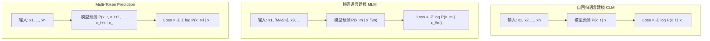
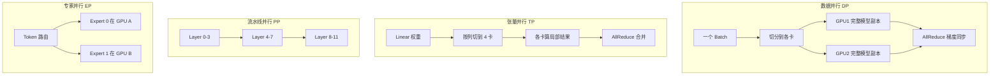

# 预训练技术

## 1. 数据工程
### 数据采集
- **网页爬取**：Common Crawl、CCNet、基于 URL 筛选的语言分类
- **书籍与论文**：BooksCorpus、arXiv、PubMed、法律文档
- **代码数据**：GitHub、The Stack、CodeParrot、BigCode
- **多模态数据**：LAION-5B、DataComp、Conceptual Captions、WIT
- **合成数据**：2025-2026 爆发式增长，DeepSeek V4 使用大量合成数据训练

### 数据清洗
- **质量过滤**：语言检测（fastText）、困惑度过滤、符号比例过滤、文档长度过滤
- **去重**：MinHash LSH（近似去重）、Exact Substring Dedup（精确子串）、SimHash、Bloom Filter
- **毒性过滤**：关键词过滤、分类器过滤（基于 RoBERTa 毒性检测）、PII 移除
- **隐私清洗**：邮箱/电话/IP 正则移除、指纹数据脱敏

### 数据混合配比
- **数据采样策略**：根据数据源质量加权采样、平滑采样
- **课程学习**：先简单后困难、先高质量后多样化
- **消融实验**：数据配比对下游任务的影响（The Pile、Dolma、RedPajama 经验）
- **数据质量评估**：Data-Infused Scaling Laws、数据质量评分模型
- **多 Token 预测数据**：MTP 策略需要特殊的序列组织方式

### 合成数据
- **重写型合成**：对自然文本重写，混合 1/3 合成 + 2/3 自然可加速 5-10×
- **教科书型合成**：LLM 生成教材质量文本，但小规模数据下损失偏高
- **混合比例**：最优约 30% 合成数据（研究来自 Meta，2025）
- **模型坍缩**：单轮合成无明显退化，但纯生成式合成在多轮场景下出现退化信号
- **DeepSeek V4**：在 32T+ token 训练中大量使用结构化合成数据（代码迹、代理执行迹）

### 分词器 Tokenizer
- **BPE（Byte Pair Encoding）**：GPT-2/LLaMA/Qwen 系列
- **Unigram**：SentencePiece 架构
- **WordPiece**：BERT 使用
- **SentencePiece**：纯文本分词，支持 BPE 和 Unigram
- **词汇表设计**：tiktoken（OpenAI）、cl100k_base、LlamaTokenizer，通常 32K-128K tokens
- **特殊 Token**：`<unk>`、`<s>`、`</s>`、`<pad>`、`<mask>`，工具调用标记（function_call、tool_use）
- **多语言分词**：BGE-M3 等多语言模型需要跨语言词汇表设计

## 2. 训练目标
- **自回归语言建模（CLM）**：最大化下一个 Token 预测对数似然（主流）
- **前缀语言建模**：PrefixLM，Encoder-Decoder 训练范式
- **掩码语言建模（MLM）**：BERT 随机掩码 15% Token 预测
- **多任务混合**：UL2（Causal LM + Span Corruption + Prefix LM），T5 的 Span Corruption
- **Multi-Token Prediction (MTP)**（DeepSeek V3/V4）：单次前向预测多个未来 Token，改善规划能力
- **GRPO 目标**：Group Relative Policy Optimization，作为后训练目标，无需价值函数

## 3. 训练策略
### 学习率调度
- **Warmup + Cosine Decay**：线性预热（通常 2000 步），余弦退火
- **Warmup + Constant + Cooldown**：常数学习率 + 最终冷却（MIT 2025 研究验证其可预测性不低于 Cosine）
- **重启动**：Cosine Annealing with Warm Restarts（SGDR）
- **权重平均**：SWA（Stochastic Weight Averaging），不增加训练成本提升模型质量

### 优化器选择
- **AdamW**：当前首选，权重衰减与 Adam 解耦
- **Sophia**：基于对角 Hessian 估计的二阶优化器
- **Muon 优化器**（2025-2026 突破）：
  - 基于 Newton-Schulz 迭代矩阵正交化
  - DeepSeek V4 大规模验证成功，1.6T 参数上训练稳定
  - 收敛速度比 AdamW 快 2×，训练更稳定
  - 首次证明非 Adam 优化器在 LLM 大规模训练中可行
- **LAMB / LARS**：大规模分布式训练优化器
- **混合精度优化**：FP16/BF16 混合精度（AMP）、损失缩放

### 权重初始化
- **默认初始化**：正态分布 std=0.02（GPT-2 方案）
- **残差连接初始化**：小值初始化或 Post-LN 调整
- **DeepNet 初始化**：残差缩放因子（如 0.1 倍初始化）
- **mHC 初始化**：DeepSeek V4 的 Manifold-Constrained Hyper-Connections 使用 Sinkhorn 投影初始化

### 正则化技术
- **Dropout**：残差连接和注意力中的 Dropout（通常 0.0-0.1）
- **Label Smoothing**：目标概率平滑
- **Weight Decay**：参数范数约束，通常 0.1
- **Gradient Clipping**：全局梯度裁剪，通常 max_norm=1.0
- **Stochastic Depth**：随机跳过层
- **Z-loss 正则化**：MoE 路由器 logits 的辅助 Loss

## 4. 分布式训练
### 并行策略
- **数据并行（DP）**：每卡一份模型副本，同步梯度（DDP/FSDP）
- **张量并行（TP）**：Megatron-LM 方案，分块权重到各卡
- **流水线并行（PP）**：GPipe/1F1B 方案，分层分配不同 GPU
- **序列并行（SP）**：沿序列维度切分（Ring Attention、DeepSpeed Ulysses）
- **上下文并行（CP）**：长序列下跨设备分割上下文
- **专家并行（EP）**：MoE 模型将不同专家分配到不同 GPU

### 主流框架
- **DeepSpeed**：ZeRO-1/2/3、ZeRO++、MoE 支持
- **FSDP（Fully Sharded Data Parallel）**：PyTorch 原生，ZeRO-3 等价
- **Megatron-LM**：NVIDIA，TP + PP + DP 三维并行
- **ColossalAI**：多种并行策略整合
- **JAX**：pmap/shard_map、XLA 编译
- **TileLang DSL**（DeepSeek V4）：领域特定语言平衡生产力与性能

### 通信优化
- **通信拓扑**：NVLink（单机内）、InfiniBand/RoCE（跨机）
- **梯度累计**：多次前向后统一 AllReduce
- **异步通信**：计算与通信重叠（overlap）
- **梯度压缩**：Top-K 稀疏化、随机量化、PowerSGD
- **MoE 通信**：Decoupled-Arch，通信与计算完全重叠（DeepSeek V4 单融合内核）

## 5. 训练稳定性
- **损失爆炸处理**：梯度裁剪、损失日志监控、检查点回滚
- **数值稳定性**：BF16 比 FP16 更稳定，FP8 训练出现但尚未完全取代
- **批量大小影响**：批量大小与学习率解耦（平方根缩放 / 线性缩放）
- **学习率重启**：训练崩溃后从稳定 checkpoint 降低 LR 重启
- **mHC 稳定性**：Birkhoff 多面体约束保证残差流 Lipschitz ≤ 1

## 6. Scaling Laws（2025-2026 更新）
- **KM Scaling Law**：Loss = E + A/N^α + B/D^β
- **Chinchilla 最优**：参数量与训练 Token 数约 1:20 比例
- **合成数据 Scaling**：Meta 研究（2025）发现约 30% 合成数据混合最优
- **推理时 Scaling**：Test-time Compute 增加与准确率呈幂律关系
- **RL Scaling Laws**（2026）：强化学习训练中也观察到了可预测的 Scaling 趋势
- **生成式评估 Scaling Law**（Stanford 2025）：pass@k 与预训练计算量/参数量的幂律关系
- **学会遗忘 Scaling**：微调时遗忘预训练知识的速率符合 Scaling Law

## 7. 训练后处理
- **模型平均**：EMA（指数移动平均）、SWA（随机权重平均）
- **检查点管理**：异步保存、按 loss 保存
- **训练-推理精度桥接**：训练 BF16/FP16 到推理 INT8/FP8 转换
- **多阶段后训练**（2026 新范式）：
  - 独立训练领域专家（SFT + GRPO）
  - 统一模型整合（On-policy Distillation）
  - 10+ 个领域教师模型蒸馏到一个模型

## 8. PyTorch 代码示例

### 8.1 数据加载与预处理 Pipeline

```python
import torch
from torch.utils.data import Dataset, DataLoader
from datasets import load_dataset

class PretrainDataset(Dataset):
    def __init__(self, data_path, tokenizer, max_len=2048):
        self.data = load_dataset("text", data_files=data_path, split="train")
        self.tokenizer = tokenizer
        self.max_len = max_len

    def __len__(self):
        return len(self.data)

    def __getitem__(self, idx):
        text = self.data[idx]["text"]
        tokens = self.tokenizer.encode(text, max_length=self.max_len, truncation=True)
        input_ids = tokens[:-1]
        labels = tokens[1:]
        return {"input_ids": torch.tensor(input_ids), "labels": torch.tensor(labels)}

def collate_fn(batch, pad_token_id=0):
    input_ids = [item["input_ids"] for item in batch]
    labels = [item["labels"] for item in batch]
    max_len = max(len(x) for x in input_ids)
    pad_input = torch.stack([torch.cat([ids, torch.full((max_len - len(ids),), pad_token_id)]) for ids in input_ids])
    pad_labels = torch.stack([torch.cat([lbl, torch.full((max_len - len(lbl),), -100)]) for lbl in labels])
    attn_mask = (pad_input != pad_token_id).long()
    return {"input_ids": pad_input, "labels": pad_labels, "attention_mask": attn_mask}

tokenizer = lambda: None
tokenizer.encode = lambda text, max_length, truncation: list(map(ord, text[:max_length]))
dataset = PretrainDataset("data.txt", tokenizer, max_len=512)
loader = DataLoader(dataset, batch_size=8, shuffle=True, collate_fn=lambda b: collate_fn(b))
```

### 8.2 交叉熵损失函数

```python
class CausalLMLoss(nn.Module):
    def __init__(self, ignore_index=-100, label_smoothing=0.0):
        super().__init__()
        self.loss_fn = nn.CrossEntropyLoss(ignore_index=ignore_index, label_smoothing=label_smoothing)

    def forward(self, logits, labels):
        B, T, V = logits.shape
        return self.loss_fn(logits.view(-1, V), labels.view(-1))

def compute_accuracy(logits, labels, ignore_index=-100):
    preds = logits.argmax(dim=-1)
    mask = labels != ignore_index
    correct = (preds == labels) & mask
    return correct.sum() / mask.sum()
```

### 8.3 训练循环简化版

```python
from torch.cuda.amp import autocast, GradScaler

class Trainer:
    def __init__(self, model, optimizer, lr_scheduler, grad_clip=1.0, use_amp=True):
        self.model = model
        self.optimizer = optimizer
        self.scheduler = lr_scheduler
        self.grad_clip = grad_clip
        self.scaler = GradScaler(enabled=use_amp)
        self.loss_fn = CausalLMLoss()

    def train_step(self, batch):
        self.model.train()
        with autocast(enabled=self.scaler.is_enabled()):
            logits = self.model(batch["input_ids"])
            loss = self.loss_fn(logits, batch["labels"])
        self.scaler.scale(loss).backward()
        self.scaler.unscale_(self.optimizer)
        torch.nn.utils.clip_grad_norm_(self.model.parameters(), self.grad_clip)
        self.scaler.step(self.optimizer)
        self.scaler.update()
        self.optimizer.zero_grad()
        self.scheduler.step()
        return loss.item()

    def train_epoch(self, loader):
        total_loss = 0
        for step, batch in enumerate(loader):
            loss = self.train_step(batch)
            total_loss += loss
            if step % 100 == 0:
                print(f"Step {step}, Loss: {loss:.4f}, LR: {self.scheduler.get_last_lr()[0]:.2e}")
        return total_loss / len(loader)
```

### 8.4 Tokenizer 使用示例

```python
from transformers import AutoTokenizer

def build_tokenizer_pipeline():
    tokenizer = AutoTokenizer.from_pretrained("meta-llama/Llama-3-8B")
    tokenizer.pad_token = tokenizer.eos_token

    texts = ["Hello world", "预训练技术正在快速发展"]
    encoded = tokenizer(texts, padding=True, truncation=True, max_length=128, return_tensors="pt")
    decoded = tokenizer.batch_decode(encoded["input_ids"])
    return encoded, decoded

def pack_sequences(tokenizer, texts, max_len=2048):
    all_ids = []
    for text in texts:
        ids = tokenizer.encode(text, add_special_tokens=False)
        all_ids.extend(ids)
        all_ids.append(tokenizer.eos_token_id)
    chunks = [all_ids[i:i+max_len] for i in range(0, len(all_ids), max_len)]
    return torch.tensor([c + [tokenizer.pad_token_id] * (max_len - len(c)) for c in chunks])
```

### 8.5 优化器设置与学习率调度

```python
from torch.optim import AdamW
from torch.optim.lr_scheduler import CosineAnnealingLR

def configure_optimizer(model, learning_rate=3e-4, weight_decay=0.1, betas=(0.9, 0.95)):
    decay_params = [p for n, p in model.named_parameters() if p.ndim >= 2 and "bias" not in n]
    no_decay_params = [p for n, p in model.named_parameters() if p.ndim < 2 or "bias" in n]
    optimizer = AdamW([
        {"params": decay_params, "weight_decay": weight_decay},
        {"params": no_decay_params, "weight_decay": 0.0},
    ], lr=learning_rate, betas=betas)
    return optimizer

def create_scheduler(optimizer, warmup_steps=2000, total_steps=50000):
    def warmup_cosine(step):
        if step < warmup_steps:
            return step / warmup_steps
        return 0.5 * (1 + torch.cos(torch.tensor((step - warmup_steps) / (total_steps - warmup_steps) * 3.14159)))
    return torch.optim.lr_scheduler.LambdaLR(optimizer, warmup_cosine)
```

## 9. Mermaid 架构图

### 9.1 预训练数据 Pipeline



### 9.2 损失函数对比



## 10. 对比表格

### 10.1 数据清洗方法对比

| 方法 | 目标 | 算法 | 时间复杂度 | 效果 |
|------|------|------|-----------|------|
| 语言检测 | 过滤非目标语言 | fastText 分类器 | O(n) | 准确率 95%+ |
| 困惑度过滤 | 低质量文本 | KenLM / 小模型评分 | O(n × L) | 去除噪声文本 |
| MinHash LSH | 近似去重 | Jaccard 相似度 + 哈希 | O(n × k) | 适合大规模 |
| Exact Substring | 精确去重 | Suffix Array / Bloom Filter | O(n²) 理论 | 100% 去重 |
| 毒性过滤 | 有害内容 | RoBERTa 分类 / 关键词 | O(n) | 召回率 90%+ |

### 10.2 优化器对比

| 优化器 | 内存开销 | 收敛速度 | 大规模稳定性 | 超参数敏感性 | 代表模型 |
|-------|---------|---------|------------|------------|---------|
| AdamW | 2× 参数量 | 基准 | 好 | 中 | GPT-4 / LLaMA |
| Sophia | 2× 参数量 | 1.5× AdamW | 好 | 低 | 中小模型 |
| Muon | 1× 参数量 | 2× AdamW | 极好 | 低 | DeepSeek V4 |
| LAMB | 2× 参数量 | 1.2× AdamW | 好 | 中 | BERT 大批量 |
| SGD | 1× 参数量 | 慢 | 差 | 低 | 很少用于 LLM |

### 10.3 并行策略对比

| 策略 | 切分维度 | 通信量 | 适用场景 | 代表框架 |
|------|---------|-------|---------|---------|
| 数据并行 (DP) | 批次维度 | 梯度 AllReduce | 模型可单卡 | DDP / FSDP |
| 张量并行 (TP) | 权重矩阵 | 每层 AllReduce | 单机多卡大模型 | Megatron-LM |
| 流水线并行 (PP) | 层维度 | 激活传递 | 跨机大模型 | GPipe / 1F1B |
| 序列并行 (SP) | 序列维度 | 注意力中间值 | 长上下文 | Ring Attention |
| 专家并行 (EP) | 专家维度 | Token 路由 | MoE 模型 | DeepSpeed-MoE |

### 10.4 正则化技术对比

| 方法 | 机制 | 效果 | 训练影响 | 推荐配置 |
|------|------|------|---------|---------|
| Dropout | 随机丢弃神经元 | 防止过拟合 | 训练变慢 | 0.0-0.1 (小模型 0.1) |
| Label Smoothing | 软化目标分布 | 提升泛化 | 训练略慢 | ϵ=0.1 |
| Weight Decay | L2 范数约束 | 控制参数规模 | 极小 | λ=0.1 |
| Gradient Clipping | 梯度范数截断 | 防梯度爆炸 | 极小 | max_norm=1.0 |
| Z-loss | MoE 路由正则化 | 均衡专家负载 | 极小 | 0.001 |

### 10.5 分词器方案对比

| 分词器 | 算法 | 词汇表大小 | 多语言能力 | 代表模型 |
|-------|------|-----------|----------|---------|
| BPE | 字节对合并 | 32K-128K | 中等 | GPT / LLaMA / Qwen |
| Unigram | 概率模型剪枝 | 32K-128K | 好 | SentencePiece |
| WordPiece | 合并最大化互信息 | 30K | 差 | BERT |
| tiktoken | BPE + 正则优化 | 100K (cl100k) | 好 | GPT-4 / o1 |

## 11. Scaling Laws 对比表

| 法则 | 核心公式 | 关键发现 | 适用场景 |
|------|---------|---------|---------|
| KM Scaling | Loss = E + A/N^α + B/D^β | Loss 随参数和数据幂律下降 | 预训练预测 |
| Chinchilla | N_opt ≈ D/20 | 参数和 Token 最优配比 | 预算分配 |
| 合成数据 Scaling | 混合 30% 合成最优 | 过度合成导致退化 | 数据策划 |
| RL Scaling | Reward ∼ C^γ | RL 也符合幂律 | RLHF 规划 |
| Test-time Compute | Acc ∼ T^δ | 推理时计算可扩展 | 推理策略 |

## 12. 实现案例

### 案例：模拟一次完整的预训练 step（含数据打包与合成数据混合）

以下代码演示如何把「自然文本 + 合成文本」按 7:3 混合打包成定长样本，并完成一次前向/反向，对应正文中「合成数据约 30% 最优」的结论：

```python
import torch
import torch.nn as nn
import torch.nn.functional as F
from torch.utils.data import IterableDataset

# 自然语料（模拟）与合成语料（模拟）
NATURAL = ["机器学习是人工智能的重要分支。", "神经网络由多层神经元组成。"] * 100
SYNTHETIC = ["本节讲解梯度下降：参数沿损失负梯度方向更新以最小化误差。"] * 43  # 约 30%

class PackedPretrainSet(IterableDataset):
    def __init__(self, natural, synthetic, tokenizer, max_len=128):
        self.data = natural + synthetic  # 按 7:3 比例混合后整体打乱
        import random
        random.shuffle(self.data)
        self.tok = tokenizer
        self.max_len = max_len
    def __iter__(self):
        buf = []
        for text in self.data:
            ids = self.tok(text)
            buf.extend(ids + [self.tok(" ")])  # 文档间用空格分隔
            while len(buf) >= self.max_len:
                chunk = buf[:self.max_len]
                buf = buf[self.max_len:]
                x = torch.tensor(chunk[:-1]); y = torch.tensor(chunk[1:])
                yield x, y

# 极简 tokenizer：按字符（仅演示流程）
def char_tok(s):
    return [ord(c) % 5000 for c in s]

model = nn.Linear(5000, 5000)  # 占位：真实为 Transformer
opt = torch.optim.AdamW(model.parameters(), lr=3e-4)
ds = PackedPretrainSet(NATURAL, SYNTHETIC, char_tok, max_len=32)
loader = torch.utils.data.DataLoader(ds, batch_size=4)

for step, (x, y) in enumerate(loader):
    logits = model(x)  # [B, T, V]
    loss = F.cross_entropy(logits.view(-1, 5000), y.view(-1))
    loss.backward()
    opt.step(); opt.zero_grad()
    if step == 0:
        print(f"合成数据占比 ≈ {len(SYNTHETIC)/(len(NATURAL)+len(SYNTHETIC)):.0%}, 首步 loss={loss.item():.4f}")
    if step >= 3:
        break
```

### 案例：根据模型规模选择分布式并行策略

下表给出从单卡到千卡集群的并行组合建议（与正文并行策略对应）：

| 模型规模 | 推荐并行组合 | 设备示例 | 说明 |
|---------|------------|---------|------|
| < 7B | 数据并行 (DP) | 1-2× GPU | 单卡放得下，纯 DP 即可 |
| 7B-70B | DP + 张量并行 (TP=2~4) | 1-2× 8卡机 | TP 切权重，DP 扩批 |
| 70B-300B | TP + PP + DP | 多机 | PP 切层，缓解显存 |
| > 300B (MoE) | TP + PP + EP + SP | 集群 | 专家并行 + 序列并行必选 |



### 案例：用 MinHash LSH 做近似去重（概念实现）

对应正文「去重：MinHash LSH」一节，下面用 3 个哈希函数演示文档相似度估计：

```python
import hashlib

def shingles(text, k=3):
    # 字符 3-gram 作为集合元素
    return set(text[i:i+k] for i in range(len(text) - k + 1))

def minhash_signature(s, num_hashes=3):
    sig = []
    for i in range(num_hashes):
        # 用不同盐值模拟多个哈希函数
        min_val = min(int(hashlib.md5((str(i) + gram).encode()).hexdigest(), 16) for gram in s)
        sig.append(min_val)
    return sig

def jaccard(a, b):
    return len(a & b) / len(a | b)

doc_a = shingles("大模型预训练需要海量高质量数据")
doc_b = shingles("大模型预训练需要海量高质量文本数据")
doc_c = shingles("今天天气晴朗适合外出散步")

print(f"a/b 真实 Jaccard = {jaccard(doc_a, doc_b):.3f}")
print(f"a/c 真实 Jaccard = {jaccard(doc_a, doc_c):.3f}")
# 签名越接近，越可能是近重复文档 → 触发去重
print("a 签名:", minhash_signature(doc_a))
print("b 签名:", minhash_signature(doc_b))
```
