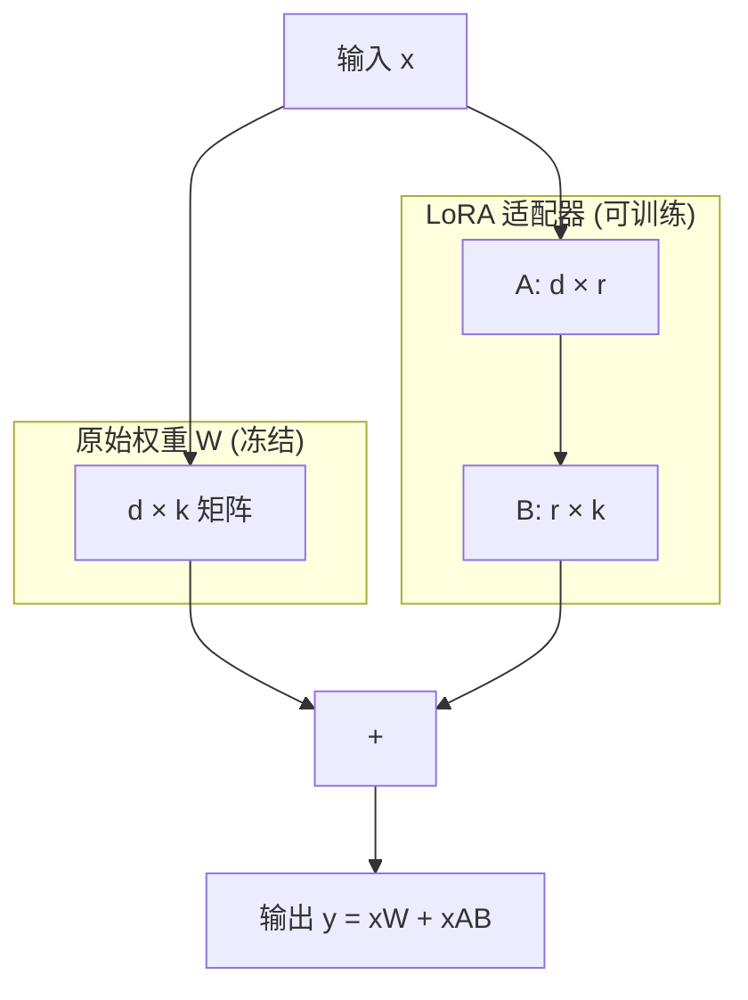
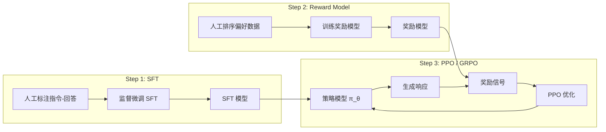

# 微调与对齐

## 1. 全参数微调 Full Fine-Tuning
- **全量更新**：所有参数参与训练，完整反向传播
- **适用场景**：领域大模型基座训练、从头适应
- **硬件需求**：高显存（每参数保存优化器状态），70B 模型需多卡 A100/H100
- **批量大小**：通常较小（4-64），依赖模型规模和 GPU 数量
- **微调技巧**：较小学习率（1e-5 ~ 5e-5）、冻结 Embedding 层、分阶段逐步解冻
- **2026 趋势**：全参数微调逐渐被 PEFT + 多阶段蒸馏流水线取代

## 2. 参数高效微调 PEFT
### LoRA（Low-Rank Adaptation）
- **原理**：权重更新 ΔW = BA（A: d×r, B: r×k, r << min(d,k)）
- **秩的选择**：r=8/16/32/64，通常 16 效果较好
- **缩放因子 alpha**：alpha/r 控制更新幅度，通常 alpha=16 或 2×r
- **目标模块选择**：通常 Q/K/V/O + 所有线性层
- **合并与部署**：可合并到原权重或保持分离，vLLM 支持多 LoRA 热切换
- **变体**：LoRA-FA（冻结 A）、rsLoRA（稳定梯度，缩放因子 1/r）

### PiSSA
- **SVD 增强初始化**：用 SVD 主分量初始化 LoRA 矩阵
- **收敛更快**：相比随机初始化，训练速度提升 2×

### DoRA（Weight-Decomposed Low-Rank Adaptation）
- **方向与幅度分解**：权重 = 方向（LoRA 更新） + 幅度（可学习向量）
- **对齐全量微调**：更精确复现全量微调行为，质量优于标准 LoRA
- **2026 推荐**：对质量敏感的场景优先选择 DoRA

### QLoRA
- **NF4 量化**：4-bit NormalFloat 量化
- **双重量化**：对量化常数再做量化，每参数减少 0.5 bit
- **Paged Optimizer**：利用 CPU 内存暂存优化器状态
- **显存对比**：70B 模型可单卡 48GB GPU 微调

### AdaLoRA
- **自适应秩分配**：根据 SVD 重要性动态调整各层 LoRA 秩
- **预算调度**：给定总参数量自动分配到重要层

### 其他 PEFT 方法
- **Adapter**：Transformer 层插入瓶颈 MLP
- **Prefix Tuning**：在 KV 序列前插入可学习前缀向量
- **Prompt Tuning**：在输入 Embedding 前加可学习连续向量
- **IA3**：对激活值做逐元素缩放

### PEFT 选择指南（2026）
| 方法 | 可训练参数 | 显存 | 质量 | 适用场景 |
|------|-----------|------|------|---------|
| LoRA | 0.1-1% | 中等 | 优秀 | 默认选择 |
| DoRA | 0.5-2% | 中等 | 最佳 | 质量优先 |
| QLoRA | 0.1-1% | 极低 | 优秀 | 显存受限 |
| Full FT | 100% | 极高 | 最好 | 充足预算 |

## 3. 监督微调 SFT
- **数据构建**：指令-回答对、System/User/Assistant 格式
- **数据质量**：LIMA 原则 — 1000 条优质数据胜过百万条低质数据
- **格式规范**：ChatML、ShareGPT、OpenAI Messages 格式
- **损失计算**：仅计算 Assistant 回复部分（Answer Loss）
- **打包策略**：多轮对话打包（packing）+ Attention Mask
- **数据配比**：通用数据 + 领域数据混合，避免灾难性遗忘
- **训练退火**：余弦退火到接近 0

## 4. 偏好对齐
### DPO（Direct Preference Optimization）
- 从偏好对中推导隐式奖励，无需显式奖励模型
- 2026 年对齐默认选择，实现简单且稳定

### RLHF（PPO）
- 奖励模型训练 + PPO 优化
- 安全关键场景仍推荐
- 需要额外训练奖励模型，系统复杂度高

### GRPO（Group Relative Policy Optimization）
- **DeepSeek R1/V4 使用**：无需价值函数，仅需分组采样
- 每组生成多个响应，以组内相对优势作为优化信号
- 比 PPO 更简单，适合推理类任务对齐
- **2026 趋势**：推理微调场景优先选择 GRPO

### KTO
- 仅需"好/坏"标签而非显式偏好对
- 适用于只有单侧标注的场景

### SimPO
- 简化偏好优化，去掉参考模型约束
- 更低的训练成本

### IPO / ORPO
- IPO：身份偏好优化
- ORPO：对比对数概率直接优化

### 多阶段后训练流水线（2026 新范式）
- **阶段一**：独立培养领域专家
  - 对不同领域分别做 SFT + GRPO
  - 每个领域训练独立的教师模型
- **阶段二**：统一模型整合
  - On-policy Distillation：多个教师模型蒸馏到一个模型
  - DeepSeek V4 验证：10+ 领域专家蒸馏效果显著
- **优点**：避免多目标冲突，各领域能力更均衡

### 对齐技术
- **Constitutional AI**：AI 自监督原则约束（Claude 方法）
- **Self-Rewarding**：模型自我生成和评估
- **SPIN**：自我博弈训练
- **RAFT**：通过奖励过滤训练数据（RAG + Fine-tuning 混合）

### 对齐目标
- **有用性（Helpfulness）**：准确完成指令
- **诚实性（Honesty）**：正确认知自身能力边界
- **安全性（Harmlessness）**：拒绝有害请求
- **拒绝回答（Refusal）**：对齐"不知道"的拒绝模式
- **风格对齐**：输出长度、格式、语气符合预期

## 5. 领域适应
- **持续预训练（Continue Pre-training）**：在领域语料上继续训练
- **混合微调**：领域数据 + 通用数据，避免 Catastrophic Forgetting
- **EWC（弹性权重巩固）**：Fisher 信息矩阵约束重要参数
- **渐进式微调**：从通用到领域逐步混合数据比例

## 6. 多任务与多轮微调
- **指令格式化**：角色扮演、任务导向、自由对话
- **多任务混合**：NLP 任务 + 对话 + 代码 + 数学
- **损失掩码**：仅对输出计算损失
- **多领域多阶段**：独立训练 + 统一蒸馏（2026 新趋势）

## 7. 微调工具链（2026）
- **Hugging Face TRL**：SFTTrainer、DPOTrainer、GRPOTrainer
- **Axolotl**：简化配置驱动的微调框架
- **Unsloth**：2026 年热门，LoRA/QLoRA 训练速度提升 3-10×，显存减少 70-90%
- **LLaMA Factory**：全栈微调框架

## 8. PyTorch 代码示例

### 8.1 LoRA 实现

```python
import torch
import torch.nn as nn
import torch.nn.functional as F

class LoRALayer(nn.Module):
    def __init__(self, in_dim, out_dim, rank=8, alpha=16):
        super().__init__()
        self.lora_a = nn.Parameter(torch.zeros(in_dim, rank))
        self.lora_b = nn.Parameter(torch.zeros(rank, out_dim))
        self.scaling = alpha / rank
        nn.init.kaiming_uniform_(self.lora_a, a=5 ** 0.5)
        nn.init.zeros_(self.lora_b)

    def forward(self, x):
        return (x @ self.lora_a @ self.lora_b) * self.scaling

class LoRALinear(nn.Module):
    def __init__(self, original_linear, rank=8, alpha=16):
        super().__init__()
        self.linear = original_linear
        self.lora = LoRALayer(original_linear.in_features, original_linear.out_features, rank, alpha)
        self.linear.weight.requires_grad = False
        if self.linear.bias is not None:
            self.linear.bias.requires_grad = False

    def forward(self, x):
        return self.linear(x) + self.lora(x)

def apply_lora(model, target_modules=None, rank=8, alpha=16):
    if target_modules is None:
        target_modules = ["q_proj", "k_proj", "v_proj", "o_proj", "gate_proj", "up_proj", "down_proj"]
    for name, module in model.named_modules():
        if any(t in name for t in target_modules) and isinstance(module, nn.Linear):
            parent = model
            parts = name.split(".")
            for p in parts[:-1]:
                parent = getattr(parent, p)
            setattr(parent, parts[-1], LoRALinear(module, rank, alpha))
    return model
```

### 8.2 QLoRA bitsandbytes 示例

```python
from transformers import AutoModelForCausalLM, AutoTokenizer, BitsAndBytesConfig
from peft import LoraConfig, get_peft_model

def setup_qlora(model_name, rank=16, alpha=32):
    bnb_config = BitsAndBytesConfig(
        load_in_4bit=True,
        bnb_4bit_quant_type="nf4",
        bnb_4bit_use_double_quant=True,
        bnb_4bit_compute_dtype=torch.bfloat16,
    )
    model = AutoModelForCausalLM.from_pretrained(
        model_name,
        quantization_config=bnb_config,
        device_map="auto",
        torch_dtype=torch.bfloat16,
    )
    tokenizer = AutoTokenizer.from_pretrained(model_name)

    lora_config = LoraConfig(
        r=rank,
        lora_alpha=alpha,
        target_modules=["q_proj", "k_proj", "v_proj", "o_proj"],
        lora_dropout=0.05,
        bias="none",
        task_type="CAUSAL_LM",
    )
    model = get_peft_model(model, lora_config)
    model.print_trainable_parameters()
    return model, tokenizer

def print_trainable_stats(model):
    total = sum(p.numel() for p in model.parameters())
    trainable = sum(p.numel() for p in model.parameters() if p.requires_grad)
    print(f"Total: {total:,}, Trainable: {trainable:,} ({trainable/total:.4%})")
```

### 8.3 DPO 损失函数

```python
class DPOLoss(nn.Module):
    def __init__(self, beta=0.1):
        super().__init__()
        self.beta = beta

    def forward(self, policy_chosen_logps, policy_rejected_logps, ref_chosen_logps, ref_rejected_logps):
        log_ratios_chosen = policy_chosen_logps - ref_chosen_logps
        log_ratios_rejected = policy_rejected_logps - ref_rejected_logps
        logits = self.beta * (log_ratios_chosen - log_ratios_rejected)
        loss = -F.logsigmoid(logits).mean()
        chosen_rewards = self.beta * log_ratios_chosen.detach()
        rejected_rewards = self.beta * log_ratios_rejected.detach()
        return loss, chosen_rewards.mean(), rejected_rewards.mean()

def compute_log_probs(model, input_ids, attention_mask, labels):
    outputs = model(input_ids, attention_mask=attention_mask)
    logits = outputs.logits
    log_probs = F.log_softmax(logits, dim=-1)
    per_token_logps = torch.gather(log_probs, dim=-1, index=labels.unsqueeze(-1)).squeeze(-1)
    return (per_token_logps * attention_mask).sum(dim=-1) / attention_mask.sum(dim=-1)
```

### 8.4 RLHF PPO 伪代码

```python
class RLHFTrainer:
    def __init__(self, policy, ref_policy, reward_model, value_model, kl_coef=0.04):
        self.policy = policy
        self.ref_policy = ref_policy
        self.reward_model = reward_model
        self.value_model = value_model
        self.kl_coef = kl_coef
        self.opt = torch.optim.AdamW(policy.parameters(), lr=1e-6)

    def compute_advantages(self, responses, rewards):
        with torch.no_grad():
            values = self.value_model(responses).squeeze(-1)
            ref_log_probs = self._get_log_probs(self.ref_policy, responses)
            cur_log_probs = self._get_log_probs(self.policy, responses)
            kl = cur_log_probs - ref_log_probs
            penalized_rewards = rewards - self.kl_coef * kl
        advantages = penalized_rewards - values
        returns = penalized_rewards
        return advantages, returns

    def train_step(self, prompts):
        responses = self.policy.generate(prompts, max_new_tokens=256)
        rewards = self.reward_model(prompts, responses)
        advantages, returns = self.compute_advantages(responses, rewards)
        cur_log_probs = self._get_log_probs(self.policy, responses)
        loss = -cur_log_probs * advantages
        loss = loss.mean()
        loss.backward()
        self.opt.step()
        self.opt.zero_grad()
        return {"loss": loss.item(), "reward": rewards.mean().item()}

    def _get_log_probs(self, model, responses):
        logits = model(responses).logits
        return F.log_softmax(logits, dim=-1).gather(-1, responses.unsqueeze(-1)).squeeze(-1).sum(-1)
```

### 8.5 GRPO 简化实现

```python
class GRPOTrainer:
    def __init__(self, policy, ref_policy, reward_fn, group_size=8, kl_coef=0.01):
        self.policy = policy
        self.ref_policy = ref_policy
        self.reward_fn = reward_fn
        self.group_size = group_size
        self.kl_coef = kl_coef

    def train_step(self, prompt):
        responses = []
        for _ in range(self.group_size):
            resp = self.policy.generate(prompt, max_new_tokens=256)
            responses.append(resp)
        rewards = [self.reward_fn(prompt, r) for r in responses]
        rewards = torch.tensor(rewards)
        advantages = (rewards - rewards.mean()) / (rewards.std() + 1e-8)

        total_loss = 0
        for resp, adv in zip(responses, advantages):
            log_probs = self._log_probs(self.policy, resp)
            ref_log_probs = self._log_probs(self.ref_policy, resp)
            kl = torch.exp(ref_log_probs - log_probs) - (ref_log_probs - log_probs) - 1
            loss = -(log_probs * adv) + self.kl_coef * kl
            total_loss += loss.sum()
        total_loss.backward()
        return {"loss": total_loss.item(), "mean_reward": rewards.mean().item()}

    def _log_probs(self, model, tokens):
        logits = model(tokens).logits
        return F.log_softmax(logits, dim=-1).gather(-1, tokens.unsqueeze(-1)).squeeze(-1)
```

### 8.6 SFT 训练循环

```python
class SFTTrainer:
    def __init__(self, model, tokenizer, optimizer, lr_scheduler):
        self.model = model
        self.tokenizer = tokenizer
        self.optimizer = optimizer
        self.scheduler = lr_scheduler

    def prepare_conversation(self, messages):
        text = self.tokenizer.apply_chat_template(messages, tokenize=False)
        tokens = self.tokenizer(text, truncation=True, max_length=2048, return_tensors="pt")
        labels = tokens["input_ids"].clone()
        assistant_start = (tokens["input_ids"] == self.tokenizer.convert_tokens_to_ids("<|assistant|>")).nonzero(as_tuple=True)[1]
        if len(assistant_start) > 0:
            labels[:, :assistant_start[0]] = -100
        return tokens["input_ids"], tokens["attention_mask"], labels

    def train_on_messages(self, messages):
        input_ids, attention_mask, labels = self.prepare_conversation(messages)
        outputs = self.model(input_ids, attention_mask=attention_mask, labels=labels)
        loss = outputs.loss
        loss.backward()
        self.optimizer.step()
        self.optimizer.zero_grad()
        self.scheduler.step()
        return loss.item()
```

## 9. Mermaid 架构图

### 9.1 LoRA 结构图



### 9.2 RLHF 三步图



## 10. 对比表格

### 10.1 PEFT 方法详细对比

| 方法 | 可训练参数 | 额外推理开销 | 显存需求 | 质量损失 | 适用场景 |
|------|-----------|------------|---------|---------|---------|
| Adapter | 1-3% | 小（增加层数） | 中 | 轻微 | 多任务 |
| LoRA | 0.1-1% | 可合并，零开销 | 低 | 极小 | 默认推荐 |
| DoRA | 0.5-2% | 可合并，零开销 | 中 | 几乎无 | 质量敏感 |
| QLoRA (NF4) | 0.1-1% | 量化推理 | 极低 | 轻微 | 显存受限 |
| Prefix Tuning | 0.01-0.1% | 增加序列长度 | 极低 | 中 | 生成控制 |
| Prompt Tuning | 0.001-0.01% | 增加序列长度 | 极低 | 中 | 简单适配 |
| IA3 | 0.01-0.1% | 可合并 | 极低 | 中 | 高效适配 |

### 10.2 对齐方法对比

| 方法 | 需奖励模型 | 需参考模型 | 训练复杂度 | 对齐效果 | 2026 推荐度 |
|------|-----------|-----------|-----------|---------|------------|
| RLHF (PPO) | 是 | 是 | 高 | 最好 | ⭐⭐⭐ 安全场景 |
| DPO | 否 | 是 | 低 | 优秀 | ⭐⭐⭐⭐⭐ 默认 |
| GRPO | 否 | 可选 | 中 | 优秀 | ⭐⭐⭐⭐⭐ 推理 |
| KTO | 否 | 是 | 低 | 好 | ⭐⭐⭐ 单侧标签 |
| SimPO | 否 | 否 | 极低 | 好 | ⭐⭐⭐⭐ 低成本 |
| ORPO | 否 | 否 | 极低 | 好 | ⭐⭐⭐⭐ 一体化 |

### 10.3 SFT vs RLHF 对比

| 维度 | SFT | RLHF | GRPO |
|------|-----|------|------|
| 数据需求 | 指令-回答对 | 偏好对 + 奖励模型 | 分组采样 |
| 数据量 | 数千至数万 | 数万至数十万 | 数万 |
| 训练稳定性 | 稳定 | 不稳定，需调参 | 较稳定 |
| 探索能力 | 无 | 有（采样） | 有（分组） |
| 对齐程度 | 表面模仿 | 深层对齐 | 推理优化 |
| 计算成本 | 低 | 高（奖励模型 + PPO） | 中（多次采样） |

### 10.4 微调工具对比（2026）

| 工具 | LoRA | QLoRA | DPO | GRPO | 速度优化 | 显存优化 | 框架 |
|------|------|-------|-----|------|---------|---------|------|
| TRL (HF) | ✅ | ✅ | ✅ | ✅ | 标准 | 标准 | Transformers |
| Axolotl | ✅ | ✅ | ✅ | ❌ | 快 | 好 | YAML 配置 |
| Unsloth | ✅ | ✅ | ❌ | ❌ | 3-10× | 减少 70-90% | 需 HF |
| LLaMA Factory | ✅ | ✅ | ✅ | ❌ | 快 | 好 | Web UI |
| OpenPipe | ✅ | ❌ | ❌ | ❌ | 快 | 好 | SaaS |

### 10.5 多阶段后训练流水线阶段对比

| 阶段 | 方法 | 模型数量 | 计算成本 | 训练数据 | 优缺点 |
|------|------|---------|---------|---------|-------|
| 单一 SFT | 端到端 SFT | 1 | 低 | 混合数据 | 简单但多任务冲突 |
| SFT + DPO | 两阶段 | 2+ | 中 | 偏好对 | 质量好 |
| 独立专家 | 分领域 SFT + GRPO | N 个专家 | 高 | 分领域 | 无冲突，专家强 |
| On-policy Distill | 蒸馏到统一模型 | N+1 | 高 | 专家合成 | 最佳均衡 |

### 10.6 对齐目标权重配置

| 目标 | 权重 (RLHF 奖励) | 训练策略 | 评估指标 | 常见问题 |
|------|-----------------|---------|---------|---------|
| 有用性 | 0.4-0.6 | SFT + DPO | MT-Bench | 过度详细 |
| 诚实性 | 0.2-0.3 | TruthfulQA 微调 | TruthfulQA | 过度保守 |
| 安全性 | 0.2-0.3 | Red Teaming | SafetyBench | 过度拒绝 |
| 风格对齐 | 0.05-0.1 | 直接约束 | 人工评估 | 风格不一致 |
