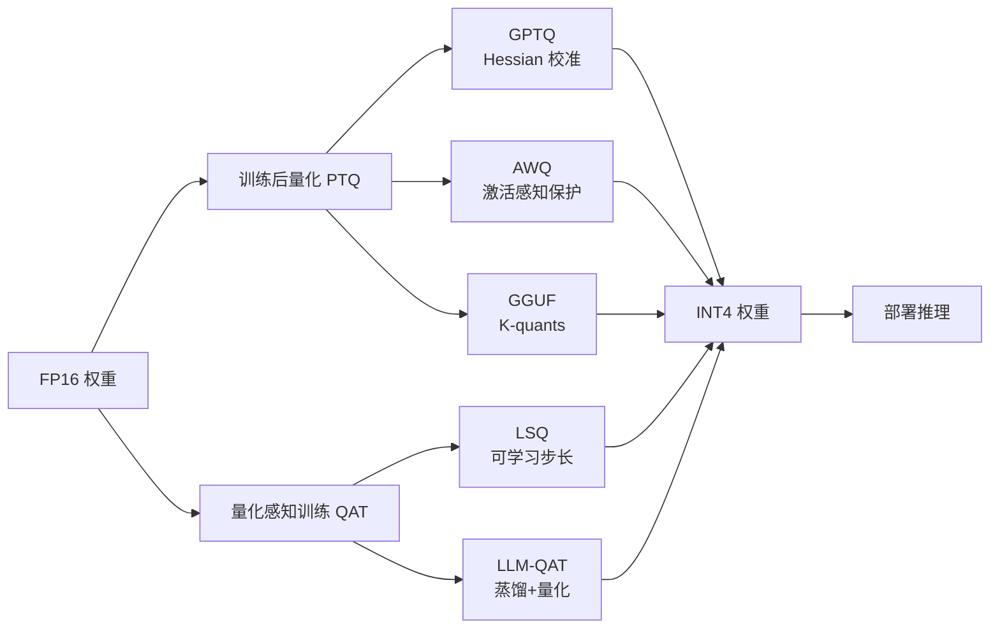

# 推理优化

## 1. KV Cache 优化
### 基础 KV Cache
- **原理**：逐 Token 生成时缓存历史 Key/Value
- **空间复杂度**：O(batch × layers × seq_len × d_k)
- **Prefill（预填充）+ Decode（自回归解码）** 两阶段

### KV Cache 压缩
- **Multi-Query Attention（MQA）**：所有 Query Head 共享 KV，缓存降低 8×
- **Grouped Query Attention（GQA）**：分组共享，灵活折中
- **Multi-head Latent Attention（MLA）**（DeepSeek V3）：低秩压缩 KV，5-10× 压缩
- **Compressed Sparse Attention (CSA)**（DeepSeek V4）：沿序列维度压缩 KV Cache，再做稀疏注意力
- **Heavily Compressed Attention (HCA)**（DeepSeek V4）：更强压缩率，保持密集注意力
- **CSA + HCA 混合**：1M 上下文时仅需 V3.2 的 10% KV Cache 和 27% FLOPs
- **KV8/KV4 量化**：INT8/INT4 量化存储 KV Cache
- **KV Cache Offloading**：溢出时卸载到 CPU 内存
- **Prefix Caching**：复用系统提示词或用户前缀的 KV Cache（SGLang RadixAttention）

### 窗口 / 剪枝策略
- **Sliding Window Cache**：只保留最近 N 个 Token（Mistral）
- **Heavy-Hitter Cache（H2O）**：保留注意力权重累积高的 Token
- **StreamingLLM**：保留初始 Token + 窗口内 Token
- **TOVA**：注意力得分最低的 Token 优先卸载
- **FastGen**：分析注意力模式后确定最优缓存策略

## 2. 注意力计算优化
- **Flash Attention V1/V2/V3**：
  - V1：分块 + 在线 softmax 重缩放
  - V2：warp-level 重排，2× vs V1
  - V3：Hopper FP8 Tensor Core + 异步 WGMMA
- **Flash Decoding**：Decode 阶段并行处理 Query
- **PagedAttention**：类虚拟内存 KV 分页管理
- **xFormers**：Memory-Efficient Attention
- **Ring Attention**：分布式长上下文计算
- **DeepSeek Sparse Attention (DSA)**：top-k 稀疏注意力
- **CSA + HCA（DeepSeek V4）**：混合注意力机制，1M 上下文高效处理
- **SGLang RadixAttention**：前缀树自动缓存 KV

## 3. 模型量化
### 量化类型
- **权重量化（W-only）**：W4A16（GPTQ/AWQ）、W8A16
- **权重+激活量化**：W8A8（SmoothQuant）、W4A4（Atom/QoQ）
- **量化粒度**：Per-tensor -> Per-channel -> Per-group（group_size=128/32）

### 主流量化方法
- **GPTQ**：基于 Hessian 矩阵的逐层量化，One-shot
- **AWQ**：激活感知的通道保护，保留 1% 敏感通道
- **GGUF/llama.cpp K-quants**：Q2_K/Q3_K/Q4_K/Q5_K/Q6_K/Q8_0
- **NormalFloat (NF4)**：正态分布最优 4bit 量化
- **FP8（E4M3/E5M2）**：Hopper GPU 原生 8bit 浮点
- **FP4（NV4）**：NVIDIA Blackwell 架构原生支持
- **BitDelta**：微调 Delta 权重的 1-bit 量化
- **AQLM**：Additive Quantization of Language Models，极低位宽（2bit）量化

### 量化对比（70B 模型）
| 方法 | 精度 | VRAM | 吞吐量 | 质量损失 |
|------|------|------|--------|---------|
| FP16 | 16bit | 140GB | 1× | 无 |
| INT8 | 8bit | 70GB | 1.5× | 极小 |
| INT4 (AWQ) | 4bit | 35GB | 3× | 轻微 |
| INT4 (GPTQ) | 4bit | 35GB | 3× | 轻微 |
| NF4 | 4bit | 35GB | 2.5× | 轻微 |

### 量化感知训练 QAT
- **LSQ**：可学习量化步长
- **LLM-QAT**：蒸馏 + 量化联合
- **QuaRot**：旋转量化改善量化特性
- **FP8 训练**：2025-2026 逐渐成熟，H100 原生支持

## 4. 模型剪枝
- **非结构化剪枝**：SparseGPT（OBS 框架，一次剪枝）、Wanda（权重×激活范数）
- **结构化剪枝**：注意力头剪枝、层剪枝（ShortGPT）
- **动态剪枝**：推理时根据输入动态决定剪枝模式

## 5. 知识蒸馏
- **白盒蒸馏**：隐藏状态对齐、注意力分布匹配
- **黑盒蒸馏**：Logit Matching、SeqKD
- **On-policy Distillation**（2026 新范式）：DeepSeek V4 使用，多个领域教师模型同时蒸馏
- **学生模型**：通常为教师的 1/3 ~ 1/10 参数量

## 6. 推测解码 Speculative Decoding
- **原理**：草稿模型生成候选 Token，目标模型并行验证
- **拒绝采样**：接受率 70-90%

### 主流方法
- **SpecInfer**：多草稿模型 + 树验证
- **Medusa**：多头预测未来 Token
- **Self-Speculative**：提前退出层作为草稿
- **Lookahead Decoding**：Jacobi 迭代生成 n-gram
- **Eagle/Eagle2**：基于特征预测的自回归草稿
- **Eagle3**（2026）：改进版，MoE 模型下仍有效

### Speculative Speculative Decoding (SSD)（2025-2026）
- **Saguaro 算法**：验证进行时，草稿模型预判验证结果并预准备
- **消除草稿延迟**：将推测解码的瓶颈从串行变为并行
- **性能**：比标准推测解码快 30%，比自回归解码快 5×

### 使用注意
- 密集模型效果最好
- MoE 模型路由开销可能抵消部分收益
- GPU 利用率越低，推测解码收益越大

## 7. 计算图优化
- **Torch Compile**：JIT 编译、算子融合
- **CUDA Graph**：vLLM 捕获 Decode 计算图，减少 Kernel Launch
- **算子融合**：Flash Attention + Layernorm + Silu + 矩阵乘融合
- **MoE 单融合内核**（DeepSeek V4）：计算、通信、内存访问完全重叠

### 连续批量处理 Continuous Batching
- 首批 Token 到达即返回
- 动态添加/移除请求，提升 GPU 利用率
- vLLM/TGI/TensorRT-LLM/SGLang 均支持

### Prompt 分块/压缩
- 超长预填充分块处理
- Prompt 压缩：减少输入 Token，可 2-5× 压缩
- LLMLingua/LongLLMLingua：基于困惑度的 Prompt 压缩

## 8. 推理服务架构
- **Prefill-Decode 分离**：分别到不同 GPU
- **动态批处理**：运行时自动拼装批次
- **优先级调度**：交互优先、批量后置
- **Request Migration**：GPU 间迁移实现负载均衡
- **Chunked Prefill**：分块预填充减少首 Token 延迟

## 9. FP8 训练与推理
- **H100/B200 原生 FP8 引擎**
- **FP8 训练**：2025-2026 成熟，精度接近 BF16
- **FP8 推理**：降低显存和带宽需求
- **DeepSeek V4**：支持 Anthropic 和 OpenAI 双 API 格式推理

## 10. PyTorch 代码示例

### 10.1 KV Cache 实现

```python
import torch
import torch.nn as nn
import torch.nn.functional as F

class KVCache:
    def __init__(self, max_batch_size, max_seq_len, n_layers, n_head, d_head, dtype=torch.float16):
        self.k_cache = [torch.zeros(max_batch_size, max_seq_len, n_head, d_head, dtype=dtype) for _ in range(n_layers)]
        self.v_cache = [torch.zeros(max_batch_size, max_seq_len, n_head, d_head, dtype=dtype) for _ in range(n_layers)]
        self.seq_lens = torch.zeros(max_batch_size, dtype=torch.long)

    def update(self, layer_idx, key, val, batch_indices, positions):
        self.k_cache[layer_idx][batch_indices, positions] = key
        self.v_cache[layer_idx][batch_indices, positions] = val
        new_lens = positions + 1
        self.seq_lens[batch_indices] = torch.maximum(self.seq_lens[batch_indices], new_lens)

    def get(self, layer_idx, batch_indices):
        seq_len = self.seq_lens[batch_indices].max().item()
        return self.k_cache[layer_idx][batch_indices, :seq_len], self.v_cache[layer_idx][batch_indices, :seq_len]

    def reset(self, batch_indices=None):
        if batch_indices is None:
            for k, v in zip(self.k_cache, self.v_cache):
                k.zero_(); v.zero_()
            self.seq_lens.zero_()
        else:
            for k, v in zip(self.k_cache, self.v_cache):
                k[batch_indices] = 0
                v[batch_indices] = 0
            self.seq_lens[batch_indices] = 0

class AttentionWithKV(nn.Module):
    def __init__(self, d_model, n_head):
        super().__init__()
        self.n_head = n_head
        self.d_head = d_model // n_head
        self.qkv = nn.Linear(d_model, 3 * d_model)
        self.proj = nn.Linear(d_model, d_model)

    def forward(self, x, kv_cache=None, layer_idx=0, batch_idx=0, pos=0):
        B, T, C = x.shape
        qkv = self.qkv(x).chunk(3, dim=-1)
        q, k, v = [t.view(B, T, self.n_head, self.d_head).transpose(1, 2) for t in qkv]
        if kv_cache is not None:
            kv_cache.update(layer_idx, k[0, :, -1:], v[0, :, -1:], batch_idx, pos)
            k_full, v_full = kv_cache.get(layer_idx, batch_idx)
        else:
            k_full, v_full = k, v
        attn = (q @ k_full.transpose(-2, -1)) * (self.d_head ** -0.5)
        attn = F.softmax(attn, dim=-1)
        y = (attn @ v_full).transpose(1, 2).contiguous().view(B, T, C)
        return self.proj(y)
```

### 10.2 Flash Attention 简化实现

```python
def flash_attention_v2(q, k, v, block_size=128):
    B, H, N, D = q.shape
    softmax_scale = D ** -0.5
    output = torch.zeros_like(q)
    for start in range(0, N, block_size):
        end = min(start + block_size, N)
        q_block = q[:, :, start:end]
        O_block = torch.zeros_like(q_block)
        l = torch.zeros(B, H, end - start, 1, device=q.device)
        m = torch.full((B, H, end - start, 1), float("-inf"), device=q.device)
        for kv_start in range(0, N, block_size):
            kv_end = min(kv_start + block_size, N)
            k_block = k[:, :, kv_start:kv_end]
            v_block = v[:, :, kv_start:kv_end]
            s = torch.einsum("bhqd,bhkd->bhqk", q_block, k_block) * softmax_scale
            m_new = torch.maximum(m, s.max(dim=-1, keepdim=True).values)
            p = torch.exp(s - m_new)
            l = l * torch.exp(m - m_new) + p.sum(dim=-1, keepdim=True)
            O_block = O_block * torch.exp(m - m_new) + torch.einsum("bhqk,bhkd->bhqd", p, v_block)
            m = m_new
        O_block = O_block / l
        output[:, :, start:end] = O_block
    return output

def flash_attention_v3(q, k, v, block_size=128):
    torch.backends.cuda.enable_flash_sdp(True)
    return F.scaled_dot_product_attention(q, k, v, is_causal=True)
```

### 10.3 PagedAttention 伪代码

```python
class PageTable:
    def __init__(self, page_size=16, num_pages=1024):
        self.page_size = page_size
        self.num_pages = num_pages
        self.page_table = {}  # logical_page -> physical_block
        self.free_pages = list(range(num_pages))
        self.kv_blocks = torch.zeros(num_pages, page_size, 64, dtype=torch.float16)
        self.v_blocks = torch.zeros(num_pages, page_size, 64, dtype=torch.float16)

    def alloc_pages(self, num_pages):
        pages = self.free_pages[:num_pages]
        self.free_pages = self.free_pages[num_pages:]
        return pages

    def write_block(self, logical_page, physical_block, k_tensor, v_tensor):
        self.kv_blocks[physical_block] = k_tensor
        self.v_blocks[physical_block] = v_tensor
        self.page_table[logical_page] = physical_block

    def read_block(self, logical_page):
        return self.kv_blocks[self.page_table[logical_page]]

class PagedAttention(nn.Module):
    def __init__(self, d_model, n_head, page_size=16):
        super().__init__()
        self.n_head = n_head
        self.d_head = d_model // n_head
        self.page_size = page_size
        self.q_proj = nn.Linear(d_model, d_model)
        self.kv_proj = nn.Linear(d_model, 2 * d_model)
        self.out_proj = nn.Linear(d_model, d_model)

    def forward(self, x, page_table, logical_pages):
        B, T, C = x.shape
        q = self.q_proj(x).view(B, T, self.n_head, self.d_head)
        kv = self.kv_proj(x).view(B, T, 2, self.n_head, self.d_head)
        k, v = kv[:, :, 0], kv[:, :, 1]
        num_kv_pages = (T + self.page_size - 1) // self.page_size
        physical_pages = page_table.alloc_pages(num_kv_pages)
        for i, lp in enumerate(logical_pages):
            page_table.write_block(lp, physical_pages[i], k[:, i*self.page_size:(i+1)*self.page_size], v[:, i*self.page_size:(i+1)*self.page_size])
        attn = torch.einsum("bthd,bkhd->bthk", q, k) * (self.d_head ** -0.5)
        attn = F.softmax(attn, dim=-1)
        out = torch.einsum("bthk,bkhd->bthd", attn, v).contiguous().view(B, T, C)
        return self.out_proj(out)
```

### 10.4 推测解码实现

```python
class SpeculativeDecoder:
    def __init__(self, draft_model, target_model, gamma=5):
        self.draft = draft_model
        self.target = target_model
        self.gamma = gamma

    @torch.no_grad()
    def decode(self, input_ids, max_new_tokens=100):
        for _ in range(max_new_tokens // self.gamma + 1):
            draft_tokens = []
            for step in range(self.gamma):
                logits = self.draft(input_ids).logits[:, -1]
                next_token = torch.multinomial(F.softmax(logits, dim=-1), 1)
                draft_tokens.append(next_token)
                input_ids = torch.cat([input_ids, next_token], dim=-1)
            draft_seq = torch.cat(draft_tokens, dim=-1)
            target_logits = self.target(input_ids).logits
            draft_logits = self.draft(input_ids).logits
            accepted = 0
            for i in range(self.gamma):
                p = F.softmax(target_logits[:, -self.gamma + i - 1], dim=-1)
                q = F.softmax(draft_logits[:, -self.gamma + i - 1], dim=-1)
                r = torch.rand(1, device=input_ids.device)
                if r < (p[0, draft_seq[0, i]] / q[0, draft_seq[0, i]]).clamp(max=1.0):
                    accepted += 1
                else:
                    input_ids = input_ids[:, :-self.gamma + i]
                    bonus_logits = target_logits[:, -1]
                    bonus_token = torch.multinomial(F.softmax(bonus_logits, dim=-1), 1)
                    input_ids = torch.cat([input_ids, bonus_token], dim=-1)
                    break
            if accepted == self.gamma:
                bonus_logits = target_logits[:, -1]
                bonus_token = torch.multinomial(F.softmax(bonus_logits, dim=-1), 1)
                input_ids = torch.cat([input_ids, bonus_token], dim=-1)
        return input_ids
```

### 10.5 W4A16 量化（GPTQ 风格）

```python
class QuantizedLinear(nn.Module):
    def __init__(self, weight, group_size=128):
        super().__init__()
        self.group_size = group_size
        in_feat, out_feat = weight.shape
        weight = weight.T.contiguous()
        self.register_buffer("weight_int4", torch.zeros(in_feat // 2, out_feat, dtype=torch.uint8))
        self.register_buffer("scales", torch.zeros(in_feat // group_size, out_feat, dtype=torch.float16))
        self.register_buffer("zeros", torch.zeros(in_feat // group_size, out_feat, dtype=torch.float16))
        self._quantize(weight)

    def _quantize(self, weight):
        for i in range(0, weight.shape[0], self.group_size):
            group = weight[i:i+self.group_size]
            max_val = group.max(dim=0, keepdim=True).values
            min_val = group.min(dim=0, keepdim=True).values
            scale = (max_val - min_val) / 15.0
            zero = -min_val / scale
            q = (group / scale + zero).round().clamp(0, 15).to(torch.uint8)
            idx = i // self.group_size
            self.scales[idx] = scale.squeeze(0)
            self.zeros[idx] = zero.squeeze(0)
            for j in range(0, self.group_size, 2):
                self.weight_int4[(i + j) // 2] = q[j] | (q[j+1] << 4)

    def forward(self, x):
        weight = torch.zeros(self.group_size * self.scales.shape[0], self.scales.shape[1], device=x.device, dtype=x.dtype)
        for i in range(0, weight.shape[0], self.group_size):
            q = torch.zeros(self.group_size, self.scales.shape[1], device=x.device, dtype=torch.uint8)
            for j in range(0, self.group_size, 2):
                packed = self.weight_int4[(i + j) // 2]
                q[j] = packed & 0x0F
                q[j+1] = (packed >> 4) & 0x0F
            idx = i // self.group_size
            weight[i:i+self.group_size] = (q.float() - self.zeros[idx:idx+1]) * self.scales[idx:idx+1]
        return F.linear(x, weight.T)
```

### 10.6 连续批处理调度

```python
class ContinuousBatchingScheduler:
    def __init__(self, max_batch_size=64, max_total_tokens=4096):
        self.max_batch_size = max_batch_size
        self.max_total_tokens = max_total_tokens
        self.running_requests = []
        self.waiting_queue = []

    def add_request(self, request):
        self.waiting_queue.append(request)

    def schedule(self):
        total_tokens = sum(r.num_tokens for r in self.running_requests)
        while self.waiting_queue and len(self.running_requests) < self.max_batch_size:
            req = self.waiting_queue.pop(0)
            if total_tokens + req.num_tokens <= self.max_total_tokens:
                self.running_requests.append(req)
                total_tokens += req.num_tokens
            else:
                break

    def step(self):
        self.schedule()
        finished = []
        for req in self.running_requests:
            token = self.generate_token(req)
            req.generated.append(token)
            req.num_tokens += 1
            if req.is_finished():
                finished.append(req)
        for req in finished:
            self.running_requests.remove(req)

    def generate_token(self, req):
        return torch.randint(0, 32000, (1,)).item()

class Request:
    def __init__(self, prompt, max_gen_tokens=256):
        self.prompt = prompt
        self.max_gen_tokens = max_gen_tokens
        self.generated = []
        self.num_tokens = len(prompt)

    def is_finished(self):
        return len(self.generated) >= self.max_gen_tokens
```

## 11. Mermaid 架构图

### 11.1 KV Cache 策略对比


### 11.2 量化流程图



## 12. 对比表格

### 12.1 KV Cache 压缩策略对比

| 策略 | 压缩比 | 实现复杂度 | 质量影响 | 适用模型 |
|------|-------|-----------|---------|---------|
| MQA | 8× (相对 MHA) | 低 | 中 | 训练时使用 |
| GQA | 2-8× (灵活) | 低 | 低-中 | LLaMA 3/Gemini |
| MLA | 5-10× | 高 | 极低 | DeepSeek V3/V4 |
| CSA | 10×+ (序列压缩) | 高 | 低 | DeepSeek V4 |
| HCA | 20×+ (强压缩) | 高 | 中 | DeepSeek V4 |
| Sliding Window | 窗口/全长 | 低 | 中 | Mistral |
| H2O | 2-5× | 中 | 低 | 通用 |
| KV8/KV4 量化 | 2-4× | 中 | 极低 | 所有模型 |

### 12.2 推测解码方法对比

| 方法 | 草稿模型 | 加速比 | 实现复杂度 | 适用场景 |
|------|---------|-------|-----------|---------|
| SpecInfer | 多个小模型 | 2-3× | 高 | 分布式 |
| Medusa | 多头预测模块 | 2-3× | 中 | 单卡 |
| Self-Speculative | 提前退出层 | 1.5-2× | 低 | 深层模型 |
| Eagle | 特征预测 | 2-4× | 中 | 密集模型 |
| Eagle3 | 特征预测 (MoE) | 2-3× | 中 | MoE 模型 |
| Lookahead | Jacobi 迭代 | 1.5-2× | 中 | 通用 |
| SSD (Saguaro) | 任意草稿 | 比标准快 30% | 高 | 高吞吐场景 |

### 12.3 量化方法效果对比

| 方法 | 位宽 | Wiki PPL 损失 | 推理速度 | 校准数据 | 硬件支持 |
|------|------|--------------|---------|---------|---------|
| FP16 | 16 | 0.0 (基准) | 1× | 无 | 所有 |
| INT8 (SmoothQuant) | 8 | +0.1-0.3 | 1.5-2× | 少量 | H100/B200 |
| INT4 (AWQ) | 4 | +0.3-0.8 | 3-4× | 少量 | 部分 GPU |
| INT4 (GPTQ) | 4 | +0.2-0.5 | 3× | 少量 | 部分 GPU |
| NF4 (QLoRA) | 4 | +0.5-1.0 | 2.5× | 无 | 所有 |
| FP8 (E4M3) | 8 | +0.05-0.1 | 2× | 无 | H100 原生 |
| AQLM (2bit) | 2 | +2-5 | 4-5× | 需校准 | 专用实现 |

### 12.4 注意力优化对比

| 方法 | 加速机制 | 理论加速 | 精度 | 硬件需求 |
|------|---------|---------|------|---------|
| Flash Attention V2 | Warp 重排 + Tiling | 2× vs V1 | 精确 | Ampere+ |
| Flash Attention V3 | FP8 Tensor Core | 1.5× vs V2 | 精确 | Hopper |
| Flash Decoding | Query 并行 | 8× decode | 精确 | Ampere+ |
| PagedAttention | 虚拟内存管理 | 减少碎片 | 精确 | 所有 |
| Ring Attention | 跨设备分块 | 线性扩展 | 精确 | 多 GPU |
| CUDA Graph | 图捕获 | 减少 Launch 开销 | 精确 | Ampere+ |

### 12.5 推理服务性能指标对比

| 指标 | 定义 | 计算公式 | 优化目标 | 典型值 |
|------|------|---------|---------|-------|
| TTFT | 首 Token 延迟 | Prefill 时间 | < 200ms | 100-500ms |
| TPOT | 每 Token 时间 | Decode 时间 / Token 数 | < 30ms | 10-50ms |
| ITL | Token 间延迟 | Token 输出间隔 | 稳定 | 5-30ms |
| TGS | 每请求每秒 Token | 1 / TPOT | > 50 | 20-100 |
| 吞吐量 | 总 Token/秒 | Batch × TGS | 最大化 | 1000-50000 |

### 12.6 计算图优化对比

| 优化技术 | 延迟改善 | 显存影响 | 首次编译时间 | 适用阶段 |
|---------|---------|---------|------------|---------|
| Torch Compile | 10-30% | 略增 | 分钟级 | Prefill + Decode |
| CUDA Graph | 30-50% (decode) | 略增 | 秒级 | Decode |
| 算子融合 | 10-20% | 略减 | 无 | Prefill + Decode |
| MoE 单融合内核 | 20-40% (MoE) | 不变 | 编译时 | MoE 模型 |
