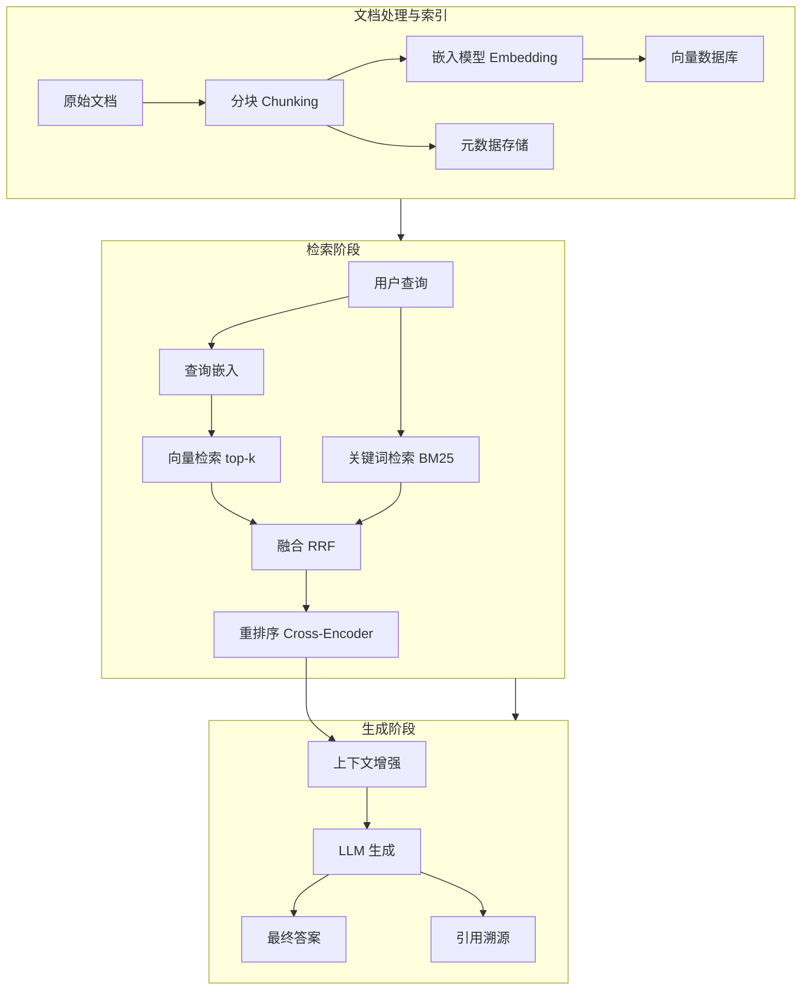

# 检索增强生成 RAG

## 1. RAG 基础架构
### 标准流程
1. **Query** → **Retrieve** → **Augment** → **Generate**

### RAG 三代演进
- **Naive RAG**：单次检索 + 直接生成
- **Advanced RAG**：预检索优化 + 后检索重排 + 多轮迭代
- **Modular RAG**：可插拔组件（搜索/过滤/融合/重排/改写）
- **GraphRAG + Agentic RAG**（2025-2026）：下一代范式

## 2. 文档处理
### 分块策略 Chunking
- **固定大小分块**：256/512/1024 tokens
- **语义分块**：按段落/句子边界
- **递归分块**：LangChain RecursiveCharacterTextSplitter
- **语义分组**：Embedding 相似度聚类
- **滚动窗口**：块间重叠（Overlap）
- **Agentic Chunking**：LLM 自动识别边界
- **Propositions 分块**：独立陈述命题（Atomic Claims）
- **Contextual Retrieval**（Anthropic 2025）：每个 Chunk 附带文档级上下文信息

### 文档清洗与增强
- **格式转换**：PDF/DOCX/HTML/LaTeX 转文本
- **表格提取**：Markdown 或 JSON 结构
- **图片 OCR**：PaddleOCR/Tesseract
- **元数据提取**：标题、作者、时间、层级
- **文档摘要**：为长文档生成摘要条目
- **假设问题生成**：HyDE 逆向检索
- **多视角标题**：同一段落多角度索引

## 3. 嵌入模型 Embedding
### 主流模型（2025-2026）
- **BGE-M3**（BAAI）：多语言+多粒度（稠密+稀疏+多向量）
- **E5 系列**（Microsoft）：Multilingual-E5
- **GTE-Qwen2**（Alibaba）：基于 Qwen2 的嵌入模型
- **text-embedding-3**（OpenAI）：text-embedding-3-small/large
- **Jina Embeddings V3**：支持 loRA 任务适应
- **Cohere Embed v3**：多语言、分类模式支持

### 嵌入维度
- 常见：384 / 512 / 768 / 1024 / 1536 / 3072

### 训练技术
- **对比学习**：InfoNCE Loss
- **硬负样本挖掘**：BM25 难负例、批次内负例
- **Matryoshka Representation Learning**：多层级嵌入维度（从 768 截断到 128 仍有效）
- **蒸馏**：大模型 Embedding 蒸馏到小模型

## 4. 向量数据库
### 主流方案对比
- **FAISS**：本地高性能，IVF/HNSW/PQ 索引
- **Milvus**：分布式云原生，GPU 加速，混合检索
- **Qdrant**：Rust 实现，多租户
- **Weaviate**：GraphQL 接口，原生多模态
- **Chroma**：轻量级原型开发
- **Pinecone**：全托管 SaaS
- **Elasticsearch**：BM25 + 向量混合搜索
- **LanceDB**：2025-2026 新兴，基于 Lance 列式格式，Embedding 优先

### 索引算法
- **IVF**：聚类倒排
- **HNSW**：分层可导航小世界图
- **IVF_PQ**：乘积量化压缩向量
- **DiskANN**：SSD 大规模图索引

### 混合搜索
- **稀疏 + 密集向量**：BM25 + Dense Embedding
- **RRF（倒数排序融合）**：多路排名加权合并
- **ColBERT**：Token 级交互细粒度匹配
- **Splade**：稀疏 Transformer 检索

## 5. 检索优化
### 查询重写
- **查询扩展**：同义词、子问题分解
- **历史上下文改写**：指代消解
- **Stepback 查询**：抽象概念提取

### 检索策略
- **多路检索**：向量 + 关键词 + SQL 并行
- **HyDE**：假想答案检索
- **RAPTOR**：递归摘要树
- **多跳检索**：逐步深化
- **自适应检索**：根据 Query 复杂度调整深度

### 重排序 Re-ranking
- **交叉编码器**（Cross-Encoder）：BGE-Reranker、Cohere Rerank
- **延迟交互**：ColBERT MaxSim
- **LLM 重排序**：Listwise 排序
- **MMR**：相关性 + 多样性平衡

## 6. GraphRAG（2025-2026 核心趋势）
### 基本原理
- 从文档构建知识图谱（实体 + 关系）
- 社区检测算法理解文档层次结构
- 图遍历检索 + 向量检索混合

### Microsoft GraphRAG
- 实体/关系提取 → 社区摘要 → 全局检索
- **准确率提升 20%**，成本降低 99%（6000× Token 减少）
- 适合需要多跳推理和全局理解的场景

### Gartner 报告（2026）
- GraphRAG 是 2026 年数据与分析顶级趋势
- 传统 RAG 在复杂推理场景准确率接近 0%，GraphRAG 可达 90%+

### 工具生态
- **GraphRAG-rs**：Rust 实现，WebGPU 加速，浏览器可运行
- **LlamaIndex + Neo4j/NebulaGraph**：图谱 RAG 集成
- **LightRAG**：轻量级 GraphRAG 实现

## 7. Agentic RAG（2026 核心趋势）
- **Agent 决定检索时机**：何时检索、检索什么、是否追加检索
- **动态工具选择**：Switching 不同检索策略
- **多步推理**：Plan → Retrieve → Reason → Retrieve → Answer
- **Self-RAG**：反思 Token 判断是否需检索
- **Corrective RAG**：生成后验证正确性，错误则回退
- **Agentic RAG 框架**：LangGraph、CrewAI、AutoGen 均支持

## 8. 生成增强 Generation
### 上下文注入
- **动态上下文窗口**：按 Token 预算裁剪
- **多文档融合**：交叉验证生成

### 生成优化
- **引用溯源**：[1][2][3] 标注来源
- **事实性验证**：LLM 自验证
- **生成锚定**：强制基于检索上下文
- **Contextual Retrieval**（Anthropic）：每个 Chunk 包含文档级上下文，减少语义歧义

### 多模态 RAG（2026）
- **文本 + 图像 + 图表**：多模态知识库
- **场景图检索**：图片结构理解 + 跨模态实体链接
- **混合检索**：视觉 + 文本相似度
- **典型问题**：解释图表并关联报告、查找相似示意图

## 9. RAG 评估
### 评估维度
- **检索质量**：Recall@K、Precision@K、MRR、NDCG@K
- **生成质量**：Faithfulness（忠实度）、Answer Relevance
- **上下文精度**：信息利用率

### 评估框架
- **RAGAS**：Faithfulness、Answer Relevance、Context Precision
- **ARES**：LLM 自动生成评估集
- **RGB**：中文 RAG 标准评测
- **CRUD**：Create/Read/Update/Delete 四类评估

### 常见问题
- **检索缺失**：召回不足
- **检索冗余**：不相关信息干扰
- **上下文丢失**：关键信息被截断
- **事实冲突**：检索结果矛盾
- **生成偏差**：模型依赖自身知识而非检索结果

## 10. 高级 RAG 范式总结
- **Agentic RAG**：Agent 动态决定检索策略
- **GraphRAG**：知识图谱增强关系推理
- **Self-RAG**：反思是否需要检索
- **Corrective RAG**：验证 → 修正 → 重生成
- **FLARE**：按需检索
- **CRAG**：检索结果评估 + 修正
- **多模态 RAG**：文本+图像+图表融合

## 11. PyTorch 代码示例

### 11.1 FAISS 检索器实现

```python
import torch
import numpy as np

class FAISSRetriever:
    def __init__(self, embedding_dim=768, index_type="IVF"):
        self.embedding_dim = embedding_dim
        self.documents = []
        self.doc_embeddings = None

    def add_documents(self, texts, embeddings):
        self.documents.extend(texts)
        if self.doc_embeddings is None:
            self.doc_embeddings = embeddings
        else:
            self.doc_embeddings = torch.cat([self.doc_embeddings, embeddings], dim=0)

    def search(self, query_embedding, k=5):
        scores = torch.matmul(query_embedding, self.doc_embeddings.T)
        top_scores, top_indices = torch.topk(scores.squeeze(0), k)
        results = []
        for score, idx in zip(top_scores.tolist(), top_indices.tolist()):
            results.append({"text": self.documents[idx], "score": score, "index": idx})
        return results

class SimpleVectorIndex:
    def __init__(self, dim=768):
        self.dim = dim
        self.vectors = []
        self.metadata = []

    def insert(self, vector, metadata):
        self.vectors.append(torch.tensor(vector))
        self.metadata.append(metadata)

    def query(self, vector, top_k=5):
        if len(self.vectors) == 0:
            return []
        vectors = torch.stack(self.vectors)
        query_vec = torch.tensor(vector)
        scores = F.cosine_similarity(query_vec.unsqueeze(0), vectors, dim=-1)
        top_scores, top_indices = torch.topk(scores, min(top_k, len(scores)))
        return [(self.metadata[idx], score.item()) for idx, score in zip(top_indices.tolist(), top_scores.tolist())]
```

### 11.2 Embedding 模型使用

```python
from transformers import AutoModel, AutoTokenizer

class EmbeddingModel:
    def __init__(self, model_name="BAAI/bge-m3"):
        self.tokenizer = AutoTokenizer.from_pretrained(model_name)
        self.model = AutoModel.from_pretrained(model_name)
        self.model.eval()

    @torch.no_grad()
    def encode(self, texts, normalize=True):
        inputs = self.tokenizer(texts, padding=True, truncation=True, max_length=512, return_tensors="pt")
        outputs = self.model(**inputs)
        embeddings = outputs.last_hidden_state[:, 0]
        if normalize:
            embeddings = F.normalize(embeddings, p=2, dim=-1)
        return embeddings

    def encode_queries(self, queries):
        return self.encode(queries)

    def encode_passages(self, passages):
        return self.encode(passages)
```

### 11.3 完整 RAG Pipeline

```python
class RAGPipeline:
    def __init__(self, retriever, embedding_model, llm):
        self.retriever = retriever
        self.embedder = embedding_model
        self.llm = llm

    def retrieve(self, query, k=5):
        query_emb = self.embedder.encode([query])
        results = self.retriever.search(query_emb, k=k)
        return [r["text"] for r in results]

    def augment(self, query, contexts, max_context_tokens=2048):
        context_text = "\n\n".join([f"[来源 {i+1}] {ctx}" for i, ctx in enumerate(contexts)])
        prompt = f"""基于以下参考信息回答问题。

参考信息：
{context_text}

问题: {query}

请基于参考信息回答，并在答案末尾标注来源编号。如果参考信息不足以回答问题，请说明。"""
        return prompt

    def generate(self, prompt):
        inputs = self.llm.tokenizer(prompt, return_tensors="pt")
        outputs = self.llm.model.generate(**inputs, max_new_tokens=512)
        return self.llm.tokenizer.decode(outputs[0], skip_special_tokens=True)

    def query(self, question, k=5):
        contexts = self.retrieve(question, k)
        prompt = self.augment(question, contexts)
        answer = self.generate(prompt)
        return {"question": question, "answer": answer, "contexts": contexts}
```

### 11.4 HyDE（假设文档检索）实现

```python
class HyDERetriever:
    def __init__(self, llm, embedder, retriever):
        self.llm = llm
        self.embedder = embedder
        self.retriever = retriever

    def generate_hypothetical_answer(self, query):
        prompt = f"""请针对以下问题生成一个假设性的详细回答（即使不确定也要尝试回答）：

问题: {query}

假设回答:"""
        inputs = self.llm.tokenizer(prompt, return_tensors="pt")
        outputs = self.llm.model.generate(**inputs, max_new_tokens=256)
        return self.llm.tokenizer.decode(outputs[0], skip_special_tokens=True)

    def search(self, query, k=5):
        hypo_answer = self.generate_hypothetical_answer(query)
        hypo_emb = self.embedder.encode([hypo_answer])
        return self.retriever.search(hypo_emb, k=k)
```

### 11.5 重排序器实现

```python
class CrossEncoderReranker:
    def __init__(self, model_name="BAAI/bge-reranker-v2-m3"):
        self.model = AutoModel.from_pretrained(model_name)
        self.tokenizer = AutoTokenizer.from_pretrained(model_name)

    @torch.no_grad()
    def score(self, query, passages):
        pairs = [[query, p] for p in passages]
        inputs = self.tokenizer(pairs, padding=True, truncation=True, max_length=512, return_tensors="pt")
        outputs = self.model(**inputs)
        scores = outputs.logits.squeeze(-1)
        return scores.tolist()

    def rerank(self, query, passages, top_k=5):
        scores = self.score(query, passages)
        scored = list(zip(scores, passages))
        scored.sort(key=lambda x: x[0], reverse=True)
        return [p for _, p in scored[:top_k]]

class MMRSelector:
    def __init__(self, lambda_param=0.5):
        self.lambda_param = lambda_param

    def select(self, query_emb, doc_embeddings, doc_texts, k=5):
        selected = []
        remaining = list(range(len(doc_texts)))
        doc_embeddings = F.normalize(doc_embeddings, p=2, dim=-1)
        query_emb = F.normalize(query_emb, p=2, dim=-1)

        sim_to_query = torch.matmul(query_emb, doc_embeddings.T).squeeze(0)

        for _ in range(k):
            mmr_scores = []
            for i in remaining:
                sim_q = sim_to_query[i]
                if len(selected) > 0:
                    sim_d = max(torch.matmul(doc_embeddings[i], doc_embeddings[s].T) for s in selected)
                else:
                    sim_d = 0
                mmr = self.lambda_param * sim_q - (1 - self.lambda_param) * sim_d
                mmr_scores.append(mmr.item())
            best_idx = remaining[torch.tensor(mmr_scores).argmax()]
            selected.append(best_idx)
            remaining.remove(best_idx)
        return [doc_texts[i] for i in selected]
```

## 12. Mermaid 架构图

### 12.1 RAG 完整流程



## 13. 对比表格

### 13.1 向量数据库对比

| 数据库 | 部署方式 | 索引类型 | 混合搜索 | 分布式 | 云原生 | 适用规模 |
|-------|---------|---------|---------|-------|-------|---------|
| FAISS | 本地嵌入 | IVF/HNSW/PQ | 否 | 否 | 否 | 小型-中型 |
| Milvus | 分布式集群 | IVF/HNSW/DiskANN | 是 | 是 | 是 | 大型 |
| Qdrant | 单机/集群 | HNSW | 是 | 是 | Docker | 中型-大型 |
| Weaviate | 单机/集群 | HNSW | 是 | 是 | Docker/K8s | 中型-大型 |
| Chroma | 本地嵌入 | HNSW | 否 | 否 | 否 | 小型原型 |
| Pinecone | 托管 SaaS | 自动 | 是 | 是 | SaaS | 任意规模 |
| Elasticsearch | 集群 | HNSW + BM25 | 是 | 是 | K8s | 大型 |
| LanceDB | 本地嵌入 | IVF | 否 | 否 | 否 | 中小型 |

### 13.2 分块策略对比

| 方法 | 语义保留 | 实现难度 | 重叠支持 | Token 效率 | 推荐文档类型 |
|------|---------|---------|---------|-----------|------------|
| 固定大小 | 差 | 极低 | 是 | 高 | 日志、代码 |
| 语义分块 | 好 | 低 | 是 | 中 | 新闻、文章 |
| 递归分块 | 中 | 低 | 是 | 中 | 通用 |
| Propositions | 极好 | 高 | 否 | 低 | 知识库 |
| Agentic Chunking | 极好 | 高 | 否 | 低 | 长复杂文档 |
| Contextual Retrieval | 极好 | 高 | 否 | 中 | 企业文档 |

### 13.3 嵌入模型对比

| 模型 | 维度 | 语言 | 最大长度 | 多向量 | MRL | 开源 | 性能排名 |
|------|------|------|---------|-------|-----|------|---------|
| BGE-M3 | 1024 | 100+ | 8192 | ✅ | ❌ | ✅ | 顶级 |
| E5-multilingual | 1024 | 100+ | 512 | ❌ | ❌ | ✅ | 优秀 |
| GTE-Qwen2 | 1024/768 | 中英+ | 8192 | ❌ | ✅ | ✅ | 优秀 |
| text-embedding-3-large | 3072 | 多语言 | 8191 | ❌ | ✅ | ❌ | 顶级 |
| Cohere Embed v3 | 1024 | 100+ | 512 | ✅ | ✅ | ❌ | 优秀 |
| Jina V3 | 1024 | 多语言 | 8192 | ❌ | ✅ | ✅ | 良好 |

### 13.4 检索策略对比

| 策略 | 召回率 | 精度 | 计算成本 | 适用场景 |
|------|-------|------|---------|---------|
| 单路向量检索 | 中 | 高 | 低 | 通用语义匹配 |
| BM25 + 向量 | 高 | 高 | 中 | 通用默认 |
| HyDE | 高 | 中 | 中 | 查询模糊 |
| 多路 + RRF | 极高 | 中 | 高 | 高召回要求 |
| RAPTOR | 高 | 高 | 高 | 长文档层次理解 |
| 多跳检索 | 高 | 中 | 高 | 复杂推理 |

### 13.5 RAG 评估指标

| 指标 | 计算方式 | 范围 | 含义 | 优化目标 |
|------|---------|------|------|---------|
| Recall@K | 相关文档在前 K 的比例 | [0,1] | 召回覆盖率 | > 0.8 |
| Precision@K | 前 K 中相关比例 | [0,1] | 检索精度 | > 0.6 |
| MRR | 第一个相关文档位置倒数 | [0,1] | 首条质量 | > 0.7 |
| NDCG@K | 排序质量加权 | [0,1] | 排序效果 | > 0.7 |
| Faithfulness | 生成是否忠实于上下文 | [0,1] | 事实性 | > 0.9 |
| Answer Relevance | 回答相关性 | [0,1] | 回答质量 | > 0.8 |

### 13.6 RAG 范式对比

| 范式 | 检索时机 | 推理复杂度 | 事实准确性 | 适用场景 |
|------|---------|-----------|-----------|---------|
| Naive RAG | 单次 | 低 | 中 | 简单问答 |
| Advanced RAG | 单次+优化 | 中 | 高 | 通用 |
| Self-RAG | 动态反思 | 高 | 高 | 复杂知识问答 |
| Corrective RAG | 生成后验证 | 高 | 极高 | 高可靠性 |
| GraphRAG | 图遍历+向量 | 高 | 高 | 关系推理 |
| Agentic RAG | Agent 决策 | 极高 | 高 | 自主系统 |
