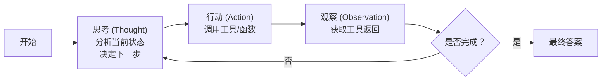
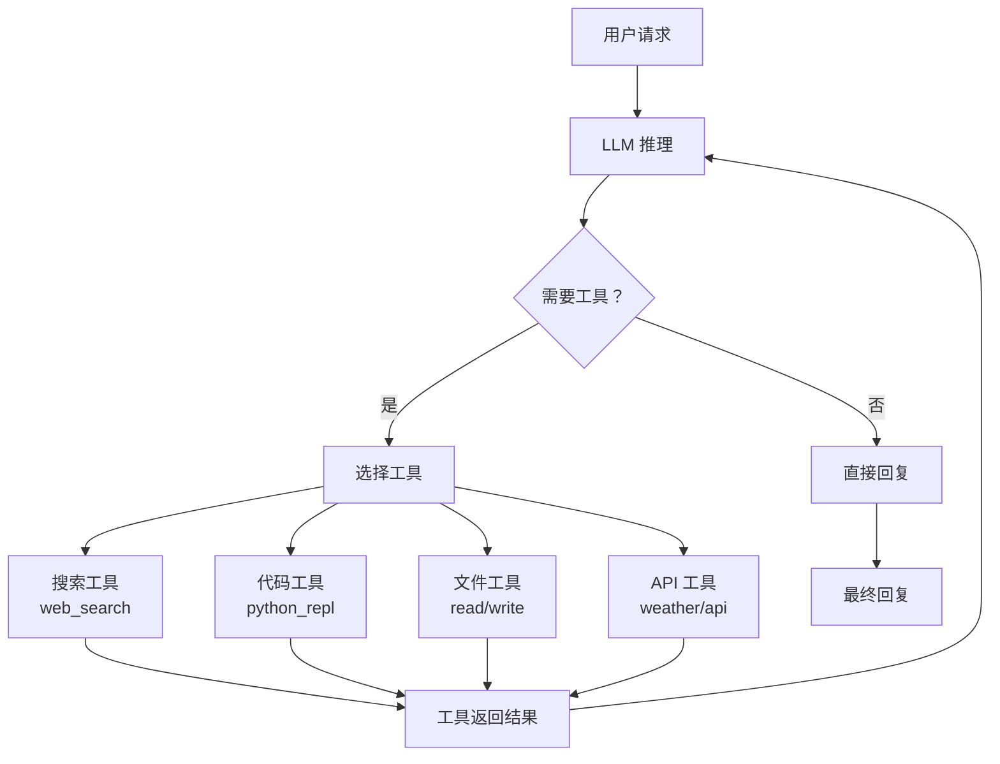
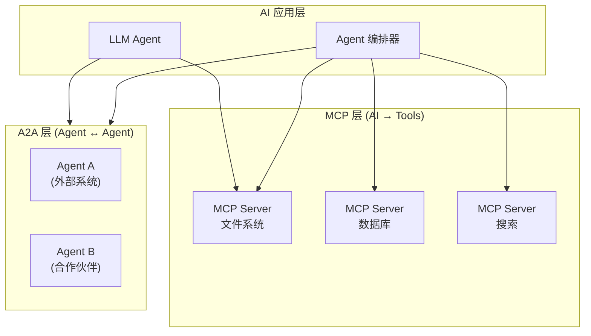
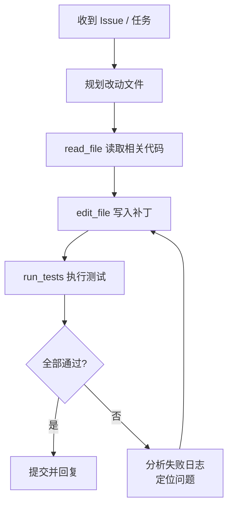

# AI 智能体 Agent

## 1. Agent 基础概念
### 核心能力
- **感知（Perception）**：接收用户输入、环境信息、工具反馈
- **推理（Reasoning）**：分析任务、规划步骤、决策行动
- **行动（Action）**：调用工具、回复用户、触发外部系统
- **记忆（Memory）**：上下文记忆 + 长期知识存储

### Agent 范式
- **Single Agent**：单一模型完成推理和行动
- **Multi-Agent**：多个 Agent 协作
- **Hierarchical Agent**：主 Agent 调度子 Agent
- **Agent Swarm**：动态 Agent 集群

## 2. 2026 年协议栈标准
### MCP（Model Context Protocol）
- Anthropic 提出，2024 年底发布，2025-2026 广泛采用
- **类比**：USB for AI Tools — 标准化的工具连接协议
- **架构**：Server（暴露工具/资源/Prompt）+ Client（AI 应用消费）
- **传输**：JSON-RPC 通信，支持 Stdio 和 SSE
- **采用者**：Claude Desktop、Cursor、Zed、OpenCode、Cline

### MCP 2026-07-28 新规范（最大更新）
- **无状态化**：移除 session 概念，去掉 initialize/initialized 握手
- **授权强化**：OAuth 2.0 + DPoP 支持
- **Server Cards**：标准化的能力发现机制
- **Skills 基元**：新增可安装扩展能力
- **迁移要求**：10 周窗口内完成从旧规范的迁移

### A2A（Agent-to-Agent Protocol）
- Google 提出（2025.4），2025.6 捐赠给 Linux Foundation
- **目的**：不同组织构建的 Agent 之间通信
- **采用**：150+ 组织，包括 Salesforce、SAP、ServiceNow、Atlassian
- **与 MCP 互补**：MCP 是 AI-工具，A2A 是 Agent-Agent

### 三协议栈（2026 标准架构）
1. **MCP**：AI → Tools，通用工具连接
2. **A2A**：Agent ↔ Agent，跨组织 Agent 通信
3. **ADK/框架**：本地编排执行

## 3. Function Calling
- **OpenAI Tool Call**：tools 参数 JSON Schema
- **Anthropic Tool Use**：tool_use content block
- **Google GenAI**：function_declarations
- **并行工具调用**：一次 Prompt 多个工具并行
- **流式工具调用**：工具参数实时流式返回

## 4. 主流框架（2026 年现状）
### LangChain / LangGraph
- 链式、图式 Agent 编排
- 复杂状态控制，支持持久化
- MCP 集成（通过 LangChain 社区包）

### Claude Agent SDK（Anthropic，2026）
- 核心原语：async query() 生成器迭代流消息
- 内置工具：Read/Write/Edit/Bash/Glob/Grep/WebSearch/WebFetch
- 生命周期钩子：PreToolUse、PostToolUse、Stop、SessionStart
- 子 Agent：options.agents，独立上下文窗口和工具
- MCP 集成：options.mcpServers
- 2026.6 开始：订阅额度单独计量 Agent SDK

### OpenAI Agents SDK
- 轻量 Handoff 链
- 可路由到人工代理

### Google ADK 1.0（2026.4）
- 四语言 GA：Python、Java、Go、TypeScript
- Service Registry：声明式切换存储后端
- 语义漂移消除：四个运行时的功能完全对齐
- 与 Vertex AI 深度集成

### Microsoft Agent Framework 1.0（2026.4）
- AutoGen 官方继承者，生产级多 Agent 框架
- 原生 MCP + A2A 支持
- Responses API 集成
- 工作流编排模式替代 GroupChat
- .NET + Azure 深度集成

### CrewAI
- 角色协作（Role-based Crews）
- 2026.5：v1.14.6，52.4k stars
- A2A 原生支持
- 快速原型开发首选

### 其他框架
- **AutoGen**（Microsoft）：多 Agent 对话，.NET 支持
- **MetaGPT**：软件工程全流程团队模拟
- **OpenAI Swarm**：轻量实验框架
- **Dify**：可视化工作流编排
- **Coze**（字节跳动）：免代码构建

### 框架选择指南（2026）
| 需求 | 推荐框架 |
|------|---------|
| 代码 Agent 深度系统集成 | Claude Agent SDK |
| 轻量 Handoff 链 | OpenAI Agents SDK |
| 多语言企业系统 | Google ADK |
| 状态工作流 | LangGraph |
| 快速原型 | CrewAI |
| .NET/Azure 生态 | Microsoft Agent Framework |

## 5. 工具使用 Tool Use
### 工具类型
- **检索工具**：搜索、知识库、数据库
- **计算工具**：Python 解释器、Wolfram Alpha
- **代码执行**：沙箱、Jupyter
- **文件操作**：读写、格式转换
- **第三方 API**：天气、邮件、支付
- **浏览器**：导航、截图、表单
- **系统命令**：Shell 执行

### 工具安全
- **沙箱隔离**：Docker、gVisor
- **权限控制**：最小权限
- **速率限制**：QPS 控制
- **审计日志**：全链路追溯
- **工具定义标准化**：MCP（统一协议）正在替代自定义格式

## 6. 记忆系统 Memory
### 短期记忆
- 上下文窗口、滑动窗口、阶段压缩

### 长期记忆
- 向量存储、知识图谱、数据库、文件系统

### 记忆管理
- 重要性评分、记忆整合、反思、跨会话传递
- **Google ADK Service Registry**：声明式切换存储后端（内存 ↔ Vertex AI Memory Bank）

## 7. 规划与推理
### 任务分解
- **ReAct**：Thought → Action → Observation 循环
- **Plan & Solve**：先规划再执行
- **Function Calling**：工具调用原生支持

### 自我纠错
- **自我反思**：执行后评估
- **验证者模式**：Critic 评估 Actor
- **人机回环（HITL）**：
  - 审批门（Approval Gates）
  - 审核编辑（Review & Edit）
  - 升级（Escalation）
  - 反馈循环（Feedback Loop）

## 8. 多 Agent 系统
### 通信方式
- 共享内存、直接消息、集中调度

### 协作模式
- 角色分工、辩论式、投票机制、竞争式

### 典型系统
- **ChatDev**：软件公司模拟
- **MetaGPT**：全流程工程角色
- **AutoGen 多 Agent**：聊天式群组
- **AgentVerse**：分组协作
- **CrewAI**：多角色 Crew

## 9. 安全与治理
- **工具权限控制**：最小权限、用户确认
- **资源限制**：Token 预算、执行上限、超时
- **审计日志**：完整 Action-Input-Output
- **人机回环**：关键操作人工确认
- **越狱防护**：工具调用 Prompt 注入防护
- **逐步自治原则**：先高人工干预，随系统证明自行逐步降低

## 10. 生产部署
- **可观测性**：调用链追踪、Token 消耗监控
- **错误管理**：重试策略、退避算法、优雅降级
- **成本控制**：模型选择层、缓存层、预算配给
- **渐进式自治**：开始多人工，逐步放权

## 11. PyTorch 代码示例

### 11.1 ReAct 循环实现

```python
import json
from typing import Callable, Dict, List, Optional

class ReActAgent:
    def __init__(self, model, tokenizer, tools: Dict[str, Callable], max_iterations=10):
        self.model = model
        self.tokenizer = tokenizer
        self.tools = tools
        self.max_iterations = max_iterations

    def build_prompt(self, question: str, thoughts: List[Dict]) -> str:
        prompt = f"问题: {question}\n"
        for step in thoughts:
            prompt += f"思考: {step['thought']}\n"
            if step.get("action"):
                prompt += f"行动: {step['action']}\n"
                prompt += f"行动输入: {json.dumps(step['action_input'], ensure_ascii=False)}\n"
            if step.get("observation"):
                prompt += f"观察: {step['observation']}\n"
        prompt += "思考:"
        return prompt

    def parse_response(self, response: str) -> Dict:
        has_action = "行动:" in response
        thought = response.split("行动:")[0].replace("思考:", "").strip() if has_action else response.replace("思考:", "").strip()
        if not has_action:
            return {"thought": thought, "action": None, "action_input": None}
        action_line = response.split("行动:")[1].split("\n")[0].strip()
        input_line = response.split("行动输入:")[1].split("\n")[0].strip() if "行动输入:" in response else "{}"
        try:
            action_input = json.loads(input_line)
        except:
            action_input = {"query": input_line}
        return {"thought": thought, "action": action_line, "action_input": action_input}

    def run(self, question: str) -> str:
        thoughts = []
        for i in range(self.max_iterations):
            prompt = self.build_prompt(question, thoughts)
            inputs = self.tokenizer(prompt, return_tensors="pt")
            outputs = self.model.generate(**inputs, max_new_tokens=256, stop_strings=["\n观察:"])
            response = self.tokenizer.decode(outputs[0])
            parsed = self.parse_response(response)
            if parsed["action"] is None:
                return parsed["thought"]
            if parsed["action"] in self.tools:
                try:
                    observation = self.tools[parsed["action"]](**parsed["action_input"])
                except Exception as e:
                    observation = f"错误: {str(e)}"
            else:
                observation = f"未知工具: {parsed['action']}"
            thoughts.append({**parsed, "observation": str(observation)[:500]})
        return "达到最大迭代次数"
```

### 11.2 工具调用 (Function Calling) 示例

```python
class ToolRegistry:
    def __init__(self):
        self.tools = {}
        self.schemas = []

    def register(self, name: str, fn: Callable, schema: Dict):
        self.tools[name] = fn
        self.schemas.append({"type": "function", "function": {"name": name, **schema}})

    def call(self, name: str, arguments: Dict):
        if name not in self.tools:
            raise ValueError(f"Unknown tool: {name}")
        return self.tools[name](**arguments)

registry = ToolRegistry()

def search_knowledge_base(query: str, top_k: int = 5) -> List[str]:
    return [f"关于{query}的搜索结果{i}" for i in range(top_k)]

def calculator(expression: str) -> str:
    return str(eval(expression))

def get_weather(city: str, date: str = "today") -> str:
    return f"{city}在{date}的天气: 晴, 25°C"

registry.register("search_knowledge_base", search_knowledge_base, {
    "description": "搜索知识库",
    "parameters": {"type": "object", "properties": {
        "query": {"type": "string", "description": "搜索查询"},
        "top_k": {"type": "integer", "description": "返回结果数"},
    }, "required": ["query"]},
})
registry.register("calculator", calculator, {
    "description": "数学计算器",
    "parameters": {"type": "object", "properties": {
        "expression": {"type": "string", "description": "数学表达式"},
    }, "required": ["expression"]},
})
registry.register("get_weather", get_weather, {
    "description": "查询天气",
    "parameters": {"type": "object", "properties": {
        "city": {"type": "string"}, "date": {"type": "string"},
    }, "required": ["city"]},
})
```

### 11.3 MCP 客户端示例

```python
import json
import subprocess
import asyncio

class MCPClient:
    def __init__(self, server_command: str, server_args: List[str] = None):
        self.server_command = server_command
        self.server_args = server_args or []
        self.process = None
        self.request_id = 0

    async def connect(self):
        self.process = await asyncio.create_subprocess_exec(
            self.server_command, *self.server_args,
            stdin=asyncio.subprocess.PIPE,
            stdout=asyncio.subprocess.PIPE,
            stderr=asyncio.subprocess.PIPE,
        )

    async def list_tools(self):
        return await self._send_request("tools/list", {})

    async def call_tool(self, name: str, arguments: Dict):
        return await self._send_request("tools/call", {"name": name, "arguments": arguments})

    async def _send_request(self, method: str, params: Dict):
        self.request_id += 1
        request = json.dumps({"jsonrpc": "2.0", "id": self.request_id, "method": method, "params": params})
        self.process.stdin.write((request + "\n").encode())
        await self.process.stdin.drain()
        response = await self.process.stdout.readline()
        return json.loads(response.decode())

    async def close(self):
        if self.process:
            self.process.terminate()
            await self.process.wait()

async def mcp_demo():
    client = MCPClient("python", ["-m", "mcp_server"])
    await client.connect()
    tools = await client.list_tools()
    print(f"可用工具: {tools}")
    result = await client.call_tool("get_weather", {"city": "北京"})
    print(f"调用结果: {result}")
    await client.close()
```

### 11.4 多 Agent 协作系统

```python
class AgentMessage:
    def __init__(self, sender: str, receiver: str, content: str, msg_type: str = "text"):
        self.sender = sender
        self.receiver = receiver
        self.content = content
        self.msg_type = msg_type

class BaseAgent:
    def __init__(self, name: str, model, tokenizer, system_prompt: str):
        self.name = name
        self.model = model
        self.tokenizer = tokenizer
        self.system_prompt = system_prompt
        self.messages = [{"role": "system", "content": system_prompt}]

    def think(self, task: str) -> str:
        self.messages.append({"role": "user", "content": task})
        inputs = self.tokenizer.apply_chat_template(self.messages, return_tensors="pt")
        outputs = self.model.generate(inputs, max_new_tokens=512)
        response = self.tokenizer.decode(outputs[0])
        self.messages.append({"role": "assistant", "content": response})
        return response

class OrchestratorAgent:
    def __init__(self, agents: Dict[str, BaseAgent]):
        self.agents = agents

    def delegate(self, task: str, agent_name: str) -> str:
        agent = self.agents[agent_name]
        return agent.think(task)

    def orchestrate(self, task: str, plan: List[str]):
        results = {}
        for step in plan:
            agent_name = step["agent"]
            sub_task = step["task"]
            results[agent_name] = self.delegate(sub_task, agent_name)
        return results
```

### 11.5 记忆系统实现

```python
class VectorMemory:
    def __init__(self, dim=768):
        self.short_term = []
        self.long_term = {}
        self.embedder = lambda x: torch.randn(dim)

    def add_short_term(self, content: str, importance: float = 0.5):
        embedding = self.embedder(content)
        self.short_term.append({"content": content, "embedding": embedding, "importance": importance})
        if len(self.short_term) > 100:
            self._consolidate()

    def _consolidate(self):
        for item in self.short_term:
            if item["importance"] > 0.7:
                key = f"mem_{len(self.long_term)}"
                self.long_term[key] = item
        self.short_term = self.short_term[-20:]

    def retrieve(self, query: str, k: int = 5):
        query_emb = self.embedder(query)
        all_memories = list(self.long_term.values()) + self.short_term
        if not all_memories:
            return []
        scores = [F.cosine_similarity(query_emb.unsqueeze(0), m["embedding"].unsqueeze(0)).item() for m in all_memories]
        top_indices = sorted(range(len(scores)), key=lambda i: scores[i], reverse=True)[:k]
        return [all_memories[i]["content"] for i in top_indices]
```

## 12. Mermaid 架构图

### 12.1 ReAct 循环



### 12.2 Agent 工具调用流程



### 12.3 三协议栈架构



## 13. 对比表格

### 13.1 Agent 框架对比（2026）

| 框架 | 核心范式 | 多 Agent | MCP | A2A | 学习曲线 | 推荐场景 |
|------|---------|---------|-----|-----|---------|---------|
| Claude Agent SDK | 流式生成器 | 子 Agent | 原生 | 否 | 中 | 代码 Agent |
| OpenAI Agents SDK | Handoff 链 | Handoff | 插件 | 插件 | 低 | 轻量长尾 |
| Google ADK 1.0 | Service Registry | 是 | 是 | 原生 | 中 | 企业多语言 |
| MS Agent Framework | 工作流编排 | 原生 | 原生 | 原生 | 高 | .NET/Azure |
| LangGraph | 状态图 | 原生 | 社区 | 社区 | 高 | 复杂状态 |
| CrewAI | 角色 Crew | 原生 | 否 | 原生 | 低 | 快速原型 |

### 13.2 MCP vs A2A vs Function Calling

| 维度 | MCP | A2A | Function Calling |
|------|-----|-----|-----------------|
| 目的 | AI → 工具 | Agent ↔ Agent | AI → 函数 |
| 通信方向 | 单向 (Client→Server) | 双向 | 单向 |
| 标准化程度 | 高 (Anthropic 推广) | 高 (Google + LF) | 低 (各厂商自定义) |
| 传输协议 | JSON-RPC (Stdio/SSE) | HTTP/REST | JSON in Prompt |
| 发现机制 | Server Cards | Agent Card | 无 |
| 安全模型 | OAuth 2.0 + DPoP | OAuth 2.0 | API Key |
| 2026 采用率 | 广泛 (1000+ Server) | 150+ 组织 | 全模型支持 |

### 13.3 工具调用格式对比

| 特性 | OpenAI | Anthropic | Google | MCP |
|------|--------|-----------|--------|-----|
| 定义方式 | tools 参数 | tool_use block | function_declarations | Server 注册 |
| 参数格式 | JSON Schema | JSON Schema | JSON Schema | JSON Schema |
| 调用方式 | tool_calls | tool_use content | function_call | tools/call |
| 并行调用 | ✅ | ✅ | ✅ | 取决于 Server |
| 流式支持 | ✅ | ✅ | ❌ | 取决于传输 |
| 返回值 | tool response | tool_result | function response | JSON-RPC |

### 13.4 记忆系统对比

| 类型 | 存储介质 | 容量 | 持久性 | 检索速度 | 适用场景 |
|------|---------|------|--------|---------|---------|
| 上下文窗口 | GPU 显存 | 4K-1M tokens | 会话级 | 纳秒 | 当前对话 |
| 向量记忆 | 向量数据库 | 百万级 | 持久化 | 毫秒 | 语义检索 |
| 知识图谱 | 图数据库 | 亿级节点 | 持久化 | 毫秒-秒 | 关系推理 |
| 键值存储 | Redis/SQL | 无限 | 持久化 | 微秒 | 事实记忆 |
| 文件系统 | SSD/NVMe | 无限 | 持久化 | 毫秒 | 大文件 |

### 13.5 Agent 安全等级

| 等级 | 描述 | 人工干预 | 执行权限 | 适用场景 |
|------|------|---------|---------|---------|
| L0 | 纯对话 | 全部 | 无 | 聊天机器人 |
| L1 | 工具调用需确认 | 每次确认 | 受限 | 个人助手 |
| L2 | 安全操作自动 | 敏感操作确认 | 部分 | 开发助手 |
| L3 | 大部分自动 | 异常回滚 | 广泛 | 生产系统 |
| L4 | 完全自动 | 审计追溯 | 全部 | 成熟系统 |

## 14. 实现案例

### 案例：代码 Agent 的单次工具循环（ReAct 风格）

对应正文「Claude Agent SDK」内置工具与「ReAct 循环」，下面演示一个最小化代码 Agent：读文件 → 改文件 → 跑测试：

```python
class CodeAgent:
    def __init__(self, model, tokenizer, workspace):
        self.model = model
        self.tokenizer = tokenizer
        self.ws = workspace
        self.tools = {
            "read_file": self._read,
            "edit_file": self._edit,
            "run_tests": self._test,
        }

    def _read(self, path):
        return open(f"{self.ws}/{path}").read()[:500]
    def _edit(self, path, content):
        with open(f"{self.ws}/{path}", "w") as f:
            f.write(content)
        return "已写入"
    def _test(self, cmd="pytest -q"):
        import subprocess
        r = subprocess.run(cmd, shell=True, capture_output=True, text=True, cwd=self.ws)
        return r.stdout[-300:] + r.stderr[-300:]

    def run(self, task, max_steps=8):
        history = [f"任务: {task}"]
        for _ in range(max_steps):
            prompt = "\n".join(history) + "\n下一步(思考/调用 read_file|edit_file|run_tests):"
            action = self.model.generate(prompt)  # 占位
            history.append(action)
            if "run_tests" in action and "全部通过" in action:
                return "任务完成"
        return "达到步数上限"

# 说明：实际 Agent 通过工具 JSON Schema 约束输出格式（见 11.2），
# 并在每次 tool_use 后用 tool_result 回填 Observation，迭代直至任务结束。
```

### 案例：Code Agent 自主修复循环示意图

下文用 mermaid 描述「生成代码 → 运行测试 → 失败则反思再改」的闭环：



### 案例：MCP Server 工具定义 vs Function Calling 定义对比

正文对比了 MCP 与 Function Calling，这里给出同一工具「查天气」两种定义的写法差异：

| 维度 | Anthropic tool_use | OpenAI tools | MCP Server 注册 |
|------|-------------------|-------------|----------------|
| 描述字段 | "description" | "description" | "description" |
| 参数 schema | input_schema | parameters | inputSchema |
| 调用返回 | tool_result block | tool response | JSON-RPC tools/call |
| 多工具发现 | 列表传入 | 列表传入 | tools/list 动态发现 |
| 跨进程 | 同一上下文 | 同一上下文 | 独立进程 (Stdio/SSE) |

```python
# OpenAI 风格
openai_tool = {
    "type": "function",
    "function": {
        "name": "get_weather",
        "description": "查询天气",
        "parameters": {"type": "object", "properties": {"city": {"type": "string"}}},
    },
}

# MCP 风格（注册到 Server，供任意 Client 通过 tools/list 发现）
mcp_tool = {
    "name": "get_weather",
    "description": "查询天气",
    "inputSchema": {"type": "object", "properties": {"city": {"type": "string"}}},
}

print("二者参数结构一致，区别在传输与发现机制")
```
