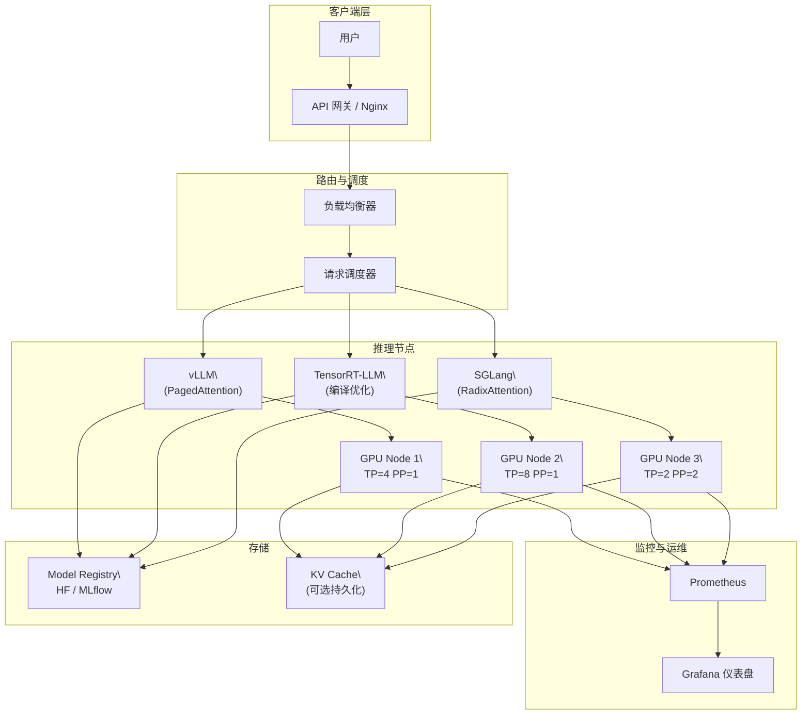
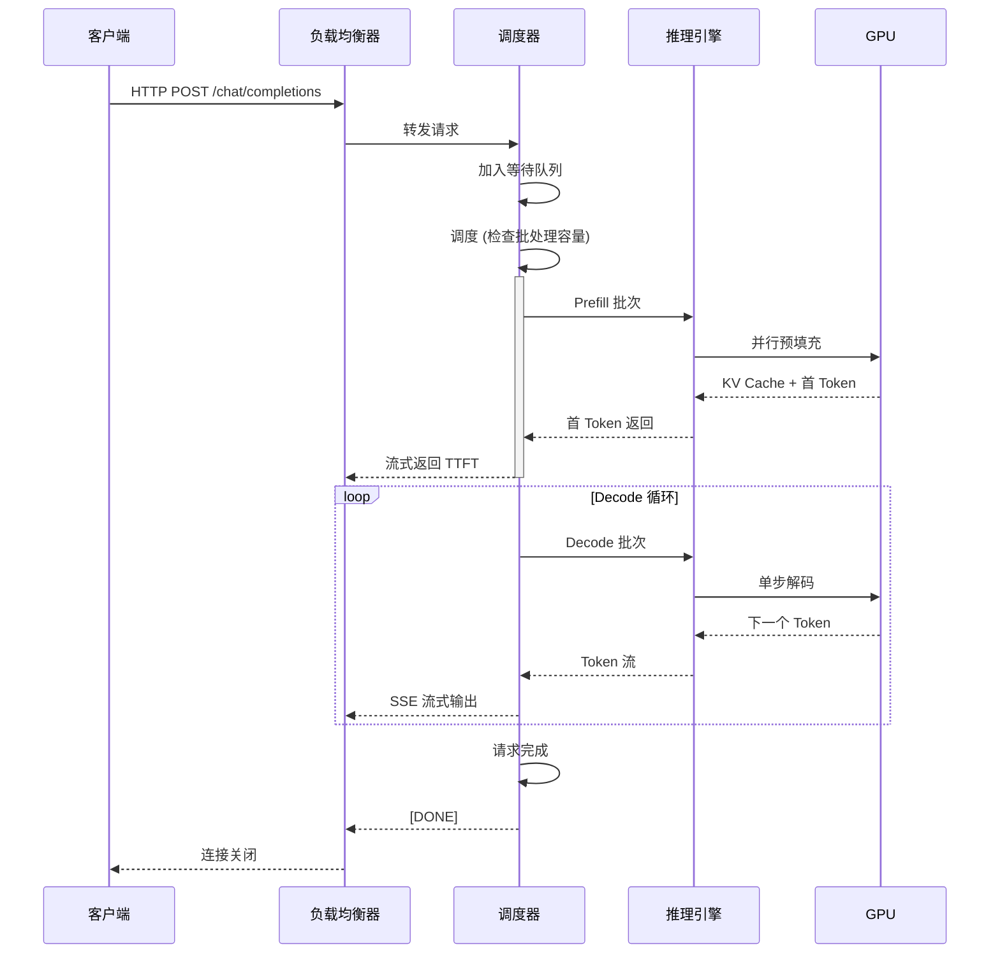
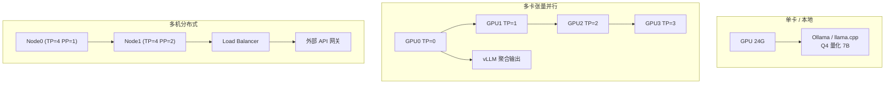

# 推理框架与部署

## 1. 推理服务器框架
### 生产级框架
- **vLLM**：
  - PagedAttention 高效管理 KV Cache
  - 连续批处理（Continuous Batching）
  - CUDA Graph 加速 Decode
  - Prefix Caching、Speculative Decoding
  - OpenAI 兼容 API
  - 多 LoRA 适配器热切换
  - 分布式推理（TP/PP）
  - 2025-2026：全面支持 DeepSeek V4、Llama 4、Qwen3 等新架构

- **TensorRT-LLM**（NVIDIA）：
  - TensorRT 编译优化图
  - In-flight Batching
  - FP8/INT4/INT8 量化（SmoothQuant/GPTQ/AWQ）
  - 推测解码（Medusa/Eagle 支持）
  - 注意力插件（Flash Attention、XQA）
  - Blackwell B200 原生优化

- **SGLang**：
  - RadixAttention 前缀树自动缓存 KV
  - 结构化生成约束（JSON Schema/Grammar）
  - 多轮对话高效复用
  - 调用批处理优化
  - 2026 发展迅速，成为长上下文场景热门选择

- **TGI（Text Generation Inference）**（Hugging Face）：
  - 流式传输、连续批处理
  - 量化（bitsandbytes/GPTQ/AWQ）
  - LoRA 热插拔
  - Hugging Face Hub 原生集成

- **Triton Inference Server**（NVIDIA）：
  - 多框架支持（TensorRT/ONNX/PyTorch）
  - 动态批处理
  - GPU/CPU 混合推理

### 轻量级推理
- **Ollama**：
  - 本地一键部署
  - Modelfile 自定义
  - GPU 加速（CUDA/Metal/Vulkan）
  - Ollama Library 模型仓库
  - OpenAI 兼容 API
  - 2026：支持 DeepSeek V4、Llama 4、Qwen3 系列

- **llama.cpp**：
  - 纯 CPU 优化
  - GGUF 格式
  - Apple Silicon Metal 加速
  - K-quants 多级量化
  - 服务模式支持
  - 2026：ARM 服务器优化，树莓派 5 可运行 7B 模型

- **MLX**（Apple）：
  - Apple Silicon 原生优化
  - 统一内存架构利用
  - 2026：快速迭代，支持主流模型

- **LocalAI**：
  - 自托管 OpenAI API 替代
  - 多后端（llama.cpp/whisper/stablediffusion）

### 云原生部署
- **Ray Serve**：分布式编排、自动缩放、多模型路由
- **KServe**（K8s）：模型推理服务平台
- **Bentoml**：模型打包、部署、监控一体化

## 2. 模型格式与转换
### 模型格式
- **Hugging Face（SafeTensors）**：安全快速加载
- **GGUF**：llama.cpp 专用单文件格式，内嵌量化参数
- **ONNX**：跨框架标准格式
- **TensorRT Engine**：NVIDIA 编译后格式
- **Core ML**（Apple）：iOS/macOS 优化
- **OpenVINO（IR）**：Intel 硬件优化
- **MLX**（Apple）：Apple Silicon 框架格式

### 转换工具
- **llama.cpp convert**：HF → GGUF
- **TensorRT-LLM 转换器**：HF → TensorRT Engine
- **Optimum**：ONNX Runtime 优化
- **OpenVINO Converter**：→ IR

## 3. 部署模式
### 本地部署
- **单 GPU** / **多 GPU 张量并行** / **多机分布式**

### API 服务
- **OpenAI API 兼容**：Chat Completions 标准
- **Anthropic API 兼容**：2026 趋势，DeepSeek V4 同时支持两种格式
- **流式响应**：SSE
- **批处理 API**：异步批量

### 边缘部署
- **手机端**：MLX/MediaPipe/Core ML，量化 2-4bit
- **浏览器端**：WebLLM、WebGPU、ONNX Runtime Web
- **嵌入式**：llama.cpp 在树莓派/嵌入式 Linux

## 4. 性能优化
### 监控指标
- **TTFT**（Time To First Token）：首 Token 延迟
- **TPOT**（Time Per Output Token）：每 Token 时间
- **ITL**（Inter-Token Latency）：Token 间延迟
- **TGS**（Token/秒/请求）
- **吞吐量**：总 Token/秒
- **显存**：KV Cache + 模型权重

### 可观测性
- **Prometheus + Grafana**：指标可视化
- **OpenTelemetry**：分布式链路追踪

### 成本优化
- **弹性 GPU**：Spot GPU 降低成本
- **Token 缓存**：相似请求复用
- **Prompt 压缩**：LLMLingua 等可压缩 2-5×
- **共享 KV Cache**：同一 Prefix 请求重用

## 5. 部署管理与编排
- **Docker 容器化**：nvidia-docker
- **Kubernetes**：GPU Node 调度、HPA
- **Helm Charts**：一键部署模板
- **GPU Operator**：NVIDIA 集群管理
- **Model Registry**：MLflow/Hugging Face Hub

## 6. 2026 趋势
- **Anthropic API 格式普及**：DeepSeek V4、Qwen3.7 等原生支持
- **FP8 推理成熟**：H100/B200 原生支持
- **百万级上下文部署**：DeepSeek V4 1M token 不涨价
- **框架融合**：SGLang + vLLM 功能趋同
- **边缘推理增强**：手机端 7B 模型实时推理成为可能

## 7. PyTorch 代码示例

### 7.1 vLLM API 调用

```python
import requests
import json

class VLLMClient:
    def __init__(self, base_url="http://localhost:8000"):
        self.base_url = base_url
        self.headers = {"Content-Type": "application/json"}

    def chat_completion(self, messages, model="default", max_tokens=1024, temperature=0.7):
        payload = {
            "model": model,
            "messages": messages,
            "max_tokens": max_tokens,
            "temperature": temperature,
            "stream": False,
        }
        response = requests.post(f"{self.base_url}/v1/chat/completions", json=payload, headers=self.headers)
        return response.json()

    def stream_completion(self, messages, model="default", max_tokens=1024):
        payload = {
            "model": model,
            "messages": messages,
            "max_tokens": max_tokens,
            "stream": True,
        }
        response = requests.post(f"{self.base_url}/v1/chat/completions", json=payload, headers=self.headers, stream=True)
        for line in response.iter_lines():
            if line:
                line = line.decode("utf-8")
                if line.startswith("data: "):
                    data = line[6:]
                    if data != "[DONE]":
                        yield json.loads(data)

client = VLLMClient()
messages = [{"role": "user", "content": "Hello!"}]
result = client.chat_completion(messages)
print(result["choices"][0]["message"]["content"])
```

### 7.2 vLLM 服务端启动与配置

```python
import subprocess
import time

class VLLMServer:
    def __init__(self, model_path, tensor_parallel_size=1, gpu_memory_utilization=0.9, max_model_len=8192):
        self.model_path = model_path
        self.tp_size = tensor_parallel_size
        self.gpu_mem = gpu_memory_utilization
        self.max_len = max_model_len
        self.process = None

    def start(self, port=8000):
        cmd = [
            "python", "-m", "vllm.entrypoints.openai.api_server",
            "--model", self.model_path,
            "--tensor-parallel-size", str(self.tp_size),
            "--gpu-memory-utilization", str(self.gpu_mem),
            "--max-model-len", str(self.max_len),
            "--port", str(port),
            "--trust-remote-code",
        ]
        self.process = subprocess.Popen(cmd, stdout=subprocess.PIPE, stderr=subprocess.PIPE)
        time.sleep(30)
        return f"http://localhost:{port}"

    def stop(self):
        if self.process:
            self.process.terminate()
            self.process.wait()
```

### 7.3 TensorRT-LLM 伪代码

```python
class TensorRTLLMBuilder:
    def __init__(self, model_path, engine_dir="trt_engines"):
        self.model_path = model_path
        self.engine_dir = engine_dir

    def build_engine(self, dtype="float16", max_batch_size=64, max_input_len=2048, max_output_len=512):
        config = {
            "builder_config": {
                "max_batch_size": max_batch_size,
                "max_input_len": max_input_len,
                "max_output_len": max_output_len,
                "precision": dtype,
            },
            "plugin_config": {
                "gpt_attention_plugin": "float16",
                "gemm_plugin": "float16",
            },
        }
        build_cmd = [
            "trtllm-build",
            f"--model_dir={self.model_path}",
            f"--output_dir={self.engine_dir}",
            f"--max_batch_size={max_batch_size}",
            f"--max_input_len={max_input_len}",
            f"--max_output_len={max_output_len}",
            f"--dtype={dtype}",
            "--use_gpt_attention_plugin=float16",
            "--use_gemm_plugin=float16",
        ]
        subprocess.run(build_cmd, check=True)
        return self.engine_dir

    def inference(self, input_ids):
        import tensorrt_llm
        from tensorrt_llm.runtime import ModelRunner
        runner = ModelRunner.from_dir(self.engine_dir)
        outputs = runner.generate(batch_input_ids=[input_ids], max_new_tokens=256)
        return outputs

def tensorrt_config_example():
    config = {
        "model": "llama-4-scout",
        "dtype": "float16",
        "quantization": "FP8",
        "max_batch_size": 128,
        "max_input_len": 4096,
        "max_output_len": 1024,
        "enable_speculative_decoding": True,
        "draft_model": "llama-4-scout-draft",
        "parallel_config": {
            "tensor_parallel": 4,
            "pipeline_parallel": 1,
        },
    }
    return config
```

### 7.4 OpenAI 兼容 API 服务端

```python
from fastapi import FastAPI, HTTPException
from pydantic import BaseModel
from typing import List, Optional
import uvicorn
import asyncio

app = FastAPI()

class ChatMessage(BaseModel):
    role: str
    content: str

class ChatRequest(BaseModel):
    model: str
    messages: List[ChatMessage]
    max_tokens: Optional[int] = 1024
    temperature: Optional[float] = 0.7
    stream: Optional[bool] = False

class ModelEngine:
    def __init__(self):
        self.model = None

    async def generate(self, prompt: str, max_tokens: int, temperature: float):
        tokens = [ord(c) for c in prompt[:max_tokens]]
        return "".join(chr(t) for t in tokens)

engine = ModelEngine()

@app.post("/v1/chat/completions")
async def chat_completion(request: ChatRequest):
    try:
        prompt = "\n".join([f"{m.role}: {m.content}" for m in request.messages])
        text = await engine.generate(prompt, request.max_tokens, request.temperature)
        return {
            "id": "chatcmpl-mock",
            "object": "chat.completion",
            "choices": [{"index": 0, "message": {"role": "assistant", "content": text}, "finish_reason": "stop"}],
            "usage": {"prompt_tokens": len(prompt), "completion_tokens": len(text), "total_tokens": len(prompt) + len(text)},
        }
    except Exception as e:
        raise HTTPException(status_code=500, detail=str(e))

@app.get("/v1/models")
async def list_models():
    return {"data": [{"id": "my-model", "object": "model"}]}
```

### 7.5 连续批处理调度器

```python
import asyncio
from dataclasses import dataclass
from typing import List, Optional

@dataclass
class Request:
    request_id: str
    prompt: List[int]
    max_tokens: int
    generated: List[int] = None

    def __post_init__(self):
        self.generated = []

class ContinuousBatchScheduler:
    def __init__(self, model, max_batch_size=32, max_total_tokens=8192):
        self.model = model
        self.max_batch_size = max_batch_size
        self.max_total_tokens = max_total_tokens
        self.waiting_queue = asyncio.Queue()
        self.running = []

    async def add_request(self, request: Request):
        await self.waiting_queue.put(request)

    async def schedule_loop(self):
        while True:
            while not self.waiting_queue.empty() and len(self.running) < self.max_batch_size:
                req = await self.waiting_queue.get()
                total = sum(len(r.prompt) + len(r.generated) + 1 for r in self.running)
                if total + len(req.prompt) <= self.max_total_tokens:
                    self.running.append(req)
                else:
                    await self.waiting_queue.put(req)
                    break
            if self.running:
                batch_prompts = [r.prompt + r.generated for r in self.running]
                logits = self.model(batch_prompts)
                next_tokens = logits[:, -1].argmax(dim=-1)
                for req, token in zip(self.running, next_tokens):
                    req.generated.append(token.item())
                self.running = [r for r in self.running if len(r.generated) < r.max_tokens]
            else:
                await asyncio.sleep(0.001)
```

### 7.6 部署配置管理

```python
from dataclasses import dataclass, field
from typing import Dict, Optional

@dataclass
class DeploymentConfig:
    model_name: str
    model_path: str
    framework: str = "vllm"
    dtype: str = "bfloat16"
    tensor_parallel: int = 1
    pipeline_parallel: int = 1
    max_model_len: int = 8192
    gpu_memory_utilization: float = 0.9
    quantization: Optional[str] = None
    enable_prefix_caching: bool = True
    enable_speculative_decoding: bool = False
    draft_model_path: Optional[str] = None
    max_num_seqs: int = 256
    port: int = 8000

    def to_dict(self) -> Dict:
        return {k: v for k, v in self.__dict__.items() if v is not None}

    @classmethod
    def from_yaml(cls, path: str):
        import yaml
        with open(path) as f:
            data = yaml.safe_load(f)
        return cls(**data)

config = DeploymentConfig(
    model_name="DeepSeek-V4-Flash",
    model_path="/models/DeepSeek-V4-Flash",
    framework="vllm",
    tensor_parallel=4,
    max_model_len=65536,
    quantization="fp8",
)
print(config.to_dict())
```

## 8. Mermaid 架构图

### 8.1 部署架构



### 8.2 请求调度流程



## 9. 对比表格

### 9.1 推理框架对比

| 特性 | vLLM | TensorRT-LLM | SGLang | TGI | llama.cpp |
|------|------|-------------|--------|-----|-----------|
| 核心优化 | PagedAttention | TensorRT 编译 | RadixAttention | HF 原生集成 | CPU 优化 |
| 连续批处理 | ✅ | ✅ (In-flight) | ✅ | ✅ | ❌ |
| 量化支持 | GPTQ/AWQ/FP8 | SmoothQuant/GPTQ/AWQ/FP8 | GPTQ/AWQ | bitsandbytes/GPTQ/AWQ | K-quants |
| 推测解码 | ✅ | ✅ (Medusa/Eagle) | ❌ | ❌ | ❌ |
| LoRA 热切换 | ✅ | ❌ | ❌ | ✅ | ❌ |
| 分布式推理 | TP/PP | TP/PP | TP/PP | ❌ | ❌ |
| 结构化输出 | ❌ | ❌ | ✅ (JSON Schema) | ❌ | ❌ |
| Prefix Caching | ✅ | ❌ | ✅ (RadixTree) | ❌ | ❌ |
| OpenAI API | ✅ 原生 | 需包装 | ✅ 原生 | ✅ 原生 | ✅ 插件 |
| 硬件支持 | NVIDIA/AMD | NVIDIA 专用 | NVIDIA | NVIDIA | CPU/Apple/AMD |

### 9.2 模型格式对比

| 格式 | 文件大小 (70B) | 加载速度 | 量化嵌入 | 跨平台 | 安全性 | 适用框架 |
|------|--------------|---------|---------|-------|-------|---------|
| SafeTensors | 140GB (FP16) | 快 (零拷贝) | 否 | 是 | 高 | vLLM/TGI/HF |
| GGUF | 35-70GB (Q4-FP16) | 慢 | 是 (K-quants) | 是 | 中 | llama.cpp |
| ONNX | 140GB (FP16) | 中 | 否 | 是 | 中 | ONNX Runtime |
| TensorRT Engine | 35-140GB | 极快 | 是 (FP8/INT4) | 否 | 高 | TensorRT-LLM |
| Core ML | 35-140GB | 中 | 是 | Apple 专用 | 中 | Apple 设备 |
| OpenVINO IR | 140GB | 中 | 否 | Intel 专用 | 中 | Intel 设备 |
| MLX | 70GB | 快 | 是 | Apple 专用 | 中 | MLX |

### 9.3 部署模式对比

| 模式 | 延迟 | 吞吐量 | 扩展性 | 成本 | 适用场景 |
|------|------|-------|-------|------|---------|
| 单 GPU (本地) | 低 | 低 | 无 | 中 | 开发测试 |
| 多 GPU TP | 低 | 中 | 中等 | 高 | 小规模生产 |
| 多机分布式 | 中 | 高 | 好 | 很高 | 大规模生产 |
| API 服务 (SaaS) | 中 | 极高 | 极好 | 按量 | 通用 |
| 边缘 (手机) | 高 | 低 | 无 | 低 | 离线场景 |
| 浏览器 (WebGPU) | 高 | 低 | 无 | 极低 | 演示/轻量 |

### 9.4 性能指标参考 (LLaMA 3 70B on H100)

| 配置 | Batch Size | TTFT | TPOT | 吞吐量 (Token/s) | 显存 |
|------|-----------|------|------|-----------------|------|
| FP16, TP=1 | 1 | 120ms | 35ms | 29 | 140GB |
| FP16, TP=4 | 1 | 80ms | 15ms | 67 | 4×35GB |
| FP16, TP=4 | 32 | 450ms | 28ms | 1,143 | 4×45GB |
| INT4 AWQ, TP=1 | 1 | 85ms | 12ms | 83 | 35GB |
| INT4 AWQ, TP=1 | 32 | 320ms | 20ms | 1,600 | 45GB |
| FP8, TP=1 | 1 | 95ms | 18ms | 56 | 70GB |
| Spec Decode (γ=5) | 1 | 100ms | 8ms | 125 | 140GB |

### 9.5 监控指标定义

| 指标 | 缩写 | 计算方式 | 目标值 | 影响因子 |
|------|------|---------|-------|---------|
| Time To First Token | TTFT | Prefill 结束时间 - 请求到达时间 | < 200ms | Prompt 长度、批大小 |
| Time Per Output Token | TPOT | Decode 阶段总时间 / 生成 Token 数 | < 30ms | 模型大小、量化 |
| Inter-Token Latency | ITL | 相邻 Token 输出间隔 | 稳定 < 50ms | 批处理波动 |
| Tokens Per Second | TGS | 1 / TPOT | > 50 | 单请求吞吐 |
| 总吞吐量 | Throughput | 总生成 Token / 时间 | 最大化 | 并发数、批大小 |

### 9.6 成本优化策略对比

| 策略 | 节省成本 | 延迟影响 | 实现复杂度 | 适用场景 |
|------|---------|---------|-----------|---------|
| 量化 (FP16→INT4) | 60-75% | 降低 (吞吐↑) | 低 | 所有场景 |
| Spotlight GPU | 60-80% | 可能中断 | 低 | 非关键任务 |
| Token 缓存 | 20-50% | 降低 (命中时) | 中 | 重复查询 |
| Prompt 压缩 | 30-60% | 降低 (输入↓) | 中 | 长上下文 |
| 共享 KV Cache | 30-50% | 降低 | 中 | 系统提示重复 |
| 推测解码 | 0% (需草稿) | 降低 (延迟↓) | 高 | 低利用率场景 |

## 10. 实现案例

### 案例：本地一键部署 llama.cpp 量化模型

对应正文「llama.cpp」与「GGUF 格式」，下面演示把 7B 模型量化到 Q4_K 并启动本地服务：

```bash
# 1) 将 HuggingFace 权重转换为 GGUF（需先 clone llama.cpp）
python convert_hf_to_gguf.py ./Qwen2.5-7B-Instruct --outfile qwen25.gguf

# 2) 量化到 Q4_K_M（兼顾质量与体积）
./llama-quantize qwen25.gguf qwen25-Q4_K_M.gguf Q4_K_M

# 3) 启动本地 OpenAI 兼容服务（默认端口 8080）
./llama-server -m qwen25-Q4_K_M.gguf -ngl 99 --host 0.0.0.0 -p 8080
```

```python
# 4) 用 OpenAI SDK 调用本地服务
from openai import OpenAI

client = OpenAI(base_url="http://localhost:8080/v1", api_key="sk-local")
resp = client.chat.completions.create(
    model="qwen25-Q4_K_M",
    messages=[{"role": "user", "content": "用一句话解释什么是 KV Cache。"}],
)
print(resp.choices[0].message.content)
```

### 案例：按显存选择量化等级对照表

对应正文「模型量化」与「性能优化」，给出 7B/13B/70B 在常见显卡上的量化选型：

| 模型 | 显卡 | 推荐量化 | 权重显存 | 是否流畅 |
|------|------|---------|---------|---------|
| 7B | RTX 3060 12G | Q4_K_M | ~4.5GB | 是（~20 T/s） |
| 7B | Mac M2 16G (MLX) | Q5_K_M | ~5.5GB | 是 |
| 13B | RTX 4090 24G | Q5_K_M | ~9GB | 是 |
| 70B | 2× RTX 4090 48G | Q4_K_M | ~40GB (TP=2) | 是 |
| 70B | 单卡 24G | Q2_K | ~28GB | 勉强（质量降） |

### 案例：单卡到多机部署拓扑

对应正文「部署模式」与「分布式推理」，下图展示不同规模下的部署形态：



### 案例：用 Ollama Python 库拉起模型并对话

正文「Ollama」提到 Modelfile 自定义，下面用官方库完成一次本地推理：

```python
import ollama

# 若未拉取过模型，首次会自动下载
resp = ollama.chat(
    model="qwen2.5:7b",
    messages=[
        {"role": "system", "content": "你只回答中文。"},
        {"role": "user", "content": "Hello, who are you?"},
    ],
)
print(resp["message"]["content"])

# 流式输出
stream = ollama.chat(model="qwen2.5:7b", messages=[{"role": "user", "content": "写一首诗"}], stream=True)
for chunk in stream:
    print(chunk["message"]["content"], end="", flush=True)
```
