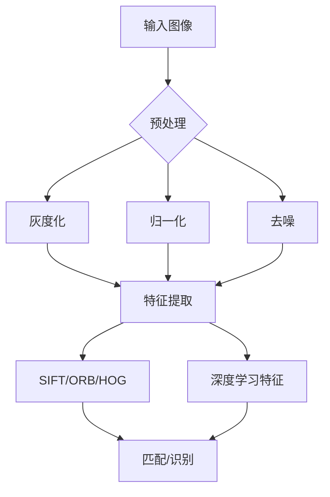
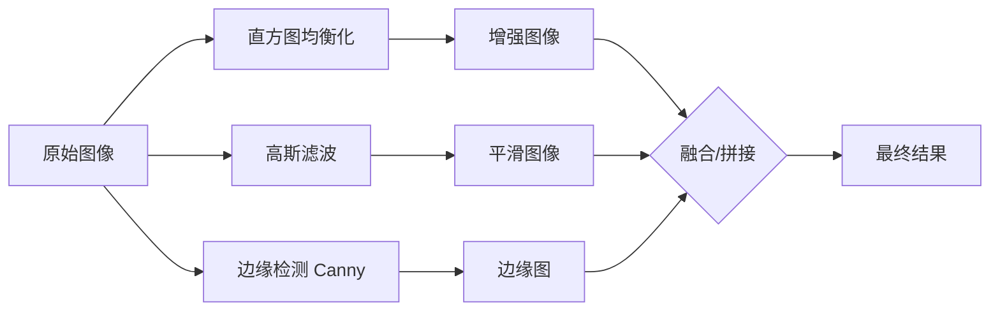

# 图像基础

## 1. 数字图像表示

### 基本概念
- **像素（Pixel）**：图像的最小单位
- **分辨率**：宽度 × 高度（如 1920×1080）
- **通道（Channel）**：灰度=1，RGB=3，RGBA=4
- **位深**：每通道位数（8bit=256 级，16bit=65536 级）

### 颜色空间
| 空间 | 组成 | 用途 |
|------|------|------|
| RGB | 红绿蓝 | 显示设备 |
| HSV | 色相/饱和度/明度 | 图像处理 |
| LAB | 亮度/A通道/B通道 | 感知均匀 |
| YCbCr | 亮度+色度 | 压缩编码 |

### 颜色空间对比
| 特性 | RGB | HSV | LAB | YCbCr |
|------|-----|-----|-----|-------|
| 感知均匀性 | 差 | 中等 | 好 | 中等 |
| 计算复杂度 | 无 | 低 | 高 | 低 |
| 光照不变性 | 差 | 较好 | 好 | 较好 |
| 适用场景 | 显示 | 分割/跟踪 | 颜色迁移 | 视频压缩 |
| 通道相关性 | 高 | 中 | 低 | 中 |

### 图像数据类型
| 类型 | 位深 | 数值范围 | 内存/像素 | PyTorch dtype |
|------|------|---------|----------|--------------|
| uint8 | 8bit | [0, 255] | 1B | torch.uint8 |
| uint16 | 16bit | [0, 65535] | 2B | - |
| float32 | 32bit | [0.0, 1.0] | 4B | torch.float32 |
| float16 | 16bit | [0.0, 1.0] | 2B | torch.float16 |

## 2. 图像处理基础

### 点操作
- **直方图均衡化**：增强对比度
- **伽马校正**：调整亮度
- **阈值分割**：二值化

### 滤波
- **均值滤波**：去噪但模糊
- **高斯滤波**：自然平滑
- **中值滤波**：去除椒盐噪声
- **高斯差分（DoG）**：边缘检测

### 滤波方法对比
| 滤波器 | 核函数 | 去噪能力 | 边缘保持 | 计算复杂度 |
|--------|--------|---------|---------|----------|
| 均值滤波 | 1/(k²) | 中等 | 差 | O(k²) |
| 高斯滤波 | exp(-r²/2σ²) | 好 | 中等 | O(k²) |
| 中值滤波 | 排序取中值 | 椒盐噪声优秀 | 好 | O(k² log k) |
| 双边滤波 | 空间+值域高斯 | 好 | 优秀 | O(k²) |
| 引导滤波 | 局部线性模型 | 好 | 优秀 | O(1) |

### 形态学操作
- **腐蚀/膨胀**：去除/扩张白色区域
- **开运算**：先腐蚀后膨胀，去小噪点
- **闭运算**：先膨胀后腐蚀，填小空洞

```python
import cv2
import numpy as np
import torch
import torchvision.transforms.functional as F
from torchvision.io import read_image, ImageReadMode

img = cv2.imread("image.jpg")
gray = cv2.cvtColor(img, cv2.COLOR_BGR2GRAY)
resized = cv2.resize(gray, (224, 224))
cv2.imwrite("output.jpg", resized)
```

```python
img = cv2.imread("dark.jpg", cv2.IMREAD_GRAYSCALE)
equ = cv2.equalizeHist(img)
clahe = cv2.createCLAHE(clipLimit=2.0, tileGridSize=(8, 8))
clahe_img = clahe.apply(gray)
result = np.hstack([gray, equ, clahe_img])
```

```python
img = cv2.imread("noisy.jpg")
blur = cv2.GaussianBlur(img, (5, 5), 1.5)
kernel = np.array([[-1, -1, -1], [-1, 9, -1], [-1, -1, -1]], np.float32)
sharp = cv2.filter2D(blur, -1, kernel)
median = cv2.medianBlur(img, 5)
```

```python
sift = cv2.SIFT_create()
kp, des = sift.detectAndCompute(gray, None)
bf = cv2.BFMatcher(cv2.NORM_L2, crossCheck=True)
matches = bf.match(des1, des2)
matches = sorted(matches, key=lambda x: x.distance)
result = cv2.drawMatches(img1, kp1, img2, kp2, matches[:50], None)
```

```python
img_t = read_image("image.jpg", ImageReadMode.RGB)
img_t = img_t.float() / 255.0
img_t = img_t.unsqueeze(0)
kernel = torch.ones((1, 1, 5, 5)) / 25
avg_pool = torch.nn.functional.avg_pool2d(img_t, 5, stride=1, padding=2)
gaussian = F.gaussian_blur(img_t, kernel_size=(5, 5), sigma=(1.5, 1.5))
result = torch.cat([img_t, gaussian], dim=0)
```

```python
src = cv2.imread("img.jpg")
kernel = cv2.getStructuringElement(cv2.MORPH_RECT, (5, 5))
eroded = cv2.erode(src, kernel, iterations=1)
dilated = cv2.dilate(src, kernel, iterations=1)
opening = cv2.morphologyEx(src, cv2.MORPH_OPEN, kernel)
closing = cv2.morphologyEx(src, cv2.MORPH_CLOSE, kernel)
grad = cv2.morphologyEx(src, cv2.MORPH_GRADIENT, kernel)
```





## 3. 特征提取

### 传统特征
| 特征 | 类型 | 不变性 |
|------|------|--------|
| SIFT | 局部关键点 | 尺度/旋转 |
| SURF | 局部关键点 | 更快版本 SIFT |
| ORB | 二进制特征 | 快速，嵌入式 |
| HOG | 梯度直方图 | 行人检测 |
| LBP | 纹理特征 | 人脸识别 |

### 特征匹配方法
| 方法 | 度量方式 | 速度 | 鲁棒性 | 适用场景 |
|------|---------|------|--------|---------|
| 暴力匹配 BF | L1/L2 | 慢 | 中 | 小数据集 |
| FLANN | KD-Tree | 快 | 高 | 大数据集 |
| 比率测试 | 最近邻距离比 | 中 | 高 | 剔除误匹配 |
| GMS | 网格运动统计 | 快 | 高 | 快速筛选 |

## 4. 数据增强
- **基本**：翻转、旋转、裁剪、缩放
- **颜色**：亮度/对比度/饱和度调整
- **高级**：Mixup（混合图像+标签）
- **噪声**：高斯噪声、椒盐噪声

## 5. 图像金字塔
- **高斯金字塔**：下采样 + 高斯模糊
- **拉普拉斯金字塔**：高频细节层
- **FPN（特征金字塔网络）**：深度学习多尺度

```python
import torch.nn.functional as F

img_t = read_image("image.jpg", ImageReadMode.RGB).float().unsqueeze(0)
gaussian_pyramid = [img_t]
for _ in range(4):
    blurred = F.gaussian_blur(gaussian_pyramid[-1], 5, 1.5)
    down = F.interpolate(blurred, scale_factor=0.5, mode="bilinear")
    gaussian_pyramid.append(down)

laplacian_pyramid = []
for i in range(len(gaussian_pyramid) - 1):
    up = F.interpolate(gaussian_pyramid[i+1], size=gaussian_pyramid[i].shape[2:], mode="bilinear")
    lap = gaussian_pyramid[i] - up
    laplacian_pyramid.append(lap)

reconstructed = gaussian_pyramid[-1]
for lap in reversed(laplacian_pyramid):
    up = F.interpolate(reconstructed, size=lap.shape[2:], mode="bilinear")
    reconstructed = up + lap
```

## 6. 计算摄影学基础

| 技术 | 原理 | 应用 |
|------|------|------|
| HDR | 多曝光融合 | 高动态范围成像 |
| 图像去雾 | 暗通道先验 | 雾天图像恢复 |
| 超分辨率 | 单/多帧重建 | 分辨率提升 |
| 图像修复 | 纹理合成 | 去除水印/修复 |
| 全景拼接 | 特征匹配+融合 | 全景照片 |
