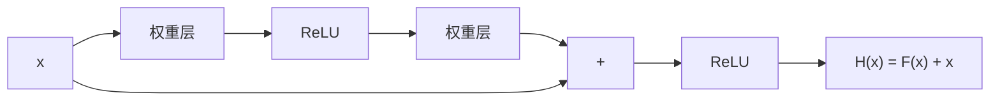
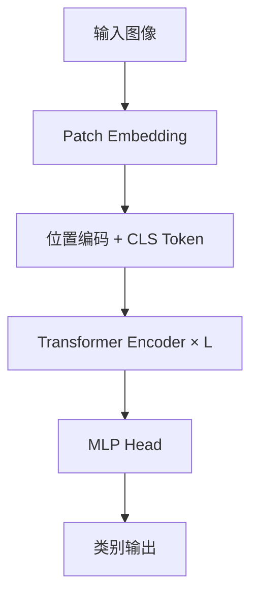
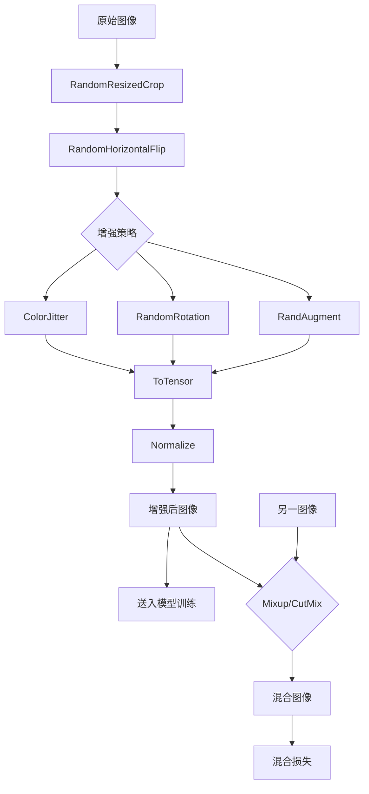
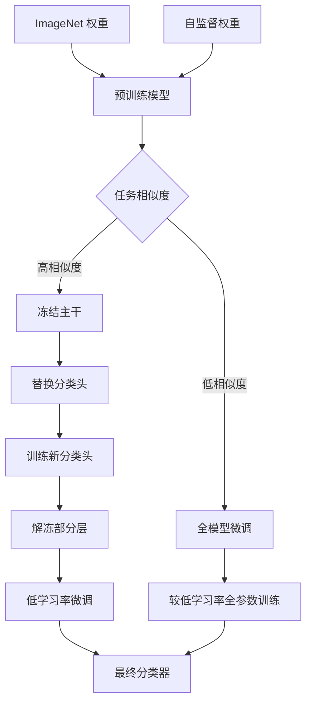

# 图像分类

## 1. CNN 经典架构演进

### AlexNet（2012）
- **突破**：ImageNet 分类冠军，深度学习元年
- **创新**：ReLU + Dropout + GPU 并行 + 局部响应归一化
- **结构**：5 卷积层 + 3 全连接层

### VGGNet（2014）
- **特点**：简单统一的小卷积核（3×3），深度加深
- **家族**：VGG16（16 层）、VGG19（19 层）
- **代价**：参数量大，计算慢

### GoogLeNet / Inception（2014）
- **Inception 模块**：1×1 + 3×3 + 5×5 卷积并列 + 1×1 降维
- **辅助分类器**：中间层加分类器缓解梯度消失
- **1×1 卷积**：降维升维、增加非线性

### ResNet（2015）— 里程碑
- **残差学习**：F(x) = H(x) - x，学习残差而不是直接映射
- **瓶颈结构**：1×1 → 3×3 → 1×1 降低计算量
- **变体**：ResNet-18/34/50/101/152
- **影响**：解决了深层网络退化问题



### 经典架构对比
| 模型 | 年份 | 层数 | Top-1 | Top-5 | 参数量 | FLOPs |
|------|------|------|-------|-------|--------|-------|
| AlexNet | 2012 | 8 | 56.5% | 80.1% | 62M | 1.5B |
| VGG-16 | 2014 | 16 | 71.6% | 90.1% | 138M | 15.5B |
| Inception-v1 | 2014 | 22 | 69.8% | 89.7% | 6.8M | 1.6B |
| ResNet-50 | 2015 | 50 | 76.0% | 93.0% | 25.6M | 3.8B |
| ResNet-152 | 2015 | 152 | 77.6% | 93.8% | 60.2M | 11.3B |
| DenseNet-169 | 2017 | 169 | 76.2% | 93.2% | 14.3M | 3.4B |
| EfficientNet-B3 | 2019 | - | 81.1% | 95.5% | 5.3M | 1.8B |

### DenseNet（2017）
- **密集连接**：每层与之前所有层相连
- **特点**：参数少、特征复用、梯度传播好
- **结构**：Dense Block + Transition Layer

### EfficientNet（2019）
- **复合缩放**：同时缩放深度、宽度、分辨率
- **NAS 搜索**：神经架构搜索最优组合
- **效果**：更小更快更准

## 2. 视觉 Transformer

### ViT（Vision Transformer, 2020）
- **结构**：图像分块 → 线性投影 → Transformer Encoder → 分类头
- **对比 CNN**：全局注意力，无需卷积归纳偏置
- **需要大数据**：ImageNet-21k/JFT-300M 预训练



### DeiT（Data-efficient ViT）
- **知识蒸馏**：CNN 教师指导学生 ViT
- **数据效率**：ImageNet-1K 即可训好

### Swin Transformer（2021）
- **层次化**：从细节到全局的特征金字塔
- **移动窗口**：限制自注意力到窗口内，线性复杂度 O(n)
- **下游泛化强**：检测/分割均 SOTA

### ConvNeXt（2022）
- **现代 CNN**：借鉴 ViT 的先进设计（GELU/LayerNorm），纯卷积
- **结论**：CNN 与 Transformer 的差距主要来自训练策略

### CNN vs Transformer 对比
| 特性 | CNN | ViT | Swin | ConvNeXt |
|------|-----|-----|------|---------|
| 归纳偏置 | 强（局部+平移不变） | 弱 | 中等 | 强 |
| 感受野 | 局部→全局 | 全局 | 窗口→全局 | 局部→全局 |
| 计算复杂度 | O(n) | O(n²) | O(n) | O(n) |
| 数据效率 | 高 | 低 | 中 | 高 |
| 下游迁移 | 好 | 好 | 优秀 | 优秀 |

## 3. 2025-2026 趋势

| 方向 | 进展 | 代表模型 |
|------|------|---------|
| 多模态统一 | 文本+图像联合理解 | CLIP、GPT-4V、Gemini |
| 自监督 | 无需标注的预训练 | DINOv2、MAE、iBot |
| 高效架构 | 更轻更快 | MobileNetV4、EfficientViT |
| 大规模 | 十亿参数视觉模型 | ViT-22B、Florence-2 |

## 4. 训练技巧

### 数据增强
- **基础**：随机翻转、旋转、裁剪、颜色抖动
- **高级**：Mixup（图像混合）、CutMix（区域替换）、RandAugment（自动增强）
- **正则化**：Label Smoothing、DropPath、Stochastic Depth

```python
import torch
import torch.nn as nn
import torch.optim as optim
import torchvision
import torchvision.transforms as T
from torch.utils.data import DataLoader, Dataset

class BasicBlock(nn.Module):
    def __init__(self, in_c, out_c, stride=1, down=None):
        super().__init__()
        self.conv1 = nn.Conv2d(in_c, out_c, 3, stride, 1, bias=False)
        self.bn1 = nn.BatchNorm2d(out_c)
        self.conv2 = nn.Conv2d(out_c, out_c, 3, 1, 1, bias=False)
        self.bn2 = nn.BatchNorm2d(out_c)
        self.down = down

    def forward(self, x):
        identity = self.down(x) if self.down else x
        out = torch.relu(self.bn1(self.conv1(x)))
        out = self.bn2(self.conv2(out))
        out += identity
        return torch.relu(out)

class ResNet18(nn.Module):
    def __init__(self, num_classes=1000):
        super().__init__()
        self.conv1 = nn.Conv2d(3, 64, 7, 2, 3, bias=False)
        self.bn1 = nn.BatchNorm2d(64)
        self.maxpool = nn.MaxPool2d(3, 2, 1)
        self.layer1 = self._make_layer(64, 64, 2, 1)
        self.layer2 = self._make_layer(64, 128, 2, 2)
        self.layer3 = self._make_layer(128, 256, 2, 2)
        self.layer4 = self._make_layer(256, 512, 2, 2)
        self.avgpool = nn.AdaptiveAvgPool2d((1, 1))
        self.fc = nn.Linear(512, num_classes)

    def _make_layer(self, in_c, out_c, blocks, stride):
        down = None
        if stride != 1 or in_c != out_c:
            down = nn.Sequential(
                nn.Conv2d(in_c, out_c, 1, stride, bias=False),
                nn.BatchNorm2d(out_c),
            )
        layers = [BasicBlock(in_c, out_c, stride, down)]
        for _ in range(1, blocks):
            layers.append(BasicBlock(out_c, out_c))
        return nn.Sequential(*layers)

    def forward(self, x):
        x = torch.relu(self.bn1(self.conv1(x)))
        x = self.maxpool(x)
        x = self.layer1(x)
        x = self.layer2(x)
        x = self.layer3(x)
        x = self.layer4(x)
        x = self.avgpool(x)
        x = torch.flatten(x, 1)
        return self.fc(x)
```

```python
train_transforms = T.Compose([
    T.RandomResizedCrop(224),
    T.RandomHorizontalFlip(),
    T.ColorJitter(brightness=0.2, contrast=0.2, saturation=0.2, hue=0.1),
    T.RandomRotation(10),
    T.ToTensor(),
    T.Normalize(mean=[0.485, 0.456, 0.406], std=[0.229, 0.224, 0.225]),
])

val_transforms = T.Compose([
    T.Resize(256),
    T.CenterCrop(224),
    T.ToTensor(),
    T.Normalize(mean=[0.485, 0.456, 0.406], std=[0.229, 0.224, 0.225]),
])

class MixupAug:
    def __init__(self, alpha=0.2):
        self.dist = torch.distributions.Beta(alpha, alpha)

    def __call__(self, x, y):
        lam = self.dist.sample().item()
        idx = torch.randperm(x.size(0))
        mixed_x = lam * x + (1 - lam) * x[idx]
        mixed_y = lam * y + (1 - lam) * y[idx]
        return mixed_x, mixed_y
```

```python
model = ResNet18(num_classes=10)
device = torch.device("cuda" if torch.cuda.is_available() else "cpu")
model = model.to(device)
criterion = nn.CrossEntropyLoss()
optimizer = optim.AdamW(model.parameters(), lr=1e-3, weight_decay=1e-4)
scheduler = optim.lr_scheduler.CosineAnnealingLR(optimizer, T_max=100)
scaler = torch.cuda.amp.GradScaler()

for epoch in range(100):
    model.train()
    running_loss = 0.0
    for images, labels in train_loader:
        images, labels = images.to(device), labels.to(device)
        optimizer.zero_grad()
        with torch.cuda.amp.autocast():
            outputs = model(images)
            loss = criterion(outputs, labels)
        scaler.scale(loss).backward()
        scaler.step(optimizer)
        scaler.update()
        running_loss += loss.item()
    scheduler.step()

    model.eval()
    correct = total = 0
    with torch.no_grad():
        for images, labels in val_loader:
            images, labels = images.to(device), labels.to(device)
            outputs = model(images)
            _, predicted = torch.max(outputs, 1)
            total += labels.size(0)
            correct += (predicted == labels).sum().item()
    print(f"Epoch {epoch}: Acc {100 * correct / total:.2f}%")
```

```python
from torchvision.datasets import ImageFolder

dataset = ImageFolder(root="data/imagenet/train", transform=train_transforms)
train_size = int(0.9 * len(dataset))
val_size = len(dataset) - train_size
train_subset, val_subset = torch.utils.data.random_split(
    dataset, [train_size, val_size]
)

train_loader = DataLoader(
    train_subset, batch_size=256, shuffle=True,
    num_workers=8, pin_memory=True, prefetch_factor=4,
)

val_loader = DataLoader(
    val_subset, batch_size=256, shuffle=False,
    num_workers=8, pin_memory=True,
)
```

### 学习率策略对比
| 策略 | 调度方式 | 收敛速度 | 最终精度 | 适用场景 |
|------|---------|---------|---------|---------|
| Step Decay | 每 K 轮衰减 γ | 中等 | 中等 | 传统训练 |
| Cosine Annealing | 余弦函数下降 | 快 | 高 | 标准选择 |
| Cosine + Warmup | 线性上升+余弦下降 | 快 | 高 | 大 batch |
| OneCycle | 先升后降 | 最快 | 高 | 快速收敛 |
| ReduceLROnPlateau | 依 metric 衰减 | 中 | 高 | 微调 |





### 迁移学习策略
| 策略 | 冻结层 | 训练层 | 学习率 | 数据量需求 |
|------|-------|--------|--------|---------|
| 特征提取 | 全部主干 | 分类头 | 1e-3 | 小（<1K） |
| 微调顶层 | 浅层 | 深层+头 | 1e-4 | 中（1K-10K） |
| 全模型微调 | 无 | 全部 | 1e-5 | 大（>10K） |
| 渐进解冻 | 逐步解冻 | 部分+头 | 1e-4→1e-5 | 中 |
| LoRA 微调 | 全部 | 低秩适配层 | 1e-3 | 极小（<100） |
