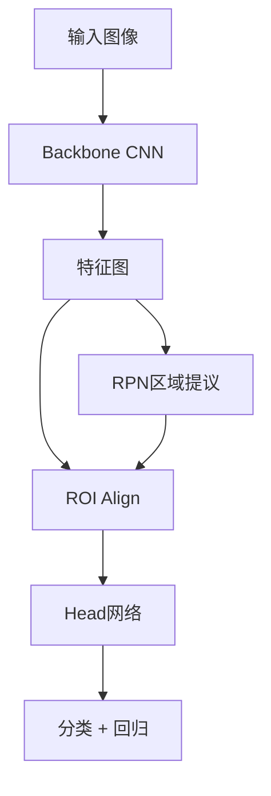
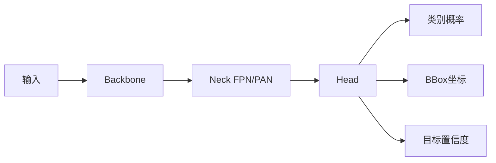
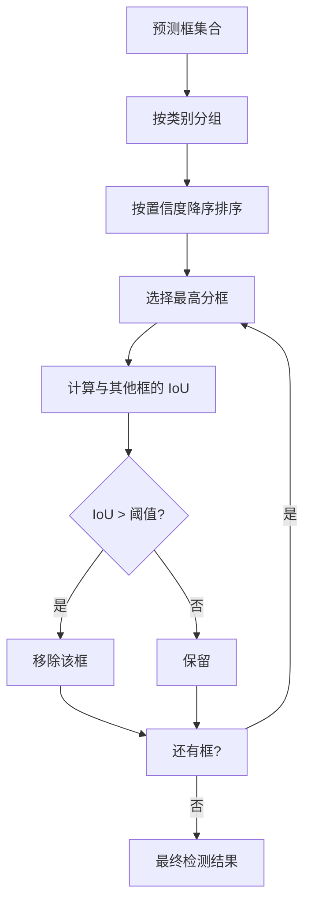
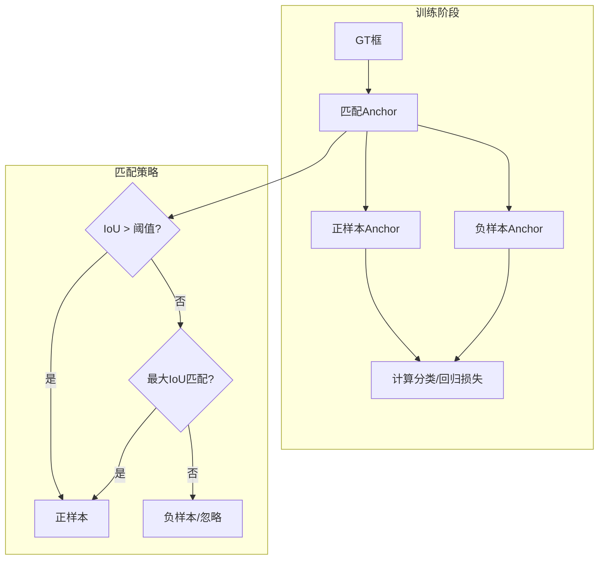

# 目标检测

## 1. 两阶段检测器（Region-based）

### R-CNN（2014）
- **流程**：Selective Search 生成候选框 → CNN 特征提取 → SVM 分类 + BBox 回归
- **缺点**：每个候选框独立计算 CNN，极慢

### Fast R-CNN（2015）
- **ROI Pooling**：整图只做一次 CNN，候选框共享特征图
- **多任务**：分类 + BBox 回归联合训练

### Faster R-CNN（2016）
- **RPN（Region Proposal Network）**：用网络代替 Selective Search
- **Anchor Boxes**：预设不同尺度和长宽比的锚点框
- **四步交替训练**：RPN → Fast R-CNN 交替优化



### 两阶段 vs 单阶段对比
| 特性 | 两阶段（Faster R-CNN） | 单阶段（YOLO） |
|------|----------------------|--------------|
| 流程 | 先提议再分类回归 | 一步直接预测 |
| 精度（mAP） | 较高 | 较高（YOLOv8+） |
| 速度（FPS） | 慢（~10-30） | 快（~100-300） |
| 小目标检测 | 好（RPN 精调） | 中（多尺度提升） |
| 训练复杂度 | 高（交替训练） | 低（端到端） |
| 部署难度 | 高 | 低 |

### Mask R-CNN（2017）
- **ROI Align**：双线性插值，解决 ROI Pooling 量化误差
- **新增分支**：分割 Mask 预测
- **应用**：实例分割、姿态估计

### RPN 实现

```python
import torch
import torch.nn as nn
import torchvision
from torchvision.ops import nms, roi_align, box_iou

class RPNHead(nn.Module):
    def __init__(self, in_channels=256, num_anchors=9):
        super().__init__()
        self.conv = nn.Conv2d(in_channels, in_channels, 3, 1, 1)
        self.cls_logits = nn.Conv2d(in_channels, num_anchors * 2, 1)
        self.bbox_pred = nn.Conv2d(in_channels, num_anchors * 4, 1)

    def forward(self, x):
        x = torch.relu(self.conv(x))
        logits = self.cls_logits(x)
        bbox = self.bbox_pred(x)
        return logits, bbox

def generate_anchors(base_size=16, ratios=[0.5, 1.0, 2.0], scales=[8, 16, 32]):
    anchors = []
    for ratio in ratios:
        w = base_size * (ratio ** 0.5)
        h = base_size / (ratio ** 0.5)
        for scale in scales:
            sw, sh = w * scale, h * scale
            anchors.append([-sw/2, -sh/2, sw/2, sh/2])
    return torch.tensor(anchors)

def apply_deltas(anchors, deltas):
    widths = anchors[:, 2] - anchors[:, 0]
    heights = anchors[:, 3] - anchors[:, 1]
    ctr_x = anchors[:, 0] + 0.5 * widths
    ctr_y = anchors[:, 1] + 0.5 * heights
    dx, dy, dw, dh = deltas.unbind(1)
    pred_ctr_x = dx * widths + ctr_x
    pred_ctr_y = dy * heights + ctr_y
    pred_w = torch.exp(dw) * widths
    pred_h = torch.exp(dh) * heights
    return torch.stack([
        pred_ctr_x - 0.5 * pred_w,
        pred_ctr_y - 0.5 * pred_h,
        pred_ctr_x + 0.5 * pred_w,
        pred_ctr_y + 0.5 * pred_h,
    ], dim=1)
```

## 2. 单阶段检测器（One-stage）

### YOLO 系列
- **核心**：端到端回归，一次预测所有框
- **YOLOv1（2016）**：S×S 网格，每个网格预测 B 个框
- **YOLOv3（2018）**：多尺度预测 + Darknet-53 + Logistic 分类
- **YOLOv5（2020）**：工程最佳实践（Mosaic 增强/自动锚框）
- **YOLOv8（2023）**：多任务（检测/分割/姿态/跟踪）
- **YOLOv9/v10/v11（2024）**：PGI 可编程梯度信息、无 NMS 训练
- **YOLO12（2025）**：注意力机制融合，NMS-free







### YOLO 简化实现

```python
import torch
import torch.nn as nn

class ConvBnSiLU(nn.Module):
    def __init__(self, in_c, out_c, k, s, p):
        super().__init__()
        self.conv = nn.Conv2d(in_c, out_c, k, s, p, bias=False)
        self.bn = nn.BatchNorm2d(out_c)
        self.silu = nn.SiLU(inplace=True)

    def forward(self, x):
        return self.silu(self.bn(self.conv(x)))

class Bottleneck(nn.Module):
    def __init__(self, in_c, out_c, shortcut=True, e=0.5):
        super().__init__()
        c_ = int(out_c * e)
        self.cv1 = ConvBnSiLU(in_c, c_, 1, 1, 0)
        self.cv2 = ConvBnSiLU(c_, out_c, 3, 1, 1)
        self.add = shortcut and in_c == out_c

    def forward(self, x):
        return x + self.cv2(self.cv1(x)) if self.add else self.cv2(self.cv1(x))

class C2f(nn.Module):
    def __init__(self, in_c, out_c, n=1, shortcut=False, e=0.5):
        super().__init__()
        self.c = int(out_c * e)
        self.cv1 = ConvBnSiLU(in_c, 2 * self.c, 1, 1, 0)
        self.cv2 = ConvBnSiLU((2 + n) * self.c, out_c, 1, 1, 0)
        self.m = nn.ModuleList([Bottleneck(self.c, self.c, shortcut) for _ in range(n)])

    def forward(self, x):
        y = list(self.cv1(x).chunk(2, 1))
        y.extend(m(y[-1]) for m in self.m)
        return self.cv2(torch.cat(y, 1))

class Detect(nn.Module):
    def __init__(self, nc=80, ch=()):
        super().__init__()
        self.nc = nc
        self.nl = len(ch)
        self.stride = torch.tensor([8, 16, 32])
        c2 = max(16, ch[0] // 4)
        self.cv2 = nn.ModuleList(
            nn.Sequential(
                ConvBnSiLU(c, c2, 3, 1, 1),
                nn.Conv2d(c2, 4 * self.nc + 4, 1),
            )
            for c in ch
        )

    def forward(self, x):
        z = []
        for i in range(self.nl):
            x[i] = self.cv2[i](x[i])
            bs, _, ny, nx = x[i].shape
            x[i] = x[i].view(bs, self.nc + 4, -1).permute(0, 2, 1)
        return torch.cat(x, 1)

class YOLOv8(nn.Module):
    def __init__(self, nc=80):
        super().__init__()
        self.model = nn.Sequential(
            ConvBnSiLU(3, 64, 3, 2, 1),
            ConvBnSiLU(64, 128, 3, 2, 1),
            C2f(128, 128, n=3),
            ConvBnSiLU(128, 256, 3, 2, 1),
            C2f(256, 256, n=6),
            ConvBnSiLU(256, 512, 3, 2, 1),
            C2f(512, 512, n=6),
            ConvBnSiLU(512, 512, 3, 2, 1),
            C2f(512, 512, n=3),
        )
        self.detect = Detect(nc, ch=(256, 512, 512))

    def forward(self, x):
        features = []
        for i, m in enumerate(self.model):
            x = m(x)
            if i in [4, 6, 8]:
                features.append(x)
        return self.detect(features)
```

### NMS 实现

```python
def compute_iou(box1, box2):
    x1 = max(box1[0], box2[0])
    y1 = max(box1[1], box2[1])
    x2 = min(box1[2], box2[2])
    y2 = min(box1[3], box2[3])
    inter = max(0, x2 - x1) * max(0, y2 - y1)
    area1 = (box1[2] - box1[0]) * (box1[3] - box1[1])
    area2 = (box2[2] - box2[0]) * (box2[3] - box2[1])
    return inter / (area1 + area2 - inter + 1e-6)

def non_max_suppression(boxes, scores, iou_thresh=0.5):
    order = scores.argsort(descending=True)
    keep = []
    while order.numel() > 0:
        i = order[0]
        keep.append(i)
        if order.numel() == 1:
            break
        ious = torch.tensor([
            compute_iou(boxes[i], boxes[j]) for j in order[1:]
        ])
        mask = ious <= iou_thresh
        order = order[1:][mask]
    return keep
```

### SSD（2016）
- 多尺度特征图检测
- 默认框（Default Boxes）+ 硬负挖掘

### RetinaNet（2017）
- **Focal Loss**：解决正负样本极端不平衡
- **核心**：降低易分类样本损失，聚焦难例

### Anchor Box 配置对比
| 检测器 | 特征图 | 每点 Anchor 数 | 尺度 | 长宽比 | Anchor 总数 |
|--------|--------|--------------|------|--------|-----------|
| SSD-300 | 6 层 | 4-6 | 0.1-0.9 | 1,2,3,1/2,1/3 | ~8732 |
| Faster R-CNN | 1 层 | 9 | 128,256,512 | 0.5,1,2 | ~16K |
| RetinaNet | 5 层 | 9 | 32-813 | 0.5,1,2 | ~100K |
| YOLOv3 | 3 层 | 3 | 自动聚类 | 自动聚类 | ~10K |
| YOLOv5 | 3 层 | 3 | 自动 | 自动 | ~21K |

## 3. Transformer 检测器

### DETR（2020）
- **端到端检测**：Transformers + 二分图匹配
- **Object Queries**：可学习检测查询
- **去掉了**：Anchor、NMS、RPN

### Deformable DETR（2021）
- **可变形注意力**：仅关注关键参考点，收敛加速 10×
- **多尺度特征**：FPN 特征融合

### DINO（2023）
- **DETR 改进**：对比去噪训练 + 混合查询选择
- **效果**：训练更稳定，小目标更好

### 检测器性能对比（COCO val2017）
| 检测器 | Backbone | mAP@0.5:0.95 | mAP@0.5 | FPS | 参数量 |
|--------|---------|-------------|---------|-----|--------|
| Faster R-CNN | ResNet-50-FPN | 37.0 | 58.2 | 26 | 42M |
| YOLOv8-M | CSPDarknet | 50.2 | 66.0 | 162 | 25.9M |
| YOLOv8-X | CSPDarknet | 53.9 | 70.0 | 92 | 68.2M |
| DETR | ResNet-50 | 42.0 | 62.4 | 28 | 41M |
| Deformable DETR | ResNet-50 | 46.9 | 65.7 | 19 | 40M |
| DINO | ResNet-50 | 51.3 | - | 18 | 47M |
| RT-DETR-L | HGNetv2 | 53.0 | - | 108 | 32M |

## 4. 评估指标

| 指标 | 含义 |
|------|------|
| IoU | 预测框与真实框的交并比 |
| mAP@0.5 | IoU>0.5 的平均精度 |
| mAP@0.5:0.95 | IoU 从 0.5 到 0.95 步长 0.05 的 mAP 平均 |
| FPS | 每秒处理帧数（速度） |
| Params | 模型参数量 |

```python
def compute_map(predictions, targets, iou_thresh=0.5):
    aps = []
    for cls in range(num_classes):
        cls_preds = [p for p in predictions if p["label"] == cls]
        cls_targets = [t for t in targets if t["label"] == cls]
        if not cls_targets:
            continue
        cls_preds.sort(key=lambda x: x["score"], reverse=True)
        tp = torch.zeros(len(cls_preds))
        fp = torch.zeros(len(cls_preds))
        matched = set()
        for i, pred in enumerate(cls_preds):
            best_iou = 0
            best_idx = -1
            for j, gt in enumerate(cls_targets):
                if j in matched:
                    continue
                iou = compute_iou(pred["bbox"], gt["bbox"])
                if iou > best_iou:
                    best_iou = iou
                    best_idx = j
            if best_iou >= iou_thresh:
                tp[i] = 1
                matched.add(best_idx)
            else:
                fp[i] = 1
        cum_tp = tp.cumsum(0)
        cum_fp = fp.cumsum(0)
        recalls = cum_tp / len(cls_targets)
        precisions = cum_tp / (cum_tp + cum_fp + 1e-6)
        ap = torch.trapezoid(precisions, recalls)
        aps.append(ap)
    return torch.tensor(aps).mean().item()
```

## 5. 2025-2026 趋势
- **端到端检测**：DETR 类方法逐渐取代 Anchor-based
- **开放词汇检测**：GLIP/Grounding DINO，任意文本目标检测
- **分割一切**：SAM 统一检测/分割/抠图
- **实时检测**：YOLO 系列持续迭代，边缘设备部署
- **多模态检测**：图文联合训练，视觉定位

## 6. 开源工具
- **MMDetection**：算法大全（50+ 方法）
- **Ultralytics YOLO**：工程首选
- **Detectron2**：FAIR 官方，Mask R-CNN 生态
- **Hugging Face Object Detection API**：一键调用
