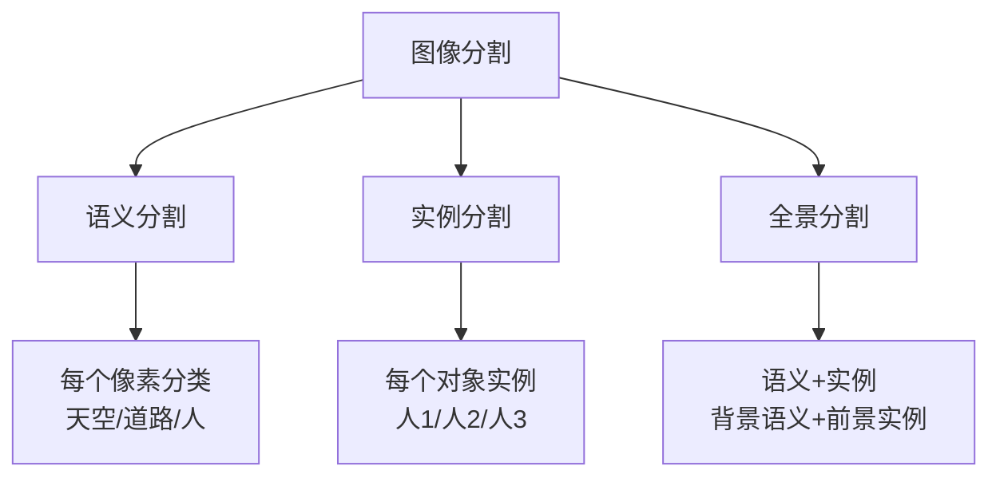
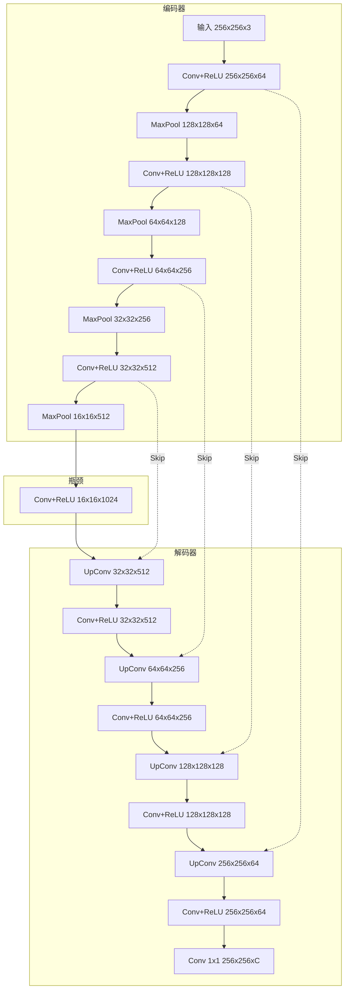
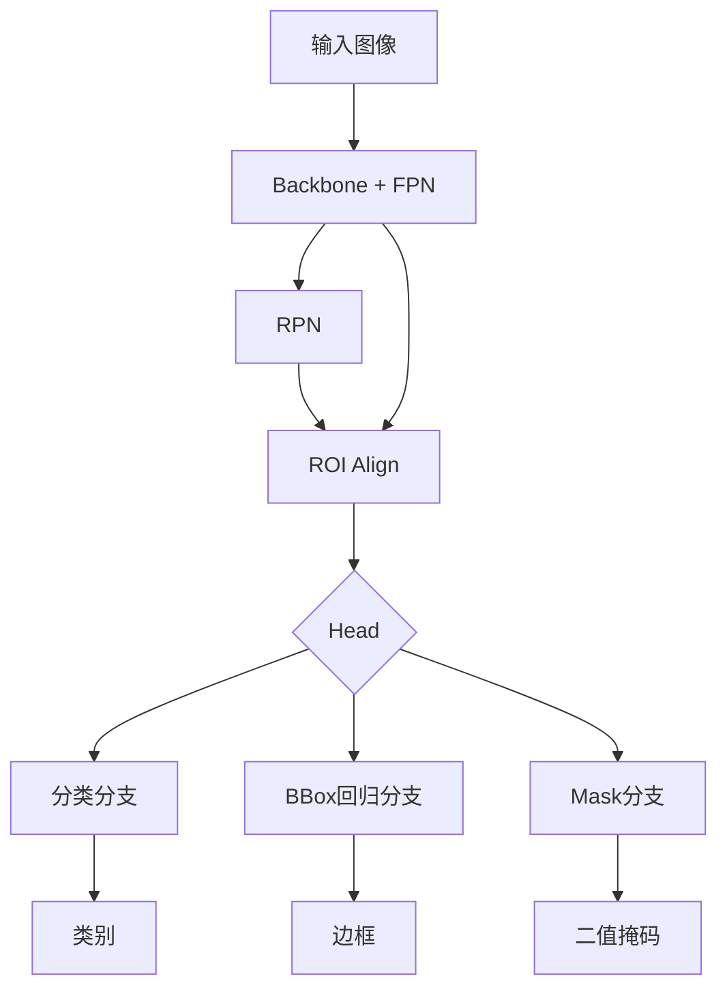
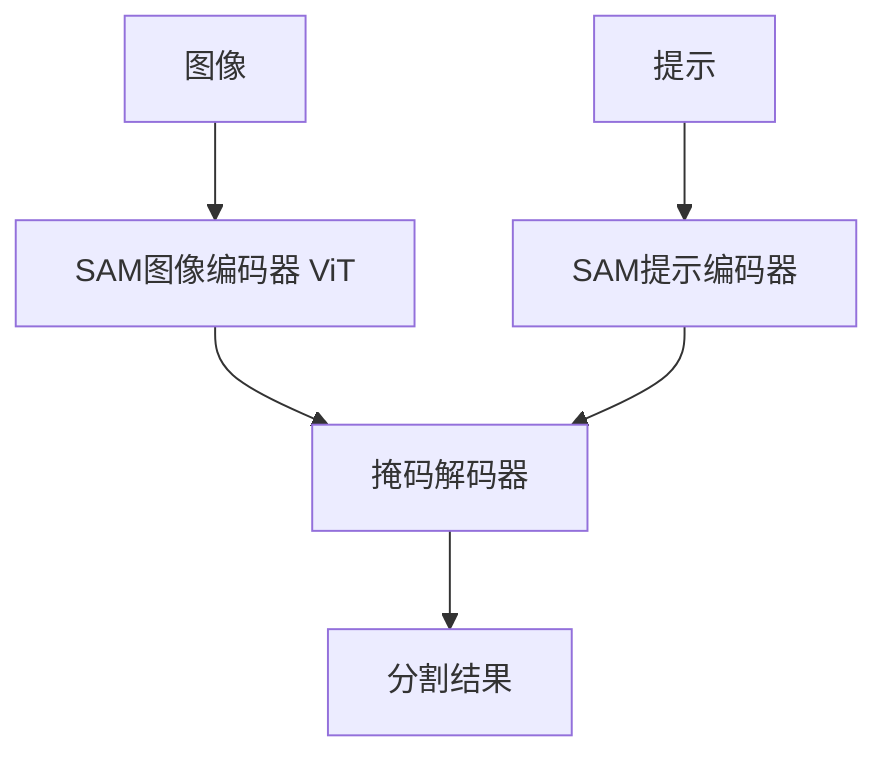

# 图像分割

## 1. 分割类型



### 分割任务对比
| 特性 | 语义分割 | 实例分割 | 全景分割 |
|------|---------|---------|---------|
| 输出 | 像素类别 | 类别+实例ID | 类别+实例ID（全部） |
| 区分同类别实例 | 不区分 | 区分 | 区分 |
| 背景处理 | 语义类 | 忽略 | 语义类 |
| 评估指标 | mIoU | AP | PQ |
| 代表模型 | DeepLab, U-Net | Mask R-CNN | Panoptic FPN |
| 难度 | 中等 | 较高 | 最高 |

## 2. 语义分割 Semantic Segmentation

### FCN（Fully Convolutional Network, 2015）
- 全卷积替代全连接，可处理任意尺寸输入
- **转置卷积**：上采样恢复空间分辨率
- **跳跃连接**：融合浅层细节+深层语义

### U-Net（2015）
- **对称编码-解码结构**
- **跳跃连接**：编码器特征直接传递给解码器
- 医学图像分割标配



### DeepLab 系列
- **V1**：空洞卷积扩大感受野
- **V2**：ASPP（空洞空间金字塔池化）
- **V3/V3+**：改进 ASPP + 编码-解码

### SegFormer（2021）
- **Transformer 语义分割**：分层 Transformer + MLP 解码器
- 简单统一，无需位置编码

### U-Net 实现

```python
import torch
import torch.nn as nn
import torch.nn.functional as F

class DoubleConv(nn.Module):
    def __init__(self, in_c, out_c):
        super().__init__()
        self.conv = nn.Sequential(
            nn.Conv2d(in_c, out_c, 3, 1, 1),
            nn.BatchNorm2d(out_c),
            nn.ReLU(inplace=True),
            nn.Conv2d(out_c, out_c, 3, 1, 1),
            nn.BatchNorm2d(out_c),
            nn.ReLU(inplace=True),
        )

    def forward(self, x):
        return self.conv(x)

class Down(nn.Module):
    def __init__(self, in_c, out_c):
        super().__init__()
        self.mpconv = nn.Sequential(
            nn.MaxPool2d(2),
            DoubleConv(in_c, out_c),
        )

    def forward(self, x):
        return self.mpconv(x)

class Up(nn.Module):
    def __init__(self, in_c, out_c, bilinear=True):
        super().__init__()
        if bilinear:
            self.up = nn.Upsample(scale_factor=2, mode="bilinear", align_corners=True)
        else:
            self.up = nn.ConvTranspose2d(in_c, in_c // 2, 2, 2)
        self.conv = DoubleConv(in_c, out_c)

    def forward(self, x1, x2):
        x1 = self.up(x1)
        diffY = x2.size(2) - x1.size(2)
        diffX = x2.size(3) - x1.size(3)
        x1 = F.pad(x1, [diffX // 2, diffX - diffX // 2, diffY // 2, diffY - diffY // 2])
        x = torch.cat([x2, x1], dim=1)
        return self.conv(x)

class UNet(nn.Module):
    def __init__(self, n_channels=3, n_classes=21, features=[64, 128, 256, 512]):
        super().__init__()
        self.inc = DoubleConv(n_channels, features[0])
        self.down1 = Down(features[0], features[1])
        self.down2 = Down(features[1], features[2])
        self.down3 = Down(features[2], features[3])
        self.down4 = Down(features[3], features[3] * 2)
        self.up1 = Up(features[3] * 2, features[3])
        self.up2 = Up(features[3], features[2])
        self.up3 = Up(features[2], features[1])
        self.up4 = Up(features[1], features[0])
        self.outc = nn.Conv2d(features[0], n_classes, 1)

    def forward(self, x):
        x1 = self.inc(x)
        x2 = self.down1(x1)
        x3 = self.down2(x2)
        x4 = self.down3(x3)
        x5 = self.down4(x4)
        x = self.up1(x5, x4)
        x = self.up2(x, x3)
        x = self.up3(x, x2)
        x = self.up4(x, x1)
        return self.outc(x)
```

### FCN 实现

```python
class FCN8s(nn.Module):
    def __init__(self, n_classes=21, backbone="vgg16"):
        super().__init__()
        vgg = torchvision.models.vgg16(weights="DEFAULT")
        features = list(vgg.features.children())
        self.conv1 = nn.Sequential(*features[:5])
        self.conv2 = nn.Sequential(*features[5:10])
        self.conv3 = nn.Sequential(*features[10:17])
        self.conv4 = nn.Sequential(*features[17:24])
        self.conv5 = nn.Sequential(*features[24:31])
        self.score_pool3 = nn.Conv2d(256, n_classes, 1)
        self.score_pool4 = nn.Conv2d(512, n_classes, 1)
        self.score_conv5 = nn.Conv2d(512, n_classes, 1)
        self.upsample2 = nn.ConvTranspose2d(n_classes, n_classes, 4, 2, 1)
        self.upsample4 = nn.ConvTranspose2d(n_classes, n_classes, 4, 2, 1)
        self.upsample8 = nn.ConvTranspose2d(n_classes, n_classes, 16, 8, 4)

    def forward(self, x):
        h = self.conv1(x)
        pool3 = self.conv2(h)
        pool4 = self.conv3(pool3)
        pool5 = self.conv4(pool4)
        conv5 = self.conv5(pool5)
        score5 = self.score_conv5(conv5)
        up4 = self.upsample2(score5)
        score4 = self.score_pool4(pool4)
        up4 = up4[:, :, :score4.size(2), :score4.size(3)]
        up4 = up4 + score4
        up3 = self.upsample4(up4)
        score3 = self.score_pool3(pool3)
        up3 = up3[:, :, :score3.size(2), :score3.size(3)]
        up3 = up3 + score3
        return self.upsample8(up3)
```

## 3. 实例分割 Instance Segmentation

### Mask R-CNN（2017）
- **Faster R-CNN 扩展**：新增 Mask 预测分支
- **ROI Align**：双线性插值消除量化误差
- **多任务**：分类 + BBox 回归 + Mask 分割



### YOLACT（2019）
- **实时实例分割**：原型掩码 + 线性组合
- 单阶段，30+ FPS

### SOLO / SOLOv2（2020-2021）
- **无锚框**：将实例分割转化为位置分类
- 按网格位置区分不同实例

## 4. 全景分割 Panoptic Segmentation
- 统一语义分割（占比）和实例分割（前景）
- **Panoptic FPN**：FPN + 联合训练
- **MaskFormer / Mask2Former**：统一的 Transformer 架构

### 分割架构对比
| 模型 | 分割类型 | Backbone | mIoU (ADE20K) | AP (COCO) | FPS |
|------|---------|---------|-------------|----------|-----|
| FCN-8s | 语义 | VGG-16 | 41.4 | - | 50+ |
| U-Net | 语义 | 自定义 | - | - | 30+ |
| DeepLabV3+ | 语义 | ResNet-101 | 46.2 | - | 20+ |
| Mask R-CNN | 实例 | ResNet-50-FPN | - | 37.5 | 13 |
| YOLACT | 实例 | ResNet-101 | - | 31.2 | 33 |
| SOLOv2 | 实例 | ResNet-101 | - | 38.8 | 18 |
| Mask2Former | 全景 | Swin-L | 57.3 | 52.5 | 8 |

## 5. SAM：Segment Anything Model（2023）

### 核心创新
- **提示分割**：点/框/掩码/文本提示 → 输出分割结果
- **SA-1B 数据集**：11M 图像，1B 掩码
- **零样本泛化**：不需微调即可分割未见过的物体



### SAM 2（2024）
- **视频分割**：图像+视频统一
- **记忆机制**：跨帧追踪对象

### SAM 应用
- 自动标注生成（训练数据）
- 图像编辑（移除背景/对象替换）
- 医学图像分割（零样本适配）

## 6. 2025-2026 趋势
- **基础分割模型**：SAM + Grounding DINO 组合，检测+分割
- **开放词汇分割**：任意文本 prompt 分割
- **3D 分割**：点云/NeRF 分割
- **视频分割**：SAM 2 + 追踪 → 自动视频标注
- **交互式分割**：点击/拖拽实时编辑

## 7. 评估指标

| 指标 | 说明 |
|------|------|
| mIoU | 均交并比，分割标准指标 |
| Dice / F1 | 医学分割常用 |
| Accuracy | 像素级准确率 |
| PQ | 全景质量（全景分割专用） |
| AP | 平均精度（实例分割） |

### mIoU 实现

```python
def compute_miou(pred_mask, gt_mask, num_classes=21):
    ious = []
    pred = pred_mask.view(-1)
    gt = gt_mask.view(-1)
    for cls in range(num_classes):
        pred_cls = (pred == cls)
        gt_cls = (gt == cls)
        inter = (pred_cls & gt_cls).sum().float()
        union = (pred_cls | gt_cls).sum().float()
        if union > 0:
            ious.append((inter / union).item())
    return torch.tensor(ious).mean().item()

def compute_dice(pred, target, eps=1e-6):
    pred = pred.contiguous().view(-1)
    target = target.contiguous().view(-1)
    inter = (pred * target).sum()
    return (2. * inter + eps) / (pred.sum() + target.sum() + eps)

class DiceLoss(nn.Module):
    def __init__(self, smooth=1e-6):
        super().__init__()
        self.smooth = smooth

    def forward(self, pred, target):
        pred = torch.softmax(pred, dim=1)
        target_onehot = F.one_hot(target, num_classes=pred.shape[1]).permute(0, 3, 1, 2).float()
        dims = (2, 3)
        inter = (pred * target_onehot).sum(dim=dims)
        union = pred.sum(dim=dims) + target_onehot.sum(dim=dims)
        dice = (2 * inter + self.smooth) / (union + self.smooth)
        return 1 - dice.mean()

class CombinedLoss(nn.Module):
    def __init__(self, num_classes=21):
        super().__init__()
        self.ce = nn.CrossEntropyLoss()
        self.dice = DiceLoss()

    def forward(self, pred, target):
        return self.ce(pred, target) + self.dice(pred, target)
```

### 分割训练示例

```python
model = UNet(n_channels=3, n_classes=21)
model = model.cuda()
optimizer = torch.optim.AdamW(model.parameters(), lr=1e-4, weight_decay=1e-4)
criterion = CombinedLoss(num_classes=21)

for epoch in range(100):
    model.train()
    for images, masks in train_loader:
        images, masks = images.cuda(), masks.cuda().long()
        optimizer.zero_grad()
        preds = model(images)
        loss = criterion(preds, masks)
        loss.backward()
        optimizer.step()

    model.eval()
    miou_scores = []
    with torch.no_grad():
        for images, masks in val_loader:
            images, masks = images.cuda(), masks.cuda().long()
            preds = model(images)
            pred_masks = torch.argmax(preds, dim=1)
            for i in range(images.size(0)):
                miou = compute_miou(pred_masks[i], masks[i], num_classes=21)
                miou_scores.append(miou)
    print(f"Epoch {epoch}: mIoU = {torch.tensor(miou_scores).mean().item():.4f}")
```

### 语义分割数据集对比
| 数据集 | 图像数 | 类别数 | 分辨率 | 标注类型 | 任务 |
|--------|-------|--------|--------|---------|------|
| PASCAL VOC 2012 | 2913 | 21 | 平均 ~500×400 | 像素级 | 语义分割 |
| Cityscapes | 5000 | 30 | 2048×1024 | 像素级 | 街景语义 |
| ADE20K | 22K | 150 | 多样 | 像素级 | 场景解析 |
| COCO Stuff | 164K | 171 | 640×480 | 像素级 | 语义+全景 |
| SA-1B | 11M | - | 多样 | 掩码 | 提示分割 |
