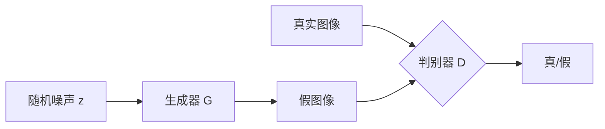

# 图像生成

## 1. 生成对抗网络 GAN

### 基本原理
- **生成器 G**：从噪声 z 生成假图像 G(z)
- **判别器 D**：区分真实图像与生成图像
- **对抗训练**：G 欺骗 D，D 识破 G



### 经典 GAN 架构
- **DCGAN（2015）**：全卷积 GAN，稳定训练基础
- **Conditional GAN**：条件控制生成（类别/文本）
- **StyleGAN（2019）**：风格控制、解耦特征
- **CycleGAN**：无配对图像翻译（斑马↔马）
- **pix2pix**：有配对图像翻译

### GAN 的发展
- **训练困难**：模式崩塌（Mode Collapse）、不收敛
- **渐进增长**：ProGAN，由低分辨率逐步增加
- **BigGAN**：大规模 GAN，ImageNet 高质量生成

### GAN 架构对比
| 模型 | 生成器 | 判别器 | 核心创新 | 分辨率 | 训练稳定性 |
|------|--------|--------|---------|--------|----------|
| DCGAN | 转置卷积 | 卷积 | 全卷积 GAN | 64×64 | 中等 |
| Conditional GAN | 条件输入 | 条件输入 | 条件控制 | 可变 | 中等 |
| StyleGAN | StyleBlock | ResNet | 风格解耦 | 1024×1024 | 好 |
| CycleGAN | ResBlock | PatchGAN | 循环一致性 | 256×256 | 好 |
| BigGAN | ResBlock | ResBlock | 大规模训练 | 512×512 | 难 |

### GAN 实现

```python
import torch
import torch.nn as nn
import torch.optim as optim

class Generator(nn.Module):
    def __init__(self, latent_dim=100, ngf=64):
        super().__init__()
        self.net = nn.Sequential(
            nn.ConvTranspose2d(latent_dim, ngf * 8, 4, 1, 0, bias=False),
            nn.BatchNorm2d(ngf * 8), nn.ReLU(True),
            nn.ConvTranspose2d(ngf * 8, ngf * 4, 4, 2, 1, bias=False),
            nn.BatchNorm2d(ngf * 4), nn.ReLU(True),
            nn.ConvTranspose2d(ngf * 4, ngf * 2, 4, 2, 1, bias=False),
            nn.BatchNorm2d(ngf * 2), nn.ReLU(True),
            nn.ConvTranspose2d(ngf * 2, ngf, 4, 2, 1, bias=False),
            nn.BatchNorm2d(ngf), nn.ReLU(True),
            nn.ConvTranspose2d(ngf, 3, 4, 2, 1, bias=False),
            nn.Tanh(),
        )

    def forward(self, z):
        z = z.view(z.size(0), -1, 1, 1)
        return self.net(z)

class Discriminator(nn.Module):
    def __init__(self, ndf=64):
        super().__init__()
        self.net = nn.Sequential(
            nn.Conv2d(3, ndf, 4, 2, 1, bias=False), nn.LeakyReLU(0.2, True),
            nn.Conv2d(ndf, ndf * 2, 4, 2, 1, bias=False),
            nn.BatchNorm2d(ndf * 2), nn.LeakyReLU(0.2, True),
            nn.Conv2d(ndf * 2, ndf * 4, 4, 2, 1, bias=False),
            nn.BatchNorm2d(ndf * 4), nn.LeakyReLU(0.2, True),
            nn.Conv2d(ndf * 4, ndf * 8, 4, 2, 1, bias=False),
            nn.BatchNorm2d(ndf * 8), nn.LeakyReLU(0.2, True),
            nn.Conv2d(ndf * 8, 1, 4, 1, 0, bias=False),
            nn.Sigmoid(),
        )

    def forward(self, x):
        return self.net(x).view(-1, 1)

def train_gan(generator, discriminator, dataloader, epochs=100, latent_dim=100, device="cuda"):
    criterion = nn.BCELoss()
    g_opt = optim.Adam(generator.parameters(), lr=2e-4, betas=(0.5, 0.999))
    d_opt = optim.Adam(discriminator.parameters(), lr=2e-4, betas=(0.5, 0.999))
    generator.train(), discriminator.train()

    for epoch in range(epochs):
        for real_imgs, _ in dataloader:
            batch = real_imgs.size(0)
            real_imgs = real_imgs.to(device)
            real_labels = torch.ones(batch, 1).to(device)
            fake_labels = torch.zeros(batch, 1).to(device)

            d_opt.zero_grad()
            d_real = discriminator(real_imgs)
            d_real_loss = criterion(d_real, real_labels)
            z = torch.randn(batch, latent_dim).to(device)
            fake_imgs = generator(z)
            d_fake = discriminator(fake_imgs.detach())
            d_fake_loss = criterion(d_fake, fake_labels)
            d_loss = d_real_loss + d_fake_loss
            d_loss.backward()
            d_opt.step()

            g_opt.zero_grad()
            z = torch.randn(batch, latent_dim).to(device)
            fake_imgs = generator(z)
            g_out = discriminator(fake_imgs)
            g_loss = criterion(g_out, real_labels)
            g_loss.backward()
            g_opt.step()
```

## 2. 扩散模型 Diffusion Models

### 基本原理
- **前向过程**：逐步加噪直到纯噪声（马尔可夫链）
- **反向过程**：学习去噪，从噪声恢复图像
- **训练目标**：预测添加的噪声 ε

```mermaid
graph LR
    A[x₀ 原始图像] -->|加噪 q| B[x₁]
    B -->|加噪| C[x₂]
    C -->|...| D[x_T 纯噪声]
    D -->|去噪 p_θ| E[x_{T-1}]
    E --> F[x_{T-2}]
    F --> G[x₀ 重建图像]
```

### 文生图扩散模型
- **Stable Diffusion（2022）**：潜在扩散模型（LDM），在潜空间运算
- **DDPM**：去噪扩散概率模型
- **DDIM**：确定性采样，加速 10-50×
- **DALL-E 3**：文本理解增强
- **Midjourney**：美学风格第一
- **Imagen**：Google，纯文本语义理解

### 扩散模型加速
- **采样加速**：DDIM、DPM-Solver、LCM（潜在一致性模型）
- **模型蒸馏**：渐进式蒸馏、对抗蒸馏
- **SDXL**：Stable Diffusion 大型版，1024×1024
- **SD3/Stable Diffusion 3**：MMDiT（多模态扩散 Transformer），2024
- **FLUX**（Black Forest Labs，2024）：Flow Matching
- **SD4（2025）**：Transformer 架构的扩散模型，质量大幅提升

### 生成方法对比
| 特性 | GAN | 扩散模型 | VAE | 自回归模型 |
|------|-----|---------|-----|-----------|
| 训练稳定性 | 差 | 好 | 好 | 好 |
| 多样性 | 低（模式崩塌） | 高 | 中 | 高 |
| 生成速度 | 快（1步） | 慢（10-1000步） | 快 | 慢 |
| 图像质量 | 高 | 极高 | 模糊 | 高 |
| 可控性 | 中 | 好 | 中 | 好 |
| 代表模型 | StyleGAN | SD/DALL-E | VQ-VAE | DALL-E 1 |

### VAE 实现

```python
class VAE(nn.Module):
    def __init__(self, latent_dim=128):
        super().__init__()
        self.encoder = nn.Sequential(
            nn.Conv2d(3, 32, 4, 2, 1), nn.ReLU(),
            nn.Conv2d(32, 64, 4, 2, 1), nn.ReLU(),
            nn.Conv2d(64, 128, 4, 2, 1), nn.ReLU(),
            nn.Conv2d(128, 256, 4, 2, 1), nn.ReLU(),
            nn.AdaptiveAvgPool2d(1),
            nn.Flatten(),
        )
        self.fc_mu = nn.Linear(256, latent_dim)
        self.fc_logvar = nn.Linear(256, latent_dim)
        self.fc_decode = nn.Linear(latent_dim, 256 * 4 * 4)
        self.decoder = nn.Sequential(
            nn.ConvTranspose2d(256, 128, 4, 2, 1), nn.ReLU(),
            nn.ConvTranspose2d(128, 64, 4, 2, 1), nn.ReLU(),
            nn.ConvTranspose2d(64, 32, 4, 2, 1), nn.ReLU(),
            nn.ConvTranspose2d(32, 3, 4, 2, 1), nn.Tanh(),
        )

    def reparameterize(self, mu, logvar):
        std = torch.exp(0.5 * logvar)
        eps = torch.randn_like(std)
        return mu + eps * std

    def forward(self, x):
        h = self.encoder(x)
        mu, logvar = self.fc_mu(h), self.fc_logvar(h)
        z = self.reparameterize(mu, logvar)
        recon = self.fc_decode(z).view(-1, 256, 4, 4)
        recon = self.decoder(recon)
        return recon, mu, logvar

def vae_loss(recon_x, x, mu, logvar):
    recon_loss = F.mse_loss(recon_x, x, reduction="sum")
    kl_loss = -0.5 * torch.sum(1 + logvar - mu.pow(2) - logvar.exp())
    return recon_loss + kl_loss
```

### 扩散模型实现（简化）

```python
class DiffusionModel(nn.Module):
    def __init__(self, n_steps=1000, beta_start=1e-4, beta_end=0.02):
        super().__init__()
        self.n_steps = n_steps
        self.betas = torch.linspace(beta_start, beta_end, n_steps)
        self.alphas = 1 - self.betas
        self.alpha_bars = torch.cumprod(self.alphas, dim=0)

    def forward_process(self, x0, t):
        sqrt_alpha_bar = self.alpha_bars[t].sqrt().view(-1, 1, 1, 1)
        sqrt_one_minus = (1 - self.alpha_bars[t]).sqrt().view(-1, 1, 1, 1)
        noise = torch.randn_like(x0)
        xt = sqrt_alpha_bar * x0 + sqrt_one_minus * noise
        return xt, noise

    def sample(self, model, shape, device="cuda"):
        model.eval()
        x = torch.randn(shape, device=device)
        with torch.no_grad():
            for t in range(self.n_steps - 1, -1, -1):
                t_tensor = torch.full((shape[0],), t, device=device, dtype=torch.long)
                pred_noise = model(x, t_tensor)
                alpha = self.alphas[t].to(device)
                alpha_bar = self.alpha_bars[t].to(device)
                alpha_bar_prev = self.alpha_bars[t-1].to(device) if t > 0 else torch.tensor(1.0).to(device)
                beta = self.betas[t].to(device)
                if t == 0:
                    x = (x - beta * pred_noise / (1 - alpha_bar).sqrt()) / alpha.sqrt()
                else:
                    noise = torch.randn_like(x)
                    x = (x - beta * pred_noise / (1 - alpha_bar).sqrt()) / alpha.sqrt() + torch.sqrt(beta) * noise
        return x

class UNetDenoiser(nn.Module):
    def __init__(self, n_steps=1000):
        super().__init__()
        self.time_embed = nn.Sequential(
            nn.Linear(n_steps, 128), nn.SiLU(),
            nn.Linear(128, 128), nn.SiLU(),
        )
        self.enc1 = nn.Conv2d(3, 64, 3, 1, 1)
        self.enc2 = nn.Conv2d(64, 128, 3, 2, 1)
        self.enc3 = nn.Conv2d(128, 256, 3, 2, 1)
        self.mid = nn.Conv2d(256, 256, 3, 1, 1)
        self.dec3 = nn.ConvTranspose2d(512, 128, 4, 2, 1)
        self.dec2 = nn.ConvTranspose2d(256, 64, 4, 2, 1)
        self.dec1 = nn.Conv2d(128, 3, 3, 1, 1)

    def forward(self, x, t):
        t_embed = self.time_embed(
            torch.nn.functional.one_hot(t, num_classes=self.time_embed[0].in_features).float()
        )
        e1 = torch.relu(self.enc1(x))
        e2 = torch.relu(self.enc2(e1))
        e3 = torch.relu(self.enc3(e2))
        m = self.mid(e3) + t_embed.view(t_embed.size(0), -1, 1, 1)
        d3 = torch.relu(self.dec3(torch.cat([m, e3], dim=1)))
        d2 = torch.relu(self.dec2(torch.cat([d3, e2], dim=1)))
        d1 = self.dec1(torch.cat([d2, e1], dim=1))
        return d1

def train_diffusion(model, denoiser, dataloader, epochs=100, device="cuda"):
    optimizer = optim.Adam(denoiser.parameters(), lr=1e-4)
    denoiser.train()
    for epoch in range(epochs):
        for x0, _ in dataloader:
            x0 = x0.to(device)
            batch = x0.size(0)
            t = torch.randint(0, model.n_steps, (batch,), device=device)
            xt, noise = model.forward_process(x0, t)
            pred_noise = denoiser(xt, t)
            loss = F.mse_loss(pred_noise, noise)
            optimizer.zero_grad()
            loss.backward()
            optimizer.step()
```

### 条件生成（Conditional GAN）

```python
class ConditionalGenerator(nn.Module):
    def __init__(self, latent_dim=100, num_classes=10):
        super().__init__()
        self.label_embed = nn.Embedding(num_classes, 50)
        self.net = nn.Sequential(
            nn.ConvTranspose2d(latent_dim + 50, 512, 4, 1, 0, bias=False),
            nn.BatchNorm2d(512), nn.ReLU(True),
            nn.ConvTranspose2d(512, 256, 4, 2, 1, bias=False),
            nn.BatchNorm2d(256), nn.ReLU(True),
            nn.ConvTranspose2d(256, 128, 4, 2, 1, bias=False),
            nn.BatchNorm2d(128), nn.ReLU(True),
            nn.ConvTranspose2d(128, 3, 4, 2, 1, bias=False),
            nn.Tanh(),
        )

    def forward(self, z, labels):
        label_emb = self.label_embed(labels).unsqueeze(-1).unsqueeze(-1)
        z = z.view(z.size(0), -1, 1, 1)
        x = torch.cat([z, label_emb.expand(-1, -1, 4, 4)], dim=1)
        return self.net(x)
```

## 3. 图像控制生成

### ControlNet（2023）
- **原理**：冻结 SD 副本 + 可训练控制分支
- **控制方式**：边缘图（Canny）、深度图（Depth）、骨骼（OpenPose）、涂鸦（Scribble）、语义分割（Seg）
- **多条件**：多个 ControlNet 同时控制

### IP-Adapter
- **图像提示**：以图生图，保持风格/内容
- **分离控制**：文本与图像控制独立

### T2I-Adapter
- **轻量适配器**：比 ControlNet 更小更快

### 控制生成方法对比
| 方法 | 参数量 | 控制精度 | 多条件 | 速度 | 兼容性 |
|------|-------|---------|-------|------|-------|
| ControlNet | ~360M | 高 | 支持 | 中等 | 好 |
| T2I-Adapter | ~77M | 中 | 支持 | 快 | 好 |
| IP-Adapter | ~22M | 中（风格） | 支持 | 快 | 好 |
| LoRA | ~3M | 低（风格） | 不直接 | 最快 | 好 |
| GLIGEN | ~200M | 高（布局） | 有限 | 中等 | 中等 |

## 4. 视频生成

- **Sora（OpenAI，2024）**：扩散 Transformer，视频生成里程碑
- **Runway Gen-3**：专业视频编辑
- **Pika Labs**：创意视频生成
- **AnimateDiff**：动画化的 Stable Diffusion
- **VideoPoet**：LLM 视频生成
- **Sora Turbo（2025）**：大幅提速
- **Kling（2025）**：中文视频生成模型

## 5. 3D 生成

- **NeRF**：神经辐射场，2D→3D 重建
- **3D Gaussian Splatting**：实时 3D 渲染新标准（2023-2025）
- **DreamFusion**：文生 3D 模型
- **Stable Zero123**：单图转 3D 模型

## 6. 2025-2026 趋势

| 方向 | 进展 |
|------|------|
| 视频生成长度 | 从 4s 到 60s+，一致性提升 |
| 实时生成 | SD Turbo/LCM 实现实时交互 |
| 3D 生成 | 2D→3D 秒级生成，可编辑 |
| 可控性 | Layout/Camera/Motion 同时控制 |
| 模型大小 | 从 1B 到 10B 参数，质量飞跃 |
