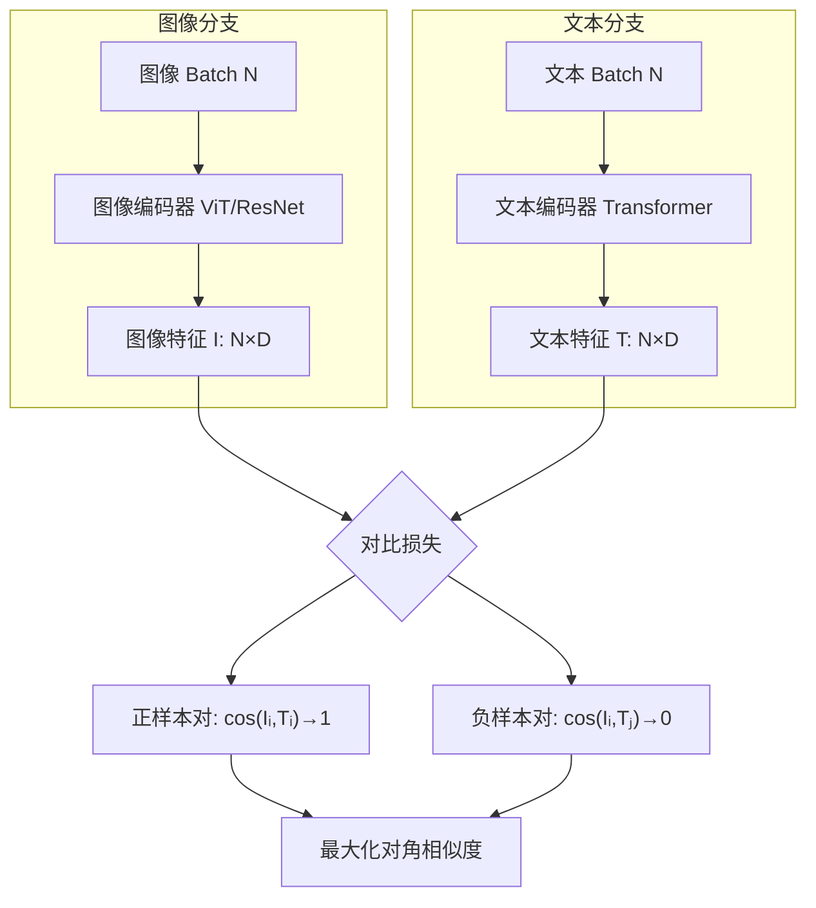

# 多模态视觉模型

## 1. 图文对比学习

### CLIP（OpenAI, 2021）



- **训练**：4 亿图文对，对比学习对齐图像和文本嵌入
- **零样本分类**：无需微调，用文本 prompt 分类图像
- **特点**：超强的泛化能力

### SigLIP（Google, 2023）
- Sigmoid 损失替代 Softmax，支持大批次更稳定
- 训练效率更高

### EVA-CLIP（2023）
- 用 CLIP 特性蒸馏更大更强

### 对比学习损失对比
| 损失函数 | 公式 | 批次要求 | 数值稳定性 | 适用场景 |
|---------|------|---------|-----------|---------|
| InfoNCE (CLIP) | -log(exp(sim⁺)/Σexp(sim)) | 大批次 | 中等 | 通用对比学习 |
| Sigmoid (SigLIP) | -log(σ(sim⁺)) - Σlog(σ(-sim⁻)) | 任意 | 好 | 任意批次 |
| HardNeg | 仅最难负样本 | 任意 | 差 | 判别任务 |
| Distillation | KL(p_teacher||p_student) | 任意 | 好 | 模型蒸馏 |

### CLIP 实现

```python
import torch
import torch.nn as nn
import torch.nn.functional as F

class ImageEncoder(nn.Module):
    def __init__(self, embed_dim=512):
        super().__init__()
        self.backbone = nn.Sequential(
            nn.Conv2d(3, 64, 4, 4), nn.ReLU(),
            nn.Conv2d(64, 128, 4, 4), nn.ReLU(),
            nn.Conv2d(128, 256, 4, 4), nn.ReLU(),
            nn.Conv2d(256, 512, 4, 4), nn.ReLU(),
            nn.AdaptiveAvgPool2d(1),
            nn.Flatten(),
        )
        self.proj = nn.Linear(512, embed_dim)

    def forward(self, x):
        x = self.backbone(x)
        return F.normalize(self.proj(x), dim=-1)

class TextEncoder(nn.Module):
    def __init__(self, vocab_size=49408, max_len=77, embed_dim=512, d_model=256):
        super().__init__()
        self.token_embed = nn.Embedding(vocab_size, d_model)
        self.pos_embed = nn.Parameter(torch.randn(1, max_len, d_model))
        encoder_layer = nn.TransformerEncoderLayer(d_model, nhead=4, batch_first=True)
        self.transformer = nn.TransformerEncoder(encoder_layer, num_layers=4)
        self.proj = nn.Linear(d_model, embed_dim)

    def forward(self, tokens, mask=None):
        x = self.token_embed(tokens) + self.pos_embed[:, :tokens.size(1), :]
        x = self.transformer(x, src_key_padding_mask=mask)
        x = x[:, 0, :]
        return F.normalize(self.proj(x), dim=-1)

class CLIPModel(nn.Module):
    def __init__(self, embed_dim=512, temperature=0.07):
        super().__init__()
        self.image_encoder = ImageEncoder(embed_dim)
        self.text_encoder = TextEncoder(embed_dim=embed_dim)
        self.logit_scale = nn.Parameter(torch.log(torch.tensor(1 / temperature)))

    def forward(self, images, tokens, mask=None):
        image_features = self.image_encoder(images)
        text_features = self.text_encoder(tokens, mask)
        return image_features, text_features

    def contrastive_loss(self, image_features, text_features):
        batch = image_features.size(0)
        logits = self.logit_scale.exp() * image_features @ text_features.t()
        labels = torch.arange(batch, device=logits.device)
        loss_i = F.cross_entropy(logits, labels)
        loss_t = F.cross_entropy(logits.t(), labels)
        return (loss_i + loss_t) / 2

class CLIPDataset(torch.utils.data.Dataset):
    def __init__(self, images, texts):
        self.images = images
        self.texts = texts

    def __len__(self):
        return len(self.images)

    def __getitem__(self, idx):
        return self.images[idx], self.texts[idx]

class SimpleTokenizer:
    def __init__(self, vocab_size=49408, max_len=77):
        self.vocab_size = vocab_size
        self.max_len = max_len

    def encode(self, texts):
        tokens = torch.randint(0, self.vocab_size, (len(texts), self.max_len))
        mask = torch.zeros(len(texts), self.max_len, dtype=torch.bool)
        return tokens, mask
```

### 训练循环

```python
model = CLIPModel(embed_dim=512)
optimizer = torch.optim.AdamW(model.parameters(), lr=5e-5, weight_decay=0.1)
tokenizer = SimpleTokenizer()

for epoch in range(30):
    model.train()
    total_loss = 0
    for images, texts in dataloader:
        tokens, mask = tokenizer.encode(texts)
        images, tokens, mask = images.cuda(), tokens.cuda(), mask.cuda()
        img_feat, txt_feat = model(images, tokens, mask)
        loss = model.contrastive_loss(img_feat, txt_feat)
        optimizer.zero_grad()
        loss.backward()
        optimizer.step()
        total_loss += loss.item()

    model.eval()
    with torch.no_grad():
        total = correct = 0
        for images, labels in zeroshot_loader:
            images = images.cuda()
            image_features = model.image_encoder(images)
            text_features = model.text_encoder(zeroshot_tokens, zeroshot_mask)
            logits = model.logit_scale.exp() * image_features @ text_features.t()
            preds = logits.argmax(dim=1)
            correct += (preds == labels.cuda()).sum().item()
            total += labels.size(0)
    print(f"Zero-shot Acc: {100 * correct / total:.2f}%")
```

## 2. 视觉语言模型 VLM

### BLIP 系列
- **BLIP（2022）**：统一理解和生成的自举方法
- **BLIP-2（2023）**：Q-Former 桥接冻结图像编码器和 LLM
- **优点**：高效，不更新 LLM

### LLaVA 系列
- **LLaVA（2023）**：简单映射层连接 CLIP 视觉编码器 + Vicuna LLM
- **LLaVA 1.5/1.6**：改进训练，支持更高分辨率
- **LLaVA-NeXT**：任意分辨率，动态高分辨率

### Flava / ImageBind
- **Flava**（Meta）：多模态融合编码器
- **ImageBind**（Meta）：绑定 6 种模态（图像/文本/音频/深度/热/IMU）

### VLM 架构对比
| 模型 | 视觉编码器 | 连接层 | 语言模型 | 训练数据 | 特点 |
|------|-----------|--------|---------|---------|------|
| BLIP-2 | ViT-g | Q-Former | FLAN-T5/OPT | 129M | 冻结 LLM |
| LLaVA 1.5 | CLIP ViT-L | MLP | Vicuna-13B | 665K | 简单高效 |
| InstructBLIP | ViT-g | Q-Former | Vicuna-7B/13B | 13B | 指令跟随 |
| Qwen-VL | ViT-bigG | Resampler | Qwen-7B | 1.4B | 中文优秀 |
| CogVLM | ViT | 深度融合 | Llama-7B | 1.5B | 深度对齐 |
| Florence-2 | ViT-H | 统一编码 | - | 5B | 任务统一 |

### LLaVA 简化实现

```python
class LLaVAModel(nn.Module):
    def __init__(self, vision_dim=768, llm_dim=4096, num_tokens=256):
        super().__init__()
        self.vision_encoder = ImageEncoder(embed_dim=vision_dim)
        self.projection = nn.Sequential(
            nn.Linear(vision_dim, llm_dim),
            nn.GELU(),
            nn.Linear(llm_dim, llm_dim),
        )

    def forward(self, images, input_ids, attention_mask):
        img_feat = self.vision_encoder(images)
        img_tokens = self.projection(img_feat).unsqueeze(1)
        return img_tokens

class QFormer(nn.Module):
    def __init__(self, num_queries=32, d_model=768):
        super().__init__()
        self.query_tokens = nn.Parameter(torch.randn(1, num_queries, d_model))
        encoder_layer = nn.TransformerEncoderLayer(d_model, nhead=8, batch_first=True)
        self.encoder = nn.TransformerEncoder(encoder_layer, num_layers=6)

    def forward(self, vision_features):
        queries = self.query_tokens.expand(vision_features.size(0), -1, -1)
        x = torch.cat([vision_features, queries], dim=1)
        x = self.encoder(x)
        return x[:, -self.query_tokens.size(1):, :]
```

## 3. GPT-4V / GPT-4o

### 能力
- **图像理解**：看图描述、推理、计数
- **图文混合**：输入文字+图像，理解和生成
- **图表分析**：读图表计算
- **文档理解**：OCR + 结构理解

### GPT-4o（2024）
- **全模态**：文本+图像+音频 统一输入输出
- **实时语音**：200ms 端到端语音对话
- **情感识别**：语音情感感知

## 4. Gemini

### Gemini 系列
- **原生多模态**：从一开始就在图像/视频/音频/代码上训练
- **Gemini Pro/Ultra**：不同规模
- **Gemini 2.5/3**：长上下文 + 推理增强

### 特性对比
| 模型 | 图像 | 视频 | 音频 | 代码 | 长上下文 |
|------|------|------|------|------|---------|
| GPT-4V | ✓ | 有限 | ✗ | ✓ | 128K |
| GPT-4o | ✓ | ✓ | ✓ | ✓ | 128K |
| Gemini 1.5 | ✓ | ✓ | ✓ | ✓ | 1M |
| Gemini 2.5 | ✓ | ✓ | ✓ | ✓ | 1M+ |
| Claude 3 | ✓ | ✗ | ✗ | ✓ | 200K |

### VLM 与生成模型对比
| 维度 | 理解型 VLM | 生成型扩散 | 统一型 |
|------|-----------|-----------|-------|
| 主要能力 | 图像理解/问答 | 图像生成 | 理解+生成 |
| 架构 | Encoder-Decoder | UNet/DiT | 融合架构 |
| 输入 | 图像+文本 | 文本/条件图 | 图像+文本 |
| 输出 | 文本 | 图像 | 文本/图像 |
| 代表 | LLaVA, BLIP-2 | SD, DALL-E | GPT-4o, Gemini |
| 训练策略 | 对比+生成 | 扩散去噪 | 多任务联合 |

## 5. 视觉生成模型（图文到图）
- **DALL-E 3**：精确文本理解，安全引导
- **Midjourney V6/V7**：美学极致，3D 一致性
- **Stable Diffusion 3/4**：MMDiT + 扩散 Transformer
- **FLUX**：Flow Matching + Transformer

## 6. 2025-2026 趋势
- **端到端多模态**：单一模型原生多模态（GPT-4o、Gemini）
- **视频理解**：从短视频到长视频（30min+）理解
- **统一生成+理解**：一个模型既能看图也能画图
- **空间理解**：3D/场景布局/物理关系推理
- **细粒度理解**：计数/排序/属性识别
