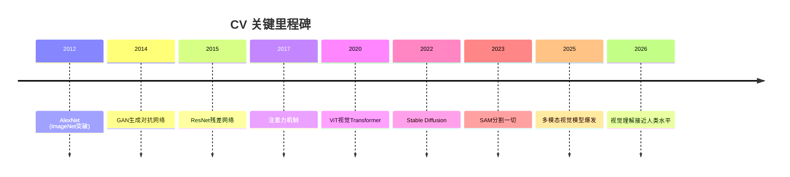

# 计算机视觉 Computer Vision

## 概述

计算机视觉（CV）使机器能够理解和分析视觉信息。本模块覆盖从经典图像处理到多模态视觉大模型的完整知识体系。

## 目录

```
04-计算机视觉CV/
├── README.md
├── 01-图像基础.md          # 滤波/边缘检测/特征点/图像变换
├── 02-图像分类.md          # CNN架构/ResNet/EfficientNet/ViT
├── 03-目标检测.md          # R-CNN系列/YOLO/SSD/DETR
├── 04-图像分割.md          # FCN/U-Net/Mask R-CNN/SAM
├── 05-图像生成.md          # GAN/扩散模型/ControlNet
├── 06-多模态视觉模型.md    # CLIP/BLIP/GPT-4V/Gemini
├── 07-视频理解.md          # 动作识别/跟踪/时序建模
└── 08-3D视觉.md            # 点云/NeRF/3D重建/深度估计
```

## 发展里程碑



## 核心框架对比

| 框架 | 语言 | 优势 | 适用场景 |
|------|------|------|---------|
| OpenCV | C++/Python | 经典算法丰富 | 图像处理/传统CV |
| PyTorch | Python | 灵活易用 | 深度学习研究 |
| Detectron2 | PyTorch | 检测/分割统一 | 目标检测研究 |
| MMDetection | PyTorch | 算法大全 | 学术对比 |
| YOLO (Ultralytics) | PyTorch | 工程速度极快 | 工业部署 |
| Hugging Face Transformers | Python | 多模态模型 | ViT/CLIP/SAM |
