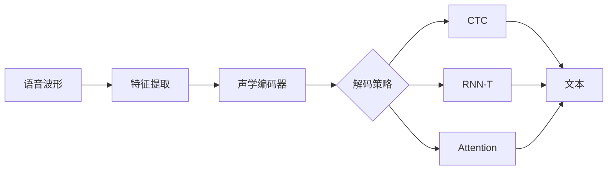
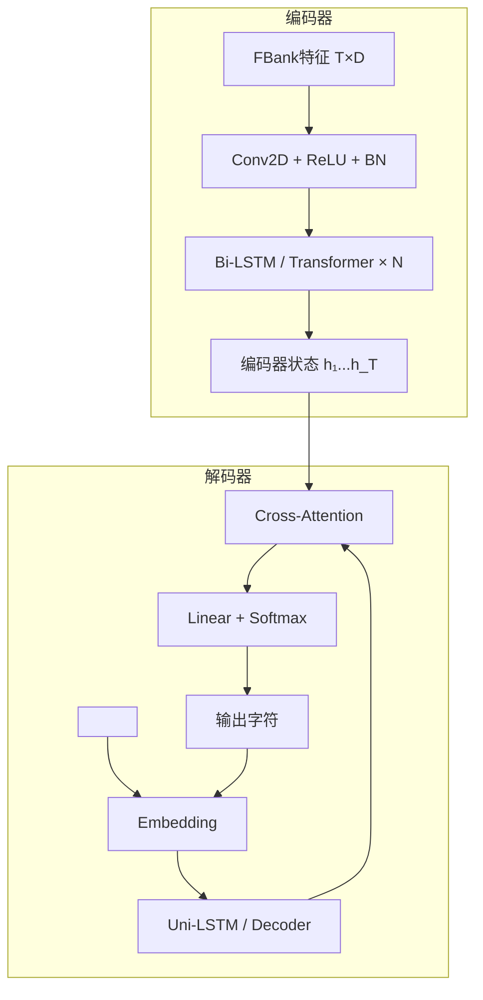
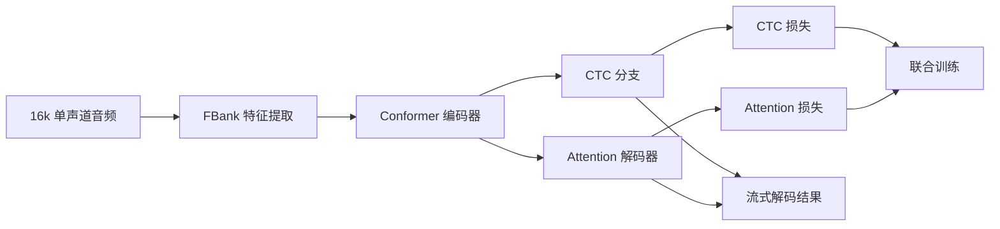

# 语音识别 ASR

## 1. 传统架构

### 声学模型 + 语言模型（传统）
- **GMM-HMM**：高斯混合模型 + 隐马尔可夫模型
- **特征**：MFCC（梅尔频率倒谱系数）、FBank（滤波器组）

### 端到端架构
- **输入**：原始波形或频谱特征（FBank/Mel Spectrogram）
- **输出**：文本序列



### 编码器-解码器架构



## 2. 特征提取对比

| 特征 | 维度 | 特点 | 常用场景 |
|------|------|------|---------|
| Raw Waveform | 1×T | 无损，模型需学习滤波 | Wav2Vec 2.0 |
| MFCC | 13×T | 去相关，压缩 | GMM-HMM，传统方法 |
| FBank | 40-80×T | 保留相关性 | 神经网络 ASR 标配 |
| Mel Spectrogram | 80-128×T | 视觉友好 | Whisper、TTS |
| Pitch + FBank | 多通道 | 包含音调 | 声调语言 |

## 3. PyTorch 代码示例

### MFCC / FBank 特征提取

```python
import torch
import torchaudio
import torchaudio.functional as F

waveform, sr = torchaudio.load("speech.wav")
waveform = torchaudio.functional.resample(waveform, sr, 16000)

fbank = torchaudio.compliance.kaldi.fbank(
    waveform, num_mel_bins=80, sample_frequency=16000,
    frame_length=25, frame_shift=10
)
mfcc = torchaudio.compliance.kaldi.mfcc(
    waveform, num_mel_bins=23, num_ceps=13, sample_frequency=16000
)

print(f"FBank shape: {fbank.shape}")   
print(f"MFCC shape: {mfcc.shape}")
```

### CTC 解码（Greedy + Beam Search）

```python
import torch
import torch.nn.functional as F

def ctc_greedy_decode(log_probs: torch.Tensor, blank: int = 0):
    preds = log_probs.argmax(dim=-1)
    collapsed = []
    prev = blank
    for p in preds[0]:
        if p != prev and p != blank:
            collapsed.append(p.item())
        prev = p
    return collapsed

def ctc_beam_search(log_probs: torch.Tensor, beam_size: int = 10, blank: int = 0):
    B, T, V = log_probs.shape
    beams = [([], 0.0)]
    for t in range(T):
        probs = torch.exp(log_probs[0, t])
        new_beams = []
        for seq, score in beams:
            for c in range(V):
                new_score = score + torch.log(probs[c] + 1e-8)
                if c == blank:
                    new_beams.append((seq, new_score))
                elif seq and seq[-1] == c:
                    new_beams.append((seq, new_score))
                else:
                    new_beams.append((seq + [c], new_score))
        new_beams.sort(key=lambda x: x[1], reverse=True)
        beams = new_beams[:beam_size]
    return [seq for seq, _ in beams]

log_probs = torch.randn(1, 50, 28).log_softmax(dim=-1)
greedy = ctc_greedy_decode(log_probs)
beam = ctc_beam_search(log_probs, beam_size=5)
print(f"Greedy: {greedy}")
print(f"Beam: {beam}")
```

### LAS 注意力机制

```python
import torch
import torch.nn as nn
import torch.nn.functional as F

class LASDecoder(nn.Module):
    def __init__(self, vocab_size, d_model=512, d_k=128):
        super().__init__()
        self.embed = nn.Embedding(vocab_size, d_model)
        self.lstm = nn.LSTMCell(d_model + d_k, d_model)
        self.W_q = nn.Linear(d_model, d_k)
        self.W_k = nn.Linear(d_model, d_k)
        self.W_v = nn.Linear(d_k, 1)
        self.proj = nn.Linear(d_model, vocab_size)

    def forward(self, enc_states, tokens):
        B, T, D = enc_states.shape
        K = self.W_k(enc_states)
        h, c = torch.zeros(B, D), torch.zeros(B, D)
        outputs = []
        for t in range(tokens.shape[1]):
            emb = self.embed(tokens[:, t])
            Q = self.W_q(h).unsqueeze(1)
            E = torch.tanh(K + Q)
            a = F.softmax(self.W_v(E).squeeze(-1), dim=1)
            ctx = (a.unsqueeze(-1) * enc_states).sum(dim=1)
            inp = torch.cat([emb, ctx], dim=1)
            h, c = self.lstm(inp, (h, c))
            outputs.append(self.proj(h))
        return torch.stack(outputs, dim=1)

model = LASDecoder(vocab_size=28)
enc = torch.randn(2, 100, 512)
tok = torch.randint(0, 28, (2, 20))
out = model(enc, tok)
print(f"LAS output: {out.shape}")
```

### Whisper 调用与解码

```python
import torch
import whisper

model = whisper.load_model("base")
result = model.transcribe("speech.wav", language="zh")
print(f"Whisper result: {result['text']}")

audio = whisper.load_audio("speech.wav")
audio = whisper.pad_or_trim(audio)
mel = whisper.log_mel_spectrogram(audio).unsqueeze(0)
with torch.no_grad():
    dec_out = model.decode(mel, whisper.DecodingOptions(
        language="zh", task="transcribe", beam_size=5
    ))
print(f"Beam decode: {dec_out.text}")
```

### Wav2Vec 2.0 微调

```python
import torch
from transformers import Wav2Vec2ForCTC, Wav2Vec2Processor

processor = Wav2Vec2Processor.from_pretrained("facebook/wav2vec2-base")
model = Wav2Vec2ForCTC.from_pretrained("facebook/wav2vec2-base")

waveform, sr = torchaudio.load("speech.wav")
waveform = torchaudio.functional.resample(waveform, sr, 16000)
inputs = processor(waveform.squeeze(), sampling_rate=16000, return_tensors="pt")

with torch.no_grad():
    logits = model(**inputs).logits
pred_ids = logits.argmax(dim=-1)
transcription = processor.batch_decode(pred_ids)[0]
print(f"Wav2Vec2: {transcription}")

optimizer = torch.optim.AdamW(model.parameters(), lr=2e-5)
for epoch in range(3):
    outputs = model(**inputs, labels=inputs.input_ids)
    loss = outputs.loss
    loss.backward()
    optimizer.step()
    optimizer.zero_grad()
    print(f"Epoch {epoch}, Loss: {loss.item():.4f}")
```

## 4. 主流模型对比

| 模型 | 参数量 | 流式 | 多语言 | 解码速度 | 代表 |
|------|--------|------|--------|---------|------|
| DeepSpeech 2 | 100M | 否 | 有限 | 快 | Baidu |
| LAS | 150M | 否 | 有限 | 中 | Google |
| RNN-T | 120M | 是 | 多语言 | 快 | Google |
| Whisper | 1.5B | 否 | 99+语言 | 慢 | OpenAI |
| Wav2Vec 2.0 | 95-317M | 否 | 需微调 | 中 | Meta |
| SenseVoice | 330M | 是 | 多语+情感 | 快 | 阿里 |
| WeNet | 50-100M | 是 | 可扩展 | 快 | 开源 |

## 5. 解码策略

| 策略 | 特点 | 适用 |
|------|------|------|
| Greedy | 每帧取最高概率 | 快速但次优 |
| Beam Search | 维护 K 个候选路径 | 标准解码 |
| Prefix Beam Search | CTC 专用，考虑 blank | CTC 模型 |
| Rescoring | N-best 语言模型重打分 | 提升准确率 |
| Flashlight Beam | 加权有限状态机 | 带词典解码 |

## 6. 数据增强
- **SpecAugment**：时间/频率掩码，ASR 标配
- **加噪**：背景噪声、混响
- **变速/变调**：鲁棒性提升
- **语速扰动**：减缓/加速

## 7. 评估
- **WER（词错误率）**：(S + D + I)/N，S=替换 D=删除 I=插入
- **实时因子 RTF**：处理时间/语音时长，RTF<1 为实时
- **延迟**：流式识别中输出相对语音的滞后时间

## 8. 工具与框架

| 工具 | 优势 | 场景 |
|------|------|------|
| Whisper | 多语言、零样本 | 通用识别 |
| FunASR | 中文优化、流式 | 工业部署 |
| WeNet | 流式+非流式统一 | 生产环境 |
| Kaldi | 传统方法丰富 | 研究 |
| SenseVoice | 中文+情感 | 人机交互 |
| NeMo | NVIDIA 优化 | GPU 加速部署 |

## 9. 2025-2026 新进展
- **SenseVoice**（阿里）**：多语言+情感+事件识别
- **Whisper Large V3 Turbo**：加速版
- **Seamless Communication**：Meta 实时语音翻译
- **端到端语音大模型**：语音理解+生成统一模型
- **低资源语言 ASR**：Few-shot 扩展新语言

## 10. 实践案例

### 案例：用 WeNet 搭建流式中文识别

下面演示 WeNet 的 CTC/Attention 联合训练与解码思路，核心是 `ctc_weight` 平衡两种损失。

```python
import torch
import torch.nn as nn
import torch.nn.functional as F

class JointCTCDecoder(nn.Module):
    def __init__(self, vocab_size, d_model=256, ctc_weight=0.3):
        super().__init__()
        self.ctc_weight = ctc_weight
        self.shared_encoder = nn.TransformerEncoder(
            nn.TransformerEncoderLayer(d_model, 4, dim_feedforward=1024),
            num_layers=6
        )
        self.ctc_head = nn.Linear(d_model, vocab_size)
        self.attn_decoder = nn.TransformerDecoder(
            nn.TransformerDecoderLayer(d_model, 4, dim_feedforward=1024),
            num_layers=3
        )
        self.attn_head = nn.Linear(d_model, vocab_size)

    def forward(self, src, tgt):
        enc = self.shared_encoder(src)
        ctc_logits = self.ctc_head(enc)
        dec = self.attn_decoder(tgt, enc)
        attn_logits = self.attn_head(dec)
        return ctc_logits, attn_logits

    def loss(self, ctc_logits, attn_logits, ctc_targets, attn_targets, src_len):
        ctc_loss = F.ctc_loss(
            ctc_logits.log_softmax(-1).transpose(0, 1),
            ctc_targets, src_len, torch.full((ctc_targets.shape[0],), 50),
            zero_infinity=True
        )
        attn_loss = F.cross_entropy(
            attn_logits.reshape(-1, attn_logits.shape[-1]), attn_targets.reshape(-1)
        )
        return self.ctc_weight * ctc_loss + (1 - self.ctc_weight) * attn_loss

src = torch.randn(8, 200, 256)
tgt = torch.randn(8, 40, 256)
model = JointCTCDecoder(vocab_size=4232)
ctc_logits, attn_logits = model(src, tgt)
print(f"CTC: {ctc_logits.shape}, Attention: {attn_logits.shape}")
```



### 实现案例：RTL 实时因子评测

流式部署必须关注 RTF，下面的函数模拟一次推理并计算处理耗时与语音时长的比值。

```python
import time
import torch

def measure_rtf(model, waveform: torch.Tensor, sr: int = 16000):
    """计算实时因子 RTF = 推理耗时 / 音频时长"""
    audio_duration = waveform.shape[-1] / sr
    start = time.time()
    with torch.no_grad():
        _ = model(waveform)
    elapsed = time.time() - start
    return elapsed / audio_duration

class DummyASR(torch.nn.Module):
    def forward(self, x):
        return x.mean(dim=-1)

model = DummyASR()
wav = torch.randn(1, 16000 * 5)  # 5 秒音频
rtf = measure_rtf(model, wav)
print(f"RTF = {rtf:.4f} (RTF < 1 表示可实时)")
```

### 案例：SenseVoice 多任务输出解析

SenseVoice 一次性输出文本、语言、情感和事件标签，便于语音理解应用。

```python
import re

def parse_sensevoice_output(raw: str):
    """解析 SenseVoice 风格的多任务标签输出"""
    pattern = r"<\|(\w+)\|>"
    labels = dict(re.findall(pattern, raw))
    text = re.sub(pattern, "", raw).strip()
    return text, labels

raw_output = "<|zh|><|NEUTRAL|><|Speech|>今天我们一起去爬山吧"
text, labels = parse_sensevoice_output(raw_output)
print(f"文本: {text}")
print(f"标签: 语言={labels.get('zh')}, 情感={labels.get('NEUTRAL')}, 事件={labels.get('Speech')}")
```

### ASR 解码策略选择对比

| 场景 | 推荐策略 | 原因 |
|------|---------|------|
| 离线高精度 | Beam Search + LM Rescoring | 质量优先 |
| 流式低延迟 | Greedy / Prefix Beam | 无需整句缓存 |
| 带词典约束 | Flashlight Beam | 强制词表合法 |
| 边缘设备 | Greedy | 计算量最小 |
