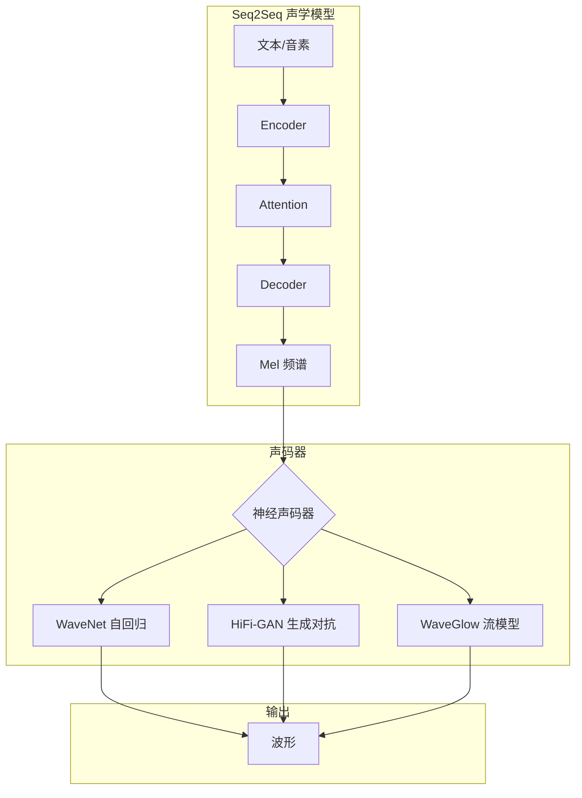
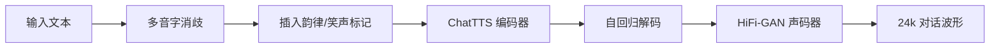

# 语音合成 TTS

## 1. 经典 TTS 流程


### 文本前端
- **分词**、**词性标注**、**韵律预测**、**多音字消歧**
- **中文难点**：多音字（银行/行为）、韵律结构、数字/日期朗读

### 声学模型
- 从文本特征预测声学特征（Mel 频谱、线性频谱、LPC）
- **传统**：HMM 参数合成

### 声码器（Vocoder）
- 从声学特征重建波形
- **传统**：Griffin-Lim、WORLD
- **神经声码器**：WaveNet、WaveGlow、HiFi-GAN、MelGAN

## 2. 神经网络 TTS 架构



## 3. 模型对比

| 模型 | 类型 | 参数量 | 速度 | 自然度 | 可控性 |
|------|------|--------|------|--------|-------|
| Tacotron 2 | 自回归 + WaveNet | 28M | 慢 | 高 | 低 |
| FastSpeech 2 | 非自回归 | 35M | 快 | 中高 | 高 |
| VITS | 端到端 VAE+GAN | 40M | 中 | 很高 | 中 |
| NaturalSpeech 3 | 因子扩散 | 100M | 中 | 极高 | 高 |
| CosyVoice | 语义+音色解耦 | 200M | 中 | 很高 | 极高 |
| ChatTTS | 对话优化 | 50M | 快 | 高 | 中 |

## 4. 神经声码器对比

| 声码器 | 原理 | 速度 | 音质 | GPU 友好 |
|--------|------|------|------|---------|
| Griffin-Lim | 相位迭代重建 | 快 | 低 | 是 |
| WORLD | 参数合成 | 快 | 中 | 否 |
| WaveNet | 自回归 dilated conv | 极慢 | 很高 | 否 |
| WaveGlow | 流模型 | 中 | 高 | 是 |
| HiFi-GAN | 生成对抗 | 快 | 很高 | 是 |
| MelGAN | 轻量 GAN | 极快 | 高 | 是 |
| LPCNet | 线性预测 + RNNet | 快 | 中高 | 否 |

## 5. PyTorch 代码示例

### Tacotron 2 简化版

```python
import torch
import torch.nn as nn
import torch.nn.functional as F

class Tacotron2Encoder(nn.Module):
    def __init__(self, vocab_size=50, embed_dim=256, enc_dim=512):
        super().__init__()
        self.embed = nn.Embedding(vocab_size, embed_dim)
        self.conv = nn.Sequential(
            nn.Conv1d(embed_dim, enc_dim, 5, padding=2),
            nn.BatchNorm1d(enc_dim),
            nn.ReLU(),
            nn.Conv1d(enc_dim, enc_dim, 5, padding=2),
            nn.BatchNorm1d(enc_dim),
            nn.ReLU(),
        )
        self.lstm = nn.LSTM(enc_dim, enc_dim // 2, bidirectional=True, batch_first=True)

    def forward(self, x):
        x = self.embed(x).transpose(1, 2)
        x = self.conv(x).transpose(1, 2)
        x, _ = self.lstm(x)
        return x

class Tacotron2Decoder(nn.Module):
    def __init__(self, mel_dim=80, d_model=512):
        super().__init__()
        self.lstm = nn.LSTMCell(mel_dim + d_model, d_model)
        self.W_q = nn.Linear(d_model, 128)
        self.W_k = nn.Linear(d_model, 128)
        self.W_v = nn.Linear(128, 1)
        self.proj_mel = nn.Linear(d_model, mel_dim)
        self.proj_stop = nn.Linear(d_model, 1)

    def forward(self, enc, mel_in):
        B, T, D = enc.shape
        K = self.W_k(enc)
        h = torch.zeros(B, D)
        c = torch.zeros(B, D)
        mels, stops = [], []
        for t in range(mel_in.shape[1]):
            inp = torch.cat([mel_in[:, t], h], dim=1)
            h, c = self.lstm(inp, (h, c))
            Q = self.W_q(h).unsqueeze(1)
            a = F.softmax(self.W_v(torch.tanh(K + Q)).squeeze(-1), dim=1)
            ctx = (a.unsqueeze(-1) * enc).sum(dim=1)
            h = h + ctx
            mels.append(self.proj_mel(h))
            stops.append(self.proj_stop(h))
        return torch.stack(mels, dim=1), torch.stack(stops, dim=1)

encoder = Tacotron2Encoder()
decoder = Tacotron2Decoder()
tokens = torch.randint(0, 50, (2, 30))
mel_in = torch.randn(2, 100, 80)
enc = encoder(tokens)
mel_out, stop_out = decoder(enc, mel_in)
print(f"Mel output: {mel_out.shape}, Stop: {stop_out.shape}")
```

### WaveNet 简化实现

```python
import torch
import torch.nn as nn
import torch.nn.functional as F

class WaveNetBlock(nn.Module):
    def __init__(self, r_channels=64, s_channels=256, dilation=1):
        super().__init__()
        self.dilated_conv = nn.Conv1d(r_channels, 2 * s_channels, 2, dilation=dilation, padding=0)
        self.skip_conv = nn.Conv1d(s_channels, s_channels, 1)
        self.residual_conv = nn.Conv1d(s_channels, r_channels, 1)

    def forward(self, x, skip_in):
        out = self.dilated_conv(x)
        a, b = out.chunk(2, dim=1)
        gated = torch.tanh(a) * torch.sigmoid(b)
        skip = skip_in + self.skip_conv(gated)
        residual = x[:, :, -gated.shape[2]:] + self.residual_conv(gated)
        return residual, skip

class WaveNet(nn.Module):
    def __init__(self, r_channels=64, s_channels=256, n_layers=10):
        super().__init__()
        self.input_conv = nn.Conv1d(80, r_channels, 1)
        self.blocks = nn.ModuleList([
            WaveNetBlock(r_channels, s_channels, 2 ** (i % 4))
            for i in range(n_layers)
        ])
        self.output_conv = nn.Conv1d(s_channels, 256, 1)

    def forward(self, mel):
        x = self.input_conv(mel)
        skip = torch.zeros(x.shape[0], 256, x.shape[2], device=x.device)
        for block in self.blocks:
            x, skip = block(x, skip)
        return self.output_conv(skip)

model = WaveNet()
mel = torch.randn(2, 80, 200)
out = model(mel)
print(f"WaveNet output: {out.shape}")
```

### FastSpeech Duration Predictor

```python
import torch
import torch.nn as nn
import torch.nn.functional as F

class DurationPredictor(nn.Module):
    def __init__(self, d_model=384, kernel=3):
        super().__init__()
        self.conv1 = nn.Conv1d(d_model, d_model, kernel, padding=kernel//2)
        self.conv2 = nn.Conv1d(d_model, d_model, kernel, padding=kernel//2)
        self.proj = nn.Linear(d_model, 1)

    def forward(self, x):
        x = x.transpose(1, 2)
        x = F.relu(self.conv1(x))
        x = F.relu(self.conv2(x))
        x = x.transpose(1, 2)
        return self.proj(x).squeeze(-1)

class FastSpeech(nn.Module):
    def __init__(self, vocab_size=50, d_model=384, n_mels=80):
        super().__init__()
        self.embed = nn.Embedding(vocab_size, d_model)
        self.encoder = nn.TransformerEncoder(
            nn.TransformerEncoderLayer(d_model, 2, dim_feedforward=1024), num_layers=4
        )
        self.dur_pred = DurationPredictor(d_model)
        self.decoder = nn.TransformerEncoder(
            nn.TransformerEncoderLayer(d_model, 2, dim_feedforward=1024), num_layers=4
        )
        self.proj = nn.Linear(d_model, n_mels)

    def forward(self, tokens, durations=None):
        x = self.embed(tokens)
        x = self.encoder(x)
        dur = self.dur_pred(x)
        if durations is not None:
            x = x.repeat_interleave(durations, dim=1)
        else:
            x = x.repeat_interleave(dur.round().long().clamp(min=1), dim=1)
        x = self.decoder(x)
        return self.proj(x), dur

model = FastSpeech()
tokens = torch.randint(0, 50, (2, 20))
durations = torch.randint(1, 5, (2, 20))
mel_out, dur_out = model(tokens, durations)
print(f"FastSpeech mel: {mel_out.shape}, durations: {dur_out.shape}")
```

### VITS 简化

```python
import torch
import torch.nn as nn
import torch.nn.functional as F

class PosteriorEncoder(nn.Module):
    def __init__(self, n_mels=80, latent_dim=192):
        super().__init__()
        self.conv = nn.Conv1d(n_mels, latent_dim * 2, 1)

    def forward(self, mel):
        stats = self.conv(mel)
        m, logs = stats.chunk(2, dim=1)
        z = m + torch.randn_like(m) * torch.exp(logs)
        return z, m, logs

class FlowDecoder(nn.Module):
    def __init__(self, latent_dim=192):
        super().__init__()
        self.conv = nn.Conv1d(latent_dim, latent_dim, 1)

    def forward(self, z):
        return self.conv(z)

class VITS(nn.Module):
    def __init__(self, n_mels=80, latent_dim=192):
        super().__init__()
        self.posterior = PosteriorEncoder(n_mels, latent_dim)
        self.decoder = FlowDecoder(latent_dim)
        self.pre = nn.Conv1d(latent_dim, n_mels, 1)

    def forward(self, mel):
        z, m, logs = self.posterior(mel)
        z = self.decoder(z)
        mel_hat = self.pre(z)
        return mel_hat, m, logs

    def sample(self, z):
        z = self.decoder(z)
        return self.pre(z)

model = VITS()
mel = torch.randn(2, 80, 200)
mel_hat, m, logs = model(mel)
z = torch.randn(2, 192, 200)
sample = model.sample(z)
print(f"VITS reconstruct: {mel_hat.shape}, sample: {sample.shape}")
```

### HiFi-GAN 声码器

```python
import torch
import torch.nn as nn
import torch.nn.functional as F

class MRFBlock(nn.Module):
    def __init__(self, channels, dilations=[1, 3, 5]):
        super().__init__()
        self.convs = nn.ModuleList([
            nn.Sequential(
                nn.LeakyReLU(0.1),
                nn.Conv1d(channels, channels, 3, dilation=d, padding=d)
            ) for d in dilations
        ])

    def forward(self, x):
        return sum(conv(x) for conv in self.convs) / len(self.convs)

class HiFiGAN(nn.Module):
    def __init__(self, n_mels=80):
        super().__init__()
        self.pre = nn.Conv1d(n_mels, 512, 7, padding=3)
        self.ups = nn.ModuleList([
            nn.Sequential(
                nn.ConvTranspose1d(512, 256, 8, stride=4, padding=2),
                MRFBlock(256)
            ),
            nn.Sequential(
                nn.ConvTranspose1d(256, 128, 8, stride=4, padding=2),
                MRFBlock(128)
            ),
            nn.Sequential(
                nn.ConvTranspose1d(128, 64, 4, stride=2, padding=1),
                MRFBlock(64)
            ),
            nn.Sequential(
                nn.ConvTranspose1d(64, 32, 4, stride=2, padding=1),
                MRFBlock(32)
            ),
        ])
        self.out = nn.Conv1d(32, 1, 7, padding=3)

    def forward(self, mel):
        x = self.pre(mel)
        for up in self.ups:
            x = up(x)
        return torch.tanh(self.out(x))

model = HiFiGAN()
mel = torch.randn(2, 80, 200)
waveform = model(mel)
print(f"HiFi-GAN waveform: {waveform.shape}")
```

## 6. 评价体系

| 指标 | 说明 |
|------|------|
| MOS | 主观听感（1-5），>4 为优秀 |
| CMOS | 相对偏好测试 |
| 自然度 | 是否像真人说话 |
| 相似度 | 克隆说话人的音色一致 |
| 延迟 | 首音延迟（流式场景） |
| RTF | 实时因子，<1 为可实时 |
| CER | 字错率（ASR 回测 TTS 音质） |

## 7. 开源 TTS 推荐

| 项目 | 特点 | 推荐场景 |
|------|------|---------|
| Edge TTS / Azure TTS | 微软多语言 | 生产环境 |
| Coqui TTS | 多模型支持 | 研究 |
| ChatTTS | 中文对话 | 聊天机器人 |
| CosyVoice | 情感+角色 | 语音交互 |
| Fish Speech | 多语言 | 开源首选 |
| OpenVoice | 音色克隆 | 语音定制 |
| Bark | 情感+非语言 | 创意生成 |

## 8. 2025-2026 趋势
- **语音大模型**：GPT-4o 语音模式（端到端语音-语音）
- **情感控制**：自然情感表达，抑扬顿挫
- **少样本克隆**：3 秒语音即可克隆音色
- **实时合成**：延迟 <200ms，流式合成
- **多模态融合**：语音+表情+手势同步
- **个性化 TTS**：根据用户画像自适应音色和风格

## 9. 实践案例

### 案例：ChatTTS 风格对话合成

ChatTTS 在文本中插入 `[laugh]`、`[uv_break]` 等控制符实现笑声与停顿，下面演示其调用与文本预处理。

```python
import re

def preprocess_chattts_text(text: str):
    """插入笑声音符与停顿标记，提升对话自然度"""
    text = re.sub(r"哈哈+", "[laugh]", text)
    text = re.sub(r"[，。！？]", lambda m: m.group(0) + "[uv_break]", text)
    return text

raw = "今天天气真好，我们一起去公园吧，哈哈太开心了！"
prepared = preprocess_chattts_text(raw)
print(f"预处理后: {prepared}")

# 假设已加载 chattts 模型
# wavs = chattts.infer([prepared], use_decoder=True)
# torchaudio.save("out.wav", wavs[0], 24000)
```



### 实现案例：用 VITS 做少样本音色克隆

VITS 端到端建模，给定参考说话人的 Mel 即可生成同音色语音，下面演示参考编码器思路。

```python
import torch
import torch.nn as nn
import torch.nn.functional as F

class ReferenceEncoder(nn.Module):
    """从参考音频 Mel 提取全局音色向量（用于音色克隆）"""
    def __init__(self, n_mels=80, hidden=128, style_dim=256):
        super().__init__()
        self.convs = nn.Sequential(
            nn.Conv2d(1, hidden, 3, padding=1), nn.ReLU(),
            nn.Conv2d(hidden, hidden, 3, padding=1), nn.ReLU(),
            nn.MaxPool2d(2)
        )
        self.gru = nn.GRU(hidden * (n_mels // 2), style_dim, batch_first=True)
        self.proj = nn.Linear(style_dim, style_dim)

    def forward(self, mel):
        x = mel.unsqueeze(1)
        x = self.convs(x)
        B, C, Fd, T = x.shape
        x = x.permute(0, 3, 1, 2).reshape(B, T, C * Fd)
        _, h = self.gru(x)
        return F.normalize(self.proj(h.squeeze(0)), dim=-1)

ref_encoder = ReferenceEncoder()
ref_mel = torch.randn(2, 80, 200)
style = ref_encoder(ref_mel)
print(f"音色向量: {style.shape}")
```

### 案例：FastSpeech 2 时长可控合成

FastSpeech 2 通过 Duration Predictor 实现非自回归并行合成，可手动控制每个音素时长。

```python
import torch

# 复用第 5 节 FastSpeech 定义
durations = torch.tensor([[3, 2, 4, 1, 5, 2]])  # 自定义每个 token 的帧数
tokens = torch.randint(0, 50, (1, 6))
# model = FastSpeech()
# mel_out, dur = model(tokens, durations)
# 将 mel_out 送入声码器即可得到波形
print("自定义时长张量:", durations, "shape:", tuple(durations.shape))
```

### TTS 架构选型对比

| 需求 | 推荐模型 | 理由 |
|------|---------|------|
| 高质量离线 | VITS / NaturalSpeech 3 | 端到端自然度最高 |
| 可控并行合成 | FastSpeech 2 | 时长/韵律可调 |
| 中文对话 | ChatTTS / CosyVoice | 对话韵律与情感 |
| 少样本克隆 | CosyVoice / OpenVoice | 3 秒即可克隆 |
| 实时流式 | VITS + 流式声码器 | 延迟可控 |
