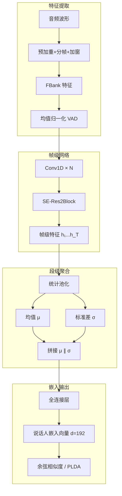
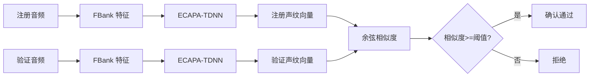

# 说话人识别与声纹

## 1. 任务定义

### 三种模式

| 模式 | 定义 | 应用 |
|------|------|------|
| 说话人确认 | 声音是否匹配注册人 | 声纹解锁、支付验证 |
| 说话人辨认 | 识别是谁的声音 | 会议纪要标注、嫌疑人识别 |
| 说话人日志 | 谁在什么时候说话 | 对话转录、多说话人分离 |

## 2. 特征对比

| 特征 | 维度/帧 | 信息量 | 说话人区分度 | 噪声鲁棒性 |
|------|---------|--------|-------------|-----------|
| MFCC | 13×1 | 低（去相关） | 中 | 高 |
| FBank | 40-80×1 | 中 | 高 | 中 |
| Mel Spectrogram | 80-128×1 | 高 | 很高 | 中 |
| Raw Waveform | 可变 | 极高 | 高 | 低 |
| wav2vec 2.0 | 768×50Hz | 极高 | 极高 | 高 |

## 3. 声纹嵌入提取流程



## 4. 损失函数对比

| 损失 | 公式思想 | 间隔 | 适用场景 |
|------|---------|------|---------|
| Softmax | 交叉熵 | 无 | 基准 |
| AM-Softmax | cosθ - m | 余弦间隔 | 通用声纹 |
| ArcFace | cos(θ + m) | 角度间隔 | 高精度 |
| CosFace | cosθ - m | 余弦间隔 | 人脸+声纹 |
| Triplet | max(d(a,p) - d(a,n) + m, 0) | 欧氏间隔 | 小样本 |
| GE2E | 相似度矩阵 + 对比 | 端到端 | 大规模 |
| ProtoNets | 原型距离 | 度量 | Few-shot |

## 5. 主流模型对比

| 模型 | 年份 | 参数量 | EER (VoxCeleb1) | 特点 |
|------|------|--------|-----------------|------|
| i-vector + PLDA | 2011 | 1M+ | 5.0% | 传统统计方法 |
| x-vector TDNN | 2018 | 4.2M | 3.1% | 统计池化 |
| ECAPA-TDNN | 2020 | 6.4M | 0.87% | SE-Res2Block |
| ResNet-34 | 2021 | 12M | 0.82% | 图像架构迁移 |
| WavLM Large | 2022 | 316M | 0.62% | 自监督预训练 |
| Wav2Vec 2.0 | 2022 | 317M | 0.75% | 自监督+微调 |
| MFA-Conformer | 2023 | 8M | 0.78% | 多头注意力 |

## 6. PyTorch 代码示例

### ECAPA-TDNN 模型

```python
import torch
import torch.nn as nn
import torch.nn.functional as F

class SEBlock(nn.Module):
    def __init__(self, channels, r=8):
        super().__init__()
        self.fc = nn.Sequential(
            nn.Linear(channels, channels // r),
            nn.ReLU(),
            nn.Linear(channels // r, channels),
            nn.Sigmoid()
        )

    def forward(self, x):
        B, C, T = x.shape
        y = x.mean(dim=-1)
        return x * self.fc(y).unsqueeze(-1)

class Res2Block(nn.Module):
    def __init__(self, in_ch, out_ch, kernel=3, dilations=[1, 2, 3, 4], scale=8):
        super().__init__()
        self.conv1 = nn.Conv1d(in_ch, out_ch, 1)
        self.se = SEBlock(out_ch)
        self.conv2 = nn.Conv1d(out_ch, out_ch, 1)
        self.sub_convs = nn.ModuleList([
            nn.Conv1d(out_ch // scale, out_ch // scale, kernel, dilation=d, padding=d)
            for d in dilations
        ])
        self.scale = scale

    def forward(self, x):
        x = self.conv1(x)
        B, C, T = x.shape
        xs = x.chunk(self.scale, dim=1)
        out = []
        for i, (s, conv) in enumerate(zip(xs, self.sub_convs)):
            if i == 0:
                out.append(conv(s))
            else:
                out.append(conv(s + out[i - 1]))
        x = torch.cat(out, dim=1)
        x = self.se(x)
        x = self.conv2(x) + x
        return x

class ECAPATDNN(nn.Module):
    def __init__(self, n_mels=80, embed_dim=192, n_classes=None):
        super().__init__()
        self.conv1 = nn.Conv1d(n_mels, 64, 5, stride=1, padding=2)
        self.block1 = Res2Block(64, 64)
        self.block2 = Res2Block(64, 128)
        self.block3 = Res2Block(128, 256)
        self.pool = nn.AdaptiveAvgPool1d(1)
        self.fc = nn.Linear(256 * 2, embed_dim)
        self.classifier = nn.Linear(embed_dim, n_classes) if n_classes else None

    def forward(self, x):
        x = self.conv1(x)
        x = self.block1(x)
        x = self.block2(x)
        x = self.block3(x)
        mu = x.mean(dim=-1)
        sg = x.std(dim=-1)
        x = torch.cat([mu, sg], dim=1)
        emb = self.fc(x)
        if self.classifier is not None:
            return self.classifier(F.normalize(emb)), emb
        return emb

model = ECAPATDNN(n_mels=80, n_classes=100)
x = torch.randn(4, 80, 300)
logits, emb = model(x)
print(f"Embedding: {emb.shape}, Logits: {logits.shape}")
```

### 声纹嵌入提取

```python
import torch
import torchaudio

def extract_embedding(model: ECAPATDNN, wav_path: str, device="cpu"):
    model.eval()
    wav, sr = torchaudio.load(wav_path)
    wav = torchaudio.functional.resample(wav, sr, 16000)
    fbank = torchaudio.compliance.kaldi.fbank(
        wav, num_mel_bins=80, sample_frequency=16000,
        frame_length=25, frame_shift=10
    )
    fbank = fbank.unsqueeze(0).transpose(1, 2)
    with torch.no_grad():
        emb = model(fbank.to(device))
    return emb.squeeze().cpu().numpy()

model = ECAPATDNN(n_mels=80)
emb1 = extract_embedding(model, "speaker1.wav")
emb2 = extract_embedding(model, "speaker2.wav")
print(f"emb1: {emb1.shape}, emb2: {emb2.shape}")
```

### 说话人相似度计算

```python
import torch
import torch.nn.functional as F
import numpy as np

def cosine_similarity(emb1: np.ndarray, emb2: np.ndarray):
    e1 = F.normalize(torch.from_numpy(emb1).unsqueeze(0), dim=1)
    e2 = F.normalize(torch.from_numpy(emb2).unsqueeze(0), dim=1)
    return torch.mm(e1, e2.T).item()

def euclidean_distance(emb1: np.ndarray, emb2: np.ndarray):
    return torch.pairwise_distance(
        torch.from_numpy(emb1).unsqueeze(0),
        torch.from_numpy(emb2).unsqueeze(0)
    ).item()

emb_a = np.random.randn(192)
emb_b = np.random.randn(192)
emb_c = np.random.randn(192)

sim_ab = cosine_similarity(emb_a, emb_b)
sim_ac = cosine_similarity(emb_a, emb_c)
dist_ab = euclidean_distance(emb_a, emb_b)

print(f"Cosine A-B: {sim_ab:.4f}, A-C: {sim_ac:.4f}")
print(f"Euclidean A-B: {dist_ab:.4f}")
```

### 说话人识别训练

```python
import torch
import torch.nn as nn
import torch.optim as optim

class AMSoftmax(nn.Module):
    def __init__(self, embed_dim, n_classes, margin=0.3, scale=30):
        super().__init__()
        self.W = nn.Parameter(torch.randn(embed_dim, n_classes))
        self.margin = margin
        self.scale = scale
        nn.init.xavier_normal_(self.W)

    def forward(self, emb, labels):
        emb = F.normalize(emb)
        W = F.normalize(self.W)
        cos = torch.mm(emb, W)
        phi = cos - self.margin
        one_hot = F.one_hot(labels, cos.shape[1]).float()
        logits = self.scale * (one_hot * phi + (1 - one_hot) * cos)
        return F.cross_entropy(logits, labels)

model = ECAPATDNN(n_mels=80, embed_dim=192)
criterion = AMSoftmax(192, 100)
optimizer = optim.Adam(model.parameters(), lr=1e-3)

for epoch in range(5):
    fbank = torch.randn(16, 80, 300)
    labels = torch.randint(0, 100, (16,))
    _, emb = model(fbank)
    loss = criterion(emb, labels)
    loss.backward()
    optimizer.step()
    optimizer.zero_grad()
    print(f"Epoch {epoch}, Loss: {loss.item():.4f}")
```

### 说话人日志（基于分割聚类）

```python
import numpy as np
from sklearn.cluster import AgglomerativeClustering

def speaker_diarization(embeddings: np.ndarray, n_speakers: int = 2):
    clustering = AgglomerativeClustering(
        n_clusters=n_speakers, metric="cosine", linkage="average"
    )
    labels = clustering.fit_predict(embeddings)
    return labels

def segment_embeddings(model: ECAPATDNN, wav_path: str, window=2.0, stride=1.0):
    wav, sr = torchaudio.load(wav_path)
    wav = torchaudio.functional.resample(wav, sr, 16000)
    sr = 16000
    n_window = int(window * sr)
    n_stride = int(stride * sr)
    embs = []
    for start in range(0, wav.shape[1] - n_window, n_stride):
        seg = wav[:, start:start + n_window]
        fbank = torchaudio.compliance.kaldi.fbank(
            seg, num_mel_bins=80, sample_frequency=16000
        )
        fbank = fbank.unsqueeze(0).transpose(1, 2)
        with torch.no_grad():
            emb = model(fbank)
        embs.append(emb.squeeze().numpy())
    return np.stack(embs), n_stride / sr

model = ECAPATDNN(n_mels=80)
embs, hop = segment_embeddings(model, "meeting.wav")
labels = speaker_diarization(embs, n_speakers=3)
timestamps = np.arange(len(labels)) * hop
for i, t in enumerate(timestamps):
    print(f"  {t:.1f}s - {t+hop:.1f}s : Speaker {labels[i]}")
```

## 7. 评估指标
- **EER（等错误率）**：FAR = FRR 时的错误率
- **minDCF**：最小检测代价函数
- **准确率**：Top-1 / Top-5
- **DER（日志错误率）**：说话人日志专用

## 8. 数据集对比

| 数据集 | 说话人 | 时长 | 场景 | 语言 |
|--------|--------|------|------|------|
| VoxCeleb1 | 1,251 | 352h | 采访 | 英文 |
| VoxCeleb2 | 5,994 | 2,442h | 采访 | 英文 |
| CN-Celeb | 1,000 | 276h | 多场景 | 中文 |
| LibriSpeech | 2,484 | 960h | 有声书 | 英文 |
| Aishell-1 | 400 | 178h | 安静 | 中文 |
| FSC (Fluent Speech) | 97 | 14h | 命令 | 英文 |

## 9. 2025-2026 趋势
- **自监督声纹**：无需标注数据的说话人表示学习
- **多模态声纹**：语音+人脸融合识别
- **反欺骗检测**：检测录音重放/合成语音攻击
- **端侧声纹**：手机/智能音箱本地识别
- **持续学习声纹**：在线注册新说话人
- **跨信道声纹**：不同麦克风/电话信道匹配

## 10. 实践案例

### 案例：声纹确认门禁系统

演示注册说话人、提取嵌入、设置阈值完成 1:1 确认的完整流程。

```python
import numpy as np
import torch
import torchaudio

def register_speaker(model, wav_path, device="cpu"):
    """注册说话人，返回其声纹嵌入"""
    emb = extract_embedding(model, wav_path, device)
    return emb

def verify(model, enroll_emb, probe_path, threshold=0.6, device="cpu"):
    """比对测试语音与注册声纹，返回是否通过"""
    probe_emb = extract_embedding(model, probe_path, device)
    sim = cosine_similarity(enroll_emb, probe_emb)
    return sim >= threshold, sim

model = ECAPATDNN(n_mels=80)
enroll_emb = register_speaker(model, "alice_enroll.wav")
passed, score = verify(model, enroll_emb, "alice_test.wav", threshold=0.6)
print(f"验证结果: {'通过' if passed else '拒绝'}, 相似度={score:.4f}")
```



### 实现案例：说话人辨认 Top-K

在已注册 N 个说话人的库中找出最匹配者，给出 Top-K 候选。

```python
import numpy as np

def speaker_identification(query_emb, gallery_embs, labels, top_k=3):
    """从注册库中辨认说话人，返回 Top-K 候选与得分"""
    sims = np.dot(gallery_embs, query_emb) / (
        np.linalg.norm(gallery_embs, axis=1) * np.linalg.norm(query_emb) + 1e-8
    )
    idx = np.argsort(-sims)[:top_k]
    return [(labels[i], float(sims[i])) for i in idx]

gallery = np.random.randn(50, 192)
labels = [f"spk_{i}" for i in range(50)]
query = np.random.randn(192)
top = speaker_identification(query, gallery, labels, top_k=3)
print("Top-3 候选:", top)
```

### 案例：反欺骗检测（ASVspoof 思路）

区分真实语音与合成/重放攻击，可作为声纹系统的前置过滤器。

```python
import torch
import torch.nn as nn
import torch.nn.functional as F

class SpoofDetector(nn.Module):
    """简单的二分类反欺骗网络：真实 vs 攻击"""
    def __init__(self, n_mels=80, embed_dim=64):
        super().__init__()
        self.encoder = nn.Sequential(
            nn.Conv1d(n_mels, 64, 3, padding=1), nn.ReLU(),
            nn.Conv1d(64, 128, 3, stride=2, padding=1), nn.ReLU(),
            nn.AdaptiveAvgPool1d(1)
        )
        self.head = nn.Linear(128, 2)

    def forward(self, mel):
        x = self.encoder(mel).squeeze(-1)
        return self.head(x)

model = SpoofDetector()
mel = torch.randn(4, 80, 300)
logits = model(mel)
probs = F.softmax(logits, dim=-1)
print(f"真实概率: {probs[:, 1].tolist()}")
```

### 声纹系统方案对比

| 场景 | 推荐模型 | 特征 | 阈值策略 |
|------|---------|------|---------|
| 手机解锁 | ECAPA-TDNN | FBank | 固定余弦阈值 |
| 会议标注 | WavLM + 聚类 | 自监督 | 自适应 |
| 支付验证 | ECAPA + 反欺骗 | FBank | 高阈值+活体 |
| 大规模检索 | ResNet-34 | Mel | 余弦+PLDA |
