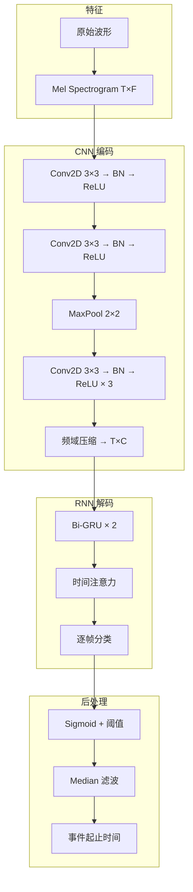

# 音频事件检测与场景分析

## 1. 音频事件检测 SED

### 定义
- **目标**：标注音频中"发生了什么"及时间范围
- **输出**：(事件类型, 开始时间, 结束时间)

### 典型事件

| 类别 | 事件 | 示例 |
|------|------|------|
| 环境音 | 雨声、风声、雷声、水流 | 自然灾害监控 |
| 城市音 | 汽车鸣笛、施工声、警笛 | 智能城市 |
| 人声 | 笑声、咳嗽声、哭声、掌声 | 健康监测 |
| 动物声 | 狗叫、鸟鸣、猫叫 | 生态保护 |
| 乐器声 | 钢琴、吉他、鼓 | 音乐分析 |

## 2. 数据集对比

| 数据集 | 事件数 | 时长 | 标注类型 | 场景 |
|--------|--------|------|---------|------|
| AudioSet | 527 | 5,800h | 弱标注 | 通用 |
| DCASE 2018 | 6 | 24h | 强标注 | 日常 |
| ESC-50 | 50 | 3h | 强标注 | 环境 |
| UrbanSound8K | 10 | 8.75h | 强标注 | 城市 |
| FSD50K | 200 | 100h | 弱+强 | 通用 |
| AudioSet-SL | 527 | 5,000h | 强标注 | 通用 |

## 3. 方法演进对比

| 时期 | 方法 | 特征 | 平均精度 | 延迟 |
|------|------|------|---------|------|
| 传统 | GMM + SVM | MFCC | 55-65% | 低 |
| 深度学习 | CNN + RNN | Mel | 70-80% | 中 |
| 预训练 | PANNs (CNN14) | Mel | 82-88% | 中 |
| 预训练 | AST (ViT) | Mel patch | 85-91% | 高 |
| 自监督 | BEATs | 离散编码 | 87-93% | 高 |
| 多模态 | AudioMAE | 掩码建模 | 90-94% | 高 |

## 4. CRNN 架构



## 5. 音频场景分类 ASC

### 任务
- **输入**：整段音频
- **输出**：场景类别（"办公室"、"公园"、"餐厅"）

### 常见场景类别

| 场景 | 声学特征 | 典型频谱 |
|------|---------|---------|
| 办公室 | 键盘声、空调、低语 | 低频连续 |
| 公园 | 鸟鸣、风声、儿童玩耍 | 中高频稀疏 |
| 餐厅 | 碗碟碰撞、多人谈话 | 全频混杂 |
| 马路 | 引擎声、鸣笛 | 中低频周期性 |
| 地铁 | 轨道声、报站 | 低频+高频轰鸣 |

## 6. PyTorch 代码示例

### Mel Spectrogram 提取

```python
import torch
import torchaudio
import torchaudio.functional as F

waveform, sr = torchaudio.load("audio.wav")
waveform = torchaudio.functional.resample(waveform, sr, 22050)

mel_spec = torchaudio.transforms.MelSpectrogram(
    sample_rate=22050,
    n_fft=1024,
    hop_length=256,
    n_mels=64,
    f_min=0,
    f_max=11025
)(waveform)

log_mel = torchaudio.transforms.AmplitudeToDB()(mel_spec)
print(f"Mel: {log_mel.shape}")

delta = torchaudio.functional.compute_deltas(log_mel)
delta2 = torchaudio.functional.compute_deltas(delta)
feat = torch.cat([log_mel, delta, delta2], dim=1)
print(f"With deltas: {feat.shape}")
```

### CRNN 音频事件检测

```python
import torch
import torch.nn as nn
import torch.nn.functional as F

class CNNEncoder(nn.Module):
    def __init__(self, in_ch=1):
        super().__init__()
        self.convs = nn.Sequential(
            nn.Conv2d(in_ch, 32, 3, padding=1),
            nn.BatchNorm2d(32), nn.ReLU(),
            nn.Conv2d(32, 32, 3, padding=1),
            nn.BatchNorm2d(32), nn.ReLU(),
            nn.MaxPool2d(2, 2),
            nn.Conv2d(32, 64, 3, padding=1),
            nn.BatchNorm2d(64), nn.ReLU(),
            nn.Conv2d(64, 64, 3, padding=1),
            nn.BatchNorm2d(64), nn.ReLU(),
            nn.MaxPool2d(2, 2),
            nn.Conv2d(64, 128, 3, padding=1),
            nn.BatchNorm2d(128), nn.ReLU(),
            nn.Conv2d(128, 128, 3, padding=1),
            nn.BatchNorm2d(128), nn.ReLU(),
        )

    def forward(self, x):
        return self.convs(x)

class CRNN(nn.Module):
    def __init__(self, n_classes=10, n_mels=64):
        super().__init__()
        self.cnn = CNNEncoder(1)
        self.gru = nn.GRU(128 * (n_mels // 4 // 4), 128, bidirectional=True, batch_first=True)
        self.attn = nn.Linear(256, 1)
        self.classifier = nn.Linear(256, n_classes)

    def forward(self, x):
        x = x.unsqueeze(1)
        x = self.cnn(x)
        B, C, F, T = x.shape
        x = x.permute(0, 3, 1, 2).reshape(B, T, C * F)
        x, _ = self.gru(x)
        a = F.softmax(self.attn(x), dim=1)
        x = (x * a).sum(dim=1)
        return torch.sigmoid(self.classifier(x))

model = CRNN(n_classes=10)
mel = torch.randn(4, 64, 200)
out = model(mel)
print(f"Event probs: {out.shape}")
```

### 时间注意力后处理

```python
import torch
import torch.nn.functional as F
import numpy as np

def sed_postprocess(frame_probs: torch.Tensor, threshold=0.5, median_k=7, min_dur=3):
    B, T, C = frame_probs.shape
    smoothed = F.avg_pool1d(
        frame_probs.transpose(1, 2), kernel_size=median_k, stride=1, padding=median_k//2
    ).transpose(1, 2)
    events = []
    for b in range(B):
        for c in range(C):
            act = (smoothed[b, :, c] > threshold).int()
            changes = torch.diff(act, prepend=torch.tensor([0]))
            starts = torch.where(changes == 1)[0]
            ends = torch.where(changes == -1)[0]
            if len(ends) < len(starts):
                ends = torch.cat([ends, torch.tensor([T])])
            for s, e in zip(starts, ends):
                if e - s >= min_dur:
                    events.append((b, c, s.item(), e.item()))
    return events

frame_probs = torch.sigmoid(torch.randn(2, 100, 10))
events = sed_postprocess(frame_probs, threshold=0.5)
for ev in events[:5]:
    print(f"Batch {ev[0]}, Event class {ev[1]}: {ev[2]} -> {ev[3]}")
```

### 音频场景分类 - PANNs 风格

```python
import torch
import torch.nn as nn
import torch.nn.functional as F

class CNN14(nn.Module):
    def __init__(self, n_classes=527):
        super().__init__()
        self.features = nn.Sequential(
            nn.Conv2d(1, 64, 3, padding=1), nn.BatchNorm2d(64), nn.ReLU(), nn.MaxPool2d(2),
            nn.Conv2d(64, 128, 3, padding=1), nn.BatchNorm2d(128), nn.ReLU(), nn.MaxPool2d(2),
            nn.Conv2d(128, 256, 3, padding=1), nn.BatchNorm2d(256), nn.ReLU(), nn.MaxPool2d(2),
            nn.Conv2d(256, 512, 3, padding=1), nn.BatchNorm2d(512), nn.ReLU(), nn.MaxPool2d(2),
            nn.Conv2d(512, 1024, 3, padding=1), nn.BatchNorm2d(1024), nn.ReLU(),
        )
        self.pool = nn.AdaptiveAvgPool2d(1)
        self.classifier = nn.Linear(1024, n_classes)

    def forward(self, x):
        x = self.features(x.unsqueeze(1))
        x = self.pool(x).squeeze(-1).squeeze(-1)
        return self.classifier(x)

model = CNN14(n_classes=10)
mel = torch.randn(4, 64, 200)
logits = model(mel)
probs = F.softmax(logits, dim=1)
scene = probs.argmax(dim=1)
print(f"Scene predictions: {scene}, probs: {probs.max(dim=1).values}")
```

### 使用预训练模型推理

```python
import torch
import torchaudio
import torch.nn.functional as F

def classify_audio_scene(wav_path: str, model: nn.Module, device="cpu"):
    wav, sr = torchaudio.load(wav_path)
    wav = torchaudio.functional.resample(wav, sr, 22050)
    mel = torchaudio.transforms.MelSpectrogram(
        sample_rate=22050, n_fft=1024, hop_length=256, n_mels=64
    )(wav)
    log_mel = torchaudio.transforms.AmplitudeToDB()(mel)
    log_mel = (log_mel - log_mel.mean()) / log_mel.std()
    log_mel = log_mel.unsqueeze(0)
    with torch.no_grad():
        logits = model(log_mel.to(device))
        probs = F.softmax(logits, dim=1)
    return probs.squeeze().cpu().numpy()

model = CNN14(n_classes=50)
model.eval()
probs = classify_audio_scene("street.wav", model)
top3 = probs.argsort()[-3:][::-1]
scene_names = ["airport", "park", "street", "office", "restaurant",
                "subway", "mall", "kitchen", "forest", "beach"]
for s in top3:
    print(f"  {scene_names[s]}: {probs[s]:.3f}")
```

## 7. 数据增强（音频专用）

| 方法 | 操作 | 适用 |
|------|------|------|
| SpecAugment | 时间/频率掩码 | 频谱输入 |
| MixUp | 两段音频混合+标签插值 | 多事件 |
| TimeStretch | 时间拉伸 | 变速不变调 |
| PitchShift | 音高偏移 | 变调不变速 |
| BackgroundMix | 背景噪声叠加 | 鲁棒性 |
| FilterAugment | 随机滤波 | 信道模拟 |
| FrameShift | 帧平移 | 对齐增强 |

## 8. 评价指标

| 指标 | 公式 | 说明 |
|------|------|------|
| 事件级 F1 | 2×P×R/(P+R) | 事件检测整体 |
| 段级 F1 | 2×P_seg×R_seg/(P_seg+R_seg) | 带时间容差 |
| ER (Error Rate) | (S+D+I)/N | DCASE 标准 |
| 准确率 | correct / total | 场景分类 |
| Top-5 准确率 | 前5命中 | 大数据集 |

## 9. 2025-2026 趋势
- **基础音频模型**：AudioMAE、BEATs、AudioLM
- **多任务统一**：事件+场景+说话人在一个模型
- **开放词汇事件**：文本 prompt 描述事件（CLAP 类）
- **视听融合**：音频+视觉互补
- **弱监督 SED**：仅用标签级标注学习事件边界
- **边缘部署**：TinyML 设备端实时事件检测
