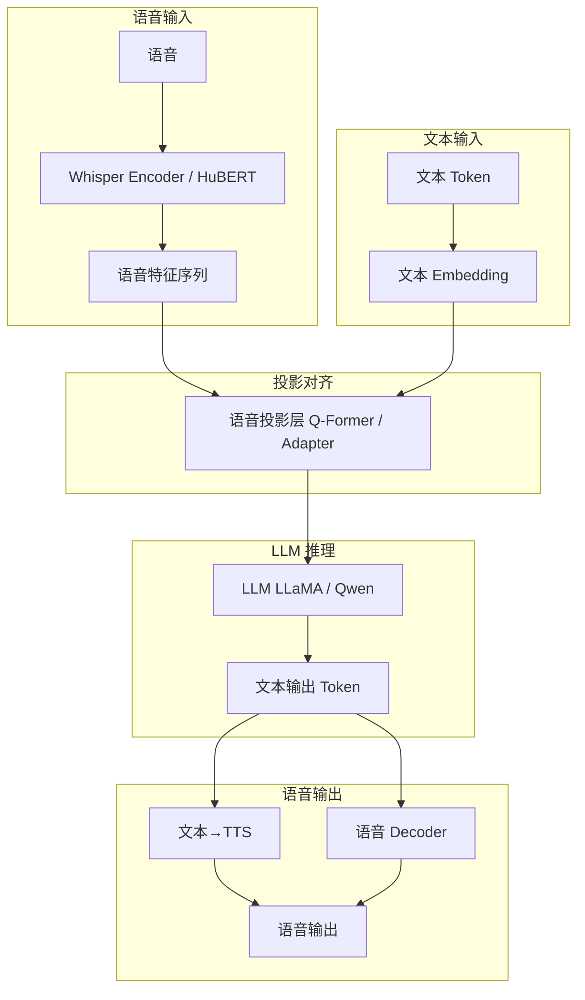

# 语音大模型

## 1. 语音预训练模型

### HuBERT / WavLM
- **HuBERT（Meta，2021）**：MFCC 聚类作为伪标签 → BERT 式掩码预测
- **WavLM（微软，2022）**：HuBERT + 去噪掩码，支持分离

### Whisper（OpenAI，2022-2023）
- **多任务**：ASR + 翻译 + 语言识别 + VAD
- **多语言**：100+ 语言
- **架构**：Encoder-Decoder Transformer

### 模型规模

| 模型 | 参数量 | 预训练数据 | 特点 |
|------|--------|-----------|------|
| HuBERT Base | 95M | 960h LibriSpeech | 自监督学习 |
| HuBERT Large | 317M | 60k hrs | 强语义表示 |
| WavLM Large | 316M | 94k hrs | 去噪+分离 |
| Whisper Small | 244M | 680k hrs | 多任务 |
| Whisper Large-v3 | 1.5B | 680k hrs | 最强 ASR |
| SeamlessM4T | 2.3B | 1M hrs | 语音翻译 |
| AudioMAE | 86M | 900k hrs | 掩码自编码 |

## 2. 语音-文本联合模型

### 架构对比

| 模型 | 语音编码器 | LLM | 输出模态 | 参数量 | 流式 |
|------|-----------|-----|---------|--------|------|
| SpeechGPT | HuBERT | LLaMA | 文本 | 7B | 否 |
| Qwen-Audio | Whisper | Qwen-7B | 文本 | 7B+ | 否 |
| SALMONN | BEATs+Whisper | Vicuna | 文本 | 13B | 否 |
| AudioGPT | CLAP+Whisper | ChatGPT | 文本 | 20B+ | 否 |
| GPT-4o | 多模态 | GPT-4 | 文本+语音 | 未公开 | 是 |
| Gemini Audio | 多模态 | Gemini | 文本+语音 | 未公开 | 是 |
| ANYTHING | Whisper | LLaMA | 文本 | 7B | 否 |

### 多模态语音 LLM 架构



## 3. 端到端语音大模型演进

| 模型 | 年份 | 语音输入 | 语音输出 | 联合训练 |
|------|------|---------|---------|---------|
| SLT (Speech Translation) | 2016 | 是 | 否 | 否 |
| Whisper | 2022 | 是 | 否 | 否 |
| SpeechGPT | 2023 | 是 | 否 | 是(3阶段) |
| Qwen-Audio | 2023 | 是 | 否 | 是(2阶段) |
| GPT-4o | 2024 | 是 | 是 | 端到端 |
| Gemini 2.0 | 2025 | 是 | 是 | 原生 |
| 语音 Agent (2026) | 2026 | 是 | 是 | 推理+工具 |

## 4. 语音编码器对比

| 组件 | 输出频率 | 特征维度 | 语义粒度 | 训练方式 |
|------|---------|---------|---------|---------|
| HuBERT | 50Hz | 768/1024 | 音素级 | 自监督掩码 |
| WavLM | 50Hz | 768/1024 | 音素+说话人 | 自监督去噪 |
| Whisper Encoder | 50Hz | 512-1280 | 语义级 | 弱监督 |
| BEATs | 100Hz | 768 | 事件级 | 自监督 |
| CLAP Audio Encoder | 1Hz | 512 | 文本对齐 | 对比学习 |

## 5. PyTorch 代码示例

### HuBERT 调用与特征提取

```python
import torch
from transformers import HubertModel, Wav2Vec2FeatureExtractor

processor = Wav2Vec2FeatureExtractor.from_pretrained("facebook/hubert-base-ls960")
model = HubertModel.from_pretrained("facebook/hubert-base-ls960")

waveform = torch.randn(1, 16000 * 5)
inputs = processor(waveform.squeeze(), sampling_rate=16000, return_tensors="pt")

with torch.no_grad():
    outputs = model(**inputs)
    hidden_states = outputs.last_hidden_state
    all_layers = outputs.hidden_states

print(f"HuBERT output: {hidden_states.shape}")
print(f"Number of layers: {len(all_layers)}")
```

### Whisper 微调

```python
import torch
import torchaudio
from transformers import WhisperForConditionalGeneration, WhisperProcessor

processor = WhisperProcessor.from_pretrained("openai/whisper-small")
model = WhisperForConditionalGeneration.from_pretrained("openai/whisper-small")
model.config.forced_decoder_ids = None

waveform, sr = torchaudio.load("speech.wav")
waveform = torchaudio.functional.resample(waveform, sr, 16000)
inputs = processor(
    waveform.squeeze(), sampling_rate=16000, return_tensors="pt"
).input_features

labels = processor(text=["今天天气真好"], return_tensors="pt").input_ids

optimizer = torch.optim.AdamW(model.parameters(), lr=1e-5)
for epoch in range(3):
    outputs = model(inputs, labels=labels)
    loss = outputs.loss
    loss.backward()
    optimizer.step()
    optimizer.zero_grad()
    print(f"Epoch {epoch}, Loss: {loss.item():.4f}")

with torch.no_grad():
    generated = model.generate(inputs, language="zh", task="transcribe")
    text = processor.batch_decode(generated, skip_special_tokens=True)
    print(f"Generated: {text}")
```

### 语音 + LLM 集成（Qwen-Audio 风格）

```python
import torch
import torch.nn as nn
from transformers import AutoModel, AutoTokenizer, WhisperModel, Wav2Vec2FeatureExtractor

class SpeechQFormer(nn.Module):
    def __init__(self, audio_dim=512, llm_dim=4096, n_queries=32):
        super().__init__()
        self.query_tokens = nn.Parameter(torch.randn(1, n_queries, llm_dim))
        self.cross_attn = nn.MultiheadAttention(llm_dim, 8, batch_first=True)
        self.linear = nn.Linear(audio_dim, llm_dim)

    def forward(self, audio_feat):
        audio_feat = self.linear(audio_feat)
        q = self.query_tokens.expand(audio_feat.shape[0], -1, -1)
        out, _ = self.cross_attn(q, audio_feat, audio_feat)
        return out

class SpeechLLM(nn.Module):
    def __init__(self, llm_name="Qwen/Qwen-7B"):
        super().__init__()
        self.audio_encoder = WhisperModel.from_pretrained("openai/whisper-small").encoder
        self.audio_encoder.freeze_encoder = True
        self.projector = SpeechQFormer()
        self.llm = AutoModel.from_pretrained(llm_name, torch_dtype=torch.float16)
        self.tokenizer = AutoTokenizer.from_pretrained(llm_name)

    def forward(self, audio_input, text_input_ids):
        audio_feat = self.audio_encoder(audio_input).last_hidden_state
        audio_tokens = self.projector(audio_feat)
        inputs_embeds = self.llm.get_input_embeddings()(text_input_ids)
        combined = torch.cat([audio_tokens, inputs_embeds], dim=1)
        return self.llm(inputs_embeds=combined).last_hidden_state

    def generate(self, audio_input, max_new_tokens=100):
        audio_feat = self.audio_encoder(audio_input).last_hidden_state
        audio_tokens = self.projector(audio_feat)
        bos = torch.full((audio_tokens.shape[0], 1), self.tokenizer.bos_token_id)
        bos_embeds = self.llm.get_input_embeddings()(bos)
        inputs = torch.cat([audio_tokens, bos_embeds], dim=1)
        with torch.no_grad():
            outputs = self.llm.generate(
                inputs_embeds=inputs,
                max_new_tokens=max_new_tokens
            )
        return self.tokenizer.batch_decode(outputs, skip_special_tokens=True)

audio_feat = torch.randn(2, 1500, 512)
text_ids = torch.randint(0, 50000, (2, 10))
model = SpeechLLM(llm_name="Qwen/Qwen-7B")
out = model(audio_feat, text_ids)
print(f"LLM output: {out.shape}")
```

### 语音 Agent（ReAct 风格）

```python
import torch
import json
import re

class SpeechAgent:
    def __init__(self, asr_model, llm_model, tts_model):
        self.asr = asr_model
        self.llm = llm_model
        self.tts = tts_model
        self.tools = {
            "search": lambda q: f"Search results for: {q}",
            "calculate": lambda e: str(eval(e)),
            "time": lambda _: "2026-07-07 14:30:00",
        }

    def process(self, audio_input):
        text = self.asr.transcribe(audio_input)["text"]
        prompt = f"""Answer the user. If you need to use tools, respond with:
Action: tool_name
Action Input: tool_input
Observation: ...
Final Answer: ..."""
        response = self.llm.generate(prompt + "\nUser: " + text)
        action_match = re.search(r"Action: (\w+)\nAction Input: (.+)", response)
        if action_match:
            tool = action_match.group(1)
            inp = action_match.group(2).strip('"')
            if tool in self.tools:
                obs = self.tools[tool](inp)
                response = self.llm.generate(
                    f"{response}\nObservation: {obs}\nFinal Answer:"
                )
        self.tts.synthesize(response)
        return response

agent = SpeechAgent(None, None, None)
print("Speech Agent ready")
```

### 语音 Embedding 对比学习

```python
import torch
import torch.nn as nn
import torch.nn.functional as F

class ContrastiveSpeech(nn.Module):
    def __init__(self, audio_encoder, text_encoder, proj_dim=256):
        super().__init__()
        self.audio_encoder = audio_encoder
        self.text_encoder = text_encoder
        self.audio_proj = nn.Linear(768, proj_dim)
        self.text_proj = nn.Linear(768, proj_dim)

    def forward(self, audio, text):
        a_feat = self.audio_encoder(audio).last_hidden_state.mean(dim=1)
        t_feat = self.text_encoder(text).last_hidden_state.mean(dim=1)
        a_emb = F.normalize(self.audio_proj(a_feat), dim=1)
        t_emb = F.normalize(self.text_proj(t_feat), dim=1)
        logits = torch.mm(a_emb, t_emb.T) * 0.07
        labels = torch.arange(a_emb.shape[0])
        loss = F.cross_entropy(logits, labels) + F.cross_entropy(logits.T, labels)
        return loss

audio = {"last_hidden_state": torch.randn(8, 200, 768)}
text = {"last_hidden_state": torch.randn(8, 50, 768)}
m_audio = type("obj", (object,), {"last_hidden_state": audio["last_hidden_state"]})
m_text = type("obj", (object,), {"last_hidden_state": text["last_hidden_state"]})
model = ContrastiveSpeech(m_audio, m_text)
loss = model(audio, text)
print(f"Contrastive loss: {loss.item():.4f}")
```

## 6. 应用场景对比

| 场景 | 模型要求 | 实时性 | 典型方案 |
|------|---------|--------|---------|
| 语音助手 | 低延迟、高准确 | <500ms | Whisper + LLM + TTS |
| 会议转录 | 多说话人、高精度 | 离线/实时 | WavLM + WeNet |
| 语音翻译 | 多语言流式 | <2s | SeamlessM4T |
| 情感交互 | 情感识别+生成 | <1s | CosyVoice + LLM |
| 语音 Agent | 推理+工具调用 | <3s | SpeechGPT |
| 声音克隆 | 少样本高保真 | 离线 | CosyVoice / NaturalSpeech3 |

## 7. 2025-2026 趋势
- **端到端语音 LLM**：取消 ASR+TTS 中间文本，语音直接推理
- **语音 Agent**：通过语音自主调用工具
- **实时声码器**：10ms 延迟高质量合成
- **声音身份保护**：反声音克隆技术
- **语音 RAG**：语音文档检索增强生成
- **多模态语音理解**：语音+视觉+文本统一推理
- **边缘端 LLM**：手机端运行 2-7B 语音大模型
