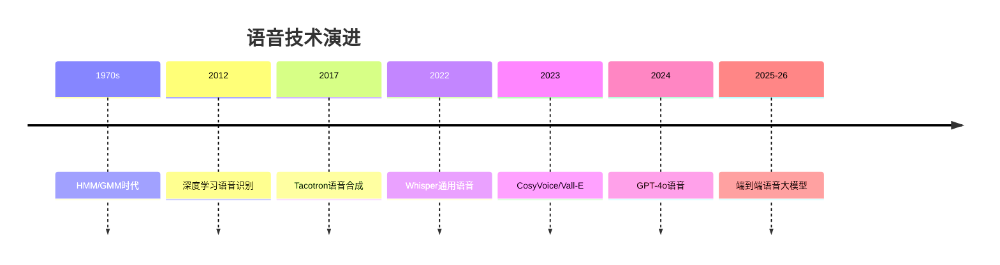

# 语音与音频

## 概述

语音和音频处理让机器能够听、说和理解声音。从语音识别到音乐生成，本模块覆盖完整知识体系。

## 目录

```
05-语音与音频/
├── README.md
├── 01-语音识别ASR.md      # CTC/RNN-T/Whisper/流式语音
├── 02-语音合成TTS.md      # Tacotron/FastSpeech/Vits/CosyVoice
├── 03-说话人识别.md        # 声纹/说话人验证/聚类
├── 04-音频事件检测.md      # 声音事件/音乐信息检索
└── 05-语音大模型.md        # GPT-4o语音/Salmonn/多模态
```

## 发展历程



## 核心指标

| 指标 | 说明 | 使用场景 |
|------|------|---------|
| WER（词错误率） | ASR 核心指标 | 语音识别 |
| CER（字错误率） | 中文字符错误率 | 中文 ASR |
| MOS（平均意见分） | 主观听感评分 1-5 | 语音合成 |
| DER（说话人错误率） | 说话人日志 | 会议识别 |
| EER（等错误率） | 说话人验证 | 声纹识别 |
